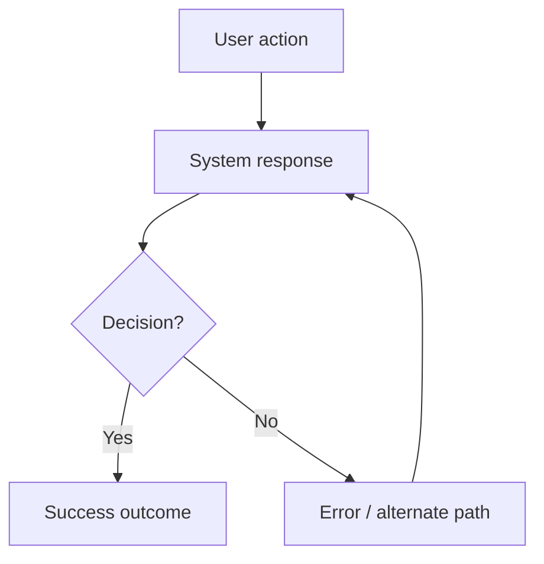
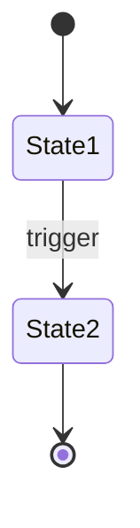

# Feature: [Feature Name]
<!-- One file per feature. Lives at `{specs}/{module}/F-{id}-{slug}.md` -->
<!-- (resolved via MANIFEST ## Paths.feature_spec → e.g. docs/specs/auth/F-003-password-reset.md). -->
<!-- Target: 80–150 lines. If longer, split into sub-features with their own F-ids. -->
<!-- Owned by: spec-agent. Read by: all agents working on this feature. -->

**ID**: F-[number]
**Slug**: [kebab-case, 2–5 words, used in filename]
**Status**: `draft` | `approved` | `in-progress` | `done`
**Last Updated**: [date]

---

## Links
<!-- ID-based traceability. Populated incrementally by each agent that touches this feature. -->
<!-- Use {module} placeholders — they resolve via MANIFEST ## Paths. -->

```yaml
primary_module:    [e.g. auth]            # the module this feature mainly lives in
secondary_modules: []                     # other modules this feature touches (orchestrator extends briefing to include them)
depends_on:        []                     # feature IDs that must be DONE before this one starts (e.g. [F-001, F-002])
implemented_in:    []                     # paths populated by impl agents (e.g. {src}/{module}/web/password-reset.tsx)
designed_in:       []                     # paths populated by architect (e.g. {design}/{module}/screens/password-reset.html)
api_endpoints:     []                     # populated by architect (e.g. POST /auth/reset-request, POST /auth/reset-confirm)

# Per-platform test coverage — populated by the matching QA agent during its authoring phase.
# A single AC often needs separate TCs at each platform it applies to; this map reflects that.
tested_by:
  api:    []                              # populated by qa-api-agent    (e.g. {qa}/{module}/F-003/api/TC-001-*.md)
  web:    []                              # populated by qa-web-agent    (e.g. {qa}/{module}/F-003/web/TC-004-*.md)
  mobile: []                              # populated by qa-mobile-agent (e.g. {qa}/{module}/F-003/mobile/TC-006-*.md)

known_bugs: []                            # open bug IDs blocking this feature (e.g. [BUG-012]). Cleared when the bug is fixed. Reviewer C1 treats non-empty as a warning.
```

---

## Purpose
<!-- One paragraph. What problem does this solve? Who benefits? -->

---

## Users & Permissions
| Role | Can do | Cannot do |
|------|--------|-----------|
| [role] | [actions] | [restrictions] |

---

## Acceptance Criteria
<!-- Each item is a testable statement. The platform QA agents (qa-api, qa-web, qa-mobile) write test cases from these. -->
<!-- Each AC has a stable ID (AC-1, AC-2…) AND a platform tag listing which platforms must cover it. -->
<!-- Valid platform tags: api, web, mobile. An AC may apply to one, two, or all three. -->
<!-- Reviewer-agent C2 walks docs/qa/{module}/F-{id}/{platform}/ folders and verifies every AC-id has ≥ 1 P1 test case in each tagged platform's folder. -->

- [ ] **AC-1** (api, web, mobile) — Given [context], when [action], then [outcome]
- [ ] **AC-2** (api, web, mobile) — Given [context], when [action], then [outcome]
- [ ] **AC-3** (api) — Error: when [invalid input], API returns [status + error code]
- [ ] **AC-4** (web) — Edge: when [UI state condition], then [expected UI behaviour]
- [ ] **AC-5** (mobile) — Edge: when [device state condition], then [expected native behaviour]

---

## User Flow
<!-- Mermaid flowchart showing main + alternate/error paths. Generated by spec-agent. -->
<!-- All downstream agents (design, architect, backend) read these diagrams. -->

### Main Flow


### State Diagram (if applicable)
<!-- Include only when the feature has an entity with lifecycle states -->


### Steps (reference)
<!-- Brief numbered steps alongside the diagram for quick scanning -->
1. User [action]
2. System [response]
3. User [action]
4. System [response]

**Alternate flows:**
- If [condition]: go to step [N]
- If [error]: show [message], allow [recovery]

---

## Data
| Field | Type | Required | Validation | Notes |
|-------|------|----------|------------|-------|
| [name] | [type] | yes/no | [rule] | [note] |

---

## API Touch Points
<!-- Reference to api-contracts.md. Don't duplicate — just list which endpoints. -->
- `POST /[endpoint]` — [brief description]
- `GET /[endpoint]` — [brief description]

---

## Design Reference
<!-- Link to the relevant screen files. Don't duplicate design here. Use MANIFEST ## Paths. -->
- Screen: `{design}/{module}/screens/[name].html`
- Components: see `{design}/_shared/components.md#[component-name]`

---

## Out of Scope (this iteration)
<!-- Never empty. Each line names something a reasonable user of THIS feature
     would expect to exist, and why it is not being built now.
     "Nothing" is not an answer — a spec with an empty exclusion list has not
     been examined at its edges, and every downstream artifact inherits the gap.
     Reviewer-agent C10 fails a missing, placeholder-only, or unjustified list. -->
- [thing not built] — [why: deferred to v2 / outside this user's path / blocked on X]

**Considered and rejected:** [what you weighed and decided against, and the reason]

---

## Ops (operational readiness)
<!-- Filled by architect-agent when the feature has production implications. -->
<!-- Reviewer-agent C8 checks that this section is non-empty for features with API endpoints. -->
<!-- Skip for purely internal / non-deployed features. -->

- **Observability**: [what to monitor — e.g. "login failure rate", "password reset email delivery latency"]
- **Feature flag**: [flag name, if gated — e.g. "FF_PASSWORD_RESET_V2", rollout strategy]
- **Rollback criteria**: [when to roll back — e.g. "if login error rate > 5% for 10 minutes"]
- **SLO reference**: [target — e.g. "p95 login < 300ms, per docs/specs/_shared/non-functional-req.md"]
- **Alerts**: [who gets paged and when — or "N/A" for non-critical features]

---

## Open Questions
<!-- Remove when resolved. Don't leave resolved questions here. -->
- [ ] [Question] — raised by [agent], needs answer from [person/agent]

---
<!-- QA SECTION — qa-api-agent, qa-web-agent, qa-mobile-agent may append below this line. spec-agent never edits below. -->

## QA Notes
<!-- Populated by the platform QA agents (qa-api-agent, qa-web-agent, qa-mobile-agent) after spec is approved. -->
<!-- Each agent may add a subsection for its platform with observations, open questions, or risk notes. -->
