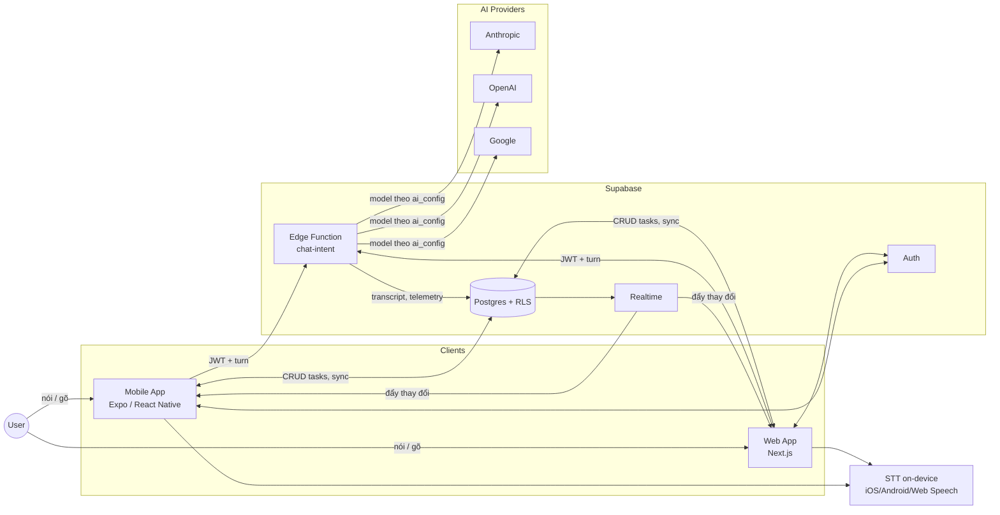
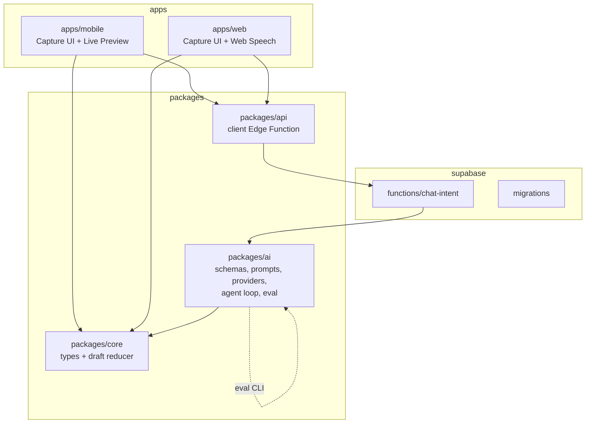
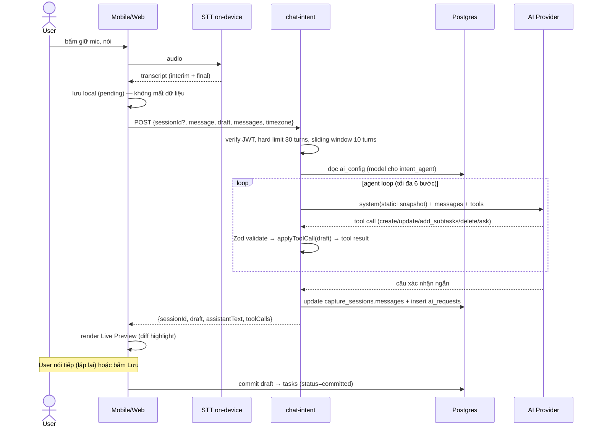
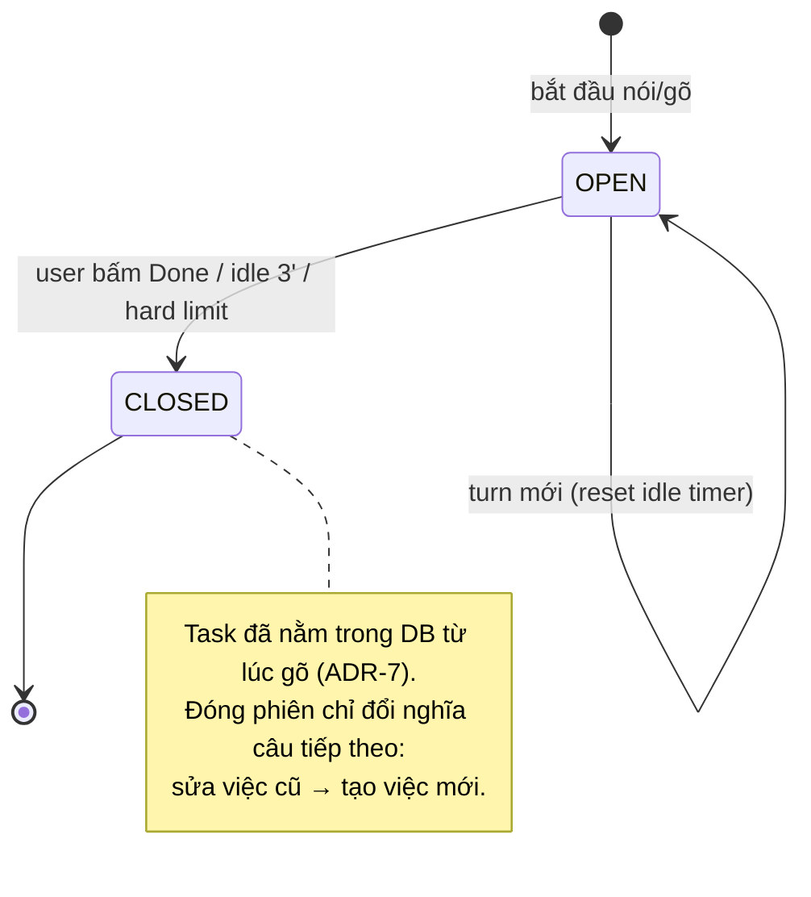
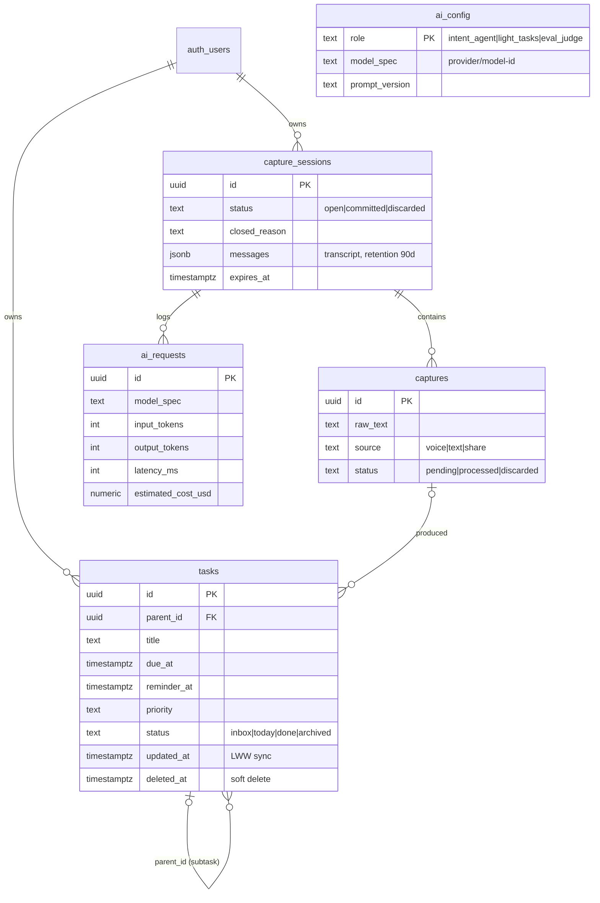
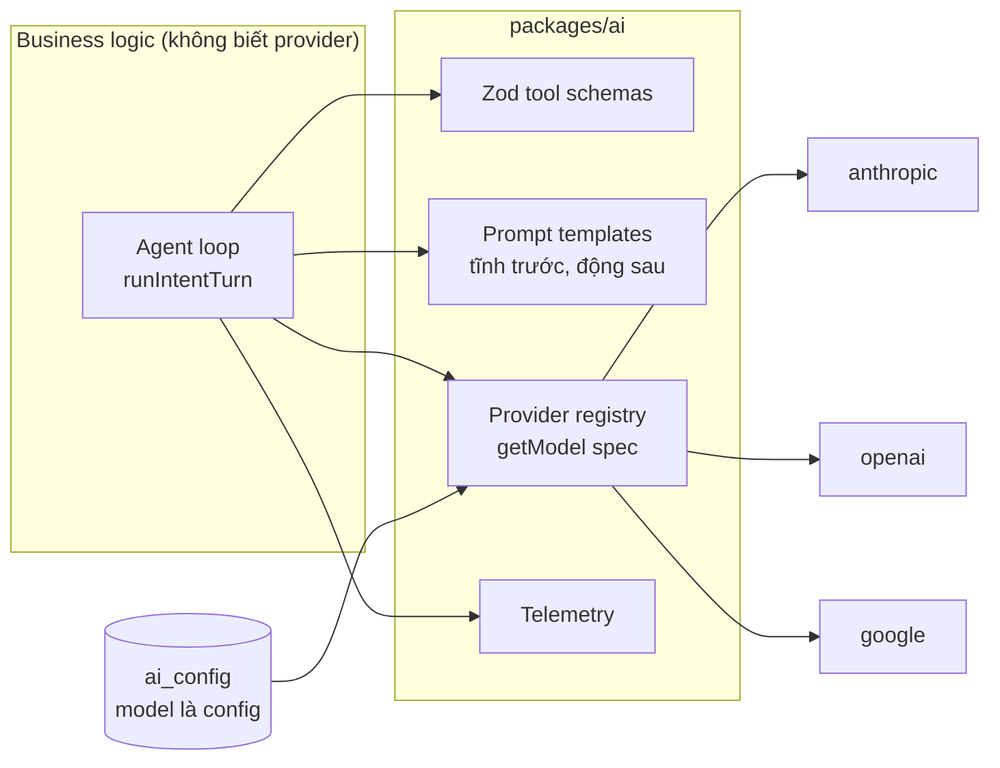

# Kiến trúc hệ thống — Todo AI

> Tài liệu thiết kế kiến trúc cho audit. Nghiên cứu nền tảng: [research-trien-khai-mobile-web.md](research-trien-khai-mobile-web.md). Trạng thái hiện thực từng phần: [04-feature-audit.md](04-feature-audit.md).

## 1. Sơ đồ ngữ cảnh (Context)

**Nguyên tắc:** client không bao giờ gọi thẳng AI provider (giấu API key, kiểm soát rate limit); STT chạy on-device trước, cloud chỉ là fallback.

## 2. Sơ đồ thành phần (monorepo)

| Thành phần | Trách nhiệm | KHÔNG được làm |
|---|---|---|
| `packages/core` | Types; **draft reducer** (`applyToolCall`) — mọi thay đổi draft đi qua đây; `draftSnapshot` cho context | Gọi mạng, biết về AI provider |
| `packages/ai` | Tool schemas (Zod — nguồn sự thật), prompt builder, provider registry, agent loop `runIntentTurn`, eval harness | Chứa business rule về draft (thuộc core) |
| `packages/api` | HTTP client gọi `chat-intent`, types request/response | State management của app |
| `chat-intent` | Auth, session lifecycle (sliding window, hard limit), chọn model từ `ai_config`, persist transcript + telemetry | Logic bóc tách (thuộc ai/core) |
| apps | UI, state phiên hội thoại phía client, STT | Gọi AI provider trực tiếp |

## 3. Luồng chính: một turn hội thoại

## 4. Vòng đời phiên & hội thoại dài

Chi tiết ở [research §5.4](research-trien-khai-mobile-web.md). Tóm tắt cấu trúc:

> **Sơ đồ này đã sửa (2026-08).** Bản cũ có `COMMITTED` với nhãn "tasks ghi DB, sync" và một nhánh
> `idle 2' auto-commit`. **Không còn bước commit nào**: câu chữ thành task thật ngay khi gõ, nên khi phiên đóng
> thì không có gì được ghi cả — thứ duy nhất đổi là nghĩa của câu tiếp theo. Một sơ đồ vẽ ra trạng thái mà code
> không có là loại tài liệu tệ nhất: nó khiến người đọc đi tìm đoạn code không tồn tại. Xem UC-10 và UC-11.

- **Tầng 1:** UX khuyến khích commit sớm (session thực tế 3–10 lượt).
- **Tầng 2:** sliding window 10 turns + draft snapshot là nguồn sự thật (đã hiện thực trong `chat-intent`); summary các turn cũ bằng code từ log tool-calls (chưa hiện thực).
- **Tầng 3:** hard limit 30 turns → `409 commit_required` (đã hiện thực).

## 5. Mô hình dữ liệu

Bảo mật: RLS trên mọi bảng (`user_id = auth.uid()`); `ai_config` chỉ đọc; Edge Function dùng service role cho ghi transcript/telemetry.

## 6. Lớp AI model-agnostic

Quyết định model dựa trên **eval harness** (`pnpm eval -- --model ...`): 7 kịch bản chấm tự động (% đúng tool, % đúng datetime tiếng Việt, % phân giải tham chiếu, latency, cost).

## 7. Offline & Sync (thiết kế — chưa hiện thực)

- Capture ghi local (SQLite/IndexedDB) **trước**, hàng đợi sync đẩy lên Supabase khi có mạng.
- Xung đột: last-write-wins theo `updated_at`; xoá bằng `deleted_at` (soft delete).
- Agent loop cần mạng → offline hạ cấp về "ghi chú thô", replay khi có mạng.

## 8. Quyết định kiến trúc (ADR tóm tắt)

| # | Quyết định | Lý do | Đánh đổi |
|---|---|---|---|
| 1 | Expo/RN + Next.js riêng, chung packages | Chia sẻ logic, desktop UX tốt cho web | Hai UI codebase |
| 2 | AI chỉ qua Edge Function | Giấu key, rate limit, telemetry tập trung | +1 hop latency |
| 3 | Draft state phía client, function stateless | Scale dễ, offline thân thiện | Client là nguồn draft — cần validate server |
| 4 | Model-agnostic qua Vercel AI SDK | Thử model tự do, tránh lock-in | Không dùng được 100% tính năng riêng từng provider |
| 5 | Reducer thuần trong core | Test không cần mạng, dùng lại ở eval + client | — |
| 6 | Session ngắn, **không nối tiếp được** — nhưng **đọc lại được** (thu hẹp 15/08/2026, xem ADR-12) | Context sạch, chi phí chặn trên | User phải qua incremental update để sửa tiếp. Bản gốc viết "không mở lại", và chữ đó gộp hai thứ khác nhau: *nói tiếp vào một phiên đã đóng* (vẫn cấm — đó là chỗ chi phí và ngữ cảnh bị chặn) và *xem lại một phiên đã đóng* (nay cho phép). Phân biệt này là điều kiện để ADR-12 tồn tại mà không lật ADR-6 |
| 7 | **AI là tầng enhance, không phải đường bắt buộc** — mọi chức năng todo cơ bản (quick-add, sửa, done, xoá, tìm, lọc) hoạt động local-first không gọi AI; AI tắt/lỗi/hết quota → app vẫn là todo app đầy đủ | Độ tin cậy, offline, chi phí; đúng bản chất sản phẩm | Hai đường nhập liệu (quick-add vs capture AI) phải được thiết kế UX rõ ràng |
| 8 | **Phạm vi là todo app, không phải assistant tổng quát** — app trả lời bốn động từ: *nhớ giùm · nhắc giùm · xếp giùm · tìm lại giùm*. Miền ngoài bốn động từ đó — quản lý hộp thư, đặt vé, quản lý chi tiêu, trả lời câu hỏi kiến thức chung, tìm web — **không thuộc lời hứa sản phẩm**. **Thu hẹp 15/08/2026:** *thực hiện một miền* khác với *mở một cánh cửa sang miền đó*. App được phép **giao cho hệ điều hành** — trình quay số, trình soạn thư, bản đồ, lịch (UC-53) — và điều đó **không** làm app lớn thêm một miền nào. Ba phép thử, phải qua **cả ba**: (1) **bỏ cánh cửa đi thì người dùng vẫn làm được việc đó, chỉ tốn thêm việc gõ lại** — cửa chỉ xoá thao tác gõ lại, không bao giờ thêm một năng lực; (2) cửa **chỉ mang theo dữ liệu người dùng đã có**, app không sinh ra nội dung mới và không hỏi mạng để mở nó; (3) **bước cuối luôn nằm ở app kia** — người dùng xác nhận ở đó, không phải ở đây. Trượt một phép thử là đang làm miền, không phải mở cửa | Assistant tổng quát đã có Siri/ChatGPT/Copilot làm — cạnh tranh trực diện là thua. Chỗ đứng được là làm bốn động từ trên sâu hơn mọi app khác, kể cả khi mất mạng (ADR-7). Còn ba phép thử tồn tại vì lằn ranh *làm* / *mở cửa* là loại lằn ranh ai cũng sẽ đẩy: không có phép thử thì "chỉ là một cánh cửa thôi mà" biện minh được cho bất cứ thứ gì, và ADR này chết dần mà không ai phải bác nó | Phải từ chối nhiều yêu cầu nghe rất hợp lý. Mỗi lần thêm miền mới là một lần phải viện dẫn ADR này. **Và mỗi cánh cửa mới phải chạy qua ba phép thử thành lời, trong chính use case của nó** — một cánh cửa lặng lẽ trượt phép thử số 2 là cách rẻ nhất để app biến thành trợ lý tổng quát mà không ai kịp nhận ra: ví dụ để model **viết hộ nội dung thư** thì trượt ngay, vì đó là sinh ra nội dung mới chứ không mang đi thứ đã có (xem UC-53 mục 2) |
| 9 | **Engine trung lập miền; chỉ `packages/core` gắn với todo** — `ai`, `server`, `ui`, `ui-tokens`, `api` không được biết khái niệm "task". Draft-ref bridge (`d1`, `d2`) là một phần của kỷ luật này: agent không bao giờ thấy id thật, nên tầng `ai` không cần biết dữ liệu thật có hình gì | Giữ ranh giới sạch **rẻ hơn nhiều** so với gỡ ra sau. Nếu sau này có app khác cùng nhà, 5/6 package đi theo được mà không phải trích xuất framework | Đôi lúc phải đi vòng: ví dụ tool AI nhận `list?: string` theo **tên** thay vì `listId`, chuyển tên → id ở tầng client. **Không** tổng quát hoá sớm — chỉ trích xuất khi thật sự có người dùng thứ hai |
| 10 | **Bắt buộc có tài khoản** — không vào được app khi chưa đăng nhập, như Todoist và TickTick. Không có kho ẩn danh, không có bước "nhận" dữ liệu. Đăng xuất **xoá dữ liệu của tài khoản đó khỏi máy**, sau khi cảnh báo nếu còn thay đổi chưa lên server. Ngoại lệ duy nhất: build **chưa cấu hình Supabase** thì không chặn — chỉ xảy ra ở môi trường dev, và điều kiện `NODE_ENV === "production"` / `__DEV__` không cho ngoại lệ đó lọt vào bản phát hành | Một đường duy nhất thay vì hai. Phương án cho dùng trước–đăng nhập sau đã dựng xong và **đã trả giá thật**: tách kho theo tài khoản, bước nhận kho ẩn danh, rồi id trùng khi máy được nhận vào tài khoản thứ hai — đo được trên thiết bị thật là 4/9 task lặng lẽ không bao giờ tới tài khoản mới. Mỗi lớp sinh ra một lớp nữa | **Lần chạy đầu tiên phải có mạng.** Không ghi được việc nào trước khi đăng ký xong — chấp nhận có ý thức, vì đây chính xác là điều Todoist/TickTick làm. Sau lần đăng nhập đầu, phiên được lưu nên mở offline vẫn vào bình thường và tạo/sửa task offline vẫn chạy đủ (ADR-7 không đổi). **Id vẫn do client sinh**: task tạo lúc offline phải có danh tính trước khi server biết nó tồn tại — nên `remapIds` vẫn cần ở biên giới còn lại là **import file của người khác**. Bắt buộc tài khoản chỉ xoá được một trong hai biên giới, không phải cả hai |
| 11 | **Voice-first là hướng sản phẩm; hội thoại là mặt CHÍNH** — chỗ mở ra đầu tiên và thứ tạo ấn tượng về app là một cuộc hội thoại, không phải một danh sách. App **trả lời thành tiếng** (bản tối giản: đọc câu trả lời, tắt được; chưa ngắt lời giữa câu). Danh sách — Inbox, Today, Upcoming, Logbook, kéo thả — **ở lại nguyên vẹn** làm đường thứ hai | Bốn động từ của ADR-8 không đổi; cái đổi là app **trả lời** thay vì app **lưu trữ**. Voice-first hôm nay hầu hết chỉ là giọng đi VÀO — vẫn phải nhìn màn hình để biết máy hiểu đúng chưa; nói lại là chỗ khác biệt thật, không phải một tính năng thêm. Chỗ đứng còn trống: phone-first, spoken-first, và **chạy được khi mất mạng** — mọi đối thủ trong `docs/mockups/vision-voice-first.html` đều là dịch vụ cloud và chết khi không có sóng | **ADR-7 áp lên chính mặt chính**: mất mạng thì hội thoại không có gì để nói, nên nó phải **rơi về danh sách**, không phải một màn trắng. Đó là điều kiện để ADR-11 không nuốt ADR-7, và là lý do phần còn lại của bản pitch **không được lấy**: pitch đề xuất bỏ Inbox, bỏ hai tab, bỏ sắp tay — làm vậy là xoá UC-14/UC-15/UC-43 vừa dựng xong và lấy mất chính cái lưới an toàn ADR-7 đứng trên. **Nói lại tốn tiếp**: đọc thành tiếng thì dễ, ngắt lời giữa câu mà không đọc lại đoạn đã đọc mới là phần khó — nên vòng này cố ý không hứa phần đó |
| 12 | **Bản ghi hội thoại lấy SERVER làm nguồn sự thật** — `capture_sessions.messages` là bản đúng; bản ở máy chỉ để **chạy phiên đang mở**, không phải để xem lại. Muốn xem lại lịch sử thì cần mạng | Một lượt AI đã bắt buộc có mạng, nên xem lại cần mạng **không thêm ràng buộc nào mới**. Hai bản đang cùng tồn tại và lệch nhau được — chỉ một lượt lỗi ở giữa là đủ — và khi lệch thì bản đáng tin là bản server, vì đó chính là bản mà UC-28 xoá. Đổi máy vẫn thấy đủ | **Xem lại không hoạt động offline** — chấp nhận có ý thức, và mặt hội thoại phải nói ra điều đó chứ không hiện như "chưa từng nói gì". Kéo theo hai chỗ **phải vá trước**, đo được trong `packages/server/src/intent.ts`: 409 và 429 `return` **trước** `saveCapture`, nên hai đường chính sách đó ghi câu của user vào không chỗ nào — mâu thuẫn thẳng với AC-12.1; và `saveTranscript` chỉ chạy ở nhánh thành công, nên lượt model lỗi nằm ở `captures` mà không có trong `messages`. Chọn server làm nguồn sự thật mà không vá hai chỗ này thì "không lượt nào biến mất" là **không đạt được** |
