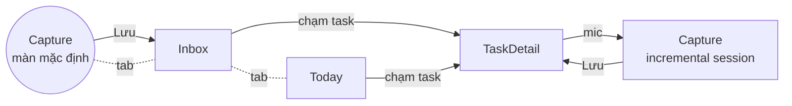

# UI Design — Todo AI

> Đặc tả giao diện cho audit. Mockup trực quan: artifact "Todo AI — UI Mockups". **Component sống + animation chạy được: `pnpm storybook`** ([@todo-ai/ui](../packages/ui/README.md)) — đó mới là nguồn sự thật của hình thức; file này là đặc tả và lý do.

## 1. Nguyên tắc thiết kế

1. **"Lười là thượng đế"** — đo mọi màn bằng số thao tác: mở app → capture xong ≤ 2 chạm (mở app đã thấy mic).
2. **Voice-first, text-luôn-sẵn** — mic là nút trung tâm nhưng bàn phím không bao giờ bị giấu; transcript hiện realtime khi nói để user yên tâm máy nghe đúng.
3. **Human-in-the-loop nhìn thấy được** — mọi thứ AI làm hiện thành card có diff highlight; không có thay đổi vô hình.
4. **Không bao giờ mất chữ** — mọi input hiển thị trạng thái persist (đang lưu nháp / đã lưu / chờ mạng).
5. **Tin tưởng qua minh bạch** — khi AI hỏi lại (ask_clarification) hiển thị như hội thoại, không như lỗi.

## 2. Design tokens (v3 — "Calm list, ink orb")

> Nguồn sự thật là code: `packages/ui-tokens/src/index.ts`. Cơ sở nghiên cứu: [07-ui-research-mobile.md](07-ui-research-mobile.md). Mockup: `docs/ui-mockups.html`.

| Token | Light / Dark | Dùng cho |
|---|---|---|
| `--bg` | `#FCFCFA` / `#0E0E10` | nền trang — trắng ngà **lạnh**, không phải be ấm |
| `--raised` | `#FFFFFF` / `#17171A` | chỉ lớp nổi (dock, sheet) — list KHÔNG dùng |
| `--ink` / `--ink-soft` | `#16161A` `#45454D` / `#F2F2F0` `#B8B8BF` | chữ chính / sub-task |
| `--muted` | `#8A8A93` / `#7C7C86` | meta, giờ, hint |
| `--hairline` | `#ECECEE` / `#232327` | đường tóc — thay cho MỌI border/separator |
| `--stroke` | `#C9C9CF` / `#3A3A42` | viền checkbox chưa done |
| `--accent` | `#3056F5` / `#8298FF` | **accent DUY NHẤT** (cobalt): AI line, link, tab active, reply pill |
| `--coral` | `#E5484D` / `#FF6B6B` | **chỉ** khi đang ghi âm / quá hạn |
| `--green` | `#178A50` / `#4CC38A` | **chỉ là màu chữ** (nhãn "new", done). Không bao giờ là nút |
| `--amber-ink` | `#A06B0A` / `#DDA43C` | **chỉ là màu chữ** (nhãn "edited") |
| Flash tints | `--flash-new #ECF6EF` · `--flash-edit #FAF3E2` | nền nháy 1.6s rồi phai về phẳng |
| Ink orb | radial `--orb1 #2B2B33 → --orb2 #101014`, icon trắng | chữ ký của app; dark mode **đảo** thành quả cầu sáng |
| Shadows | **không có shadow màu.** Depth chỉ ở orb `0 8px 20px -6px rgba(10,10,16,.45)` và dock | list tuyệt đối phẳng |
| Icons | **SVG stroke 1.8–2, round cap — KHÔNG dùng emoji làm icon UI** | sprite dùng chung |
| Type scale | 31 (large title, w750, −0.035em) / 18 (section, w700) / 15.5 (row, **regular 480**) / 12.5 (meta, tabular) / 10 (nhãn diff, uppercase) | |
| Serif | `Georgia` italic — **chỉ 2 chỗ**: empty "Just say it." và "All clear." | nét sáng tạo duy nhất về chữ |
| Spacing | 4-8-12-16-22 (gutter 22 mobile / 20 web) | grid 4pt |
| Radius | 999 (nút mực, pill), 50% (orb, checkbox), 14 (control), 20 (sheet) — **không còn radius card** | task là hàng, không phải hộp |

**Luật bất di bất dịch** (checklist đầy đủ ở 07-ui-research-mobile §4): không viền/bóng cho list item · không màu thứ tư · không gradient màu · ưu tiên khoảng trắng thay vì đậm hoá chữ.

## 3. Bản đồ màn hình & điều hướng



> ⚠️ **Sơ đồ trên đã lỗi thời.** Màn Capture riêng không còn: gõ và nói cùng đổ vào thanh nhập ở đáy mọi màn (xem `Composer.tsx`), nên không có node Capture để điều hướng tới nữa.

**Điều hướng đang chạy (cả web lẫn mobile): drawer.** Nút menu cạnh large title mở drawer trái chứa mọi đích đến (`Inbox · Today · Snoozed · Trash`, sẽ thêm Lists/Tags…), badge đếm lấy từ đúng selector mà màn hình render — số và danh sách không thể lệch nhau. Đáy màn trả **trọn** cho thanh nhập + orb; đích không nhận task mới (Trash, Snoozed) tự ẩn thanh nhập.

Hàng active trong drawer dùng nền cobalt 7% — ngoại lệ DUY NHẤT của luật "list phẳng", vì đây là chrome điều hướng chứ không phải task.

> Lịch sử: đã thử hai kiến trúc trước đó — cặp tab large-title (chỉ chứa nổi 2 đích) rồi capsule nổi đáy màn (va chạm với thanh nhập, và không app todo nào ship kiểu đó — xem đối chiếu Todoist/Things/Keep). Drawer thắng vì lists/tags là tập không giới hạn, đúng ngưỡng Material khuyên dùng drawer.

## 4. Đặc tả từng màn

### 4.1 Capture (màn trung tâm)

```
┌─────────────────────────────┐
│ Sunday, August 9            │  kicker muted
│ Capture                     │  large title 31/750
│                             │
│ ○  Team sync   EDITED  2:00 │  HÀNG, không card: không viền,
│                             │  không bóng, không separator
│ ○  Prepare Q3 slides        │  nhãn diff là CHỮ, không phải chip
│    ○ Outline 10 slides      │  sub-task thụt 34px, chữ nhỏ hơn
│    ○ Revenue figures        │  hàng vừa đổi: nháy nền tint 1.6s
│                             │  rồi phai về phẳng
│ ○  Pick up kids   NEW  5:00 │
│                             │
│ ✦ Moved the sync to 2pm…    │  AI = MỘT DÒNG cobalt, không bubble
│ ─────────────────────────── │  hairline thay banner
│ Type, or hold to talk…  (●) │  orb mực: mic khi trống,
│ [———— Save 3 tasks ————]    │  gửi khi có chữ, san hô khi nghe
└─────────────────────────────┘     nút Lưu = pill đen chữ trắng
```

**Trạng thái màn Capture:**

| State | Hiển thị |
|---|---|
| Empty | serif italic giữa màn: *"Just say it."* + 1 dòng hướng dẫn muted; orb ở input bar |
| Recording | orb chuyển san hô + waveform; kicker đổi thành `● Listening…`; transcript interim chạy trong ô input |
| Processing | 3 chấm cobalt ở vị trí dòng AI (không khoá input) |
| Diff | hàng nháy nền tint full-bleed 1.6s + nhãn chữ `NEW`/`EDITED`, rồi phai về phẳng |
| Clarify | dòng AI cobalt + 2–4 reply pill viền cobalt (chạm = gửi turn) |
| Idle countdown | thin-note hairline "Auto-saving in 30s… **Keep**" |
| Offline | thin-note hairline "Waiting for network — 1 message queued"; hàng nháp vẫn thao tác được |
| Error AI | thin-note màu san hô + giữ nguyên input |

### 4.2 Inbox

- Danh sách card gọn (title + due + badge sub-task count), nhóm theo ngày tạo.
- Vuốt phải = done (haptic + animation gạch ngang), vuốt trái = menu (Today/sửa/xoá).
- Nút mic floating góc phải dưới → về Capture.

### 4.3 Today Focus

- Header: "Hôm nay · 3 việc". Sắp theo giờ (due trước), việc không giờ xuống dưới.
- Task quá hạn: dot `--record` + kéo lên đầu.
- Empty state: "Hôm nay trống — nghỉ ngơi hoặc kéo việc từ Inbox".

### 4.4 Task Detail + Incremental Capture (UC-18)

- Hiện đủ trường, sub-tasks checklist.
- Nút mic lớn dưới cùng: "Nói để bổ sung" → mở phiên Capture mới, card của task này ghim trên đầu làm ngữ cảnh, các thay đổi hiện diff như Capture thường.

### 4.5 Web khác biệt

- Layout 2 cột ≥ 900px: trái = hội thoại (transcript các turn), phải = Live Preview cards; mobile-web gập lại như app.
- Web Speech chỉ Chrome/Edge → Safari/Firefox tự ẩn mic, hiện tooltip "Dùng Chrome để nói, hoặc gõ".

## 5. Thành phần (component inventory)

> Hiện thực: `packages/ui/src/{primitives,patterns,gamification}.tsx`. Xem trực tiếp trong Storybook.

| Component | Props chính | Dùng ở |
|---|---|---|
| `TaskRow` | task, flash(new/changed/none), done, onToggle, onSwipe | Capture, Inbox, Today, Incremental |
| `SubRow` | text, done, onToggle | TaskRow, TaskDetail |
| `InkOrb` | mode(mic/send/recording), size(sm/lg), onPressIn/Out | Thanh nhập (mọi màn), TaskDetail |
| `AiLine` | text, type(confirm/question/thinking), replies? | Capture |
| `ThinNote` | text, tone(muted/warned/error), action? | Capture (offline, idle, lỗi) |
| `InkButton` | label, state(idle/saved), variant(solid/ghost) | Capture, TaskDetail |

*Đã bỏ khỏi v2: `DraftCard`, `TaskCard`, `AssistantBubble`, `PersistStatus`, `CountdownBar` — hộp và bubble không còn tồn tại trong hệ v3; vai trò của chúng chuyển sang `TaskRow`, `AiLine`, `ThinNote`.*

## 6. Accessibility & i18n

- Orb có label + hỗ trợ VoiceOver/TalkBack ("Bấm giữ để nói" / "Gửi" theo mode).
- Diff không chỉ bằng màu: kèm **nhãn chữ** `NEW` / `EDITED` (an toàn cho mù màu — v3 bỏ chip màu nên chữ là kênh chính).
- Contrast tối thiểu WCAG AA trên cả 2 theme.
- **English-first (đã chốt):** chuỗi UI viết tiếng Anh trước, bản dịch vi theo sau qua i18n; locale máy quyết định hiển thị (mặc định en). STT mặc định `en-US`, chuyển `vi-VN` theo locale. Ngày giờ format theo locale. Nội dung task luôn giữ nguyên ngôn ngữ user nhập.

## 7. Micro-interactions

Đã có trong app: hàng mới trượt lên 6px + fade 200ms (`ease-spring`); flash diff 1.6s; orb nhún 0.92 khi bấm; waveform khi ghi; nút Lưu pop 1.04 rồi hàng trôi xuống.

Còn lại (Giai đoạn 2 — cần Reanimated/gesture): swipe phải = done (kéo dãn + gạch ngang + haptic nhẹ), swipe trái = xoá; sóng âm co về thành 3 chấm processing khi thả mic; auto-commit "bay" gọn về icon Inbox. Chi tiết đặc tả MO-1..16 ở [06-uiux.md](06-uiux.md).
