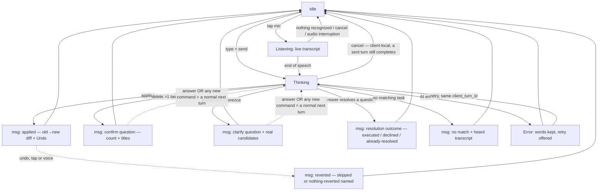

# Feature: Voice-first Assistant View

**ID**: F-001
**Slug**: voice-assistant-view
**Status**: `draft` (revision 3 — final Gate 1 revision, `docs/reports/gate1-review-F-001.md ## Round 2 results`; round cap reached. **AC-30 added 2026-08-17, post-Gate-1**, from the owner decision resolving BUG-004 — `docs/reports/owner-decision-2026-08-17-new-message-affordance.md`; no existing AC was reworded. Amended the same day with clause (h) — the owner's answer to Open Question 8, which is now closed against the decision. **Revision 10, 2026-08-23 (T-322)**: **AC-36 and AC-37 are amended in place; no AC was renumbered, deleted or added; the count is still 37.** The owner chose option B: the TaskBottomBar replaces the floating voice button and the inline add row below `breakpoints.split`. AC-37 is restated for the bar's morphing action button — navigates to Talk when the field is empty (accessible name "Talk"), commits the typed title when the field holds text (accessible name "Add task"), does not start microphone capture in either state. The accessible name must track the current function (WCAG 4.1.2). AC-36 is confirmed unchanged: the bar shows only below `split`, so the accepted consequence (no visible add-task affordance above the fold at `split` and above) still holds; the sentence referencing the retired FAB is updated. **Revision 9, 2026-08-23 (T-268)**: **AC-37 is new; 36 become 37. No AC was renumbered, deleted or amended.** AC-37 names the floating voice button as a navigation control whose accessible name is "Talk", not "Start listening" — the label the mockup drew and both clients copied describes an action the control does not perform (WCAG 4.1.2). The defect was independently reported by web-agent and mobile-agent while building the FAB. Starting capture on arrival at Talk is explicitly not the intent; the distinction between navigation and capture is Open Question 9's, and the MicControl orb on the Talk surface is the capture control. **Revision 8, 2026-08-22 (T-229)**: five owner decisions that existed only in design files are written into the specs that bind them. **AC-33, AC-34, AC-35 and AC-36 are new; 32 become 36. No AC was renumbered, deleted or amended.** AC-33 carries the accessibility path for the gesture-hidden delete (on both platforms). AC-34 names the gesture partitioning on the task row. AC-35 requires the Lists drawer to close at the `wide` breakpoint. AC-36 records that there is no visible add-task affordance above the fold at `split` and above, as an accepted consequence. `## Out of Scope` gains one entry: `blocked` / `in-progress` task status, rejected by the owner with reasoning. **Revision 4, 2026-08-18 (T-103)**: the conversation no longer renders the task list, so **AC-1, AC-4 and AC-15 are restated — their guarantees unchanged, their mechanisms moved** — and **AC-31 / AC-32 are added** for what the restatement would otherwise have dropped. Sources: `docs/reports/owner-decision-2026-08-17-conversation-is-not-a-list.md`, `docs/reports/owner-decision-2026-08-17-desktop-list-is-primary.md` (which supersedes the former's "no list at any width" confirmation for wide screens only), and `docs/design/_shared/information-architecture.md §10`. **Revision 5, 2026-08-18 (T-145)**: **AC-24's reachability sub-bullet is amended in place** — the bound is unchanged (*at most one action*); its **reason** and its **coverage** are what changed. Rev 4 justified the bound by asserting that at or above `tokens.json breakpoints.split` the list is already on screen in zero actions; `F-005 AC-45` places the task detail in that column, so while the detail is open the list is on screen at **no** width, and that state had no route named at all. The reason now rests on the arrangements having no control in common rather than on a per-width claim, and **closing the detail is named as the one action, at both widths**, carrying AC-24's own not-hidden/not-disabled condition. Source: `docs/specs/assistant/F-005-task-detail.md ## Impact §13` and its `AC-45`. **AC-25's sub-bullet, AC-31 and AC-32 were checked against the amendment and needed no change** — AC-25 carries the bound by reference and so inherits it, AC-32 is conditional on the list being rendered, and AC-31's postcondition is stated layout-independently. The two states this leaves genuinely undecided are recorded as **Open Questions 10 and 11** rather than settled here. No AC was renumbered and no AC was deleted. **Revision 6, 2026-08-18 (T-153)**: those two Open Questions are **answered by the owner and closed against the decision** — `docs/reports/owner-decision-2026-08-18-detail-trap-and-message-door.md`. Neither was a lens finding; both were found in composition (`LEARNINGS.md` **L-015**). **OQ10 → AC-24 is unamended in substance**: the owner narrowed `F-005 AC-2` instead, so closing the detail is **always available** and a failed write's value moves into a notice that outlives it (`F-005 AC-47`, new) — AC-24's detail-open sub-bullet gains one clause recording that the one action it names is now unconditionally available, and the alternative (widening AC-24's condition to *any* failure) is recorded as rejected. **OQ11 → AC-31's postcondition still stands unamended**; what gains an entry is its **route enumeration**: at or above the split, when that column holds a task detail, activating a task named in a message **replaces the open detail with the named task's**, and below the split the case does not arise — now stated, so the absence reads as considered rather than missing. What the surface does at the moment of the swap is `F-005 AC-48`, not this spec. No AC was renumbered, none deleted, and no AC was added — this revision writes into AC-24 and AC-31 only. **Revision 7, 2026-08-19 (T-157, absorbing T-140)**: **AC-31's activatability gate is amended in place** — the postcondition is again unchanged; what changed is **which tasks the door is a door for**. Rev 4 gated it on the task being in the collection **currently shown**, justified by *"rendered as an inert control it would be an affordance that does nothing"*. That reason rested on the postcondition being *bring the row into view in the list*, and two later decisions falsified it: rev 6 gave the door a second postcondition that needs nothing from the list at all (`F-005 AC-48`), and the owner's direction of 2026-08-19 (T-140) supplies what the first one was missing — **activating a task named in a message switches to a collection that holds it**. The gate is now **the task existing**; the **deleted** case stays inert **for its own reason** (no row exists anywhere to reach). It is stated once and binds **both** client predicates — `src/assistant/web/shell.ts`'s `canReveal` and `src/assistant/mobile/model/task-link.ts`'s `taskLinkState` — because an amendment landing on one of them leaves AC-31's door meaning two different things on two clients, decided by a filter the user cannot see on either (**L-005**; `F-005 ## Impact §14`, dev-web H3 then M1). Sources: `docs/specs/assistant/F-005-task-detail.md ## Impact §14` and its `AC-48`, `docs/reports/gate1-lenses/F-005-r2-dev-web.md` (H3), `docs/reports/gate1-lenses/F-005-r3-dev-web.md` (M1), and `docs/reports/owner-question-2026-08-18-assistant-created-tasks-are-invisible.md`. **What the direction does not settle is recorded as Open Question 12 rather than decided here** — the collections overlap by design, so more than one of them can hold the named task. Two consequences are **named and routed rather than made**: the shipped per-message note *"tap a task to find it in the list"* is false in the detail-open state, which is design's copy to fix, and AC-31's existing web and mobile assertions change. **No AC was renumbered, none was deleted, and none was added** — this revision writes into AC-31 and `## Open Questions` only.)
**Last Updated**: 2026-08-23

---

## Links

```yaml
primary_module:    assistant
secondary_modules: []
depends_on:        []
implemented_in:    [src/assistant/api/, src/assistant/web/, package.json]
designed_in:       [docs/design/_shared/DESIGN.md, docs/design/_shared/tokens.json, docs/design/_shared/components.md, docs/design/assistant/screens/voice-assistant-view.html, docs/design/assistant/screens/voice-assistant-view-ios.html, docs/design/assistant/screens/voice-assistant-view-android.html]
api_endpoints:     ["POST /assistant/turn", "GET /assistant/session", "POST /assistant/session/close", "POST /assistant/turn/{turn_id}/undo", "GET /tasks", "POST /tasks", "PATCH /tasks/{id}", "DELETE /tasks/{id}"]
tested_by:
  api:    [docs/qa/assistant/F-001/api/, tests/assistant/api/F-001-voice-assistant-view.spec.ts, docs/qa/assistant/runs/2026-08-16-api-execute.md]
  web:    [docs/qa/assistant/F-001/web/, tests/assistant/e2e/F-001-voice-assistant-view.spec.ts, docs/qa/assistant/runs/2026-08-16-web-execute.md]
  mobile: []
known_bugs: []   # BUG-001 fixed 2026-08-17 (T-023/T-026); the record stays in docs/qa/_shared/bugs/
```

---

## Purpose

The main view of the redesigned todo-ai: the user speaks to an AI assistant to create, edit, and delete todos. Voice is the primary input; **the turn's own message is where its result lives** — it names every task the turn touched and shows the per-field change, so the user verifies with their eyes without leaving the conversation and without hunting. The assistant interprets server-side, applies changes atomically, and every applied change is attributable, reviewable, and reversible. The todo list is the **second path** (`todo-ai ADR-11`), on its own surface rather than inside this one: voice is never the only path — every action has a tap/type equivalent (WCAG 2.1 AA), and the core list works untouched when AI is off, erroring, or offline (existing ADR-7).

## Users & Permissions

| Role | Can do | Cannot do |
|------|--------|-----------|
| Authenticated user | Speak/type to create, edit, complete, delete todos; answer or ignore assistant questions; undo applied turns by tap or voice; manage the list by touch alone | See or affect another user's tasks or transcripts |
| Assistant (AI) | Propose and apply changes to the speaking user's tasks; ask clarifying/confirmation questions as conversation messages | Apply a multi-task delete without an affirmative answer (server-refused, AC-9); mutate data in a turn that asks a question (asking turns apply nothing, AC-1); invent tasks for no-match input (AC-14) |

## Conversation model

One state count, replacing rev 1's three disagreeing lists (Gate 1 C6). The surface has exactly **four states**: **idle · listening · thinking · error**. Everything else is a **message** in the conversation, never a state: applied (diff + Undo) · reverted (skipped tasks named; all-skipped → nothing-reverted, AC-7) · undo-refused (AC-6) · clarify question · confirm question · resolution outcome (executed / declined / declined-superseded / already-resolved, AC-10, AC-11) · no-match (quoting the heard transcript) · session-closed boundary marker (carrying the closed session's terminal outcomes, AC-28) · queued-turn notice. A pending question **blocks nothing** — no modal, no lock, no timeout (owner decision D2). The mic control has three modes orthogonal to the states: available · dimmed (permission denied **or** transient recognition failure, AC-21, AC-22 — the message states which) · hidden (no capability). Design derives its screens from this list and no other.

**Naming convention (read before any AC below).** The state names, message kinds and affordance names used throughout this spec — idle, listening, applied, reverted, no-match, Undo, retry, send — are **concept names in this spec's own prose**, written in English because English is this spec's writing language. They are **not shipped strings**. The user-visible wording of every label, message and accessible name — and the language it is written in — is the design system's to specify (`docs/design/_shared/components.md`); no AC in this spec mandates a literal English string in the product. Where an AC quotes an utterance the user *says* (AC-5's "hoàn tác" / "undo"), that is recognizer input vocabulary, not UI copy, and the distinction is deliberate.

## User Flow



These edges are the complete transition list (AC-29). Cancel is client-local (AC-3): a turn already sent still completes server-side and its late outcome renders as the matching message above. Mic modes and the offline handover are not conversation states — see Conversation model and Lifecycle.

### Lifecycle

- Background/kill while **listening**: recognized-so-far text persists in the client pending store; reopening shows it in the composer (AC-26).
- **Audio interruption while listening** (incoming call, system assistant, audio-focus loss): behaves exactly as cancel-while-listening — capture stops, recognized-so-far text is preserved in the composer, no turn is sent (AC-3, AC-26).
- Background/kill while **thinking**: the turn — already sent under its client id — resolves server-side; the outgoing turn survives the kill in the local store until the server acks it (AC-27); reopening within the open session shows its outcome message.
- Background with a **question unanswered**: nothing changes; questions are messages and survive as messages, no timeout. Session close while unanswered = declined, visible on next open (AC-28). This replaces rev 1's AC-5×AC-13 contradiction.
- **Session close**: idle auto-close leaves a visible marker; an open session resumes visibly; a stale/closed session starts clean (AC-28).
- **Offline**: no half-running conversation — the surface says so and hands over to the list (ADR-7). A turn already in flight when the connection drops queues and replays visibly (UC-13 AC-13.2); input made while offline goes through the local no-AI path (AC-25).

## Acceptance Criteria

### Interpretation & visibility
- [ ] **AC-1** (api, web) — A spoken/typed sentence is interpreted server-side; an **applying** turn's changes land atomically (all-or-nothing) and are **named in that turn's own message, within the same turn**: the message names every task the turn created, edited or deleted and carries the per-field `old → new` for each change (AC-4 fixes the anatomy). The message, not a task list, is where the result lives. Carve-out unchanged (resolves rev 1 AC-1×AC-5): a turn that produces a **question** (clarification, bulk-delete confirmation) applies nothing; its visible same-turn result is the question message itself.
  - **One mechanism, and it has no viewport condition.** *Restated rev 4; the guarantee — the user sees what changed, in the same turn, without hunting — is unchanged, the mechanism moved from the list to the message.* The message carries its **full** diff whether or not a task list is also on screen. Where a list **is** rendered beside the conversation — the wide frame of `information-architecture.md §1a`, at or above `tokens.json breakpoints.split` — it is an **addition**, and it is never the observable this AC is verified against. Neither is the path-switch count (`Tasks · N`): a moving number is a second, cheaper confirmation that cannot say *which* task changed, so writing it into this AC's acceptance would make the weaker claim the tested one and leave the real guarantee untested. Acceptance is read off the applied message alone, and it is the same reading at every width and on every client. **Do not add a layout branch here** — an AC that carries two mechanisms selected by width is one mechanism plus one that nobody runs (`owner-decision-2026-08-17-desktop-list-is-primary.md`, constraint 2). The separate and weaker obligation that a rendered list is not stale is **AC-32**, deliberately not this AC.
- [ ] **AC-2** (web) — While listening, a live transcript renders as words are recognized. Listening that ends with nothing recognized returns to idle visibly and sends no turn.
- [ ] **AC-3** (web) — Cancel is **client-local**: there is no cancel endpoint, and a turn that has been sent always runs to completion server-side. While listening, cancel keeps the text in the composer and sends nothing; while thinking, cancel returns the surface to idle with words kept, and the sent turn's late outcome still renders as a message per its kind — applied → applied + Undo (never pretending the cancel won); question → the question message renders and D2's resolution rules apply; failed → error message. A cancelled turn that never reached the server renders nothing. A mobile audio interruption while listening (call, system assistant, audio-focus loss) triggers cancel-while-listening semantics with the text preserved.
- [ ] **AC-4** (web) — Every AI-applied change is attributable **in the turn's own message**: the message names each task the turn touched (`turn.changed_task_ids`) and states what happened to it — an **edit** shows old → new per field (`turn.diff`); a **create** is marked new with no fabricated old value; a **delete** is named by title, since no row remains anywhere to mark. Only the turn's own changes are attributed — tasks changed by hand or by other turns are never attributed to this turn. Messages show the user's words and real task titles — internal agent refs (raw task uuids and draft-ref tokens of the `#d1` style) never render (UC-52 AC-52.10); the fixture table carries a row asserting this (Test strategy).
  - **What moved, rev 4:** attribution's *location*, not attribution. The markers and the per-field diff were specced as row-level marking in the list beside the conversation; they now belong to the message, where they already render. **No clause of this AC is satisfied by anything rendered outside the message** — including a task list that happens to be on screen at a wide width. The row-level flash treatment (`diffFlashHold` / `diffFlashFade`, `docs/design/_shared/components.md`) is not deleted: it survives as **AC-31**'s arrival cue, moved from "whenever a turn applies" to "on arrival from the message that changed it". Two clauses of this AC are load-bearing and survive the move untouched: **only the turn's own changes are attributed**, and **no raw uuid or draft-ref token ever renders** (UC-52 AC-52.10).

### Undo contract
- [ ] **AC-5** (api, web) — The newest applied turn (in AC-8's sense: a turn that applied changes) has a one-gesture undo, reachable by tap **and by voice**: saying "undo" undoes the turn and never becomes a task with that name (UC-52 AC-52.18; mechanism = Open Question 6). Undo covers the whole turn: a 4-task turn reverts all 4.
- [ ] **AC-6** (api) — Revert shapes, via `POST /assistant/turn/{turn_id}/undo` from the `turn.undo_snapshot` captured at apply time: edit → prior field values restored; create → created tasks removed and staying removed on a fresh task-list read; delete → tasks restored with all fields intact. The observable for "survives sync" is a read-back: a subsequent task-list `GET` returns the reverted values. The undone turn stays visible, marked undone (`turn.status`). Server enforcement: the window check and the revert run in **one transaction**; undo of a turn that is not the newest applied turn, or whose session is closed, is refused with a visible outcome message stating why; undo of an already-undone turn is idempotent — the same success outcome, no second revert.
- [ ] **AC-7** (api, web) — Undo never clobbers later work: a task modified after the turn (by hand or by a later turn) is skipped, and the reverted-outcome message names every skipped task. Zero silent overwrites. Modified-since detection is **snapshot comparison** — a task counts as modified iff its current state differs from the task's **post-apply state**: the state immediately after this turn applied, before any later turn touched it. (Comparing against the pre-apply snapshot would flag the turn's own change as a modification and undo could never revert anything.) AC-12 uses the same rule against the state captured when its question was asked. If every task is skipped, the outcome message says nothing was reverted — it never renders as a successful revert.
- [ ] **AC-8** (web, api) — Undo is one level and session-bounded: available while its turn is the newest applied turn of the open session; a newer applied turn or session close ends it and the affordance visibly disappears. No hidden timer. "A newer applied turn" means a newer turn that applied changes (`changed_task_ids` non-empty); a turn that mutated nothing neither holds nor ends the undo window. An undo attempted outside the window — by voice or by a stale affordance — yields AC-6's visible refusal outcome: never silence, never a task named "undo".

### Bulk-delete confirmation (owner decision D2)
- [ ] **AC-9** (api, web) — A delete touching more than one task executes only after confirmation. The question is a conversation **message** naming the count and the task titles; the server refuses to apply an unconfirmed bulk delete. A single-task delete applies immediately with undo.
- [ ] **AC-10** (api, web) — Resolution, with no timeout anywhere: only a **clearly affirmative** answer executes; a negative answer declines; **any unrelated new command supersedes the question — the delete is declined and the new command proceeds normally**; session close with the question unanswered declines. An **unclassifiable** utterance — not affirmative, not negative, not an interpretable command — executes nothing and the question stays pending, still resolvable by exactly D2's events (answer, supersede, session close). The answer travels as a normal turn — spoken, typed, or a tap sending the option's literal text (UC-54 AC-54.7, UC-08 AC-08.3); there is no separate confirm protocol. One-shot resolution and ordering: the server processes a session's turns **serially in receipt order**; a question resolves exactly once; a spoken or typed answer binds to the newest unresolved question, while a tap carries an explicit binding to its question's turn; an answer arriving after its question is already resolved applies nothing — it **never** executes the questioned delete — and yields a visible already-resolved outcome.
- [ ] **AC-11** (web) — Every resolution path produces a visible outcome message (executed / declined / declined-because-superseded / already-resolved); nothing resolves silently (resolves rev 1 AC-5×AC-7), and the pending question blocks nothing — list, manual edits and other commands all work while `turn.question` is unanswered. An **executed** outcome has the full applied-message anatomy: changed rows marked, actual count and titles named, diff where applicable, and Undo (AC-4, AC-5 apply to it unchanged).
- [ ] **AC-12** (api) — On an affirmative, the server re-validates the named tasks before deleting; tasks deleted or changed since the question was asked — detected by AC-7's snapshot-comparison rule, against the state captured at ask time — are dropped, and the outcome states the actual count and names.

### Clarification
- [ ] **AC-13** (api, web) — A reference matching ≥ 2 tasks gets a clarify-question message presenting the actual candidates; no data changes until answered; answering works by tap (the option's literal text), voice, or typing, as a normal turn under AC-10's one-shot binding rules; an unrelated command supersedes the question visibly and proceeds (same D2 rule). UC-08's edge table applies as written.

### Honesty on no-match
- [ ] **AC-14** (api, web) — A command matching no task applies zero task mutations and answers with a message **quoting the heard transcript** — a misheard word is distinguishable from an absent task. Bounded check: task table unchanged, no unrelated task edited, no task created.
- [ ] **AC-15** (api) — Questions **about** the list ("what's on Sunday?") need the UC-54 `find_tasks` engine and are out of this feature's scope: the assistant answers that it cannot do that yet **and names the working alternative — the task list, browsable by hand with its collections** — zero mutations, no fabricated answer.
  - **Restated rev 4, and the constraint is stricter than a wording change.** The old alternative was "the on-screen list and its existing filters"; there is no on-screen list on this surface any more, and the filters are collections on the Tasks surface (`information-architecture.md §3`). The named alternative must be **width- and layout-independent**: this answer is composed **server-side**, and the server does not know the viewport, so an answer naming a route only one layout has is not merely inaccurate — it is unimplementable. "Tap Tasks" is wrong at a width where Tasks is already on screen; "look beside the conversation" is wrong at every other width. Per `## Naming convention` the literal wording is design's (`docs/design/_shared/components.md`); what this AC fixes is that the alternative named is **real, currently reachable, and named without reference to the layout**.

### Idempotency
- [ ] **AC-16** (api) — Every turn carries a client-generated `turn.client_turn_id`; retry re-sends the same id and the server treats it as the same turn — a retry whose original actually succeeded applies nothing twice (UC-25 AC-25.3). Dedupe is **per-status**: a replay of a turn whose status is applied, asked, or undone re-serves the recorded outcome without re-executing; a replay of a **failed** turn re-attempts it (failed → pending under the same id). Dedupe scope is **account-level**, with retention at least as long as the offline replay window (AC-25); a replay arriving after session close targets the new session and the id is still recognized.

### Manual path & accessibility
- [ ] **AC-17** (web) — Typed composer input goes through the same interpretation path as speech.
- [ ] **AC-18** (web) — All list operations (create, edit, complete, delete) are doable by direct touch without the assistant, with **zero AI calls** — asserted via the harness AI-call counter.
  - **Where these now happen, rev 4:** on the **Tasks surface**, not in a pane beside the conversation (`information-architecture.md §3`). The surface moved; the obligation did not — all **four** operations remain required, by direct touch, with zero AI calls. **This is not a fix for the parity gap and must not be read as one:** `F-003 ## Parity` lists AC-18 among the ACs that "hold identically" on mobile, while mobile ships two of the four — no inline rename and no delete control (`uc-coverage-map.md` D8, UC-09 and UC-33 rows). Relocating the operations changes nothing about that count. The correction is owed in F-003's parity table, not here.
- [ ] **AC-19** (web) — The new conversation UI meets these WCAG 2.1 AA criteria by name: **2.1.1** (mic, undo, candidate and confirm controls keyboard-operable), **4.1.2** (those controls expose name/role/value), **1.4.3** (contrast on transcript, diff and outcome messages), **2.5.3** (visible labels match accessible names), **4.1.3** (status messages) — **every message the conversation adds** (applied, reverted / nothing-reverted, undo-refused, clarify question, confirm question, resolution outcome, no-match, session-closed boundary marker, queued-turn notice — the full list in Conversation model) is announced to assistive technology through a live region on the conversation surface itself, without moving focus; an error message is announced immediately rather than queued behind earlier output. Announcing the state word alone (idle / listening / thinking / error) does **not** satisfy this: a screen-reader user must receive the same information a sighted user gets from reading the new message — what changed, how many, which tasks by title, and that undo is available. Verified against a real screen reader, not inferred from markup (W3C F103).

### Speech capture (STT locus — Gate 1 C2)
- [ ] **AC-20** (api, web) — Speech-to-text runs on the client (device/browser capability); the server receives recognized **text** only — no audio in the turn payload. A device or browser without the capability hides the mic without error, detected by capability, never by platform name (UC-23 AC-23.3).
- [ ] **AC-21** (web) — Permission is requested before the first talk attempt, with a short explanation — not at app open (UC-23 AC-23.1) — and the request covers **every** permission the platform requires for capture + recognition: dual on iOS (microphone + speech recognition), single on Android and web. Denial of **any** required permission: the mic stays visible but dimmed; activating it leads the user to (or tells them) where to re-grant; typing fully works.
- [ ] **AC-22** (web) — A transient recognition failure (language pack unavailable, service busy) shows a visible message; while the capability is down the mic renders in the **dimmed** mode (its message states the transient cause, distinguishing it from permission-denied) and returns to available when recognition recovers; typing is unaffected throughout.

> Known platform asymmetry (Gate 1 C2): common browser speech APIs route audio through the browser vendor's servers, so web may lose voice **input** when offline while mobile recognizes on-device — AC-25's local no-AI path is the floor either way, and the vendor routing belongs in the privacy policy, not in this app's payload (AC-20 keeps our server audio-free).

### Failure paths
- [ ] **AC-23** (api) — `turn.transcript_raw` is persisted before interpretation is attempted; a failed or blocked turn never loses the user's words (the failed turn is recorded in `session.messages` too), and retry does not require re-speaking (UC-25 AC-25.1).
- [ ] **AC-24** (api, web) — When AI errors, the conversation surface says so and offers retry; the full todo list remains usable by hand (create, edit, complete, delete).
  - **"Remains usable" acquires a reachability half, rev 4; its reason is restated and its coverage completed, rev 5**, because the list is no longer unconditionally on this surface. From **every** conversation failure state — a failed turn (this AC), offline (AC-25), and the session-read failure that leaves no thread to render at all (`information-architecture.md §6`, S1) — the by-hand list is reachable in **at most one action**, measured from wherever the user is when the failure is showing, and whatever affordance reaches it is neither hidden nor disabled by the failure that is being recovered from. Stated as a **bound**, not as a named control, and deliberately: the arrangements this bound is measured over **have no control in common** — the list already rendered beside the conversation, the `Tasks · N` path-switch in the top bar, the task detail occupying the column the list occupies (`F-005 AC-45`) — so an AC naming any one of them would be false in the others, and the bound is what every arrangement can be held to. One bound, one sentence, both widths. This is the moment ADR-11's second path exists for, so a failure state that offers no route to it fails this AC even when its error message is perfect.
    - **The detail-open state is inside the bound, at both widths** *(rev 5, from `F-005 ## Impact §13`)*. When the task detail occupies the place the list would occupy — the centre column at or above `tokens.json breakpoints.split`, the surface reached from Tasks below it, one application state placed by CSS rather than two selected by a measured width (`F-005 AC-45`) — the list is on screen at **no** width, so **closing the detail is the one action**, and the affordance that closes it carries this AC's condition unchanged: neither hidden nor disabled by the failure being recovered from. This adds coverage, not a second mechanism — the count is still at most one and the sentence is the same at both widths. *(Rev 4 read "at or above the split the list is already on screen (zero actions) and the path-switch control does not exist at all". That was true of the arrangements existing when it was written; `F-005 AC-45` makes it false, which is why the reason above moved off a per-width claim. Deleting the false clause alone would have left this AC passing on a state it named no route for.)*
      - **The one action is now unconditionally available, which rev 5 could only assert *(rev 6, 2026-08-18, closing Open Question 10)*.** Rev 5 named closing the detail as the one action while `F-005 AC-2` still held the detail open over an unresolved write — so in the state this AC exists for, the named action was present in the spec and **absent on the screen**: a server outage fails the write and the turn together, which is the ordinary shape of an outage rather than a rare interleaving. The owner's decision (`docs/reports/owner-decision-2026-08-18-detail-trap-and-message-door.md` §1) narrows **`F-005 AC-2`**, not this AC: **closing is always available**, and the failed value moves into the notice `F-005 AC-47` now requires, so nothing is discarded by taking the route out. **This AC's condition is unchanged** — the affordance is neither hidden nor disabled by the failure being recovered from — and it is now satisfiable in the composed state. The alternative the owner rejected was to widen this condition to *any* failure, which would have spent the guarantee the bound exists to make.
- [ ] **AC-25** (web) — Offline there is **no half-running conversation**: the surface states it and hands over to the list (ADR-7); input still creates tasks through the local no-AI path; a turn already in flight when the connection dropped queues and replays visibly (UC-13 AC-13.2).
  - **"Hands over to the list" is AC-24's reachability bound applied to the offline state, plus one thing only offline adds:** the offline notice is visible **on the list as well as on the conversation** (`information-architecture.md §3, §6`). A handover that delivers the user to a surface which looks healthy — while their creates are local-only and their queued turn is unsent — has told them the truth on the one surface they just left. The banner belongs on both, or the handover is a demotion disguised as a fallback.

### Lifecycle & states
- [ ] **AC-26** — **[RESERVED — moves wholesale to the mobile follow-up feature; not part of F-001's api/web scope, see Out of Scope]** Backgrounding or kill while listening loses no words: recognized-so-far text persists in the `client.pending_input` store and reopens into the composer.
- [ ] **AC-27** — **[RESERVED — moves wholesale to the mobile follow-up feature; not part of F-001's api/web scope, see Out of Scope]** Backgrounding or kill while thinking: the turn resolves server-side under its `turn.client_turn_id`; the outgoing turn stays in the kill-surviving `client.outgoing_turn` store until the server acknowledges its id, so a kill never loses a sent-but-unacked turn; reopening within the open session shows its outcome message; unanswered questions and the undo affordance reappear per their own rules (AC-8, AC-10).
- [ ] **AC-28** (api, web) — Session lifecycle is visible: idle auto-close leaves a marker message, `session.status` becomes closed with the close reason recorded; reopening an open session resumes it visibly; a stale/closed session starts clean rather than pointing at yesterday's tasks; close with a question unanswered = declined, outcome visible on next open. A clean start renders exactly **one** boundary message carrying the closed session's terminal outcomes: the close marker, every question declined by name, and any turn that resolved between last foreground and close (applied or failed, tasks named). `GET /assistant/session` returns these boundary outcomes to the client.
- [ ] **AC-29** (web) — The surface is always in exactly one of the four states (idle / listening / thinking / error); questions and outcomes are messages, never blocking states. Bounded transition rule: the only state transitions are the edges of the User Flow flowchart, and each one has a visible cue — there is no transition outside that list.

### Following new messages (BUG-004; owner decision 2026-08-17)
- [ ] **AC-30** (web, mobile) — **The conversation follows new messages only when the user is already at the bottom; otherwise the view holds still and one affordance says something is waiting.** Resolves BUG-004 under `docs/reports/owner-decision-2026-08-17-new-message-affordance.md` (Slack's behaviour, and no carve-out for the bulk-delete confirmation). This AC adds no persisted and no model state: every term below is a measurement of the scroll viewport. Clauses (b)–(g) govern **messages arriving**, whatever their origin; the user's own **submit** is a separate trigger with its own answer in (h) — the single exception, and it is granted to the user's action, never to a message's importance (owner decision 2026-08-17, closing Open Question 8).
  - **(a) "At the bottom" is a number, and it is the same number on both clients.** Let `distance_from_bottom = content_height − (scroll_offset + viewport_height)`, in the platform's logical units (CSS pixels on web, density-independent points in React Native). The surface is **at the bottom** iff `distance_from_bottom ≤ 48`. The slack is deliberate and not "near enough": momentum scrolling, fractional device-pixel rounding and keyboard-driven layout shifts leave a few units of residue, and an exact-zero test would flip the surface between following and not-following during ordinary use. The measurement is sampled **immediately before the message is appended**, never after — appending grows `content_height`, so a post-append sample reports every user as not-at-bottom and clause (b) would never fire.
  - **(b) At the bottom → the message arrives in view.** The newest message is scrolled fully into view in the same render that appends it, and no affordance appears. First render of a session's history also starts at the bottom, so the newest message is in view with no affordance.
  - **(c) Not at the bottom → the view does not move.** Stated as a comparison, not a feeling: the message occupying the top edge of the viewport immediately before the append still occupies it afterwards, at the same offset from that edge — sampled after layout settles, tolerance 1 logical unit. On a non-inverted list this is the same assertion as "`scroll_offset` is unchanged", and that is the form the web test compares. No scroll animation is started at all; a shorter or gentler scroll does not satisfy this.
  - **(d) One affordance, however many messages.** N messages arriving while the user is away from the bottom produce exactly **one** affordance, not N. The assertion is a **count**: after N ≥ 2 appends, the number of affordance nodes on the surface equals 1. It appears on the first message that arrives while not at the bottom and persists across every later one without stacking, duplicating, or re-mounting.
  - **(e) It must convey that something is *waiting*, not merely that something *arrived*.** Whenever an **unresolved question** — AC-9's bulk-delete confirmation or AC-13's clarify question — is among the messages that arrived below the fold, the affordance conveys that an answer is **pending on the user**, distinguishably from the case where messages only arrived. Whether that distinction is carried by wording, a count, an icon or a separate state is design's call, as are placement, label, accessible name and testid (`docs/design/_shared/components.md` is the owning artifact). What this AC fixes is that the two cases are **distinguishable** — to a sighted user, and through the accessible name on the announcement path AC-19 already establishes — and that one undifferentiated "new messages" rendering serving both does **not** satisfy it. This clause is load-bearing: because the confirmation gets no priority (owner decision, rule 5), a user who has scrolled up can be asked *"Delete 3 tasks?"* and never see it, and the app then waits on an answer whose only indication is this affordance.
  - **(f) Activating it goes to the bottom; so does scrolling there by hand.** Activating the affordance — by tap, click or keyboard, since it is a control under AC-19's WCAG 2.1.1 and exposes name/role/value under 4.1.2 — scrolls the surface to the bottom; afterwards `distance_from_bottom ≤ 48` by (a) and the affordance is gone. Reaching the bottom by scrolling manually dismisses it identically: the dismissal condition is **being at the bottom**, not the gesture that got there.
  - **(g) Reduced motion.** When `prefers-reduced-motion: reduce` (web) or `AccessibilityInfo.isReduceMotionEnabled()` (mobile) is set, **every scroll this AC mandates** completes **without animation** — identical final position, no intermediate frames. The obligation attaches to the scroll itself, not to the clause that triggers it: as written that is (b)'s follow, (f)'s activation and (h)'s submit, and any later path that scrolls this surface inherits it without amending this clause. (Stated as a quantifier rather than a list because an enumeration of triggers is exactly the shape that leaves one door unguarded — L-005.) The observable is the absence of animation, not a shortened duration.
  - **(h) Submitting a turn scrolls to the bottom.** *Owner decision 2026-08-17, closing Open Question 8.* When the user submits a turn — send tap, keyboard submit, or a voice capture that ends by producing a turn — the surface scrolls to the bottom wherever it was, and the affordance is cleared. The end state is **identical to (f)'s**: `distance_from_bottom ≤ 48`, no affordance. Because the postcondition is the same, (f) and (h) are **one scroll routine called from two places**, not two implementations — two implementations of one postcondition drift, and a grep for the routine's name should return both callers (L-005). **The moment is the append of the user's own message, not the submit gesture.** F-001 renders the user's turn optimistically, so these are two different instants and the earlier one is wrong: at gesture time the user's message is not yet in the content, so "the bottom" does not include it and the scroll lands short by exactly that row. A submit that appends nothing — AC-3's cancel-before-send, which renders nothing — scrolls nothing. **Nothing is pinned beyond that append:** having scrolled, the user is at the bottom by (a), so the assistant's reply to that same turn arrives in view through (b) on its own; there is no follow-this-turn-until-it-resolves mode to build. This clause does not reopen rule 5 — a bulk-delete confirmation that arrives without a send from this user is still governed by (c) and (e).

### The list, now that it is not on this surface (rev 4)

Two ACs the restatement of AC-1 and AC-4 forced. Neither could be a clause of an existing AC — the
reason is stated in each, and in both cases folding it in would have put a second, layout-selected
mechanism inside AC-1, which is exactly what `owner-decision-2026-08-17-desktop-list-is-primary.md`
constraint 2 forbids.

- [ ] **AC-31** (web) — **A task named in a message is a door to that task.** Every task the assistant names in an applied or outcome message is activatable — by tap, click or keyboard, since it is a control under AC-19's **2.1.1** and exposes name/role/value under **4.1.2**. Activating it brings that task's row into view **in the task list**, scrolled into view and flashed once, using AC-4's existing diff-flash treatment (`docs/design/_shared/components.md`) re-attached from "whenever a turn applies" to "on arrival from the message that changed it" — the same cue, now at the moment it is informative.
  - **The postcondition is one sentence at every width** — that task's row is on screen and has flashed exactly once — and how the layout reaches it is not part of the acceptance: below `tokens.json breakpoints.split` this navigates to the Tasks surface first; at or above it, the centre list only scrolls (`information-architecture.md §3`, last row); and at **either** width the route **first switches to a collection that holds the row, when the one on screen does not** *(rev 7 — the switch is route, not postcondition, which is why it lands here and leaves the sentence above untouched)*. **One scroll-and-flash routine called from both entries, not two implementations of one postcondition** — the discipline AC-30(h) already imposes on (f)/(h), and for the same reason (L-005): a grep for the routine's name returns every caller.
  - **When that column holds a task detail, activating the door replaces the open detail with the named task's detail** *(rev 6, 2026-08-18 — the owner's answer to Open Question 11, `docs/reports/owner-decision-2026-08-18-detail-trap-and-message-door.md` §2; the postcondition above is **unamended**, this completes the route enumeration for a state it had no entry for).* At or above the split the conversation renders beside the detail (`F-005 AC-45`), so the door is activatable while a **different** task's detail is open, and the swap is one context change instead of two, leaving the user in the surface they were already working in. **The postcondition is met by the detail being that task** — the door's promise is *"here is that task"*, and a detail is more of that task than a scrolled row is. The arrival cue is the re-subjected one `F-005 AC-3` already defines (constants inherited, subject re-attached, treatment design's), because the diff-flash is specified as a tint across a **row background** and a detail is not a row. When the named task is the one the detail already holds, nothing is replaced and the postcondition is already true.
    - **Below the split the case does not arise, and that is stated rather than left as a gap:** one surface shows at a time and the conversation is not on screen while the detail is, so there is no door to activate. The route below the split is otherwise unchanged — navigate to Tasks, then scroll and flash *(and, from rev 7, switch collection first when the one on screen does not hold the row)*.
    - **Two ACs bind the swap and are cited, not restated:** `F-005 AC-2` (leaving a field is what saves it, so an edit in flight is not discarded by the swap, and a save that fails at that moment survives it) and `F-005 AC-3` (a control the user currently has focus in is never overwritten while it has focus). AC-3's exception is written about an arriving **value**; a swap is an arriving **subject**, and which side of the exception it falls on is answered by **`F-005 AC-48`**, on the surface that owns it — not here.
    - **The two rejected answers, with what each costs.** *Close the detail and scroll to the row* — two context changes for one request, and it throws away the surface the user was working in. *Treat it as **revision 6's gate** treated a task the list does not hold (inert, plain text)* — that is the shape Gate 1 convergence 2 named: the assistant reports changing a task and the link to it does nothing, with no explanation available. It would make the door dead in the one arrangement where it is most obviously alive. *(**Rev 7**: that gate no longer exists for the filtered case, so this option no longer has a sibling rule to borrow — the rejection is now structural rather than a preference.)*
  - **The door is a door whenever the task still exists — the collection on screen does not decide it** *(rev 7, 2026-08-19, T-157 absorbing T-140; the postcondition above is **unamended**, the **activatability condition** is what changed).* A task named in an applied or outcome message is activatable **iff the task still exists**. When the collection currently shown does not hold that row, activating the door **switches to a collection that holds it** and then meets the postcondition unchanged — the switch is part of the route (bullet 1), never a second postcondition.
    - **The deleted task is still inert, and still for its own reason.** A task named in a **delete** outcome, or one a later turn deleted, is **not activatable at all**: plain text, never a disabled or inert control. Its reason was never the filter — **no row exists anywhere to bring into view**, so no collection change and no layout can meet the postcondition, and *"rendered as an inert control it would be an affordance that does nothing, which is worse than none; rendered as plain text it is honest"* stays exactly true of it. *(Not stated in design §5; decided here, because §5's "every task named inside a message bubble is tappable" has no answer for the delete case and a delete outcome is one of the messages it names.)*
    - **What revision 4 said, and why it moved.** This bullet read ~~*"A task the list does not hold is not activatable at all — a deleted task named in a delete outcome, **or one filtered out of the collection currently shown**"*~~, with the *"affordance that does nothing"* reason covering both halves at once. **That reason was true when it was written.** It holds only while the postcondition is *bring the row into view in the list*, which a filtered-out row genuinely could not satisfy — because no collection change had been specified anywhere. Two later decisions falsified it: **rev 6** gave the door a second postcondition that needs nothing from the list at all (the open detail changes subject, `F-005 AC-48`), and the owner's direction of 2026-08-19 supplies the collection change the first postcondition was missing. The clause outlived its premise; it is narrowed here rather than deleted, and the reason it was right is kept, because a later reader would otherwise read it as carelessness.
    - **Why this is urgent rather than a tidy-up** (`F-005 ## Impact §14`, from dev-web H3 and M1). `DEFAULT_COLLECTION` is **Today** and the assistant creates dateless tasks, which are in **Inbox** — so under the old gate **the task the assistant has just created is the one task in the message that is not a door**, and nothing on screen says why. That is the common case, not an edge, and it disables the very receipt the answer to `docs/reports/owner-question-2026-08-18-assistant-created-tasks-are-invisible.md` rests on. Compounding it: while the detail is open the old gate consults a collection `F-005 AC-45` puts on screen **at no width** — activatability decided by a filter the user cannot see.
    - **One condition, and it must reach both client predicates — the gate is written twice** (**L-005**). **Web:** `canReveal` (`src/assistant/web/shell.ts:113-115`), consumed by `components/ConversationPane.tsx:71`. **Mobile:** `taskLinkState(…)` returning `'link' | 'inert'` (`src/assistant/mobile/model/task-link.ts:54`), consumed by `components/AssistantScreen.tsx:24` and `a11y.ts:39` against the reserved id `talk-task-link`. Amending only the web one — which is how `F-005 ## Impact §14` first routed it — leaves the phone holding the collection filter, so this AC's door means **two different things on two clients, decided by a filter the user cannot see on either**. Both predicates answer one question, *does this task still exist?*; the collection switch belongs to the single `revealTask` routine bullet 1 already requires, not to a second gate beside it. **Where the phone's copy is verified is an open dependency, named here and not settled here:** this AC carries the `(web)` tag, and `F-003 ## Parity` is where an F-001 AC's mobile disposition lives — it enumerates **29** F-001 ACs, was already owed an update for 32, and does not list AC-31 at all. So the predicate this bullet binds on the phone is today asserted by no tier. Retagging the AC would change an enumeration another spec binds and is **F-003's amendment**, not this one's.
    - **The per-message note that describes the door is now false in one state, and the copy change is routed rather than written here.** Both clients render a note on a message that has any door; web ships it as *"tap a task to find it in the list"* (`ConversationPane.tsx:131-136`), chosen width-independent on purpose. The **collection switch keeps it true** — the row is still found in a list, just not the one that was on screen. The **rev-6 swap does not**: at or above the split with a detail in that column the door produces a *detail*, not a row in a list, and widening the gate is exactly what turns that state from rare into ordinary. So the note must describe the door without promising the list, and must be true in **every** state the door can be activated from. **The wording is design's** (`## Conversation model`, naming convention — no AC here mandates a shipped string): `docs/design/_shared/components.md` § MessageTaskLink owes the replacement. A second effect on the same note: with the gate widened, nearly every applied message now carries at least one door, so the note goes from occasional to near-permanent — also design's call.
  - **Why this is not a clause of AC-4.** AC-4 is attribution *inside* the message and is now discharged entirely there. This is navigation *out* of the message onto a different surface, with its own control, its own accessibility obligations, its own inert case and its own testids. Folding it into AC-4 would re-attach a row-level obligation to the one AC whose whole restatement was to remove one. **Provenance:** `information-architecture.md §5` — design's proposal, not an owner decision. It closes the smallest useful part of `UC-52 AC-52.5 / 52.6` and needs no new field (`turn.changed_task_ids` already carries it). **The owner can cut it at Gate 1; cutting it costs this AC and nothing else.**
- [ ] **AC-32** (web) — **The task list tells the truth after a turn.** Wherever the task list is rendered — as the centre column beside the conversation above the split, or as the surface reached from it below — it reflects an applying turn's creates, edits and deletes **without a manual refresh and without a re-navigation**: a list already on screen when the turn applies updates within that turn; a list opened afterwards opens showing the applied state.
  - **This is deliberately separate from AC-1, and it is the weaker of the two.** AC-1's guarantee is discharged by the message alone and is verified against the message alone; this one only says the second path is not stale. Keeping them apart is what stops AC-1 acquiring a viewport-selected second mechanism. **If AC-32 fails and AC-1 passes, the user has still seen what changed; if AC-1 fails and AC-32 passes, they have not.** The two are never substitutes, and a test for one is never coverage of the other — that substitution is the specific failure this split exists to prevent.
  - **Why it exists at all:** rev 3's AC-1 said the changes "appear in the on-screen todo list within the same turn". Restating AC-1 onto the message removes that sentence, and with it the only requirement anywhere that the list is current after a turn. Dropping it silently is the loss the owner's decision explicitly warned against; carrying it inside AC-1 is the branch the same decision forbids. A third AC is the only placement that does neither. Its long-term home is the Tasks-surface feature (see Out of Scope); it lives here until that spec exists so that the guarantee is never unowned.

### Task row gestures and accessibility (rev 8 — design decisions written into spec)

- [ ] **AC-33** (web, mobile) — **Delete on a task row is gesture-hidden; it must also be reachable without gesture.** The row's delete control appears on hover/focus-within (web) or on a left-swipe reveal (iOS and Android) — `DESIGN.md ## Platform` row-delete table. Neither VoiceOver nor TalkBack can perform a custom swipe, so **a delete reachable only by swiping does not exist for a screen-reader user.** Delete is therefore reachable by two additional paths that require no gesture discovery: **(1)** the Delete control inside the task detail (F-005), reached by tapping the row; **(2)** a platform custom action — **VoiceOver rotor custom action "Delete task"** on iOS, **TalkBack custom action menu "Delete task"** on Android. Both paths perform the same `DELETE /tasks/{id}` and carry the same undo (F-005 AC-42, AC-43). The accessible name of the swipe-revealed control and the custom action must match (WCAG 2.5.3), and the custom action must be discoverable without sighted assistance. This AC carries the requirement; `DESIGN.md ## Platform` carries the mechanism. **Why this is not a clause of AC-18:** AC-18 requires the four operations to be doable by touch with zero AI calls; this AC requires that one of those operations is reachable by assistive technology when its primary control is gesture-hidden. The obligations are orthogonal — AC-18 holds even if every control were always visible, and this AC holds even if there were only three operations.
- [ ] **AC-34** (web, mobile) — **The task row's gesture partitioning: tap title, tap row, checkbox.** On the task list, three regions of a row perform three distinct actions: **(a)** tapping the **title text** edits it inline — the title becomes an input, the keyboard opens (mobile), and the edit commits on blur or Enter; **(b)** tapping **anywhere else on the row** (excluding the checkbox and the title) opens the task detail (F-005); **(c)** tapping the **checkbox** completes or un-completes the task and opens nothing. No region performs another region's action: a title tap never opens the detail, a row tap never starts an inline edit, and a checkbox tap never navigates. The boundary between (a) and (b) is the title's hit area, not a pixel. **Why this is narrower than AC-18 and warrants its own AC:** AC-18 says the four operations are doable by touch; this AC names which gesture does which, so that two implementations of the same row cannot silently disagree. The partitioning matches Apple Reminders and Todoist. The inline edit is the only field the row shows as text — a due date edited inline would need a picker popover, which is most of the way to the detail; the title is not.
- [ ] **AC-35** (web) — **Crossing into the `wide` layout closes an open Lists drawer.** When the viewport crosses `tokens.json breakpoints.wide` (1536) upward while the Lists drawer is open, the drawer closes automatically — its open state is cleared, its scrim is removed, and the persistent Lists rail renders in its place. **Hiding the drawer's trigger is not closing the drawer:** `hide-wide` (the CSS class that hides the trigger at `wide`) leaves the open state intact, so a user who opens the drawer at 1200 and resizes to 1600 would see the rail **and** the drawer, with the rail unreachable behind the drawer's scrim. The owner hit this and named it. The reverse crossing — from `wide` downward — does not re-open the drawer; the drawer starts closed below `wide` regardless. **This AC is about the transition, not the steady state:** the steady-state layout is `DESIGN.md ## Layout`, which already says the rail replaces the drawer at `wide`.
- [ ] **AC-36** (web, mobile) — **There is no visible add-task affordance above the fold at `split` and above, and that is accepted.** At or above `tokens.json breakpoints.split`, the add-task control is an inline row at the end of the task list; on a long list that row is below the fold. The TaskBottomBar (revision 10, replacing the retired floating voice button and the inline add row below `split`) also shows only below `split`. **The owner chose this** over two alternatives: **(a)** a keyboard shortcut (rejected: adds a hidden affordance with a learning cost and no mobile equivalent); **(b)** moving the inline row to the top of the list (rejected: the list then opens with an empty input rather than with content, and the row competes with the collection heading for the top position). The decision rests on speaking being the primary way to add a task — the mic is always above the fold in the Talk panel. **Recorded as an accepted consequence, not as a defect**, so that a later reviewer who sees no add button above the fold on a long list finds a decision rather than a bug.

### TaskBottomBar identity (rev 10, T-322 — option B merges the add-task field and the Talk navigation into one bar)

- [ ] **AC-37** (web, mobile) — **The TaskBottomBar's action button navigates to the Talk surface when the field is empty and commits the typed title when the field holds text; it does not start microphone capture in either state.** Below `tokens.json breakpoints.split` the bar (`docs/design/_shared/components.md ## TaskBottomBar`) holds a text field and one action button that morphs between two identities. **When the field is empty:** mic icon, accessible name **"Talk"**, tapping navigates to the Talk surface — the same destination the retired floating voice button (`assistant-voice-fab`) and the retired PathSwitch PS-TALK reached. **When the field holds text:** send arrow, accessible name **"Add task"**, tapping commits the title through the literal add path — the same path the retired inline add row used. The morph fires on the first character entering or the last character leaving the field, not on focus or blur. **The accessible name must match the button's current function (WCAG 4.1.2):** "Talk" is correct when the button navigates, "Add task" is correct when the button submits — each would be a defect in the other's state, and a name that does not track the function is the defect revision 9 (T-268) was written to prevent. **"Start listening" is wrong in both states:** the control does not activate the microphone, does not request permission, and does not begin speech recognition — starting capture is what the MicControl orb does on a separate tap after the user arrives at Talk (`docs/design/_shared/components.md ## MicControl`, accessible name "Tap to speak"). **Starting capture on arrival at the Talk surface is not the intent.** The user may arrive to read, to type, or to review history; auto-capture would pre-empt all three. This is consistent with the owner decision that the app is silent at MVP (`docs/reports/owner-decision-2026-08-21-the-app-speaks-on-open.md`) and with Open Question 9's distinction between a navigation affordance and a capture affordance. *(History: revision 9 wrote this AC for the floating voice button after the mockup drew `aria-label="Start listening"` and both clients copied it. The bar inherits the rule and replaces the control; the two retired implementations — `src/assistant/web/components/Chrome.tsx:84`, `src/assistant/mobile/components/VoiceFab.tsx:33` — are superseded by the bar's own element.)*

## Data

| Field | Type | Required | Validation | Notes |
|-------|------|----------|------------|-------|
| session.id | uuid | yes | — | one open conversation per user; account-vs-device scope is Open Question 4 |
| session.status | enum(open, closed) | yes | closed sessions accept no turns | close reason recorded (AC-28) |
| session.messages | turn[] | yes | server is source of truth | failed turns recorded too (AC-23) |
| turn.client_turn_id | uuid | yes | client-generated, unique per turn | dedupe key (AC-16, AC-27) |
| turn.status | enum(pending, applied, asked, failed, undone) | yes | transitions exactly: pending → applied \| asked \| failed; applied → undone; failed → pending (same-id retry) | drives AC-6, AC-16, AC-27; dedupe is per-status (AC-16) |
| turn.transcript_raw | text | yes | persisted before AI call | AC-23 |
| turn.changed_task_ids | uuid[] | yes | may be empty | drives AC-4's per-task attribution **in the message**, AC-31's door to the row, and AC-5's undo scope |
| turn.diff | {task_id, field, old\|null, new\|null}[] | yes | old=null for create, new=null for delete | drives AC-4; task_id attributes each pair in a multi-task turn |
| turn.undo_snapshot | task[] | applying turns only | captured immediately **before** apply, inside the apply transaction; create → records the created task ids (nothing pre-existing to snapshot) | drives AC-6 revert shapes + AC-12's ask-time snapshot comparison; AC-7's modified-since check uses post-apply state instead, not this snapshot |
| turn.question | object \| null | no | {kind: bulk_delete\|clarify, task_ids, options, resolution} | a message, never app state — AC-9..13; no timeout (D2) |
| client.pending_input | text | local only | survives process kill (mobile) and tab close/reload (web: durable browser storage) | AC-26; text only, never audio |
| client.outgoing_turn | turn | local only | held until the server acks its client_turn_id; survives kill (mobile) and reload (web) | AC-27; drives queued replay (AC-25) |
| task.* | existing | — | unchanged from current todo-ai model | see Out of Scope |

## API Touch Points

- `POST /assistant/turn` — one conversation turn (interpret + apply atomically). **A new contract, not an extension of `chat-intent`** (Gate 1 C12): it adds server-side task writes and crosses ADR-9's no-real-ids / draft-ref boundary — the superseding ADR must be recorded before implementation (Open Question 5). Confirmation and clarification **answers are normal turns on this endpoint**; a tap sends the option's literal text (UC-54 AC-54.7) — no hidden protocol. The server processes a session's turns serially in receipt order (AC-10).
- `GET /assistant/session` — read open-session history (resume, AC-28) **and**, on a clean start, the closed session's boundary outcomes: close marker, questions declined by name, turns resolved between last foreground and close (AC-28).
- `POST /assistant/session/close` — close session, record reason
- `POST /assistant/turn/{turn_id}/undo` — revert an applied turn (AC-5..8); refusal and idempotency rules in AC-6.
- Removed from rev 1: `POST /assistant/turn/confirm` — replaced by the normal-turn answer rule above.
- Deliberately absent: a cancel endpoint. Cancel is client-local (AC-3); a sent turn always runs to completion.

## Ops

- **Observability** — turn outcome counter by `turn.outcome.kind`; undo refusal counter by `detail.reason`. Prototype: in-process counters, no exporter (ADR-001).
- **Rollback criteria** — N/A this phase: prototype server, no deployment target and no live users to roll back for.
- **Feature flag** — N/A: F-001 is the app's main view, not an increment behind a flag.

## Test strategy (api)

- The stub replaces **model interpretation only** — and that includes answer classification: whether an utterance is affirmative, negative, or unclassifiable comes from fixture rows, while turn orchestration, confirmation gating and resolution, persistence, dedupe and undo run real — otherwise a green suite tests the stub.
- One canonical utterance → intent fixture table, kept with the api test cases (MANIFEST `test_cases_api`), shared by QA and implementers. It carries ambiguous-answer rows asserting **zero deletion** (AC-10) and an internal-ref row asserting no uuid/draft-ref token ever renders (AC-4).
- Failure injection: model error, timeout-then-late-success (AC-16), unconfirmed bulk delete refused (AC-9), undo racing a later mutation (AC-7), **cancel racing apply** (AC-3 — late outcome renders applied + Undo), and mid-apply failure proving atomicity leaves zero partial writes (AC-1).
- An AI-call counter in the harness proves the zero-AI-call assertions (AC-18, AC-25).
- The session idle-close timer is injectable in the harness, so AC-28's close paths run in test time (Open Question 2 owns the production number and the timer's owner).
- Web **and mobile** get a speech test seam — an injectable transcript source plus capability and failure injection (no capability, permission denied, transient recognition failure) — so listening-state and mic-mode tests need no real audio (AC-2, AC-20–22).

## Coverage of existing UCs (re-derived against 02-use-cases.md + 11-uc-conversation.md)

- **UC-52** — **partial.** Covered: UC-52 AC-52.1 (talking surface is the main view — Purpose), UC-52 AC-52.3 persistence half (AC-23), UC-52 AC-52.7 (AC-24, AC-25), UC-52 AC-52.10 (AC-4), UC-52 AC-52.18 (voice undo, AC-5); partial: UC-52 AC-52.4 (AC-28 gives the boundary marker, not the review timeline), **UC-52 AC-52.5/52.6 (turn→task navigation — rev 4's AC-31 carries the smallest useful part: a task named in a message opens its row; the reviewable history it also implies still needs the history-read endpoint)**. Not covered here: UC-52 AC-52.2 (history review timeline — history-read endpoint, follow-up feature), UC-52 AC-52.8, UC-52 AC-52.9 (drawer assumption = Open Question 1), UC-52 AC-52.11, UC-52 AC-52.12, UC-52 AC-52.13–17 (transcript search), and every speech-output clause → F-002.
- **UC-01–04** — **partial.** Capture path, live transcript, pre-AI persistence carried (AC-1, AC-2, AC-23); interpretation-quality ACs (UC-01 AC-01.1 latency, UC-02 datetime, UC-03 splitting, UC-04 decomposition) belong to the existing engine and are not re-verified here.
- **UC-05, UC-06** — **partial.** Per-field old→new diff (AC-4); anaphora quality (UC-05 AC-05.1) inherited, not restated.
- **UC-07** — covered (AC-5..8). **UC-08** — covered (AC-13).
- **UC-09** — **partial.** Manual inline fix remains (AC-18); UC-09 AC-09.2 (next AI turn sees hand edits) is not restated — the freshness guarantee must ride the turn contract = Open Question 7.
- **UC-11, UC-13** — covered (AC-25–29): visible close, resume, pending store, queued replay.
- **UC-23** — covered (AC-20–22).
- **UC-24** — **partial.** No-junk honesty + transcript echo (AC-14); the offer-to-record path (UC-24 AC-24.3/24.4) is not specced here — follow-up.
- **UC-25** — **partial.** UC-25 AC-25.1 → AC-23; UC-25 AC-25.3 → AC-16; UC-25 AC-25.2 (error telemetry, three-failures suggestion) not restated.
- **UC-54** — **partial.** Only the confirmation rule ships (AC-9–12, from UC-54 AC-54.6/54.7); the `find_tasks` engine is out of scope (AC-15).
- **UC-31–48 (CORE)** — unchanged; they are the fallback AC-18/AC-24/AC-25 stand on. **UC-53** — not covered, separate feature.

## Out of Scope (this iteration)

- **Speech output / talk-back (UC-20).** F-001 ships without voice output. **This sequences against ADR-11**, which pulled talk-back into the MVP as the product's differentiator; the product owner accepted that on 2026-08-16 (Gate 1 D1) with a binding commitment: **F-002 (talk-back, UC-20) is the immediately-next feature after F-001 — not backlog.** Until F-002, every assistant reply is text-only; UC-20 AC-20.2's "text always exists" makes that a safe intermediate state.
- **Whole-list voice commands and list questions (UC-54 `find_tasks`)** — only the confirmation rule ships; a list question gets an honest not-yet answer that names the working alternative, with zero mutations (AC-15).
- **History review timeline (UC-52 AC-52.2) and transcript search (UC-52 AC-52.13–17)** — need the history-read endpoint and search index; follow-up features. **UC-52 AC-52.5/52.6 is no longer wholly out** — AC-31 carries the navigation half; only the reviewable timeline it also implies stays here.
- **The Tasks surface's own acceptance criteria.** This revision restates what the **conversation** owes now that the list is not inside it. It does not spec the surface the list moved to. The list surface, the lists menu, Settings and the new-list sheet that `docs/design/_shared/information-architecture.md` proposes are a **separate feature** with their own F-id — and personal lists additionally need a data-model change that does not exist (`§7`: no `lists` table, no `tasks.list_id`). AC-32 holds the one guarantee that would otherwise have been dropped in the gap between the two specs, and moves to that feature when it is written.
- **OS hand-off doors (UC-53)** — separate feature with its own permission questions.
- **Wake word / always-on mic** — privacy and battery decision not yet made; v1 is tap-to-talk.
- **Real backend** — MANIFEST declares prototype-grade; api ACs are testable against the contract with a stub server (see Test strategy).
- **task.* changes** — none; this feature adds no task fields.
- **Mobile (React Native) surface** — deferred to a follow-up feature (F-002+); the AC set carried by this spec is unchanged except AC-26/AC-27 (session lifecycle while backgrounded/killed), which move wholesale to that feature since they have no meaning on web.

- **`blocked` / `in-progress` / workflow task status — considered and rejected by the owner.** `data-model.md` documents `status: inbox | done | archived`; status is the gate that removes a task from both axes (date and filing), participating in neither. **`blocked` was the one candidate with real value for a single user** — *waiting on someone* carries genuine information — **and was still declined**, on the grounds that a workflow status exists to hand work between people, and an *in progress* nobody ever sets back only rots. A single-user todo app has no counterparty to hand to; the value of *waiting* is that someone else will change it, and there is no someone else. `in-progress` was declined for the same reason with less argument: if the user is doing it they know, and if they are not doing it the status is stale by the time it matters. **The three-value set is closed and no new member is added without a product decision recorded here.** This entry exists so the next person to ask gets an answer instead of re-running the discussion.

**Considered and rejected:** confirmation dialogs on every AI change — undo-instead-of-confirm stays the rule (UC-33 precedent, 11-uc §4); confirmation is reserved for multi-task deletes, where undo saves the data but not the trust (AC-9). Building all three platforms (api, web, mobile) at once — web-first is the pipeline decision: prove the voice UX on one platform before forking three.

## Open Questions

1. **Does the assistant view replace list navigation, or sit above it? — ANSWERED IN PART, 2026-08-17/18 by two owner decisions.** Neither: the list leaves this surface and becomes a **peer**. Below `tokens.json breakpoints.split` the two are one tap apart; at or above it they share one frame with the list in the centre and the conversation in a right panel (`conversation-is-not-a-list.md`, `desktop-list-is-primary.md`, `information-architecture.md §1/§1a`). UC-52 AC-52.9's drawer assumption is superseded. **Still open, and not this feature's:** the surface set the list moved to — lists menu, Settings, new-list sheet — which is a separate spec (see Out of Scope). — closed for F-001; the residue is a scoping question for the orchestrator
2. Session idle-close timing: client code uses ~3 min, UC-11 says 2 — two numbers, no measuring instrument (11-uc §6.2). AC-28 makes the boundary visible, so the number must be unified before ship; until then carry current behaviour. Also undecided: which side **owns** the timer — server closes on idle vs client requests close (the harness makes it injectable either way, see Test strategy). — architect + product
3. Session entity: reuse `capture_sessions` (then UC-12's 30-turn 409 limit applies to assistant turns) or a new entity? The 409 close path's interaction with AC-28 hangs on this. — architect
4. One open `session.id` per **account** or per **device**? Not enforced server-side today (11-uc §4); two devices = two parallel open sessions until decided. — architect
5. ADR for the ADR-9 crossing: `POST /assistant/turn` writes tasks server-side with real ids — the superseding ADR must be written before implementation. — architect
6. Voice-undo mechanism for AC-5: client-side closed phrase list vs a model `undo_turn` tool (11-uc §6.19). The need is fixed in AC-5; the mechanism is an architecture/design call. — architect + design-agent
7. UC-09 AC-09.2 — an assistant turn issued right after a manual edit must see the edited state (snapshot freshness). Not restated as an AC here; the freshness guarantee must ride the `POST /assistant/turn` contract. — architect
8. **Does a user's own send scroll them to the bottom? — CLOSED 2026-08-17 by owner decision: yes.** *Asked* as the concrete screen — you are scrolled up reading history, you type something and hit send — with the trade stated both ways: the universal chat convention, against one rule with no exception to remember. *Chosen:* auto-scroll to the bottom on your own send. Written into **AC-30(h)**, which makes the submit the single exception to (c) and converges it with (f) onto one scroll routine. **Kept rather than deleted** (the treatment F-002 OQ2 got): AC-30 is no longer origin-independent, and recording why stops a later reader re-deriving the exception as an inconsistency in the AC. **What this did not reopen:** rule 5 of the owner decision. A bulk-delete confirmation arriving *on its own* still gets no priority — that carve-out was declined knowingly, and this decision is about the user's own action, not about which message arrived. — settled; no owner action outstanding
9. **What does a phone land on — Talk or Tasks? — OPEN.** Design proposes **Talk** and argues it (`information-architecture.md §12`); the desktop decision explicitly did not ask or answer this, and the owner has the call. **Nothing in this spec assumes either answer:** AC-1, AC-4, AC-31 and AC-32 are postconditions rather than entry points, and AC-24's reachability bound holds from whichever surface opens first. **What each answer costs, since that is what makes it more than a default flag:** *Talk* costs one line here making today's behaviour explicit rather than inherited. *Tasks* costs a **capture affordance on the Tasks surface** — voice capture would otherwise go from 2 actions to 3 on the one path the product's differentiator lives on — which is a new control with new states and a second place the mic can live (L-005's shape applied to the interface), and it would need its own AC in whichever spec owns that surface. Design has deliberately not drawn it. — owner (design has proposed)
10. **Does AC-24's bound survive a detail that is holding itself open over its own failed write? — CLOSED 2026-08-18 by owner decision: the detail never traps the user; closing is always available.** *Asked* as the composition, not as either spec's bug: AC-24's condition is that the reaching affordance is neither hidden nor disabled **by the failure being recovered from**, while `F-005 AC-2` (rev 2) kept the detail open over an unresolved write and, on failure, kept it open with a retry — **a different failure**, so neither spec was wrong and neither covered the state where both hold. What made it worth an answer rather than a note: **a server outage fails the write and the turn at once**, so this is the ordinary shape of an outage and not a rare interleaving. *Chosen* (`docs/reports/owner-decision-2026-08-18-detail-trap-and-message-door.md` §1): narrow **`F-005 AC-2`** — closing is always available, and a failed write's value moves into a notice that **outlives the detail** (`F-005 AC-47`, new), naming the task and the field and carrying the same retry. **This AC-24 is unamended in substance**; rev 6 records under its detail-open sub-bullet that the one action is now unconditionally available. *Rejected, with costs:* **widening this AC's condition to any failure** — spends the guarantee the bound exists to make; **close and discard the value loudly** — takes typed work away at the moment the app has already failed the user; those are recorded in `F-005 ## Out of Scope`. **What it cost to say yes:** the notice family does not exist and `F-005 AC-2` had explicitly recorded not building it — that call was right against the case it was looking at and wrong against this one, where the alternative is not a lost value but a user with no route out during an outage. **Kept rather than deleted** (OQ8's treatment): `F-005 AC-2`'s product-F10 reasoning survives inside that AC, and a later reader who finds the narrowing must be able to see it was overruled by a case, not by an oversight. — settled; the residue is design's (draw the notice), not the owner's
11. **What does activating a message's task-name door do while the task detail is open? — CLOSED 2026-08-18 by owner decision: it swaps the detail to the named task.** *Asked* against AC-31's route enumeration — its postcondition is layout-independent and **stands unamended**; what had no entry was *"at or above it, the centre list only scrolls"* for the case where that column holds a detail (`F-005 AC-45`). *Chosen* (`…detail-trap-and-message-door.md` §2): at or above the split, activating the door **replaces the open detail with the named task's detail** — one context change instead of two, and the user stays in the surface they were working in; the door's promise is *"here is that task"*, and a detail is more of that task than a scrolled row. Written into **AC-31**'s enumeration (route) and **`F-005 AC-48`** (what the surface does at the moment of the change: focused-and-dirty fields save, an uncommitted repeat preview is discarded, `F-005 AC-3`'s focus exception does not apply because it is written about an arriving *value* and this is an arriving *subject*). Below the split the case does not arise — one surface at a time, and the conversation is not on screen — which is now **stated** in AC-31 so the absence reads as considered. *Rejected, with costs:* **close and scroll to the row** — two context changes for one request; **inert, as AC-31 *then* treated a task the list does not hold** — the Gate 1 convergence-2 shape, a link that does nothing in the one arrangement where the door is most obviously alive. *(**Revision 7** removed that treatment for the filtered case altogether, which strengthens this rejection rather than weakening it: there is no longer a sibling rule the swap could have been made to follow.)* **Composition note (L-015):** this answer is only buildable because OQ10's is — under rev 2's `F-005 AC-2`, a detail with a failed write could not close, so the swap would have been refused or would have dropped the value silently. — settled; no owner action outstanding
12. **When more than one collection holds the named task, which one does the door switch to? — OPEN, and deliberately not settled here.** *Asked* because revision 7 makes the collection switch part of AC-31's route, and the collections **overlap by design**: `inCollection` is explicitly not a partition — an unfiled task dated today is in **Today and Inbox at once** (measured `|Inbox ∩ Today| = 7`, `src/assistant/_shared/model/tasks.ts`) — and today `isFiled` answers `false` for every task, so **Inbox holds every open task**. *"The collection holding it"* therefore names exactly one collection only for a done task. **What is already binding, so nothing is left unowned while this is open:** AC-31's postcondition is satisfied by **any** collection that holds the row, so the requirement stays falsifiable and the test is the same whichever answer is chosen; and whichever rule is picked is **one rule shared by both clients**, not one per predicate — the same L-005 obligation the gate itself carries. *The candidates, with what each costs:* **(a) prefer the date collection, falling back to Inbox** — a dateless AI-created task lands on Inbox, a task due tomorrow on Upcoming; costs an ordering rule that must be restated the day a task can sit in two date cells. **(b) always Inbox** — one line, and correct today only because Inbox is currently every open task; it stops being an answer the day `lists` ships and Inbox narrows, which is already planned (`information-architecture.md §7`). **(c) never switch — leave the door inert when the collection on screen does not hold the row** — that is revision 4's gate, and rejecting it is the whole of revision 7. *Recommendation:* **(a)**. **Not decided here:** the direction folded in by revision 7 settles *that* the door switches, not *where to*, and choosing between (a) and (b) is a product call about what the user is shown, not a drafting one. — owner
