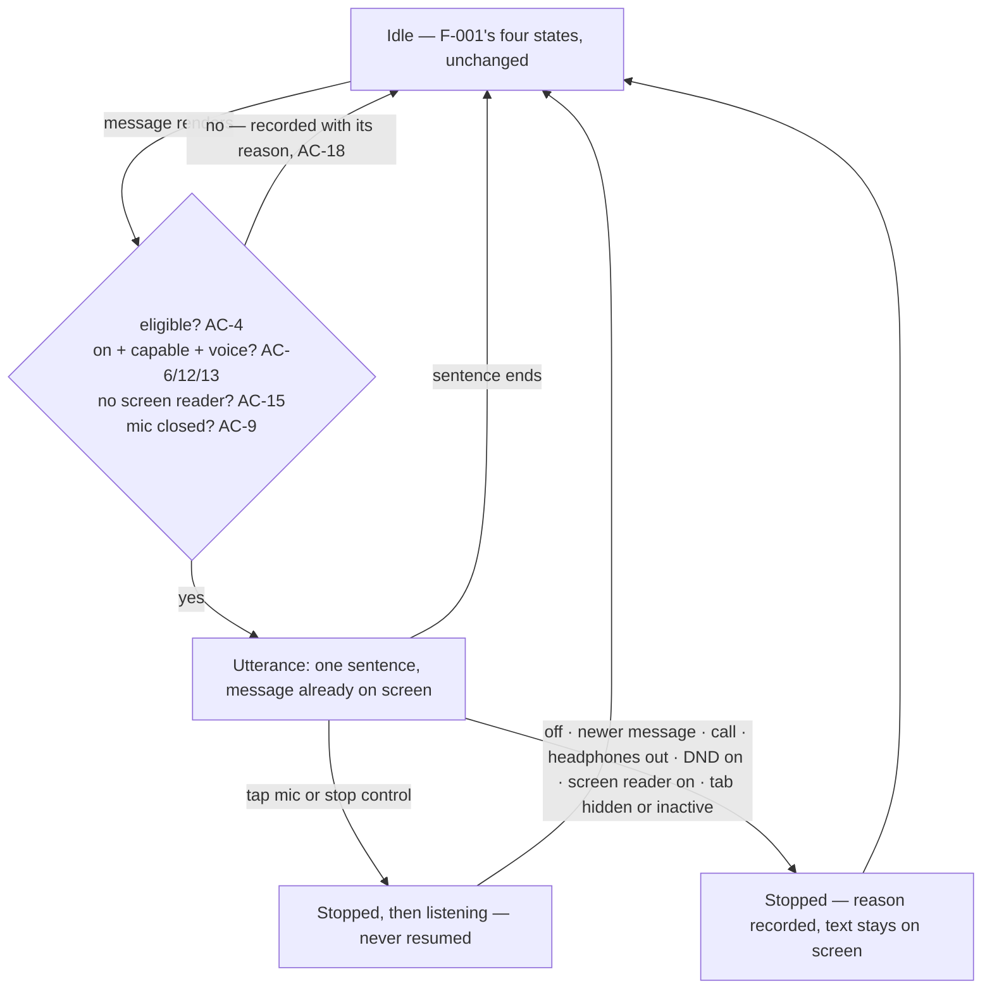

# Feature: Talk-back (speech output)

**ID**: F-002
**Slug**: talk-back
**Status**: `draft` (revision 3 — the **closing** revision. Gate 1 round 2, `reports/gate1-review-F-002.md#round-2`; D1–D10, the round-2 MEDIUM/LOW table and §R-rec's five recovered round-1 findings addressed, changelog at the end)
**Last Updated**: 2026-08-17

> **This revision was not reviewed.** The Gate 1 round cap is 2 and was reached at round 2, so revision 3 closes the gate without a third lens pass. Rounds 1 and 2 both showed this spec introducing new defects while fixing old ones — round 2's 25 HIGH findings sat almost entirely in the four ACs revision 2 had just written. That risk is not retired by this revision; it is carried. Where this revision was unsure, it says so **in place** rather than leaving a reader to discover it: look for **UNVERIFIED** (claims about platform behaviour nobody has run on a device).
>
> **The three Gate 1 escalations were answered by the product owner on 2026-08-17** and are written in as decisions, not as open questions: talk-back is **content, not incidental sound** (AC-7 — the ringer no longer silences it); iOS Safari's gesture refusal is **surfaced** (AC-24, new); a spoken destructive confirmation **must name the tasks** (AC-22). Two consequences of those answers were **not** in the questions put to the owner and are therefore recorded open rather than decided here: Android `silent` mode as distinct from `vibrate` (OQ1b), and the fact that **iOS has no route to the DND half of the first decision at all** (OQ6).

---

## Links

```yaml
primary_module:    assistant
secondary_modules: []
depends_on:        [F-001, F-003]
implemented_in:    []   # orchestrator fills from agent returns
designed_in:       []
api_endpoints:     []   # none — see API Touch Points
tested_by:
  api:    []
  web:    []
  mobile: []
known_bugs: []
```

---

## Purpose

The app answers **out loud**, so the user knows what it understood without looking at the screen. This is the binding next feature after F-001 (Gate 1 decision D1) and, per ADR-11, the actual differentiator: voice-first today is mostly voice going *in* — you still have to read the screen to learn whether the machine got it right. Speaking back closes that loop.

**Deliberately minimal, and the source says so** (UC-20, rewritten 15/08/2026): it reads, it can be turned off, and it does **not** promise cutting in mid-sentence and continuing where it left off — ADR-11 states plainly that speaking is easy and not re-reading what was already said is the expensive part nobody has measured. Two clients ship it at once — web and React Native — because both are gate-passed and forking the capability would split the one conversation contract F-003 AC-1 exists to hold.

**What this feature does not deliver of ADR-11** (product F2, recorded rather than left implicit): AC-4 restricts speech to a turn the user just issued and AC-11 confirms no new outcome exists offline, so **the spoken surface is exactly empty when there is no connection** — the one axis ADR-11 names as the open market position. The only thing that would carry that leg is the spoken day summary (UC-20 AC-20.6), excluded here with reasons and reserved as **F-004** — and **F-004 has no owner decision behind it yet.** The id is reserved so it is not reused; whether it is built, and when, is an open product-owner call. Nothing in this spec or the index commits anyone to it. Approving F-002 is not approving ADR-11's market claim, and the gap between the two currently has no owner.

## Users & Permissions

| Role | Can do | Cannot do |
|------|--------|-----------|
| Authenticated user | Hear one spoken sentence per turn; turn speech off in one gesture; stop a sentence immediately and speak straight after | Lose information by muting — every spoken sentence has a text counterpart (AC-2) |
| Assistant (AI) | Unchanged from F-001 — same server, same turn contract, same refusals | Speak anything not already a message on screen; speak a turn the user did not just issue (AC-4); speak while a screen reader is reading (AC-15) or while the mic is open (AC-9) |
| Operating system | Suppress output while **Do Not Disturb** is active (Android; see AC-7's iOS gap), interrupt for a call / system assistant / focus loss, change the audio route, withhold synthesis or a voice | **Silence output via the ringer or the iOS ring/silent switch** — talk-back is content, not incidental sound (AC-7, owner decision 2026-08-17). Force audio out of the external speaker after headphones are removed (AC-7) |

## Speaking in the conversation model

**Speaking is not a fifth state.** F-001's surface has exactly four — idle · listening · thinking · error (F-001 AC-29) — and this feature adds none. Speaking is a **transient property of one message being rendered**, orthogonal to the four states in the same way the mic control's modes are. Two things force this reading: the surface stays fully usable while speech plays (F-001 AC-11's "a message blocks nothing" applies unchanged), and AC-9's tap-then-speak *requires* the mic to be activatable mid-sentence, which a blocking state would forbid. F-001 AC-29's bounded transition list is untouched.

### What speaks, and from what (C1 — this table is the catalogue's membership)

AC-2's source is **the object the on-screen message renders from**, which is `turn.outcome` for most kinds and three other things for the rest. Enumerated, so design does not have to guess later and the two kinds a blind user most needs — *did my undo revert anything* and *did that fail* — are not silently dropped.

**This table is now also the slot contract** (D2, D3). Revision 2 opened membership to twelve kinds in one AC and closed the slot vocabulary to *"a count and at most one title"* in another, so four kinds could not say what they are for. The last column fixes each kind's permitted slots and, where a task name is spoken, **which field supplies it** — the resolution rule that revision 2 left to a lookup guaranteed to miss on the top-precedence kind. Slot types are defined once in AC-22; frames by row id live in `docs/design/_shared/components.md ## Spoken frames`.

| Message kind (F-001 Conversation model) | Speaks | Renders and speaks from | Permitted slots, and where a name comes from |
|---|---|---|---|
| applied — **delete** | yes | `turn.outcome` (`data-model.md ## TurnOutcome`) | `count`, `title` ← **`turn.outcome.deleted_titles[0]`**, `title_list` ← `deleted_titles` (bounded, AC-22). Never a local lookup: F-001 AC-4 names a delete by title *precisely because no row remains locally* |
| applied — **create** | yes | `turn.outcome` | `count`, `title` ← **`turn.outcome.created_titles[0]`**, `title_list` ← `created_titles` |
| applied — **edit, title field** | yes | `turn.outcome` | `count`, `title` ← **`turn.diff[].new`** for the entry whose `field` is the title |
| applied — **edit, non-title field** | yes | `turn.outcome` | `count`, `title` ← local lookup of `changed_task_ids` against the client task list (the resolution F-001 AC-4 already performs). **This is the only kind for which `degraded{no_title_resolved}` is reachable** |
| resolution outcome | yes | `turn.outcome` (`kind: resolution`) | `count`, `title` — an `executed` resolution carries the full applied anatomy, so it resolves exactly as the applied row above for its own operation; `declined` / `declined_superseded` / `already_resolved` are **count-only** |
| clarify question | yes | `turn.outcome` (`kind: question` → `turn.question`) | `count`, `title_list` ← **`turn.question.options`** (the actual candidate texts, F-001 AC-13). Speaking the count without the candidates asks a question and withholds its answer set |
| confirm question (bulk delete) | yes | `turn.outcome` → `turn.question` | `count`, **`title_list` REQUIRED** ← **`turn.question.task_titles`** (F-001 AC-9 names them on screen). Naming the tasks is an obligation, not an option — owner decision 2026-08-17, AC-22 |
| no-match | yes | `turn.outcome` (`kind: no_match`) | `verbatim` ← **`turn.outcome.heard_transcript`**. F-001 AC-14 requires the heard words so a mishearing is distinguishable from an absent task; spoken count-only they become one sentence, in the channel where the user cannot see the quote |
| unsupported-query | yes | `turn.outcome` (`kind: unsupported_query`) | `verbatim` ← **`turn.outcome.alternative`** (server-provided string, passed through unmodified) |
| unclassifiable | yes | `turn.outcome` (`kind: unclassifiable`) | count-only — nothing executed, no task to name |
| reverted / partially-reverted / nothing-reverted | **yes** | `turn.undo_result` (`UndoResult`) — **not** `turn.outcome` | `count` ← `reverted.length`, `count_secondary` ← `skipped.length`, `title` / `title_list` ← **`UndoResult.reverted[].title`** and `skipped[].title`, which the object carries inline. Frame selection is AC-22's three-way rule, not `nothing_reverted` alone |
| undo-refused | **yes** | the `409 UNDO_REFUSED` envelope; on the voice-undo path no turn row exists at all (ADR-006) | count-only — the envelope carries no titles |
| failed-turn error | **yes** | the `500 APPLY_FAILED` / `502 AI_ERROR` envelope; `TurnOutcome.kind` has no error member | count-only — the envelope carries no titles |
| queued-turn notice (offline) | **yes** | client-local; no server object. Staying silent here is the "did it even hear me" failure AC-1 exists to prevent | count-only — client-local, nothing applied yet |
| session-closed boundary marker | **no** | history — AC-4 | — |
| any message restored by a session read | **no** | history — AC-4 | — |

**Fourteen speaking rows, and `degraded{no_title_resolved}` is reachable from exactly one of them.** Revision 2 routed every named task through one client-side lookup, so the miss marker fired on the best-supported paths (delete, create) and read as normal operation — *"`degraded` is the spec's own word for 'working as designed'"*. It is now reserved for the genuine miss: a non-title edit whose id is not in the local list (filtered-out, archived, or an offline store that never held it).

## User Flow



**These boxes are not surface states.** The surface is in exactly one of F-001's four throughout; the diagram is the lifecycle of a single utterance. F-001's conversation flow and F-003's lifecycle flow are unchanged and not restated.

## Composition with F-001 and F-003

No F-001 or F-003 AC is narrowed, replaced, or forked. Each row adds; none subtracts.

| Existing contract | Composition here |
|---|---|
| F-001 AC-19 / F-003 AC-12 — announcement | Unchanged, never suppressed by talk-back (AC-14). F-003's existing `suppressAnnouncements` is a **different subject** and stays — see AC-14 |
| F-001 AC-3 / F-003 AC-7 — cancel, interruption while **listening** | Unchanged. AC-10 adds the mirror case (interruption while **speaking**); AC-4 makes a cancelled turn's late outcome render silently |
| F-001 AC-20 — capability detection, no audio on the wire | Same rule reused for synthesis (AC-12); no audio crosses the wire in either direction |
| F-001 AC-4 — changed rows marked from `changed_task_ids` | **Reused, not duplicated — but only where the wire carries no title.** F-001 AC-4 names a **delete** by title precisely because no row remains locally, so AC-21 takes `deleted_titles` / `created_titles` from `turn.outcome` first and reuses the local resolution **only** for an edit to a non-title field (D2). Revision 2 routed every name through the local lookup, which made the top-precedence kind miss by construction |
| F-001 AC-9 / AC-10 / AC-13 — bulk-delete confirmation, answerable **by voice** | A spoken confirmation **names the tasks** (AC-22, owner decision 2026-08-17). This is the composition that makes it a safety obligation rather than a phrasing preference: F-001 lets an affirmative arrive by voice, so a count-only question would let a user delete tasks they were never told the names of |
| F-001 AC-7 — a revert never renders as a success when it was not one | **Now matched on the spoken half** (AC-22's three-way frame selection). Revision 2 selected on `nothing_reverted` alone, so a partial revert spoke the success frame — misinforming, and invisible to every silence AC because the log correctly recorded `spoke` |
| F-001 AC-14 — no-match **quotes the heard transcript** | Carried into speech as AC-22's `verbatim` slot. Count-only would have collapsed mishearing and genuine absence into one sentence, in the channel where the user cannot see the quote |
| F-001 AC-25 / ADR-7 — offline | Unchanged; offline there is no new outcome to speak, only the queued-turn notice. See Purpose for what this costs ADR-11 |
| F-001 AC-28 / F-003 AC-8 — session read, boundary message | Unchanged and explicitly **silent** (AC-4). AC-20 carves out the one thing the session read may never gate: stopping speech |
| F-003 AC-4 — recognizer present, language pack missing → dimmed with the cause stated | **Now matched on the output half** (AC-13). Revision 1 made the opposite call and did not say so; this revision aligns them |
| F-003 AC-1 — no per-platform behaviour fork | Holds. Every divergence is forced by a platform capability and tagged `ios` / `android` / `web`, never hidden under `mobile` |

## Acceptance Criteria

### The point of the feature (UC-20 AC-20.1)
- [ ] **AC-1** (web, mobile) — The user learns what the app understood **without looking at the screen**. Acceptance method, stated completely enough to be repeatable (tester-mobile F9): the screen is covered; the listener speaks the `client.interface_language` and has **not** seen the script; three legs run — one create, one edit, and one turn changing three tasks; the listener recounts, for each leg, what happened and **which task** (AC-21 names one even in the multi-change leg). Pass bar: all three legs recounted correctly by two of two listeners, or the leg is a finding. Device/manual — see `## Verification status`.

### Text always exists (UC-20 AC-20.2)
- [ ] **AC-2** (web, mobile) — Every spoken sentence has a text counterpart. Speech is produced **only** from a message already rendered on the conversation surface, and from the same object that message renders from. Four source objects, not one (C1 — revision 1 named only the first, which silently excluded the two kinds a user not looking at the screen most needs): `turn.outcome` for the seven turn-outcome kinds; **`turn.undo_result`** for reverted / nothing-reverted; the `409 UNDO_REFUSED` envelope for undo-refused, which on the voice path has no turn row at all; and the failure envelope (`500 APPLY_FAILED` / `502 AI_ERROR`) for a failed turn, since `turn.outcome` has no error member. The per-kind enumeration in `## What speaks, and from what` is exhaustive and closed; a kind not in that table does not speak. Never a separate server field, never the rendered text read verbatim. Muting, disabling, or a device that cannot speak loses **zero** information. There is no spoken-only message. **Where the "never read the rendered text verbatim" half is observable** (tester-web F7, recovered — see §R-rec): for a single-task turn, composing from the outcome and scraping the DOM are byte-identical, so that clause has no test of its own there. The one turn where the two diverge observably is **AC-3's multi-task turn**, where the screen shows a per-row diff and the utterance is one sentence with a count — assert the mechanism there, not on the single-task case.

### Summary for the ear (UC-20 AC-20.7)
- [ ] **AC-3** (web, mobile) — Exactly **one sentence per turn**. A multi-change outcome speaks a count plus the one task AC-21 names, never a per-row reading; a diff is not read field by field. Detail stays on screen, where F-001 AC-4 already draws it. Countable acceptance: one turn = one utterance = one sentence. *(Revision 2's "an eval scenario penalises a listing answer" is struck — product L-2: it named an artifact that exists nowhere and has no owner. The countable half carries the AC alone.)*
- [ ] **AC-21** (web, mobile) — **Which task is named** is deterministic, not a model judgement (C11), and **the name comes from the source object that actually carries it** (D2). Precedence between operations stays: **deleted > edited > created**, ties broken by the turn's own order in `changed_task_ids`; the sentence names that one task and states the total count when more than one changed ("deleted *Call the dentist*, and two more"). Resolution order is **per source, not one lookup** — `## What speaks, and from what` fixes it per kind, and the rule in one line is: **take the title the wire already carries; look locally only when it does not.** Concretely: `turn.outcome.deleted_titles` for a delete, `created_titles` for a create, `turn.diff[].new` for an edit whose changed field is the title, `UndoResult.reverted[]/skipped[]`'s inline `{task_id, title}` for a revert, `turn.question.task_titles` / `.options` for the two question kinds, and the client's own task list **only** for an edit to a non-title field. Kinds whose source object carries no title at all (undo-refused, failed turn, queued notice, unclassifiable, declined resolutions) are **count-only by declaration**, not by fallback.
  **Why this changed** (D2, four lenses): revision 2 ranked deletes highest and then resolved every name through the local task list — but F-001 AC-4 names a delete by title *precisely because no row remains locally*, so the top-precedence kind routed to the one lookup guaranteed to miss. Its own worked example ("deleted *Call the dentist*, and two more") and AC-1's three-task acceptance leg both fell into it. `turn.diff` cannot rescue a delete either: `new` is null for a delete (`data-model.md ## assistant_turn`). Meanwhile `deleted_titles` and `created_titles` were already on the wire and already cited in this spec's own `## API Touch Points`. **No contract change — every field named above exists today.**
  **Miss case, narrowed** (C2, D2): if a **non-title edit**'s id is not in the local list — filtered-out, archived, or an offline store that never held it — the sentence falls back to the count-only form and **never** reads a uuid or a draft-ref token (F-001 AC-4). That fallback, and only that one, is recorded `degraded{reason: no_title_resolved}` (AC-18). A count-only sentence for a kind the table declares count-only is **not** `degraded` — it is that kind working correctly, and recording it as degradation is what made the marker unreadable in revision 2.

### Which messages speak, and when
- [ ] **AC-4** (web, mobile) — Eligibility is **presence plus intent**, not a dedupe flag (C3 — revision 1 keyed on `replayed`, which expresses a dedupe fact). An outcome speaks only if **all four** hold when it arrives: (a) it belongs to a turn the user issued in this foreground session, not one restored by a session read; (b) the surface is foregrounded **and visible**, so a hidden tab is not spoken to and hiding the tab mid-sentence stops it (`stopped{not_visible}`); (c) the turn was **not cancelled** — F-001 AC-3's client-local cancel marks the turn speech-ineligible, and its late outcome still renders per F-001 AC-3 but does not speak; (d) it arrives inside the **same uninterrupted foreground period** in which the turn was issued, so an offline-queued turn delivered on reconnect minutes later (F-001 AC-25) renders silently even though `replayed` is `false`. `replayed: true` remains sufficient for silence and is no longer the criterion. Every ineligible outcome is recorded with its reason (AC-18).
- [ ] **AC-4(b) reads one injectable source, not a browser property** (D8). Visibility is a capability of the `SpeechOutput` port — beside DND state and screen-reader state — and AC-4(b) is phrased against **that** source; `document.visibilityState` is one implementation of it, not the predicate. This is not tidiness: tester-web verified in *this repo's own browser tier* that visibility cannot be driven from outside the page — Playwright exposes no API, `Emulation.setPageVisibilityState` is **absent from this Chromium build**, and a second foregrounded page leaves the first reporting `visible`. The only remaining route redefines the property on the page, which proves the guard reads a stub rather than that it reads visibility. With an injectable source the node tier asserts the guard and the browser tier is left one honest question — does the real property drive the source — instead of a test that cannot fail. **On mobile the predicate was simply missing:** `AppVisibility` is `'active' | 'inactive' | 'background'` (`src/assistant/mobile/model/lifecycle.ts:11`) and the controller handles only two (`controller.ts:97-100`) — `inactive` falls through. On iOS `inactive` is exactly the mid-utterance case that matters: notification shade, incoming-call banner, app switcher. **`inactive` stops the utterance**, recorded `stopped{not_visible}`, the same intent as a hidden tab.
- [ ] **AC-5** (web, mobile) — One utterance at a time; two voices never overlap. `speech.utterance` is a slot of size one: a newer message's speech **cancels** the older rather than queueing behind it, recorded `stopped{reason: superseded}`. The cancelled message keeps its text (AC-2), so nothing is lost by being dropped.
  **The supersede path is the one AC-18's start-callback rule exists to catch** (dev-web F7, recovered — see §R-rec — and rediscovered from the other direction by round-2 dev-web). The browser sequence this AC mandates is `cancel()` immediately followed by `speak()`, and **that is the sequence Chromium is known to drop**: the replacing utterance never sounds, `speechSynthesis.speak()` returns void and cannot fail synchronously, so nothing throws and nothing is observable at the call site. `cancel()` compounds it by reporting its end inconsistently across engines — `end` in some, `error: 'canceled' | 'interrupted'` in others. A double with an injectable completion callback passes AC-5 and AC-9 in node while the real browser silently swallows the replacement. **These are one fix seen twice:** because AC-18 appends `spoke` from the port's *start* callback, a Chromium-dropped replacement produces **no `spoke` entry**, and AC-18's no-start timeout turns the swallow into a recorded `failed{no_audio_start}` the suite can assert on. Written any other way — `spoke` at the call site — the dropped utterance and a working one are the same log. AC-5's cancel-and-replace half is therefore **browser-verified, not node-verifiable**; see `## Verification status`.

### Off, and never unintentional (UC-20 AC-20.3)
- [ ] **AC-6** (web, mobile) — Speech is turned off in **one gesture** from the conversation surface. Off means nothing is synthesised at all — not synthesised-and-muted. Turning it off during a sentence stops that sentence immediately. The setting persists in `client.speech_prefs` and survives reload and backgrounding on both clients, and **process kill on mobile**. *(tester-web F8, recovered: the web platform has no observable for process kill distinct from reload, so a single web+mobile "survives process kill" claim gets ticked on weaker evidence than it states — the pattern `## Verification status` exists to prevent. The durability contract is now stated per platform, matching `data-model.md ## Client-side stores`, which already scopes kill-survival to mobile and reload-survival to web.)*
- [ ] **AC-7** (ios, android) — **Talk-back is content, not incidental sound** — *owner decision, 2026-08-17: "vẫn nói — như Google Maps chỉ đường."* Exactly **two** things silence it: the user turning it off (AC-6), and **Do Not Disturb**. The ringer does not. This reverses revision 2, which read the OS's silence as absolute and picked the strictest value set on both platforms — a reading nobody had chosen, and one that killed the feature in the most common all-day phone state with no cause shown and the control still reading ON. Platform convention for deliberate voice output runs the owner's way: navigation guidance and media survive vibrate and the iOS switch; only incidental UI sound does not.
  **iOS**: playback uses **`playback`** — a category the ring/silent switch does **not** silence. Revision 2's `ambient` / `soloAmbient` are now **forbidden** (they defer to the switch, which is the reading the owner rejected), and so is keeping the recognizer's `playAndRecord` for playback — it routes audio to the earpiece unless `.defaultToSpeaker` is set, quietly breaking AC-1's cover-the-screen test. `playback` cannot record, so AC-19's arbiter is still required and its job is unchanged: switch on every listen↔speak edge.
  **Android**: TTS defaults to the media stream, which the ringer does not silence — under this decision that default is **correct** for the ringer and wrong only for DND. The client reads DND via `NotificationManager.getCurrentInterruptionFilter()` and **suppresses on `NONE` and `ALARMS`**, recorded `suppressed{reason: os_silenced}`. It does **not** read ringer mode at all.
  **DND is not a boolean** (dev-mobile M1): the filter is `ALL | PRIORITY | NONE | ALARMS | UNKNOWN`. **`PRIORITY` does not suppress** — it is the mode most people leave on a schedule, it does not attenuate media at all, and suppressing on it would kill the feature every evening for the same reason revision 2's vibrate rule killed it every day. **`UNKNOWN` does not suppress**, decided explicitly: it means the read failed, and failing closed would produce silence with a cause the user cannot act on. Both non-suppressing values still record their decision (AC-18), so "DND read returned `UNKNOWN` all week" is visible rather than inferred.
  **Mid-utterance, not only at start** (D10): DND turning on **during** a sentence stops it (`stopped{reason: os_silenced}`). Revision 2 specified a start-time read only, while `## Data`'s `stopped` vocabulary and the User Flow diagram both already carried the mid-utterance case — `os_silenced` was a dead vocabulary value and a phone put into DND mid-sentence kept talking. That is L-005's shape (one obligation, two doors, a guard at one), which the same revision applied correctly to AC-15 and not here. All four places now agree: this AC, the flow diagram, the `stopped` vocabulary, and `## Test strategy`'s matrix. The subscription this needs is a DND observer, and it is a **blocking** capability check — OQ3.
  **Both**: an output-route change removing headphones mid-sentence **stops** the utterance (`stopped{reason: route_change}`); it never re-routes to the external speaker. Android focus is held as a **transient** focus and **released promptly when the utterance ends** — the constraint is on the release, not on the ducking (dev-mobile F10, recovered): revision 2's "holds transient audio focus rather than ducking others indefinitely" conflated a focus *type* with a *release* failure and as written ruled out `AUDIOFOCUS_GAIN_TRANSIENT_MAY_DUCK`, the mode actually fitted to a one-sentence utterance. The alternative pauses the user's music once per turn.
  **UNVERIFIED — iOS cannot honour the DND half of this decision, and nobody has been asked.** iOS exposes **no public API for Focus / Do Not Disturb state**, and `playback` audio is not attenuated by DND, so on iOS neither route to the owner's second silencer exists: the app cannot read DND, and the OS will not apply it. The decision is fully implementable on Android and **half-implementable on iOS** (user-off works; DND does not). This is a consequence of the decision that was not put to the owner — it is recorded as OQ6 and in `## Known platform asymmetries`, not silently dropped and not decided here.
- [ ] **AC-8** — **[WITHDRAWN — not an acceptance criterion.** Its substance was "web exposes no silent-switch or headphone-removal signal", which asserts the absence of a platform capability and would force a test asserting nothing (product F4). It now lives in the platform-asymmetry note below. The id is retired, not reused.**]**

### Stop to listen — not resume (UC-20 AC-20.4)
- [ ] **AC-9** (web, mobile) — **Tap then speak.** Activating the mic or the stop control while a sentence plays stops it immediately — no remaining audio after the tap, the rest is never read first, and it is never resumed. Exclusivity is defined in **both** directions (C8): speech never starts while the mic is open, and an outcome arriving *during* listening renders silently, recorded `suppressed{reason: listening}` — it is **not** queued to speak when listening ends, which would be the delayed unsolicited audio AC-4 forbids. This exclusivity is also what makes AC-19's category switching possible, and what keeps barge-in out of scope rather than half-built.
- [ ] **AC-20** (web, mobile) — **The stop is always reachable and never waits for the network** (C8, code-verified). Two failures in the shipped clients this AC forbids: (a) `MobileAssistantController.tapMic()` (`src/assistant/mobile/controller.ts:294–299`) defers the **whole** tap behind F-003 AC-8's `foregroundSync`, so a tap landing during a foreground transition waits on a network round trip — **stopping speech is not "new input" in F-003 AC-8's sense and is never gated**; only the begin-listening half waits for the session read. (b) The mic's modes are `SpeechCapability = available | none | permission-denied | transient-failure` (`src/assistant/_shared/ports/transcript-source.ts:23`), and talk-back keys off a *different* capability, so a mic-only stop is not reachable in every mode. *(Correcting revision 2, dev-mobile M2: it listed "available · dimmed · hidden · permission-denied", which is not this codebase's enum — "dimmed" is a **rendering** in `docs/design/_shared/components.md ## MicControl`, not a mode; `transient-failure` was missing; and its claim that a mic stop "has no instantiation in three of four" is false — `tapMic()` has live branches at `controller.ts:307-310` and `:311-316`, and only `none` returns early at `:301`. The directive survives the correction: one mode with no mic at all is enough to require a second stop.)* Therefore a **stop affordance is present independently of the mic**, reachable in every capability value; the mic tap is an *additional* stop when the mic is tappable. AC-17's WCAG 1.4.2 mechanism depends on this — a hidden mic must not remove the only way to stop audio.
  (c) **The stop's identity is the utterance, not the message** (D9). Revision 2 bound it to "the speaking message itself", but a message stops being *the speaking message* through events the user does not control: AC-5 supersession, AC-4(b) tab hide or `inactive`, AC-7 route change or DND, AC-15 screen-reader activation. Under supersession a keyboard or switch user reaching for message A's stop has it **destroyed under their hand** while the live stop reappears on message B — more audio, no focus, and AC-17's 1.4.2 mechanism momentarily absent. So: **exactly one stop affordance exists at a time, present precisely while `speech.utterance` is non-empty**, and it persists across a supersession rather than being destroyed and recreated. Placement remains design's (`docs/design/_shared/components.md`); its *identity* is this spec's. **Focus disposition, stated rather than left to the frame author:** if focus is on the stop when the utterance is superseded, focus stays on the stop — it is the same control, now bound to the new utterance. When the utterance ends for any reason and no new one starts, the affordance disappears and focus returns to the conversation surface, never to `document.body`. F-001 met this exact shape with `UndoAffordance`, whose "gone" state is a *visible* removal plus a retained note; talk-back's removal is silent and time-critical, which is why the identity is the utterance and not the row it came from.
- [ ] **AC-10** (ios, android) — Audio interruption while **speaking** stops the utterance and releases the audio session so the interrupting app is not blocked. On focus return speech does **not** resume and the mic returns to available without re-prompting. Mirror of F-003 AC-7, which governs interruption while listening; per AC-9 the two never both apply. iOS signals this as an `AVAudioSession` interruption notification, Android as audio-focus loss — the same obligation, two signals, and AC-19's single owner subscribes to both.
  **All four interruption reasons are this AC's, arriving through one callback** (dev-mobile F5, recovered). `AudioInterruptionReason` is `'call' | 'system-assistant' | 'focus-loss' | 'route-change'` (`src/assistant/mobile/model/lifecycle.ts:70`), and its comment states the union is deliberately exhaustive so *"an unlisted kind cannot silently take a different path."* Revision 2 listed the first three here and put **route-change in AC-7 under a different platform tag** — one code path, one callback, split across two ACs, which is L-005's shape arriving pre-built. All four are handled here; each maps to its own recorded reason so the log stays diagnostic: `call` · `system-assistant` · `focus-loss` → `stopped{audio_interruption}`, `route-change` → `stopped{route_change}`. AC-7 keeps only the *routing* guarantee it is actually about — never re-route to the external speaker.
  **The category is re-asserted per utterance, not held** (dev-mobile L1). `AudioInterruptionEvent.phase: 'ended'` is subscribed by nothing today (`controller.ts:101-103` handles `'began'` only) and this feature **does not add a subscriber**: since speech never resumes after an interruption, there is nothing for an `'ended'` handler to do, and AC-19's arbiter sets the category at the start of each utterance rather than assuming the one it set last is still in force. This is the cheaper half of the choice and the one that survives another app taking the session in between.
- [ ] **AC-19** (ios, android) — **One owner arbitrates the audio session** (C7). On iOS `AVAudioSession` is a single process-wide singleton; AC-7's `playback` **cannot record** while F-003's recognizer needs `record` / `playAndRecord`, so the two cannot both hold without switching category on every listen↔speak edge. AC-9's mutual exclusivity is what makes that switch coherent: it is the enabling condition, not an optimisation. The switch is performed by **one arbiter module** both ports call, never by each port independently — one installer, every door (L-005) — and that arbiter also owns the interruption subscriptions AC-10 needs. Observable: it records the category in force at each `spoke` (AC-18's extended entry) and each listening transition, so a build that never switches is caught by assertion rather than by a device.
  **The seam delta, named — because without it this AC is not buildable** (D4). Audio-session ownership today lives in the **recognizer** port, and `NativeSpeechModule` exposes `start(locale)` / `stop()` / `releaseAudioSession()` and **no category operation at all** (`src/assistant/mobile/ports/native/rn-transcript-source.ts:29-45`). `RNTranscriptSource.start()` therefore configures the session behind any arbiter's back. Revision 2 asked for an arbiter and simultaneously forbade touching the seams that would let one exist, leaving exactly two ways to build it: edit shipped F-003 code that `## Out of Scope` forbade, or stand a second owner beside the existing one — **which is the two-owners problem this AC exists to end**. Earliest catch would have been C6 writer-subtree enforcement or a mobile implementer returning BLOCKED mid-build. The three edits are therefore **in scope for F-002** and carved into `## Out of Scope` accordingly:
  1. `NativeSpeechModule` (`rn-transcript-source.ts:29-45`) **gains a category operation** — set/activate a named `AVAudioSession` category.
  2. `releaseAudioSession()` **moves to the arbiter** — from `NativeSpeechModule:41`, `RNTranscriptSource.releaseAudioSession` (`:203-205`) and the `MobileTranscriptSource` port (`ports/transcript-source.ts:47`, `:156`); the two existing callers in `controller.ts:218` and `:232` call the arbiter instead.
  3. The interruption subscription at `controller.ts:101-103` **moves with it**, so AC-10's handler and the category owner are the same module.
  This is the same carve-out the spec already made in the opposite direction for the recognizer's language alignment (`## Out of Scope`) — there the F-003 seam edit was declined and recorded as follow-up drift; here it is accepted and bounded to three named seams. Anything beyond these three is still out of scope.
  **Failure branch** (D4/M5): the iOS switch is deactivate → setCategory → setActive, and **`setActive` routinely fails** while another app holds the session or a call tears down — and AC-9 makes that edge fire on *every* interruption of an utterance. Revision 2's closed reason vocabulary had no value for it, so an ordinary platform error violated AC-18 by construction. Disposition: a failed switch **abandons the utterance rather than speaking on the wrong category**, recorded `failed{reason: audio_session_unavailable}`; the message keeps its text (AC-2), nothing is queued, and the next turn attempts the switch fresh (per AC-10's re-assert-per-utterance rule). Speaking on whatever category happened to be in force is forbidden: on iOS that is the recognizer's `playAndRecord`, which routes to the earpiece and breaks AC-1.
- [ ] **AC-11** (web, mobile) — Losing connectivity mid-sentence does not cut it off **when the selected voice is on-device**, and voice selection therefore **prefers an on-device voice** whenever one exists for the declared language. Android network voices are real (tester-mobile F10): if only a network voice exists, a connection loss mid-sentence ends the utterance as `stopped{reason: voice_unavailable}` rather than truncating silently. Offline, F-001 AC-25's handover stands unchanged.

### Capability, voice and language (UC-20 AC-20.5)
- [ ] **AC-12** (web, mobile) — A device or browser with **no synthesis capability at all** keeps everything else working with no error surfaced and no dead control: the on/off control is **hidden**, not disabled. Detected by capability (`speech.capability`), never by platform name — F-001 AC-20's rule.
- [ ] **AC-13** (web, mobile) — **Synthesis present but no usable voice is a different state, and it is not hidden** (C5). `speech.capability.voice_for_language` is four-valued: `available` · `installable` · `unsupported` · `resolving`. `installable` (reachable on Android, where voice data downloads separately) keeps the control **visible with the cause stated in words and no CTA** — the same shape F-003 AC-4 chose for the recognizer's missing language pack, and for the same reason: absence without explanation reads as breakage. *(Revision 2 mandated a CTA to install the voice; design flagged that `components.md:56` deliberately gave the sibling case **words and no CTA** under the over-promise rule, so one of the two siblings diverged whichever way it was written. Resolved toward the existing precedent: both routes end in system settings, and a button labelled as if it installs a voice promises an action the app cannot perform. The two siblings now match.)* `unsupported` keeps the control visible and says so; the turn is **silent with no error surfaced**, never spoken in another language, because a wrong-language voice is harder to understand than no voice. `resolving` covers **two** asynchronous cases, not one: the web voice list loading (dev-web F4) **and Android's engine, which is not queryable until `OnInitListener` fires** — so `on_device`, which AC-11 keys its preference on, is also unknown at boot (dev-mobile L2). An eligible utterance **waits for resolution** rather than being dropped or misreported as no-voice, bounded by a stated timeout after which the state becomes `unsupported`. **`resolving` is recorded while it waits** — `waiting{reason: voice_resolving}` (AC-18) — because a terminal-only vocabulary means a build whose voice list never resolves records nothing at all until the timeout, which is silence with no entry and therefore indistinguishable from the tautology AC-18 exists to kill. Revision 1's two-boolean shape permitted `{synthesis_available: true, voice_for_lang: false, enabled: true}` — a control reading ON that never speaks — which is exactly the dead control AC-12 promises not to ship.
- [ ] **AC-23** (web, mobile) — **The interface language has exactly one declared source** (C6): `client.interface_language`, a BCP-47 tag, read by both the synthesiser and the recognizer. **For this phase it is a build-time constant**, set to the language of the shipped copy in `docs/design/_shared/components.md` (English, `en-US` — *owner decision, 2026-08-17*, ADR-008; the value moved from `vi-VN`, nothing else in this AC did); it is **never** `navigator.language` and never a per-port constant. *(product M-1: revision 2 defined it as "the app's own interface-language setting" — **no such setting exists**, and no settings surface is a deliverable of this feature or any other in flight. An implementer reading that reaches for `navigator.language` as the nearest available thing, which is the exact drift this AC exists to stop, reintroduced by the AC's own wording. A constant is honest about the phase and still gives both ports the single source they must read; a settings surface can replace the constant later without changing any consumer.)* Every utterance declares this tag explicitly rather than letting the engine guess. Recorded drift this AC exists to stop — **still live after ADR-008, and one half of it now wrong twice over**: today web recognition uses `navigator.language || 'en-US'` (`src/assistant/web/ports/web-speech-source.ts:50`), which is the wrong *mechanism* whatever it resolves to — on a Vietnamese-locale machine it hands an English sentence to a Vietnamese voice, the exact failure AC-13 exists to prevent, shipping as the default. Mobile hardcodes `'vi-VN'` (`src/assistant/mobile/ports/native/rn-transcript-source.ts:71`), which is now wrong in **both** respects: it is a per-port constant rather than the declared source, *and* since ADR-008 it names the wrong language. Note what does **not** follow: correcting the mobile literal to `'en-US'` would leave the AC just as violated, because the defect is the second source, not the value in it. Aligning the *recognizer* to this value is drift for a follow-up, not F-002's build; declaring the value both must read is F-002's.
- [ ] **AC-24** (web) — **iOS Safari's gesture refusal is surfaced, not silent** — *owner decision, 2026-08-17.* iOS Safari requires a user gesture per `speak()`, and every utterance here fires from a network callback; the mechanism is that the gesture which *sent* the turn — the mic tap or send tap — unlocks the utterance that answers it. When the platform refuses anyway, the result is `suppressed{reason: gesture_required}` **and the control stays visible with a short line stating that the browser blocked the audio and that tapping enables it.** This is the shape AC-13 already uses for `installable`, applied to a second cause: absence without explanation reads as breakage, and on the only browser engine available on iOS a user who deliberately opted in would otherwise get permanent silence with no cause. *(Revision 2 claimed this result was "surfaced rather than silent" while **no AC required any user-visible surfacing** and the log is in-memory — a promise in prose that nothing carried. The word is now true because this AC carries it.)* Unlike AC-13's `installable`, this state is **recoverable by the user in place**, so the line is tied to the refusal and clears on the next successful `spoke`. Wording and placement are design's (`docs/design/_shared/components.md`).

### Accessibility composition
- [ ] **AC-14** (web, mobile) — F-001 AC-19's live region and F-003 AC-12's native announcement are **unchanged, never suppressed by talk-back, and never conditional on it**. Talk-back is a second channel for everyone; it is never the accessibility path, and turning it off degrades no screen-reader user. **Not in conflict with F-003's existing `suppressAnnouncements`** (`src/assistant/mobile/controller.ts:74`, dev-mobile F9): that flag suppresses announcement of *restored history during reconciliation*, a different subject, and it is correct — an implementer must not "fix" it in this feature's name. Observable (tester-web F3): with talk-back **enabled**, the announcement call still fires for every kind in `## What speaks, and from what`, asserted on the recorded announcement surface; the web suite runs this case with `client.speech_prefs.enabled` forced true, since web's default-off would otherwise never exercise it.
- [ ] **AC-15** (ios, android) — While a screen reader is active, talk-back produces **no utterance**, so VoiceOver / TalkBack and the app never speak over each other, and the on/off setting keeps its value — suppression is never a silent write to the user's preference. **Both doors, not one** (C9, `LEARNINGS.md` L-005): the state is checked at utterance start **and** subscribed to for the duration, so enabling a screen reader **mid-sentence** — the moment the user most needs it — stops the utterance immediately (`stopped{reason: screen_reader_activated}`), and it is re-read on every foreground transition, the cadence `client.permission_state` already uses. The Android signal must report **spoken-feedback accessibility services**, not touch exploration (tester-mobile F8): touch exploration is neither necessary nor sufficient, and RN's `isScreenReaderEnabled` maps to it — the exact API is Open Question 3. **The subscription has the same defect as the read, and needs the same answer** (dev-mobile M3): RN's `screenReaderChanged` event derives from the *same* touch-exploration signal, so a correct read paired with a wrong subscription still doubles mid-sentence — the exact case this clause was added to fix. OQ3 is split into the read and the subscribe halves accordingly, and both are blocking. **Fallback, stated rather than left open:** if no spoken-feedback subscription is available on Android, the state is re-read at each utterance start and at every foreground transition, and the mid-utterance stop is **absent on Android with that recorded as a known gap** — never silently approximated from touch exploration, which would stop utterances for sighted users navigating by touch and still miss real screen-reader activation.
- [ ] **AC-16** (web) — The web platform exposes **no** screen-reader detection (deliberately, for privacy), so the web client cannot auto-suppress and AC-15 has no web instantiation. Web's substitute: talk-back is **off by default**, enabled only by explicit opt-in, and the control's description states that a screen reader already reads new messages. Capability-driven, not a behaviour fork (F-003 AC-1); product-agent examined this specifically for a product-vs-accessibility clash, found none, and recorded three converging reasons — the decision is closed.
- [ ] **AC-17** (web, mobile) — WCAG 2.1 AA, by name: **1.4.2 Audio Control** — speech starts without a distinct per-utterance activation and a sentence may exceed three seconds, so the exemption is not relied on; AC-6's one-gesture off and AC-20's always-reachable stop are the required mechanism. **2.1.1** — off and stop are keyboard-operable (web). **4.1.2** — the off control exposes name, role **and its on/off state** — and, when it is on but will not speak, **the cause** (design F5, recovered): four suppression states leave `client.speech_prefs.enabled` true with nothing that will ever speak (`synthesis: absent`, `voice_for_language: unsupported`, screen reader active, DND active on Android), so a control exposing only on/off tells a screen-reader user it is ON while the feature is inert. This is AC-12's "no dead control" promise applied to the control's *accessible* description, not only to its visibility. **1.4.3, 2.5.3, 4.1.3** — unchanged from F-001 AC-19.
  **The control itself is not yet designed, and that is a gap this spec cannot close** (design F4, recovered — raised at round 1, never routed): five ACs here require an on/off control (AC-6, AC-12, AC-13, AC-16, AC-17) and **none of them describes it**. Its placement, and the split between a persistent control and a per-message affordance, are unstated — while `docs/design/_shared/components.md ## Composer` now hosts two independently hideable siblings (MicControl per F-001 AC-20, and this control per AC-12) whose simultaneous absence reflows the composer to something nobody has drawn. **Routed to design-agent, not answered here**: this spec fixes the control's *obligations* (one gesture, hidden vs visible-with-cause, exposed state and cause, keyboard-operable) and its *identity* rules for the stop (AC-20c); the rendering is design's deliverable.

### Making the silence falsifiable
- [ ] **AC-18** (web, mobile) — **Every speech decision is recorded, with a reason from a closed vocabulary** (C4). Four ACs above specify *no sound* for four different reasons, and a build that never speaks at all satisfies all of them — the tautology shape Gate 3 caught inside F-003's test file, here living in the spec where no mutation check reaches it. The fix is that the port's **recorded** surface is part of the contract, not only what tests inject into it: `speech.decision_log` records the fate of every message of a speaking kind, and the only permitted `decision` and `reason` values are the vocabulary declared in `## Data`.

  **What revision 2 got wrong, because it is the whole point of this AC** (D1, five lenses — the dominant round-2 finding). The declared row was `{seq, message_id, decision, reason, at}`. Clause (b) demanded a `spoke` entry *"with a non-empty utterance"* and **there was no utterance field**; AC-19 demanded the audio category at each `spoke` and **there was no category field**; AC-22's test asserted frame + slots and **neither was in the row** — the only place they lived, `speech.utterance`, is a transient slot of size one that AC-5 overwrites, so a suite cannot iterate the utterances that already happened. The consequence, stated by tester-mobile: *"the only assertable half of AC-18(b) is `decision === 'spoke'` — a model-written enum. A build that resolves eligibility correctly, appends `spoke`, and never calls the platform synthesiser satisfies AC-18(b), and therefore satisfies AC-7, AC-12, AC-13 and AC-15 exactly as it did in revision 1."* That is C4's tautology reinstated inside the AC written to kill it. The row is extended in `## Data`; the four obligations below are what the extension is for.

  **Six decisions, four terminal and two annotations.** `spoke` (audio began), `suppressed` (the client decided not to speak), `stopped` (audio began and was ended early), and `failed` (the client decided to speak and no audio was delivered) are **terminal** — exactly one per rendered message of a speaking kind. `waiting` (AC-13's `voice_resolving`) and `degraded` (AC-21's `no_title_resolved`) are **annotations**, not outcomes: they may accompany or precede a terminal entry and never substitute for one. Entry shapes and the closed reason vocabulary for each are in `## Data`.

  (a) **A suppression or stop is only correct if it is recorded with its specific reason** — silence with no entry, or with the wrong reason, fails the AC that caused it.

  (b) **The positive assertion is mandatory, and it is quantified over the closed table, not over one message** (D7). Under the fully-permissive tuple — enabled, synthesis `available`, voice `available`, no screen reader, eligible, mic closed, DND off — **every kind marked Speaks=yes in `## What speaks, and from what`** must produce a `spoke` entry carrying a non-empty composed utterance, a `frame_id` that exists in `docs/design/_shared/components.md ## Spoken frames`, and its filled `slots`. Revision 2 quantified over *"an eligible message"* — one message — while AC-2 had just closed a fourteen-row kind vocabulary, so a build that spoke applied outcomes and never wired reverted / undo-refused / failed-turn / queued-notice passed clause (b) on one test, passed every silence AC, and left nothing to contradict it: clause (a) fails "the AC that caused it", but **no AC caused it**, so nothing failed. The C1 and C4 fixes did not compose — C1 closed the vocabulary, C4 made silence falsifiable for one member of it. The log therefore appends one terminal entry per **rendered message of a speaking kind**, not per message considered, so an unwired kind is an **absent entry** the suite asserts on by iterating the table.

  (c) **`spoke` is appended from the port's start callback, never from the call site** (D1, dev-web). `speechSynthesis.speak()` returns void and cannot fail synchronously; the only honest evidence audio began is the utterance's start event (`utterance.onstart` on web, the platform's equivalent on mobile). Three web cases accept `speak()` and emit neither audio nor error: iOS Safari outside a live gesture, **Chromium after `cancel()` in the same tick — which is exactly AC-5's supersede path** (see AC-5 and §R-rec/dev-web F7), and a listed but non-functional voice. A `spoke` written at the call site cannot distinguish any of them from working audio. **No-start timeout:** if no start event arrives within a bounded interval of the call, the utterance is abandoned and recorded `failed{reason: no_audio_start}` — the timeout value is OQ5, the same measurement question as `resolving`. Clause (c) is the same rule revision 2 already applied on the stop side (*"never on the model clearing its own field"*), which clause (b) needed and did not have.

  (d) **AC-9's and AC-20's "immediately" is asserted on the port's recorded surface** — a `stopped` entry precedes the listening transition and the port reports not-speaking — never on the model clearing its own field, which is indistinguishable from forgetting to call the platform.

  **Scope of the obligation: silences the client decides** (D5). The log records decisions **this client makes**. It does not, and cannot, record an OS-level mute the platform never reports. Under AC-7's owner decision this is now a much smaller exemption than round 2 anticipated: iOS uses `playback`, which the ring/silent switch does not silence, so **there is no longer any iOS silence the app is expected to observe and cannot** — the case D5 was raised about has dissolved rather than been exempted, and no clause is added for it. What remains is narrower and worth naming anyway: `suppressed{os_silenced}` is **reachable on Android only** (AC-7 has no web instantiation and iOS no longer defers to the switch), so the Ops counter for it is structurally zero on iOS and web — read as "not applicable on this platform", never as "never happens". **Verify the platform-silencing cases as a pair**, same build, same tuple, AC-19's recorded category captured in both runs: one with DND on, one with DND off. A single silent run cannot distinguish DND working from the category being wrong (audio to the earpiece) from the engine no-opping — *"those three have opposite fixes and one symptom"*.

### One sentence, one composer
- [ ] **AC-22** (web, mobile) — **One composer, shared** (dev-web F8): the spoken sentence is assembled in `{src}/_shared/`, by the same module for both clients, exactly as F-003 AC-1 requires of the reducer — two composers would fork the sentence per platform, which is the divergence the parity contract exists to prevent. **Frames, not literals and not free templates** (C10): revision 1 demanded literals "cited by row id, never an interpolating template", which a sentence carrying a count cannot satisfy. The rule is the third thing the codebase already does (`appliedHead()` in `src/assistant/_shared/model/format.ts:70`): **fixed frames declared in `docs/design/_shared/components.md ## Spoken frames` by row id, each declaring exactly which slots it accepts, from the closed slot vocabulary below.** No free interpolation of model-authored text. L-008's protection survives intact — an unenumerated combination has no frame and therefore fails rather than shipping fluent text nobody reviewed.

  **The slot vocabulary is wider than revision 2's, and still closed** (D3, three lenses). Revision 2 closed slots at *"a count and at most one task title"* in the same revision AC-2 opened membership to fourteen speaking kinds, and four kinds carry content that is neither — so the alphabet is widened rather than the closure dropped. **Five slot types, and no others:**

  | Slot | Type | Filled from | Notes |
  |---|---|---|---|
  | `count` | integer | the kind's own count | the primary count |
  | `count_secondary` | integer | see below | **revert frames only** — `UndoResult.skipped.length` |
  | `title` | one task title | AC-21's per-source resolution | never a uuid or draft-ref token (F-001 AC-4) |
  | `title_list` | `{titles: string[] (≤ 3), overflow: integer}` | per `## What speaks, and from what` | ordered; over the bound, the first 3 are named and `overflow` carries the rest ("và N việc nữa") |
  | `verbatim` | string, passed through **unmodified** | `outcome.heard_transcript` (no-match) · `outcome.alternative` (unsupported-query) | **user- or server-authored, never model-composed** — so L-008's protection against interpolating model-authored text is untouched: nothing here is generated, it is quoted |

  **The four kinds that forced the widening**, each with the failure revision 2 shipped:
  - **Clarify question** — its entire content *is* the candidate set (`turn.question.options`). Under count-only the sole legal sentence was *"two tasks match — which one do you want?"*: talk-back speaks a question and withholds its answer set, on the turn where the model was least certain. Now `title_list`.
  - **No-match** — F-001 AC-14 requires the heard transcript quoted verbatim *so a misheard word is distinguishable from an absent task*. Spoken count-only, mishearing and genuine absence become the same sentence, **in the channel where the user cannot see the quoted words**. Now `verbatim`.
  - **Partial revert** — `UndoResult` is `{reverted[], skipped[], nothing_reverted}`: two lists, two counts. A 2-reverted/3-skipped revert has `nothing_reverted: false`, selected the success frame, and spoke *"hoàn tác 2 việc"* while three tasks silently stayed deleted. F-001 AC-7 forbids a revert rendering as a success when it was not one; design's verdict was **"this is not under-informing, it is misinforming"**, and no silence AC catches it because the log correctly records `spoke`. **Frame selection is three-way, not two:** `nothing_reverted: true` → the nothing-reverted frame; `skipped` non-empty **and** `reverted` non-empty → the **partially-reverted** frame, which takes `count` + `count_secondary` and names the skipped tasks; otherwise the success frame.
  - **Unsupported-query** — `outcome.alternative` is a server-provided string with no slot. Now `verbatim`.

  **Destructive confirmations name what they will delete** — *owner decision, 2026-08-17*, choosing *"Xoá 3 việc: Gọi nha sĩ, Mua sữa, Họp nhóm?"* over the count-only form. For the **confirm-question (bulk delete) frame this is a hard obligation, not an option**: the frame **requires** `title_list`, and the count-only form is **not a legal fallback** for it. F-001 AC-9 gates a multi-task delete on an affirmative and AC-10/13 let that affirmative arrive **by voice** — so under count-only a user answering "vâng" deleted three tasks they were never told the names of. **Bound, stated here rather than left to the frame author:** name up to **3** titles, then `overflow` ("và N việc nữa") — matching `title_list`'s general bound so the confirm frame needs no special slot. Note the asymmetry with the screen, which is deliberate: F-001's confirm bubble renders `task_titles` in full while the spoken form truncates at 3, because a sentence naming eleven tasks is not a sentence anyone can act on. **This is the one place D2's resolution order is load-bearing for safety rather than polish** — the titles come from `turn.question.task_titles`, which the question object carries directly, so the confirm frame never depends on a local lookup and can never degrade to count-only through a miss. If `task_titles` is empty or absent, the utterance is **abandoned** (`failed{reason: no_titles_for_confirm}`) rather than spoken count-only; the on-screen confirmation still stands and the user answers by tap.

> **Known platform asymmetries** (stated, not specced around). **Web has no DND and no reliable headphone-removal signal**, so AC-7's guarantee has no web instantiation; web's substitute is consent — AC-16's opt-in plus AC-20's always-reachable stop (this is retired AC-8's substance). **iOS cannot honour AC-7's DND half at all**: iOS exposes no public API for Focus / Do Not Disturb state, and `playback` audio is not attenuated by DND, so neither reading it nor relying on the OS is available. Under the 2026-08-17 owner decision, DND is one of exactly two silencers — and on iOS only the other one (AC-6's off) exists. **UNVERIFIED and unrouted at spec time**: this is a consequence of that decision which was not put to the owner, recorded as OQ6. **iOS Safari requires a user gesture per `speak()`**, and every utterance fires from a network callback (dev-web F5, product F5) — mechanism, refusal state and the surfacing the owner chose are now AC-24's, not this note's. Whether the unlock holds across a real network round trip on iOS Safari is device debt, not a claim.

## Data

No server entity changes; no new server field. This feature adds client-local concerns only.

| Field | Type | Required | Validation | Notes |
|-------|------|----------|------------|-------|
| client.speech_prefs | `{enabled: bool, updated_at}` | local only | **device-local, never account-scoped** — account scope would ship web speaking without the consent AC-16 requires (architect F5, closes rev-1 OQ4) | drives AC-6; default `false` on web (AC-16), `true` on mobile |
| client.interface_language | BCP-47 string | yes | **build-time constant this phase** (`en-US`, the language of the shipped copy — ADR-008; was `vi-VN`); one declared value, the only source for both synthesis and recognition | AC-23; cross-cutting — needs a row in `data-model.md ## Client-side stores`. Product M-1: not a user setting, because no settings surface is a deliverable |
| speech.utterance | `{message_id, frame_id, slots, lang, text, audio_category, started_at}` | transient | slot of size one (AC-5); never persisted, never sent to the server. `text` is the composed sentence; `audio_category` is iOS-only and `null` elsewhere | `frame_id` + `slots` per AC-22; `lang` = `client.interface_language`. **This is the live slot; the historical record is `decision_log` — see below** |
| speech.capability | `{synthesis: available \| absent, voice_for_language: available \| installable \| unsupported \| resolving, on_device: bool \| null}` | derived | probed at runtime, re-resolved on foreground; never inferred from platform name. `on_device` is `null` while `voice_for_language` is `resolving` — Android cannot answer it before `OnInitListener` fires (dev-mobile L2) | AC-12, AC-13, AC-11's on-device preference |
| speech.decision_log | ordered entry list, in-memory | in-memory | **see the entry shapes and the closed vocabulary below** | AC-18 — the field that makes every silence clause falsifiable |
| turn.question | existing (F-001) | — | unchanged | supplies `task_titles` (confirm) and `options` (clarify) to AC-22's `title_list` — AC-21 |
| turn.outcome | existing (F-001) | — | unchanged — no new field added | one of the four sources in `## What speaks, and from what` (AC-2) |
| turn.undo_result | existing (F-001) | — | unchanged | the reverted / nothing-reverted message's source (AC-2, C1) |
| task.* | existing | — | unchanged | see Out of Scope |

### `speech.decision_log` — entry shapes (D1)

Revision 2 declared one row shape, `{seq, message_id, decision, reason, at}`, and then wrote three ACs asserting on fields it did not contain. **Every field an AC asserts on is declared here**; an AC may not assert on anything absent from this section.

**Common to every entry:** `{seq, message_id, kind, decision, reason, at}` — `kind` is the row from `## What speaks, and from what`, which is what lets AC-18(b) iterate the closed table rather than sample one message.

| `decision` | Terminal? | Additional fields | When |
|---|---|---|---|
| `spoke` | yes | **`frame_id`, `slots`, `lang`, `text`, `audio_category`** | appended from the port's **start callback** (AC-18c), never the call site. `text` is the composed utterance; `audio_category` is the category in force (iOS; `null` elsewhere) — this is the field AC-19's observable requires |
| `suppressed` | yes | — | the client decided not to speak |
| `stopped` | yes | — | audio began and was ended early |
| `failed` | yes | — | the client decided to speak and **no audio was delivered** |
| `waiting` | **no** | — | a non-terminal annotation; must be followed by a terminal entry for the same `message_id` |
| `degraded` | **no** | — | a non-terminal annotation accompanying a `spoke` |

**Exactly one terminal entry per rendered message of a speaking kind** (AC-18b, D7). `waiting` and `degraded` are annotations, not outcomes — a message with only annotations and no terminal entry is a defect the suite asserts on.

**Closed reason vocabulary — this list is the only one; Ops cites it and does not restate it** (L-004):

- `suppressed`: `disabled` · `not_eligible` · `no_synthesis` · `no_voice_for_language` · `screen_reader_active` · `listening` · `os_silenced` *(Android only — AC-7/D5)* · `gesture_required` *(web/iOS Safari — AC-24)*
- `stopped`: `user_stopped` · `mic_tap` · `superseded` · `audio_interruption` · `route_change` · `os_silenced` · `screen_reader_activated` · `not_visible` · `voice_unavailable`
- `failed`: `no_audio_start` *(AC-18c's timeout — the Chromium-dropped `cancel()`+`speak()` case)* · `audio_session_unavailable` *(AC-19's failed category switch)* · `no_titles_for_confirm` *(AC-22's destructive-confirmation obligation)*
- `waiting`: `voice_resolving` *(AC-13)*
- `degraded`: `no_title_resolved` *(AC-21 — reachable from **one** kind only: a non-title edit whose id is not in the local list)*
- `spoke`: reason `null`

**`failed` is new in revision 3** and is why three round-2 findings do not need three separate mechanisms: a build that calls the synthesiser and gets no audio (D1's timeout), a platform switch that fails mid-turn (D4's `setActive`), and a destructive confirmation with no titles to name (the owner's decision 3) are all "we intended to speak and did not", and all three were previously either unrecordable or forced into a reason vocabulary with no value for them — which made an ordinary platform error an AC-18 violation by construction.

## API Touch Points

**None. This feature adds no endpoint, no request field, and no response field** — and C2, the one place that claim was genuinely at risk, is resolved without one. `turn.outcome` carries `created_titles` and `deleted_titles` but no title for an **edited** task, while AC-1's acceptance test is literally one create and one edit. On screen this is invisible because the list supplies the name; speech has no list. The resolution costs nothing new because **the wire already carries every title except one** (D2): `deleted_titles` and `created_titles` on `turn.outcome`, `new` on `turn.diff` for a title edit, inline `{task_id, title}` on `UndoResult.reverted[]` / `skipped[]`, and `task_titles` / `options` on `turn.question`. The single gap is an edit to a **non-title** field, and there the client reuses the resolution it **already** performs against its own task list to mark changed rows for F-001 AC-4, falling back to a recorded count-only sentence when the id is not locally held. *(Revision 2 claimed the same "no new field" result while routing every name through that one local lookup — which meant the claim held but the mechanism did not, since a delete has no local row to look up. The claim is now true on each source separately.)* No audio crosses the wire in either direction. F-001's eight endpoints remain the complete surface, unchanged and with no new caller.

## Ops

- **Observability** — one counter per `speech.decision_log` reason value, across all six `decision` values (`spoke` · `suppressed` · `stopped` · `failed` · `waiting` · `degraded`). The vocabulary in `## Data` is the single list and is deliberately **not** restated here: two copies of an enumerated set drift, and the drift shows up as a counter nobody can map to a cause (`LEARNINGS.md` L-004). Plus one counter for AC-6 toggle transitions, on→off and off→on separately (product F7). Prototype: in-process counters, no exporter (ADR-001). No server counters change.
- **Two counters are structurally zero on some platforms, and that is not a fault** (D5): `suppressed{os_silenced}` is reachable on **Android only** — web has no DND signal and iOS neither reads DND nor defers to the ring/silent switch (AC-7) — and `suppressed{gesture_required}` is reachable on **web only** (AC-24, iOS Safari in practice). Read a zero on the other platforms as *not applicable here*, never as *never happens*. Counters worth watching in the opposite direction: a rising `failed{no_audio_start}` means the platform is accepting `speak()` and producing no audio (AC-18c), and a rising `degraded{no_title_resolved}` now means what it says — a real local-lookup miss on a non-title edit — rather than normal operation on the commonest paths, which is what it meant in revision 2.
- **Rollback criteria** — N/A this phase: prototype-grade, no distribution and no live users (ADR-001).
- **Feature flag** — AC-6's off control **is** the flag, per-user rather than per-build; a separate build flag would be a second switch with no additional reach.

## Test strategy

- **The synthesis seam mirrors F-001's transcript seam, and its recorded half is the contract.** A `SpeechOutput` port with injectable capability, voice list, **DND state**, screen-reader state, **visibility state** (D8 — so AC-4(b) is drivable at all) and **start + completion callbacks** — **plus `speech.decision_log` as its observable output**. Tests assert on the log, not on model fields (AC-18c/d). The mandatory positive case (AC-18b) runs first in the file: a build that never speaks must fail before any silence assertion is read.
- **AC-18(b) iterates the closed table, it does not sample it** (D7). The positive case is parameterised over **every kind marked Speaks=yes in `## What speaks, and from what`**, asserting a terminal `spoke` entry with a non-empty `text`, a `frame_id` that resolves in `docs/design/_shared/components.md ## Spoken frames`, and filled `slots`. A kind nobody wired produces **no entry**, and the absence is the failure. Written as one message's assertion instead, it passes on the one kind the author happened to pick.
- **The start callback is the seam that makes the browser's failures visible** (D1, dev-web F7). The double must expose start and completion **separately** and must be capable of firing completion with **no start** — that is the only way to test AC-18(c)'s timeout, and it is the shape of the three real web cases (iOS Safari outside a gesture, Chromium dropping `cancel()`+`speak()`, a listed but non-functional voice). A double whose `speak()` implies a start proves nothing about any of them (L-006: build the double so the ordinary trigger is inert).
- **Every silence AC is asserted as a pair** — the silence *and* its recorded reason — and the fully-permissive tuple is the control. This is what stops the four silence ACs from being jointly satisfiable by a broken build (C4).
- **AC-22's four widened kinds each get a case against the failure they shipped in revision 2** (D3): a clarify question naming its candidates; a no-match carrying the heard transcript verbatim; a **2-reverted/3-skipped** revert selecting the partially-reverted frame rather than the success frame; a bulk-delete confirmation naming its tasks and, above the bound of 3, carrying `overflow`. The revert case is the sharpest — it is the one where the log correctly records `spoke` and the build is still wrong.
- **AC-9/AC-20 exclusivity is asserted from both directions**, as two structurally different tests rather than one parameterised pair (L-005): a tap during an utterance, and an outcome arriving while listening. A double whose stop callback never fires is what proves the tap path rather than the callback path (L-006). AC-20(a) additionally asserts a stop while `foregroundSync` is pending and unresolved — the assertion must not `await` the foreground read, or it collapses the race it exists to catch (L-005).
- **AC-22 is asserted against the upstream artifact** — the test parses the frames from `docs/design/_shared/components.md` by row id and asserts every spoken utterance is a **declared frame with its slots filled**, failing when design's frames move (L-008, in the direction drift travels). Retyped expectations are not accepted.
- **The permission-style matrix is enumerated, not sampled**: `voice_for_language` ×4 × `synthesis` ×2; **Android DND filter ×5** (`ALL | PRIORITY | NONE | ALARMS | UNKNOWN`, with `PRIORITY` and `UNKNOWN` asserted as **non**-suppressing — dev-mobile M1) **× start/mid-utterance** (D10 — the mid-utterance leg is the one revision 2 omitted, which is what made `stopped{os_silenced}` a dead vocabulary value); screen-reader on/off × start/mid-utterance; **visibility ×3 on mobile** (`active | inactive | background` — `inactive` is the leg the controller drops today) and visible/hidden on web, both driven through the port's injectable source, not the browser property; **mic capability ×4** (`available | none | permission-denied | transient-failure`, dev-mobile M2) crossed with AC-20's stop, since the stop must be reachable in every one.

## Verification status

Three categories, restored from F-003's shape — revision 1 had two and lost the middle one, which is where most of these ACs actually live (C12). **A ticked box is not a device pass either**: several node-verified ACs carry device residue on top of their proven half.

- **Node-verifiable in full:** AC-2, AC-3, AC-4, AC-12, AC-14, AC-16, AC-18, AC-21, AC-22, AC-23.
- **Node half proven, device residue named — ticked means the node half only:** **AC-6** (the "survives process kill" clause is verbatim the claim F-003 recorded as its highest-value device debt — a storage write that is never awaited passes every headless test and still loses the setting; **mobile only**, since web has no observable for process kill distinct from reload — tester-web F8), **AC-9** and **AC-20** (the decision sequence is node-provable; *audio actually ceasing* is not, and AC-20(a)'s ungated stop needs a real foreground transition), **AC-11** (voice-preference logic yes; a real network voice cutting out no), **AC-13** (all four states as branches yes; a real engine lacking a voice no), **AC-10** (three of its four clauses — stop, no resume, mic returns available — are what F-003 AC-7 already verified headlessly through the `AppLifecycle` double; only the real audio-session release needs a device. Revision 1 over-allocated this one), **AC-24** (the surfaced state and its clearing are node-provable; iOS Safari actually refusing across a real network round trip is not).
  **Three ACs moved into this category in revision 3** (D6) — revision 2 put them under "no headless observable at all" while each declares a node-tier observable and each is named in `## Test strategy`'s matrix. That is the C12 defect revision 2 *fixed for AC-10* and reintroduced for three others in the same act, and it lands hardest on AC-15, whose mid-utterance stop is the behaviour round-1 F3 was raised to create: a QA agent allocating from this section reads it as device-lab-only, writes no node case, and the mid-sentence stop ships with nothing asserting it. **L-003 exactly** — *an AC whose only assertion lives in a tier nobody executes is uncovered in practice while every coverage check reports it covered.*
  - **AC-7** — node: the Android DND filter's five values and their suppress/not-suppress mapping, the mid-utterance DND stop, route-change stopping. Device: a real headphone removal mid-sentence, and confirming `playback` genuinely survives the iOS ring/silent switch (**UNVERIFIED** — the owner's decision rests on it).
  - **AC-15** — node: the start gate, the mid-utterance stop, and the foreground re-read cadence. Device: a real VoiceOver / TalkBack not doubling.
  - **AC-19** — node: the **recorded** category at each `spoke` (this is what AC-18's extended entry exists to make assertable) and the arbiter being the sole caller. Device: the real `AVAudioSession` category in force, and the session release.
  - **AC-5** — node: the size-one slot and `stopped{superseded}`. **Browser-verified, not node-verifiable:** the cancel-and-replace half, because `cancel()`+`speak()` is the sequence Chromium drops and `cancel()` reports its end inconsistently across engines (dev-web F7, §R-rec). The node tier cannot distinguish a working replacement from a swallowed one; the browser tier can, via the absent `spoke` entry (AC-18c).
- **No headless observable at all:** **AC-1** (the cover-the-screen recount), **AC-17**'s 1.4.2 half only — **2.1.1 and 4.1.2 are provable on the web tier** against the rendered DOM and are not device debt (tester-web); only real-screen-reader confirmation is.
- Asserting a prop or a config value instead of the observable would be testing source text (L-002).

## Out of Scope (this iteration)

- **Barge-in — interrupting by voice while the app speaks.** UC-20 rules it out explicitly: it requires an always-open mic beside a playing speaker, which is a privacy and battery decision **nobody has made** (F-001 defers wake-word/always-on for the same reason) and means the mic hears the app itself, needing echo cancellation nobody has measured. AC-9's tap-then-speak is the whole interrupt story. **Considered and rejected:** a "half" barge-in opening the mic only while speaking — that is the always-open mic for the exact window where it is hardest, shipping the undecided privacy question as a default.
- **Resume-where-it-was-cut.** Stop-to-listen only. ADR-11 names this as the expensive part: stopping is easy, continuing without re-reading what was already said is not. **Considered and rejected:** resuming from the start of the interrupted sentence — re-reading is precisely what makes people turn the feature off.
- **The spoken day summary (UC-20 AC-20.6) — reserved as F-004, not committed.** "What's on today" read from local data, no model, working offline. It is a **list-reading** capability, not talk-back on a turn: its own entry affordance, a summary composer over the local task store, and offline semantics deliberately outside the conversation. Per product F2 it is also the entire offline leg of ADR-11's market position — which is a **finding, not a decision**: no product owner has ruled it in or out, and this spec deliberately does not do so on their behalf. **Considered and rejected:** folding it in as "one more thing that speaks" — it shares only the synthesis port, and every AC here is about a turn outcome it does not have.
- **Speaking while backgrounded, on the lock screen, or through CarPlay / Android Auto** — background audio needs its own OS capability declarations and a session the user cannot see. **Considered and rejected:** letting an in-flight sentence finish after backgrounding — AC-4(b) now stops it, and revision 1's rationale here asserted the opposite, which is exactly how an implementer concluded no guard was needed (C3).
- **Re-reading an older message on demand** — AC-4 restricts speech to the turn just issued; a replay control needs its own placement, testid and announcement rules. **Considered and rejected:** reusing the stop affordance as a re-read when idle — one control with two meanings is how AC-20's stop becomes unreachable under stress.
- **Voice, rate, pitch and persona settings** — one voice, the platform default for AC-23's declared language, preferring on-device (AC-11). A settings surface is a design deliverable that does not exist. **Considered and rejected:** a speed control alone — it implies the settings screen without providing it.
- **An audio cue before or after an utterance** (design F7) — the utterance is its own cue and stopping is deliberately uncued; a chime would be a second sound to specify, silence, and test in every state above. **Considered and rejected:** a short tone on stop — it would play in exactly the cases (DND, screen reader) where the whole point is that nothing comes out.
- **Server-side synthesis / audio in any payload** — a media contract, latency and per-turn cost the prototype has no budget for, breaking the symmetry F-001 AC-20 established. **Considered and rejected:** server-generated audio for language coverage — Open Question 2 is a wording question, not a synthesis-quality one.
- **Aligning the recognizer to `client.interface_language`** — AC-23 declares the value both ports must read; changing `web-speech-source.ts:50` and `rn-transcript-source.ts:71` is F-001/F-003 surface and is recorded as drift for a follow-up. **Considered and rejected:** fixing it here — it would put this feature's agent inside two shipped, gate-passed ports for a reason unrelated to speech output.
- **F-003 seam edits — three named exceptions, and no others** (D4). The bullet above declines an F-003 seam edit; this one **grants three**, because AC-19 is not buildable without them and revision 2 required the arbiter while forbidding every route to it. In scope for F-002, in `src/assistant/mobile/`:
  1. `NativeSpeechModule` (`ports/native/rn-transcript-source.ts:29-45`) gains a **category operation**.
  2. `releaseAudioSession()` **moves to the arbiter** — out of `NativeSpeechModule:41`, `RNTranscriptSource:203-205` and `ports/transcript-source.ts:47`/`:156`; the callers at `controller.ts:218` and `:232` retarget.
  3. The audio-interruption subscription at `controller.ts:101-103` **moves to the arbiter** with it.
  Everything else in those files stays. **Considered and rejected:** standing a second session owner beside the recognizer's existing one — that is precisely the two-owners problem AC-19 exists to end, and it would ship the defect while appearing to respect the scope boundary. The orchestrator should expect these three edits in a mobile implementer's diff and **not** treat them as scope creep; conversely, an edit to those files beyond these three is.
- **`task.*` changes** — none; this feature adds no task fields.

**Considered and rejected (feature-level):** making speaking a **fifth surface state** — F-001's Gate 1 spent a whole round on three disagreeing state counts, and a blocking speaking-state would forbid AC-9's mid-sentence stop, the one interrupt this feature does promise (the design lens defended this as correct restraint at round 1). Also rejected: letting talk-back **replace** the live-region announcement for screen-reader users — it would make an optional, user-disableable feature load-bearing for accessibility, and one sentence per turn (AC-3) carries strictly less than F-001 AC-19 requires. Also rejected: adding a server field for the edited-task title (C2) — the client already performs that resolution for F-001 AC-4, so a field would duplicate a lookup rather than enable one.

## Open Questions

1. **When to speak** — **partly settled 2026-08-17.** Settled: the ringer does **not** gate it. Talk-back is content, not incidental sound, and exactly two things silence it — the user turning it off, and DND (AC-7). Still open: whether "every eligible turn" is the right trigger at all, or whether it should key off a hands-free signal. UC-20 names the failure the owner decision does *not* address — reading every turn aloud in a meeting is why people turn the feature off and never back on — and DND is only a partial answer to it, since a meeting is not always a DND window. Interim: every eligible turn (AC-4), with AC-6's one-gesture off as the mitigation. — product
1b. **Android `silent` ringer mode specifically was not put to the owner.** The chosen option named DND and manual-off as the only silencers, which reads as *silent mode still speaks*, and AC-7 is written to the decision as given — the client does not read ringer mode at all. But `silent` was never distinguished from `vibrate` in the question, and it is the one ringer state where a user may reasonably expect no sound from anything. Flagged rather than assumed in either direction. If it is later ruled a silencer, the cost is a `RINGER_MODE_CHANGED_ACTION` receiver added to OQ3's blocking check — not a redesign. — product
2. **Mixed Vietnamese–English sentences** — one utterance with one declared tag, per-clause switching, or stay silent? UC-20 records this as undecided and notes a wrong-language voice is worse than none. **CLOSED 2026-08-17 by ADR-008** (owner decision: English is the product language this phase; other languages are later, separately-named work). The question presupposed two shipped languages; with one, there is no mixed sentence to route and no second tag to switch to — so what was the interim answer becomes the whole answer: AC-23's single declared language (`en-US`) plus AC-13's silence-over-mis-speak. **Kept rather than deleted, and it re-opens with the second language**, not before — the localisation feature ADR-008 defers inherits this question unanswered, and UC-20's finding that a wrong-language voice is worse than none is the constraint it must still satisfy. — product + architect
3. **Which client capabilities provide synthesis, the iOS category, the Android DND state, and a spoken-feedback screen-reader signal** — one module or four, and does the chosen RN synthesis package permit AC-19's category switching at all? **Blocking pre-implementation check, not a preference**, and it has four parts now rather than three:
   - (a) **The RN synthesis package must let the arbiter set the category.** Under the owner's decision the requirement inverted: revision 2 needed a package that publishes on a category the switch *silences*; AC-7 now needs `playback`, which the switch **ignores**. A package that hardcodes either one and exposes no category control fails AC-7 outright. The requirement flipped, the blocking-check status did not.
   - (b) **Screen-reader read** — RN's `AccessibilityInfo.isScreenReaderEnabled` maps to touch exploration, which AC-15 rejects.
   - (c) **Screen-reader subscribe** — split out per dev-mobile M3: `screenReaderChanged` derives from the *same* touch-exploration signal, so answering (b) does not answer (c), and AC-15's mid-utterance stop depends on (c). AC-15 states the fallback if no spoken-feedback subscription exists.
   - (d) **A DND observer**, for AC-7's mid-utterance stop (D10). Reading `getCurrentInterruptionFilter()` at utterance start is the easy half; observing a change *during* a sentence is the half revision 2 omitted and the reason `stopped{os_silenced}` was a dead vocabulary value. — architect
4. **The web/mobile default asymmetry** (AC-16: web off, mobile on) — permanent, or unified if a screen-reader signal ever becomes available on web? Currently forced by AC-15's detection capability, not chosen. Product closed the *product-vs-accessibility* question at Gate 1; this is the narrower forward-looking half. — product
5. **Two timeouts nobody has measured**, both in the same place and both needing one real observation rather than a guess: **`resolving`'s bound in AC-13** (how long an eligible utterance waits for the voice list — web's async load, Android's `OnInitListener`) before the state becomes `unsupported`; and **AC-18(c)'s no-start bound** (how long after `speak()` the absence of a start event is recorded `failed{no_audio_start}`). Set too tight, the second one fails working audio on a slow engine; too loose, it lets the Chromium-dropped utterance look like a slow one. — architect
6. **iOS has no route to the DND half of the 2026-08-17 decision.** iOS exposes no public API for Focus / Do Not Disturb state, and `playback` is not attenuated by DND — so of the owner's two silencers, iOS can honour only AC-6's off. This was not put to the owner because it is a consequence of their answer, not part of the question. Three ways out, none chosen here: accept the asymmetry and say so in the control's description; use a category that *is* attenuated (which re-opens exactly the decision they just made); or treat it as accepted platform debt. **The AC is written to the decision and this gap is marked UNVERIFIED in place** rather than resolved by a spec agent on the owner's behalf. — product + architect

**On round 1: nothing was declined — but five findings were lost.** Revision 2 recorded *"nothing from Gate 1 round 1 was declined"*, which was written in good faith and is **false**. Five round-1 findings were never routed at all: the round-1 report stored only cluster syntheses, so per-lens findings that clustered with nothing were dropped in consolidation. Four lenses caught this independently in round 2 — *"raised at round 1 and appears in neither the report nor the changelog; it was dropped in consolidation, not declined."* The five are recovered with their full substance in `reports/gate1-review-F-002.md` **§R-rec** and are all addressed in this revision (dev-web F7 → AC-5 + AC-18(c); dev-mobile F5 → AC-10; dev-mobile F10 → AC-7; tester-web F7 → AC-2; tester-web F8 → AC-6 + `## Verification status`), along with design's F4 and F5, which were lost the same way → AC-17. Every lens return for both rounds is now on disk at `reports/gate1-lenses/F-002/round{1,2}-{lens}.md`. Where a finding's directive was implemented differently from the wording proposed, it is noted in the changelog: C4's reason vocabulary lives in **one** place (`## Data`) with Ops citing it, rather than as two matching lists, because two copies of an enumerated set are the L-004 shape.

## Changelog — revision 1 → 2 (cluster → what moved)

| Cluster | ACs / rows touched |
|---|---|
| C1 message kinds | New `## What speaks, and from what` table; AC-2 rewritten to point at it; `turn.undo_result` added to `## Data` |
| C2 edited-task title | AC-21 (new) with the client-side lookup + named miss case; `## API Touch Points` rewritten; F-001 AC-4 row added to `## Composition` |
| C3 eligibility | AC-4 rewritten (four conditions, `replayed` demoted); Out-of-Scope backgrounding bullet corrected — it previously asserted the opposite |
| C4 tautology | AC-18 (new); `speech.decision_log` added to `## Data` with the closed vocabulary; Ops rewritten to cite it; Test strategy's mandatory positive case |
| C5 dead control | AC-13 rewritten (four-valued, visible-with-cause, CTA); AC-12 narrowed to no-synthesis; `speech.capability` reshaped; F-003 AC-4 row added to `## Composition` |
| C6 language source | AC-23 (new); `client.interface_language` added to `## Data`; drift recorded with file:line; Out of Scope names the recognizer alignment as follow-up |
| C7 audio session | AC-7 rewritten (iOS forbidden category, Android ringer enumerated + DND); AC-19 (new, single arbiter); OQ3 rewritten |
| C8 stop unreachable | AC-20 (new) for the ungated stop and the mic-mode-independent affordance; AC-9 gains the second exclusivity direction; AC-17's 1.4.2 now depends on AC-20 |
| C9 screen reader mid-sentence | AC-15 rewritten (both doors, subscription, foreground cadence, correct Android signal) |
| C10 literals vs counts | AC-22 (new): declared frames with a closed slot vocabulary; Test strategy's parse assertion corrected |
| C11 multi-change turns | AC-21's precedence rule; AC-3 points at it; AC-1's acceptance method gains a three-task leg, listener conditions and a pass bar |
| C12 verification status | `## Verification status` restored to three categories; AC-10 de-allocated; AC-17 split; F-003's "a ticked box is not a device pass" caveat carried |
| MEDIUM / LOW list | AC-8 withdrawn (product F4) → asymmetry note; hidden tab (dev-web F6) → AC-4(b); async voice list (dev-web F4) → AC-13 `resolving` + OQ5; iOS Safari gesture (dev-web F5, product F5) → asymmetry note + `gesture_required`; OQ4 closed device-local (architect F5) → `## Data`; `suppressAnnouncements` (dev-mobile F9) → AC-14; AC-10 retagged `(ios, android)` (tester-mobile F6); Android ringer/DND enumerated (tester-mobile F7, dev-mobile F2) → AC-7; Android AT signal (tester-mobile F8) → AC-15 + OQ3; acceptance method (tester-mobile F9) → AC-1; network voices (tester-mobile F10) → AC-11; AC-17 web-provable half (tester-web) → Verification status; AC-14 observable (tester-web F3) → AC-14; one composer (dev-web F8) → AC-22; uncued stop (design F7) → Out of Scope; toggle counter (product F7) → Ops |
| product F2 (human item) | `## Purpose` third paragraph; F-004 **reserved but not committed** in Out of Scope; index.md row. Corrected after first drafting: revision 2 briefly wrote F-004 as inheriting D1's binding-next status — D1 was a real owner decision about F-002, this is product-agent's finding plus a relay, and the two must stay distinguishable |

## Changelog — revision 2 → 3 (the closing revision)

**Owner decisions, 2026-08-17** — the three Gate 1 escalations, answered and written in as decided:

| Decision | Answer | Where it landed |
|---|---|---|
| Is talk-back content or incidental sound? | **Content** — *"vẫn nói — như Google Maps chỉ đường."* Only user-off and DND silence it | AC-7 rewritten (iOS `playback`, not `ambient`/`soloAmbient`; Android reads DND and **not** ringer mode); `## Users & Permissions` OS row; User Flow edge; OQ1 split into settled/open; **OQ1b** records that `silent` was never separately put to the owner; **OQ6** records that iOS has no route to the DND half at all |
| iOS Safari gesture refusal: surface or accept silence? | **Surface it** — visible control, short line, tapping enables | **AC-24 (new)**; the asymmetry note's "surfaced" is now true because an AC carries it |
| May a destructive confirmation omit the titles? | **No — it must name them** | AC-22's confirm frame **requires** `title_list`, count-only is not a legal fallback, bound stated at 3 + overflow; `## What speaks, and from what` confirm row; a new `## Composition` row for F-001 AC-9/10/13 |

**Round-2 clusters D1–D10:**

| Cluster | Where it landed |
|---|---|
| D1 log cannot carry its own assertions | `## Data` gains `### speech.decision_log — entry shapes`: `spoke` carries `frame_id`, `slots`, `lang`, `text`, `audio_category`; every entry carries `kind`. AC-18 rewritten into four clauses — (c) is new: `spoke` is appended from the port's **start callback**, with a no-start timeout recording `failed{no_audio_start}`. New `failed` decision |
| D2 precedence misses deletes | AC-21 rewritten to resolve **per source** (`deleted_titles` / `created_titles` / `diff.new` / `UndoResult` inline titles / `question.task_titles` / local lookup **only** for non-title edits); `## What speaks, and from what` gains a per-kind slot+source column; `degraded{no_title_resolved}` narrowed to the one kind it is reachable from; `## API Touch Points` and the F-001 AC-4 composition row corrected. **No contract change** |
| D3 slots narrower than kinds | AC-22 gains a five-type closed slot vocabulary (`count`, `count_secondary`, `title`, `title_list`, `verbatim`) enumerated **per kind** in the same table as the kinds; three-way revert frame selection (partially-reverted is new); `docs/design/_shared/components.md ## Spoken frames` created |
| D4 arbiter not buildable | AC-19 names the three seam edits with file:line; `## Out of Scope` **grants** them explicitly as three named exceptions; failure branch added (`failed{audio_session_unavailable}`) |
| D5 `os_silenced` two mechanisms | **Largely dissolved by the owner decision** rather than exempted — iOS no longer defers to the switch, so there is no iOS silence the app must observe and cannot. AC-18 scopes recording to client-decided silences; `os_silenced` marked Android-only; paired verification (DND on / DND off) required |
| D6 verification miscategorised | AC-7, AC-15, AC-19 moved to category 2 with node half and device residue named per AC; AC-5's cancel-and-replace half moved to **browser-verified** in the same pass (dev-web F7) |
| D7 AC-18(b) quantified over one message | Clause (b) now quantifies over **every kind marked Speaks=yes**; the log appends one terminal entry per **rendered message of a speaking kind**, so an unwired kind is an absent entry; Test strategy iterates the table |
| D8 visibility not drivable | AC-4(b) phrased against an **injectable visibility source** on the `SpeechOutput` port; mobile predicate named over `AppVisibility` including **`inactive`** → `stopped{not_visible}` |
| D9 stop identity | AC-20(c) new: one affordance, present precisely while `speech.utterance` is non-empty, surviving supersession; focus disposition stated |
| D10 mid-sentence `os_silenced` | AC-7 gains the mid-utterance DND stop; flow diagram, `stopped` vocabulary and test matrix all agree; the DND observer added to OQ3 as blocking |

**Round-2 MEDIUM / LOW:** dev-mobile M1 (DND by filter value, `PRIORITY` and `UNKNOWN` explicitly non-suppressing) → AC-7 · M2 (real `SpeechCapability` enum; revision 2's mode list and "three of four" claim corrected) → AC-20(b) · M3 (OQ3 split read/subscribe + fallback) → AC-15, OQ3 · L2 (Android `OnInitListener`) → AC-13, `speech.capability.on_device` nullable · L1 (`phase:'ended'`) → AC-10, category re-asserted per utterance · product M-1 (`interface_language` is a **build-time constant**) → AC-23, `## Data` · product L-2 (eval scenario struck) → AC-3 · design ×3 (AC-13 CTA removed to match `components.md:56`; `waiting{voice_resolving}` added) → AC-13, `## Data`. **product L-1 not applied as a spec edit:** ADR-7/ADR-11 are the *existing app's* ADRs while this repo has its own `ADR-007` on a different subject — one disambiguating line belongs in `MANIFEST` or `docs/specs/_shared/adr/`, not repeated at five citation sites; flagged to the orchestrator instead.

**§R-rec — the five round-1 findings lost in consolidation** (not declined — lost; see `## Open Questions`): dev-web F7 → AC-5 + AC-18(c) + `## Verification status` · dev-mobile F5 → AC-10 (all four `AudioInterruptionReason` values, one callback) · dev-mobile F10 → AC-7 (constrain the release, not the ducking) · tester-web F7 → AC-2 (the mechanism's observable is AC-3's multi-task turn) · tester-web F8 → AC-6 + `## Verification status` (process-kill is mobile-only). Design's F4/F5, lost the same way → AC-17.

**Deliberate deviations, declared.** (1) `failed` is a **new decision value** rather than three reasons spread across the existing three — D1's timeout, D4's failed switch and the owner's confirm obligation are one class ("intended to speak, no audio"), and revision 2's vocabulary had no value for any of them. (2) `waiting` and `degraded` are **non-terminal annotations**, not outcomes, which is what lets D7's "exactly one terminal entry per rendered message" be a checkable rule. (3) D5's proposed exemption clause was **not written** — the owner's AC-7 decision removed the case it was for, and a clause for a case that no longer exists is worse than none.

**Known weakness of this revision, stated plainly.** It closes Gate 1 **unreviewed**, and both prior rounds showed this spec introducing new defects while fixing old ones — round 2's 25 HIGH findings sat almost entirely in the four ACs revision 1→2 had just written. Revision 3 writes one new AC (AC-24), one new `## Data` subsection, and a new frames section in `docs/design/_shared/components.md` whose **wording is not yet written** — that last one is the most likely place for the pattern to repeat, and it is why the frame catalogue is explicitly routed to design-agent rather than filled in here.
