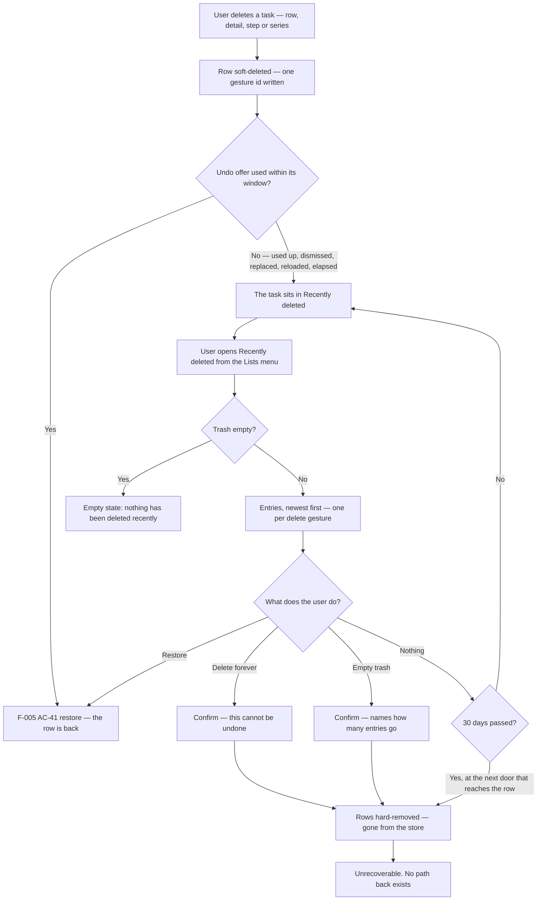
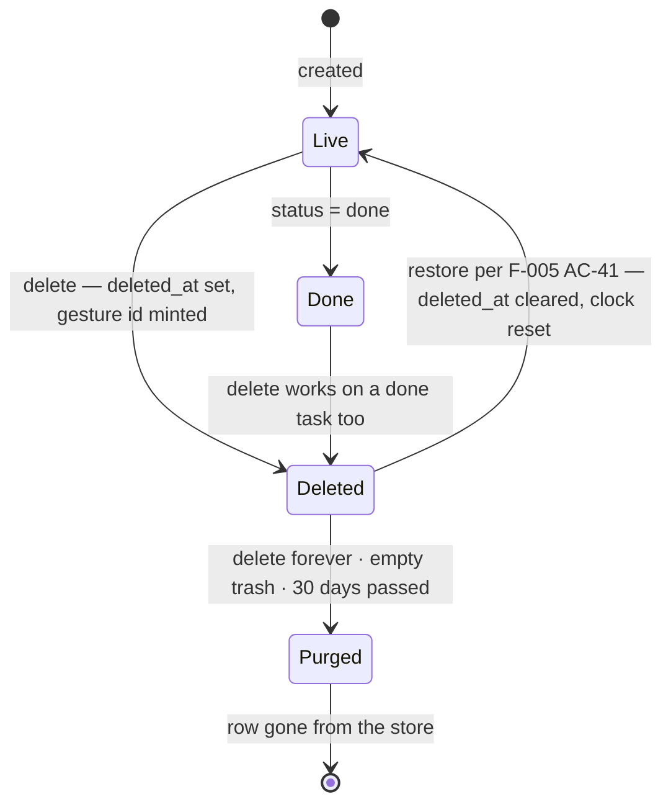

# Feature: Recently deleted (the trash)

**ID**: F-006
**Slug**: recently-deleted
**Status**: `draft` (**revision 2 — an amendment, not a review round.** Gate 1 has not run, and this pass does not pre-empt it: it folds in the one owner answer taken after revision 1 was written (`docs/reports/owner-decision-2026-08-19-carried-notice-placement-and-timer.md` §6). **Retention is 30 days, and it binds reachability rather than storage** — AC-12 carries the clock, the doors its predicate is evaluated at and the limit; AC-3 carries the date the user sees; **OQ1 closes**. **Amend-only: 16 ACs before, 16 after, nothing renumbered, added or deleted.** Two ACs are amended: AC-3, AC-12. **Revision 1's record, kept:** revision 1 — first pass, Gate 1 not yet run.)
**Last Updated**: 2026-08-21

---

## Links

```yaml
primary_module:    assistant
secondary_modules: []
depends_on:        [F-001, F-005]
implemented_in:    []
designed_in:       []
api_endpoints:     ["GET /tasks", "DELETE /tasks/{id}", "POST /tasks/{id}/restore"]
tested_by:
  api:    []
  web:    []
  mobile: []
known_bugs: []
```

---

## Purpose

**The app can delete a task in one tap and has nothing behind it.** This feature is the
net: a *Recently deleted* place a deleted task sits in for 30 days, from which
the user can put it back or destroy it for good.

The owner asked what comparable products do, and the answer is why this is a
requirement rather than a nicety (`docs/reports/owner-decision-2026-08-19-carried-notice-placement-and-timer.md` §4):

| App | Delete | Net behind it |
|---|---|---|
| Apple Reminders | yes | *Recently Deleted*, **30 days**, then permanent |
| TickTick | yes | Trash |
| Things 3 (Mac) | yes | Trash, emptied by hand |
| Things 3 (iOS) | yes | **none** — permanent, and delete is deliberately multi-step |
| Todoist | yes | no trash; daily backups (paid) |

**No product on that list drops delete, and only one has no net — and it pays for it by
making delete deliberate.** This app has a one-tap delete on every list row on both
clients (`src/assistant/mobile/components/TaskList.tsx` calls `controller.removeTask`),
so without this feature it would have the least safety of any of them.

### F-005 is waiting on this, and the dependency is a shipping order

`F-005 AC-43`'s undo offer **elapses after ten seconds**, and `F-005 AC-33` half (ii)
declares that elapse conformant with WCAG 2.1 AA's **2.2.1 Timing Adjustable** *because an
equivalent untimed path to the same outcome exists*. For four of AC-43's five classes
— delete from the detail (AC-31), delete from a list row (AC-42), delete a step
(AC-14), delete a series (AC-30) — **that path is this feature, and it does not exist
yet.** So `F-005 AC-43`'s ten-second elapse on `CN-UNDO` **does not ship before F-006
does**, and until then that offer keeps its four pre-elapse enders. An AC claiming AA
conformance on a timer whose untimed equivalent was never built is a false claim, which
is why the order is written into both specs rather than left in the decision document.

`F-005 AC-41` also records that its restore **has no read path that returns a deleted
row** and that nothing has ever purged one. Both are this feature's.

---

## What already exists, measured rather than assumed

**Deletion has been soft since F-001. Nothing here is being recovered from nothing, and
no migration is owed.** Re-measured on `data/assistant.json`, 2026-08-21:

| Fact | Measurement |
|---|---|
| Rows in the store | **839** tasks |
| Soft-deleted rows | **57**, across **20** accounts |
| Of those, carrying a `delete_gesture_id` (ADR-012) | **4**; the other **53** predate the field and are the legacy case ADR-012 answers |
| Deleted steps (`parent_id` set) / deleted series rows (`series_id` set) | **0** / **0** |
| Oldest soft-delete in the store | **2026-08-16** — nothing on disk is older than five days |
| Rows ever removed by a retention rule | **0**. Nothing has ever purged one |

The mechanism is already built: `deleted_at` and `delete_gesture_id` are stored fields
(`src/assistant/api/types.ts:44`), `DELETE /tasks/{id}` sets `deleted_at` and mints one
gesture id per gesture (`plan.ts:851`, ADR-012), `GET /tasks` filters deleted rows out
(`app.ts:422`), and `POST /tasks/{id}/restore` clears `deleted_at` for the whole
recorded membership (`app.ts:568-628`, ADR-012).

**What is missing is four things and only four:** a read path that returns deleted rows,
the 30-day retention, permanent deletion, and the surface. Without the second, this is not
a trash — it is a leak that happens to be recoverable.

---

## The structural answer, in one sentence

**The trash is a lifecycle state like `Done`, not a container like `Inbox`.**

`ADR-009 § Amendment 2` models open tasks on two independent axes — a date axis
(Today · Upcoming · `undated`) and a filing axis (Inbox · personal lists) — with `Done`
the gate that empties both. **The trash is on neither axis.** Built as a fifth *filing*
destination it repeats the exact category error the four-buckets decision fixed, and
`INV-INBOX-FILING` is the standing warning about that family of mistake. What that
means concretely is `## Impact` §2 and §3.

---

## Users & Permissions

| Role | Can do | Cannot do |
|------|--------|-----------|
| Authenticated user | Open *Recently deleted*; restore an entry; destroy one entry for good; empty the trash | See or restore another account's deleted rows; recover a row more than 30 days after it was deleted; undo a permanent deletion |
| Assistant (AI) | Nothing here. It cannot see, name, restore or destroy a deleted task | Reach any door this feature adds — a deleted row is in no handle list (`turns.ts:396`) and no turn may write one |
| The system | Remove a row deleted more than 30 days ago, at the doors named in AC-12 | Remove a row on any timer — **there is no scheduler in this app** (`## Ops`) |

---

## User Flow





---

## Acceptance Criteria

**Platform tags decide which QA tier verifies an AC**, exactly as in F-005 — they scope
verification, they do not describe where the code lives.

**This feature ships on web and on the phone at the same time**, and that is not
symmetry for its own sake: the one-tap row delete this trash exists to make safe is
already shipped on **both** clients, and the Lists menu that carries the entry is one
presentation on every platform (`docs/design/_shared/components.md § ListsMenu`). A
web-only trash leaves the phone with a one-tap delete, a ten-second window and no net —
the exact configuration the owner chose the trash to avoid.

### The surface

- [ ] **AC-1** (web, mobile) — **The Lists menu carries a *Recently deleted* entry, and it is peer to `Done`, not to `Inbox`.** It belongs with the rows that answer *what is this task doing* — the views and the gate — and never in the filing group beneath Inbox, which is where the personal lists will append. Where exactly it renders within that group, and its wording, are design's (`components.md § ListsMenu`); **which kind of row it is, is not.**
  - **It carries no count.** Every number in that menu is `collectionCount(tasks, c, now)` over the live rows, and a deleted row is in no collection by AC-4 — so a number here would be the one number in the column produced by a different mechanism while looking identical. It would also read as an inducement to open a place whose whole value is that you rarely need it. *(Design may still want a "there is something in here" mark; that is a mark, not a count, and it is design's call.)*
- [ ] **AC-2** (web, mobile) — **Opening it shows the account's deleted entries, newest deletion first, with an empty state when there are none.** The empty state says nothing has been deleted recently — it is the ordinary state of this surface, not a failure, and it must not be drawn as one.
- [ ] **AC-3** (web, mobile) — **Every entry states when it was deleted and when it goes — 30 days after the deletion.** A trash that does not say how long you have is a promise the user cannot act on; this is the observable half of AC-12. **What the entry states is the date the row stops being recoverable**, which is exactly what AC-12's predicate tests — not a date the bytes leave the disk, and no wording on this surface may promise that.

### What the surface lists, and what an entry is

- [ ] **AC-4** (api, web, mobile) — **A deleted task appears in no collection, no count, and no assistant query while it sits in the trash.** It is not in Today, Upcoming, Inbox or Done; it is in neither expression of `INV-INBOX-FILING`; it is not in the interpreter's handle list, so no turn can name it; and it is not returned by `GET /tasks`. This is what "lifecycle state, not container" means as an assertion, and it is falsifiable at each of those readers separately. **The trash's own read is the single exception and is the only one** (AC-5).
- [ ] **AC-5** (api) — **One read path returns deleted rows, it is the only one that does, and it is scoped to the caller's own rows.** Every other read keeps its `deleted_at === null` filter unchanged — eleven such filters exist across the API and both clients (`## Impact` §1) and this feature widens none of them. Another account's deleted rows are not reachable through it by any argument, exactly as `POST /tasks/{id}/restore` is scoped today.
- [ ] **AC-6** (api, web, mobile) — **A trash entry is a delete gesture, not a row.** Deleting a task with steps trashed N+1 rows under one `delete_gesture_id` (ADR-012) and restoring puts back exactly that set, so the trash shows **one** entry for it and never N+1. A row whose `delete_gesture_id` is `null` is its own entry — **measured, that is 53 of the 57 rows in the store today**, so on real data almost every entry is currently a singleton and an implementation that only handles clusters is untested by the live store.
- [ ] **AC-7** (web, mobile) — **A step deleted on its own is in the trash, and it is never drawn there as a top-level task.** Its entry is presented as a step **of the parent it belongs to** — resolved through the step's own `parent_id`, which the delete leaves untouched — and named by that parent. This matters because `F-005 AC-35` excludes steps from every collection and every count, and ADR-013 forbids the undo path from ever rendering a step title on the grounds that *"a step is neither drawn nor addressable"* — so this surface is the first place in the product where a lone deleted step has to be identifiable at all. The wording is design's; that it is not a top-level row is this AC's.
- [ ] **AC-8** (web, mobile) — **A deleted series is one entry.** `DELETE /tasks/{id}?scope=series` trashes every unfinished occurrence and their steps under one gesture id and leaves the completed occurrences alone (`F-005 AC-30`); the trash shows one entry for the gesture, and restoring it is AC-9's restore over that membership. **What restoring does to the repeat itself is not settled here — see `## Impact` §6 and Open Question 2.**

### Putting a task back

- [ ] **AC-9** (api, web, mobile) — **Restoring from the trash is `F-005 AC-41`'s restore and nothing else.** No second un-delete mechanism is built: `POST /tasks/{id}/restore` already clears `deleted_at` across the recorded membership, keeps id, `step_order`, `series_id` and `created_at`, restores a step's still-deleted parent as an invariant, is a stated no-op on a live row, and is scoped to the caller (ADR-012, `api-contracts.md`). Two mechanisms answering one gesture is L-005's shape and this feature deliberately adds none.
- [ ] **AC-10** (web, mobile) — **A restored task returns to wherever the ordinary predicates put it, and this feature states no relocation rule.** Restoring clears `deleted_at` and touches nothing else, so a task whose due date has passed while it sat in the trash lands in **Today** — because `today(t, now)` is `open(t) && day(t, now) <= 0` and that is where *every* overdue task is, not a special case this feature invents. A task with no date lands in Inbox. **Nothing is moved to Inbox on restore**: doing so would file a task the user never filed, and would be this feature writing on the filing axis, which `## The structural answer` forbids. The restored task is on screen and named after the restore, so a user who disagrees can move it by hand.

### Destroying a task for good

- [ ] **AC-11** (api, web, mobile) — **An entry can be destroyed permanently, and the trash can be emptied, and both are confirmed.** *Delete forever* hard-removes exactly the rows the entry covers — the same membership AC-9's restore would have put back. *Empty trash* hard-removes every deleted row of the account and says **how many entries** it is about to destroy. **This is the only genuinely irreversible act in the product and the only place a confirmation earns its keep** — the confirmation exists here precisely because it does not exist on the ordinary delete, which has this trash behind it. Hard removal is reported through the existing `removed: [uuid]` channel (`api-contracts.md § The multi-row response rule`); no new response shape is owed.
- [ ] **AC-12** (api) — **A deleted row stays recoverable for 30 days, the clock starts at `deleted_at`, and a restore resets it.** A restored-then-re-deleted row gets a full fresh 30 days, because `deleted_at` is cleared by the restore and re-set by the next delete — **no separate expiry field is stored**, so the expiry is always derived from `deleted_at` and there is no second value that can disagree with it. *(The length was Open Question 1; the owner answered it on 2026-08-21 — `docs/reports/owner-decision-2026-08-19-carried-notice-placement-and-timer.md` §6. Apple Reminders' *Recently Deleted* is the comparable at the same number.)*
  - **The 30 days binds what stays *reachable*, not what stays on disk, and that is the promise this AC makes and is tested against.** Once 30 days have passed since `deleted_at`, the row is not listed by AC-5's read and `POST /tasks/{id}/restore` does not bring it back (AC-9). That holds without exception and is the whole of what the user is promised. **It is not a promise that the row has left the store**: a row belonging to an account nobody opens the trash on stays on disk past its 30 days, and an implementation that leaves it there is conformant. **That is a trade the owner took with its cost stated, not an oversight to be repaired later** — a storage guarantee needs the background job `## Out of Scope` excludes, so *"deleted after 30 days"* is true of reachability and not literally true of storage. Reading it as a storage claim and filing it as a bug is reading a promise this AC does not make; if it ever has to become one — a data-retention obligation, a privacy commitment — that is a scheduler and a separate piece of work.
  - **What removes an expired row, stated plainly rather than implied: nothing runs on a timer.** **There is no server-side scheduler, cron or background job in this app** — verified 2026-08-21: the only timers in `src/` are client UI ones (a flash dismissal, a retry sleep, the speech port) and none of them touches the store — and this feature does not add one (`## Out of Scope`). **The expiry predicate — 30 days elapsed since `deleted_at` — is evaluated at every door that reaches a deleted row, and there are exactly two: the trash read (AC-5) and the restore (AC-9).** So an expired row stops being listed and stops being restorable the moment it expires, whether or not anything has run. **The removal *write* happens on the trash read**: the expired rows go from the store the next time anyone opens that account's trash.
- [ ] **AC-13** (api) — **A permanently removed row is gone, and a turn undo never brings it back — it reports it as skipped.** `undo_snapshot` replays whole task rows verbatim into the store (`undo.ts:173`), and **24 of the store's 420 turns currently name a row that is soft-deleted** — measured 2026-08-21 — so this is an ordinary interleaving rather than a contrived one. The existing comparison already refuses to replay a row whose current state differs from the state the turn left it in, and `deleted_at` is in `task-equals.ts`'s field list, so the guard exists; **this AC makes it an assertion instead of an accident**, at both the soft-deleted and the hard-removed state.

### The bounds this surface inherits

- [ ] **AC-14** (api) — **The trash is per-account, and the assistant may not write to it.** Every door here is scoped by `X-User-Id` like every other route, and no turn may restore or permanently delete: `F-005 AC-36` permits the assistant `note`, `priority`, `due_at` and `reminder_at` and nothing else, so a turn attempting either is refused under `F-005 AC-40` like any other unpermitted write. Stated rather than assumed because two of the three doors this feature adds are **new write paths**, which is exactly where caller scoping gets missed and no other AC would turn red.
- [ ] **AC-15** (web, mobile) — **Every operation here is reachable by hand, makes zero AI calls, and works while the assistant is erroring**, asserted through F-001's harness AI-call counter. `MANIFEST ## Knowledge` declares WCAG 2.1 AA with the note that *voice-first requires a non-voice path for every action*, and this feature has **no** voice path at all by AC-14 — so the hand path is not an alternative here, it is the only one.
- [ ] **AC-16** (web, mobile) — **WCAG 2.1 AA on what this feature adds, by name:** **2.1.1** — every control, including both confirmations, is keyboard-operable on web; **4.1.2** — name, role and value on the entry rows and the confirmation dialogs; **4.1.3** — the outcome of every restore, every permanent deletion and every refusal is announced, per `F-005 AC-33`'s rule that every status message a spec states is announced; **2.5.1** — no path-based gesture is the only way to reach restore or delete-forever, which binds the phone, where a swipe is the obvious drawing. **2.2.1 is not engaged by anything this feature adds** — nothing here is withdrawn by time in front of the user; the retention period is 30 days and its expiry is not an activity the user is racing.

---

## Data

Requirement names, not a schema. **No new stored field is required** — the first three
rows below already exist and ship. Architecture owns representation.

| Field | Type | Required | Validation | Notes |
|-------|------|----------|------------|-------|
| deleted_at | instant \| none | no | already stored; set by the soft delete, cleared by the restore and by nothing else; **it is the retention clock's start** | AC-4, AC-9, AC-12. Existing field (`api/types.ts:44`) |
| delete_gesture_id | gesture ref \| none | no | already stored, internal, never serialized; **it is the trash entry's unit**; `null` restores and destroys alone | AC-6, AC-8, AC-11. Existing field, ADR-012. **53 of 57 deleted rows carry `null`** |
| parent_id | task ref \| none | no | unchanged; a lone deleted step is identified through its parent and never drawn as a top-level row | AC-7. Existing field |
| retention period | duration | yes | **30 days** (owner, 2026-08-21) — **a stated constant, not a column**; one value for every account, read by both doors that reach a deleted row, and it bounds reachability rather than storage | AC-3, AC-12 |

---

## API Touch Points

- `GET /tasks` — **unchanged, and its `deleted_at === null` filter stays** (`app.ts:422`). This feature does not add a flag to it. A read that can be asked for deleted rows is a read every existing caller can get them from by accident.
- **A read that returns the account's deleted rows — new (AC-5).** Route shape, whether entries are grouped server-side or by the client, and whether the response carries the gesture membership are architecture's. **That it exists, that it is the only such read, and that it is caller-scoped are not.**
- `POST /tasks/{id}/restore` — **unchanged and reused as-is** (AC-9). Nothing about it moves.
- **Permanent deletion — new (AC-11), two shapes: one entry, and all.** Hard removal, reported through the existing `removed: [uuid]` field of `§ The multi-row response rule`. Whether *empty trash* is a distinct route or the same route without an id is architecture's.
- `DELETE /tasks/{id}` — **unchanged.** It already mints one `delete_gesture_id` per gesture, which is the whole mechanism this feature reads.
- **Recorded, not answered — does the trash read write?** AC-12 puts the retention *removal* on the trash read, which makes a `GET` mutate the store. That is unusual enough to be a deliberate choice rather than an implementation detail: the alternatives are a scheduler (out of scope), sweeping on every task write (a cost paid by every user on every keystroke to serve a surface they rarely open), or never removing anything (which is the leak this feature exists to close). **The promise itself is settled** — reachability, not storage, by the owner on 2026-08-21 — so what is open here is where the removal write goes, not what the user is owed. **What breaks if the wrong default is taken:** a sweep on `GET /tasks` would make the retention true of storage as well and costs a scan on the hottest path in the app; no sweep at all leaves expired rows on disk indefinitely, which AC-12 permits but nothing then ever reclaims.
- **Recorded, not answered — what a restore does to `series_ended_at`.** Measured: `plan.ts:696-702` writes `series_ended_at` on **every** row of a series delete, and `app.ts:615-620`'s restore clears **`deleted_at` only**. So restoring a series today returns the occurrences with the repeat permanently inert. See `## Impact` §6 and Open Question 2; **this spec records it and does not fix it**, because the fix is an amendment to `F-005 AC-41` / ADR-012, which are not this feature's to write.

---

## Impact on what already exists

Per feature and per artifact: what this touches, what changes there, and what breaks if
nobody looks. Written to `LEARNINGS.md` **L-013**.

### 1. `deleted_at IS NULL` is assumed in forty-five places, and eleven of them are reads

Measured 2026-08-21: **45 non-test lines across 16 files** name `deleted_at`, and
**eleven of them keep a deleted row out of something a caller can see** — a list, a
count, a handle set, or a write's own view of what is live: `api/app.ts:422` (`GET /tasks`),
`_shared/controller.ts:969`, `:974` and `:1690` (the client's merge and refresh),
`api/engine/turns.ts:396` (the interpreter's handle list), `api/engine/plan.ts:105`,
`api/engine/task-fields.ts:413` and `:428` (a step's parent must be live),
`_shared/model/task-fields.ts:116` and `:239` (a deleted row surfaces no reminder), and
`api/engine/undo.ts:33`.

**Every one of them stays as it is.** The exception AC-5 creates is a *new* read, not a
widening of an existing one. The failure mode to watch for is the opposite of the usual:
not a site that was missed, but a site "helpfully" widened while someone builds the
trash — and a widened `turns.ts:396` puts deleted tasks back in the assistant's handle
list, which AC-4 forbids and which no test of the trash itself would catch.

### 2. `Collection` is a closed vocabulary of four, and the trash is not a fifth member

`src/assistant/_shared/model/tasks.ts` declares `Collection = 'inbox' | 'today' |
'upcoming' | 'done'` and derives four things from it: `COLLECTION_GROUPS`,
`COLLECTIONS`, `collectionName()`, and `dueAtForCollection()`. Adding a member is the
obvious way to draw AC-1's menu row and **it is the category error**, concretely:

- `inCollection()` (`tasks.ts:387`) is evaluated over `state.tasks`, which holds only
  live rows — so a `'trash'` member would count **zero forever** while looking correct.
- `dueAtForCollection()` is create-in-context: a `'trash'` member makes *"create a task
  while viewing the trash"* a reachable state with a defined due date.
- `COLLECTIONS` is described in its own comment as *"order is contract, not
  presentation"* and is read by set assertions in both clients' tests.

**What breaks if nobody looks:** the menu row renders, the count reads zero, and the
first bug filed is "the trash count is wrong" — against a design that was never capable
of producing a number. The row is a menu entry pointing at AC-5's read; it is not a
`Collection`. Which vocabulary it *does* belong to is architecture's call.

### 3. Deleted rows must not enter `state.tasks`, and nothing in the client would stop them

`inCollection()` **never checks `deleted_at`** — it checks the step gate, the done gate,
`isFiled` and `due_at`, and nothing else. The rows are kept out upstream, at
`controller.ts:969/974/1690`. So the moment a trash implementation puts deleted rows into
the same array to save a fetch, **every deleted task silently joins Inbox, Today or Done
and every count that reads them**, with no error anywhere. This is the single most likely
way to break AC-4, and it breaks it in the client, where no API test can see it. The
trash's rows belong in their own state, separate from `state.tasks`.

### 4. F-005 — what unblocks, and what stays blocked until this ships

- **`F-005 AC-43`'s ten-second elapse on `CN-UNDO` unblocks when this ships**, and not
  before (`## Purpose`). `F-005 AC-33` half (ii)'s AA claim rests on it.
- **`F-005 AC-41`'s "the recovery has a depth of one" ceases to be true** in the good
  direction: all three mechanisms that end the undo offer (used up, replaced, reloaded,
  elapsed) end a *shortcut*, and the trash is the remedy. That is exactly what closing
  `F-005 OQ13` asserted, and this feature is what makes the assertion true.
- **`F-005 AC-42`'s row-delete undo and `AC-31`'s detail delete are unchanged.** This
  feature adds no second delete gesture and no second restore.
- **`F-005 AC-4`** — a failure whose cause is that the task is gone produces no notice.
  Unchanged: a task in the trash is still gone from every live surface, so nothing here
  makes that AC's terminal state wrong.

### 5. Permanent deletion meets records that are replayed verbatim

`undo_snapshot` stores whole task rows and `performUndo` writes them back into the store
(`undo.ts:173`). **Measured: 24 of the store's 420 turns name a row that is currently
soft-deleted, and all 24 are `applied`** — so purging is not a rare interleaving.

The existing guard holds: a row is replayed only when its current state matches the state
the turn left it in, and `deleted_at` is in `task-equals.ts`'s field list, so a
soft-deleted row is *skipped* rather than resurrected. For a **hard-removed** row the
same comparison also skips, because `cur` is absent while `post_apply` is not. **The
guard is real and it is currently an accident of two unrelated decisions**, which is why
AC-13 makes it an assertion. What breaks if nobody looks: a purge implemented as
`delete state.tasks[id]` plus a `post_apply` cleanup would flip the row into the
`removedByThisTurn` branch — *absent and expected-absent* — and undo would **re-create a
row the user permanently destroyed.**

### 6. The series delete's end marker is not cleared by the restore, and this feature is where it becomes visible

`plan.ts:696-702` writes `series_ended_at` on every row of a series delete — including
the completed occurrences it deliberately leaves alone — and `app.ts:615-620`'s restore
clears `deleted_at` and advances `updated_at`, **and nothing else**. So restoring a
series-deleted set returns the occurrences with `series_live: false` and the repeat
permanently dead.

**This contradicts `F-005 AC-43`'s *"it reverses exactly the action it was offered for
and nothing else"*, for the one class where the delete did two things.** It is invisible
today because the undo offer is the only door to that restore and the window is seconds
wide; the trash makes it a thing a user does days later, deliberately, expecting the
task back. **It is F-005 / ADR-012's defect, not this feature's** — recorded here and
routed, not fixed (Open Question 2). Measured: **0 rows in the store carry `series_id`
and `deleted_at` together**, so nothing is currently broken on disk.

### 7. `INV-INBOX-FILING` is untouched, and that is worth stating

`open_all` and `inbox_count` both count **open** tasks, and `open(t)` is `status !==
'done'` — neither expression's subject is narrowed by this feature, because a deleted row
is excluded upstream of both by AC-4 rather than by a new clause inside either. F-005
narrowed both subjects at once (steps), and `data-model.md` records that two subjects
narrowing silently is how the two facts get re-merged. **This feature narrows neither.**
Anyone who finds themselves editing that invariant while building the trash has taken a
wrong turn.

### 8. F-001's message door stays inert for a deleted task, and must not be "fixed"

`web/shell.ts:206` and `mobile/model/task-link.ts:76` both gate the message's task door on
`t.deleted_at === null` over `state.tasks`, and `F-001 AC-31` revision 7 states the reason:
*"the deleted task stays inert for its own reason — no row exists to reach."* A trash makes
that sentence look stale, and it is not: `F-001 AC-31`'s door switches to **a collection
that holds the row**, and by AC-4 no collection holds a deleted row. Making the door open
the trash is a new requirement for `F-001` to take, not a repair. Unchanged by this feature.

### 9. Design and the testid contract

- `components.md § ListsMenu` describes **four** built-in rows (`LM-COLLECTION`: Today ·
  Upcoming · Done · Inbox) with `collectionCount` as their source and two visual groups.
  AC-1 adds a fifth row that is in the first group and has **no count** — an additive
  block, but one that falsifies the section's "four built-in rows" wording and its single
  `Source` cell.
- **The phone's testid catalogue is closed** (`F-003`), and this feature adds a surface,
  two confirmation dialogs and per-entry controls to it. `F-005 ## Impact` §8 already
  carries four such design debts; **this is a fifth and it is listed here so it is
  routed rather than believed-recorded.**
- **Both confirmations are new components, and the catalogue's existing confirmation
  vocabulary is spoken rather than drawn.** `components.md` has `SPK-CONFIRM-DELETE` (the
  assistant's bulk-delete question, `F-001 AC-9`) and a `danger` button variant reserved
  for *"confirm-delete contexts only"* — so the button exists and the **visual dialog does
  not**. Its only sibling is `F-005 AC-30`'s series-delete confirmation, itself undrawn.

### 10. Documents that become wrong the moment this is architected

| Document | What changes |
|---|---|
| `api-contracts.md § GET /tasks` | *"deleted rows filtered out"* stays true, and now has a named exception elsewhere in the file |
| `api-contracts.md § The multi-row response rule` | `removed:` gains a second producer (AC-11); its comment says *"today exactly one producer"* |
| `api-contracts.md § POST /tasks/{id}/restore` | gains a second caller (the trash) and the expiry precondition of AC-12 |
| `data-model.md § task` | `deleted_at`'s note gains the retention clock; `delete_gesture_id` gains its second reader |
| `ADR-009 § Amendment 2` | the two-axis table gains a row that is on **neither** axis, beside `Done` |
| `ADR-012` | Open Question 2, if the owner answers it in the direction that changes the restore |
| `docs/design/_shared/components.md § ListsMenu` | §9 above |
| `F-005 AC-43`, `AC-33` | their shipping-order dependency is discharged when this lands |

---

## Ops

- **No scheduler, no background job, no cron — and this is a decision, not an omission.**
  The app has none today and this feature adds none (`## Out of Scope`). AC-12 states what
  that costs.
- **Observability** — counters for entries restored, entries permanently deleted, trashes
  emptied, and **rows removed by retention**, the last counted separately because it is the
  only removal no user asked for.
- **Feature flag / rollback** — N/A this phase: prototype server, no deployment target.

## Test strategy

- **AC-4 is a membership assertion at four readers, not one** — `GET /tasks`, both
  collection counts, the interpreter's handle list, and `INV-INBOX-FILING`'s two
  expressions. Its instructive mutation is putting deleted rows into `state.tasks`: the
  trash surface passes and three collections quietly gain rows (§3).
- **AC-6's fixture must include a `null`-gesture row**, because that is 53 of the 57 rows
  on the live store and a cluster-only fixture never exercises the singleton path.
- **AC-13 needs a turn whose snapshot names the purged row** — 24 such turns exist on the
  live store, so the fixture is a copy of a real state rather than a construction.
- **AC-12's expiry is testable only with an injectable clock**; `F-005 AC-44`'s clock seam
  is the one to use, not a second one.

## Out of Scope

- **A scheduler, a background purge, a cron job or a push-driven expiry.** AC-12 puts the
  removal on the doors that already exist. Adding a scheduler is a platform change with
  its own failure modes and no other feature needs one yet.
- **Undoing a permanent deletion, backups, and export.** AC-11 is irreversible by design;
  that is what the confirmation is for. Todoist's daily-backup model is the alternative
  and it is a different product decision.
- **A trash per personal list.** `lists` and `tasks.list_id` do not exist (ADR-009
  § Amendment 2 §3). When they do, a deleted task's filing cell comes back with it via
  AC-9's untouched restore, and nothing here needs to change.
- **Restoring into a chosen collection.** AC-10 restores in place; a "restore to…" picker
  is a filing gesture and belongs with UC-41.
- **Showing deleted tasks anywhere except this surface** — no strikethrough rows in
  collections, no "recently deleted" section in the Logbook (UC-45 is out of scope
  entirely), no deleted rows in search (UC-37, also out of scope).
- **Admin or cross-account recovery.** AC-14 is per-account and nothing here is an
  operator tool.
- **Purging done tasks, archived tasks, or old turns.** This feature removes deleted rows
  only. Nothing else in the store has a retention rule and this spec does not give it one.

## Open Questions

Plain questions first; the AC each would change is in brackets. **OQ1 is closed by the
owner and is kept below rather than deleted** — a closed question that still shows what
was decided, and what the decision cost, is what stops it being re-asked in three weeks.
**OQ2 is open and is the owner's**, not architecture's: it changes a promise the user
sees. OQ3 is design's, and is recorded here only so it reaches design rather than being
settled by whoever draws the row first.

1. **CLOSED 2026-08-21 by the owner**
   (`docs/reports/owner-decision-2026-08-19-carried-notice-placement-and-timer.md` §6).
   **30 days, reachability-scoped.** After 30 days a deleted task can no longer be
   recovered, and the row is removed **when someone opens the trash**, not by a clock →
   **AC-12**; the date each entry states → **AC-3**. **The owner was asked to choose
   between two different promises and took the cheaper one with its cost on the table:**
   reachability needs nothing new, because the predicate is evaluated at the two doors
   that already reach a deleted row; storage needs a background job this app does not
   have and `## Out of Scope` excludes. **So an account nobody opens the trash on keeps
   its rows on disk past 30 days — accepted, not overlooked**, and AC-12 says so in the
   AC text rather than in a note, because that is the one thing about this feature a
   later reader is most likely to file as a bug. *The question is kept rather than
   deleted, on `F-005 OQ6`'s precedent, because the second half is the part that would
   otherwise be re-opened.* It read:
   > **How long does a deleted task stay recoverable, and is that a promise about
   > reachability or about storage?** [AC-12, AC-3] Apple Reminders is the reference point
   > at **30 days**; TickTick and Things keep a trash until it is emptied by hand. Measured
   > here: nothing on disk is older than **five days**, so **at any value from 7 days
   > upward, today's purge removes nothing** — the choice costs nothing to make now and
   > gets expensive once users have learned it. The second half is AC-12's stated limit: with
   > no scheduler, retention binds what is *reachable*; a storage guarantee needs a
   > background job this spec excludes. **Recommendation: 30 days, reachability-scoped**,
   > matching the closest comparable product and the owner's own reference point.
2. **When a deleted series is restored, does the repeat come back to life?** [AC-8, and an
   amendment to `F-005 AC-41` / ADR-012] Today it does not: the series delete writes
   `series_ended_at` on every row and the restore clears only `deleted_at`, so the
   occurrences come back with the repeat permanently dead (`## Impact` §6). **What breaks
   if nobody decides:** `F-005 AC-43`'s *"it reverses exactly the action it was offered
   for and nothing else"* is false for that one class, and the user gets their tasks back
   without their repeat and is told nothing. **Two answers, both defensible** — the
   restore also clears `series_ended_at`, which makes the reversal complete and means a
   restore can revive a series the user ended deliberately; or the restore leaves it, and
   the trash entry must say so, which needs copy design does not have. **No recommendation
   is offered**: this is a question about what the user meant by the gesture, and the two
   readings are genuinely different products.
3. **Is a "there is something in here" mark on the menu row wanted?** [AC-1] Decided *not*
   to be a count, with the reason in the AC. Whether it is a dot, nothing at all, or
   something else is design's — recorded here only so the question reaches design rather
   than being settled by whoever draws the row first.
