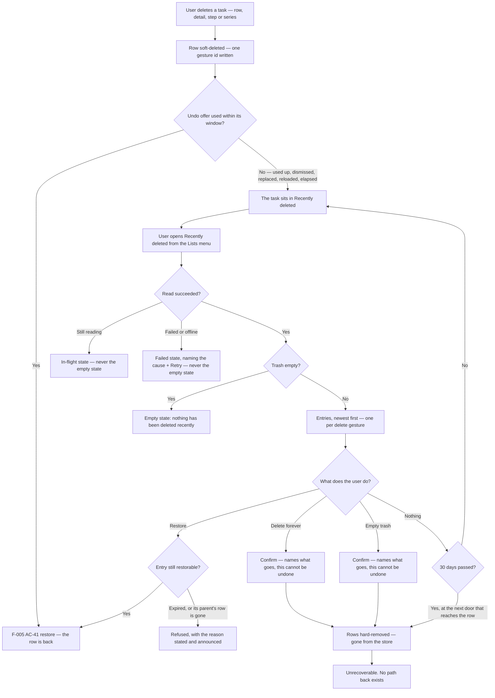
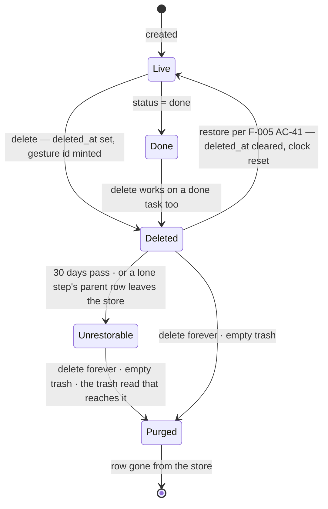

# Feature: Recently deleted (the trash)

**ID**: F-006
**Slug**: recently-deleted
**Status**: `draft` (**revision 3 — the Gate 1 round-1 revision.** Nine lenses returned **REJECT: 21 HIGH · 29 MEDIUM · 6 LOW, 56 findings**, all dispositioned in `docs/reports/gate1-lenses/F-006-revision-3-log.md`. **The round cap is 2**, so what follows this is at most one targeted re-review of the ACs each lens raised findings on. **The central fix is C1 — a trash entry's membership is now a closed set, stated once in AC-6**, and AC-9, AC-11 and AC-12 refer to that statement instead of re-deriving it (AC-17 deliberately acts on a different set and says so); 7 of 9 lenses found the old wording independently. **17 ACs, up from 16 — one added.** `AC-17` splits *empty trash* out of AC-11, which bundled four independently-failing guarantees under one id and hid the fact that the two destructive acts are **keyed differently** (a gesture's membership versus every deleted row of the account) — which is C1's own subject. Nothing was renumbered and nothing was deleted. **Revision 2's record, kept:** revision 2 — an amendment, not a review round; it folded in the owner's 30-day answer, bound retention to reachability rather than storage, and closed OQ1. **Revision 1's record, kept:** revision 1 — first pass, Gate 1 not yet run.)
**Last Updated**: 2026-08-21

---

## Links

```yaml
primary_module:    assistant
secondary_modules: []
depends_on:        [F-001, F-005]
implemented_in:    []
designed_in:       []
api_endpoints:     ["GET /tasks", "DELETE /tasks/{id}", "POST /tasks/{id}/restore"]
tested_by:
  api:    []
  web:    []
  mobile: []
known_bugs: []
```

---

## Purpose

**The app can delete a task in one tap and has nothing behind it.** This feature is the
net: a *Recently deleted* place a deleted task sits in for 30 days, from which
the user can put it back or destroy it for good.

The owner asked what comparable products do, and the answer is why this is a
requirement rather than a nicety (`docs/reports/owner-decision-2026-08-19-carried-notice-placement-and-timer.md` §4):

| App | Delete | Net behind it |
|---|---|---|
| Apple Reminders | yes | *Recently Deleted*, **30 days**, then permanent |
| TickTick | yes | Trash |
| Things 3 (Mac) | yes | Trash, emptied by hand |
| Things 3 (iOS) | yes | **none** — permanent, and delete is deliberately multi-step |
| Todoist | yes | no trash; daily backups (paid) |

**No product on that list drops delete, and only one has no net — and it pays for it by
making delete deliberate.** This app has a one-tap delete on every list row on both
clients (`src/assistant/mobile/components/TaskList.tsx` calls `controller.removeTask`),
so without this feature it would have the least safety of any of them.

### F-005 is waiting on this, and the dependency is a shipping order

`F-005 AC-43`'s undo offer **elapses after ten seconds**, and `F-005 AC-33` half (ii)
declares that elapse conformant with WCAG 2.1 AA's **2.2.1 Timing Adjustable** *because an
equivalent untimed path to the same outcome exists*. For four of AC-43's five classes
— delete from the detail (AC-31), delete from a list row (AC-42), delete a step
(AC-14), delete a series (AC-30) — **that path is this feature, and it does not exist
yet.** So `F-005 AC-43`'s ten-second elapse on `CN-UNDO` **does not ship before F-006
does**, and until then that offer keeps its four pre-elapse enders. An AC claiming AA
conformance on a timer whose untimed equivalent was never built is a false claim, which
is why the order is written into both specs rather than left in the decision document.

**How a user reaches this feature at the moment they need it is `F-005 AC-43`'s, not
this spec's** *(owner, 2026-08-21 — `owner-decision-2026-08-19-carried-notice-placement-and-timer.md`
§7, option A: when `CN-UNDO` reaches its ten seconds, **what replaces it names the trash
as where the task went**)*. Recorded here once and referenced, never restated: the rule
lives in `F-005 AC-43`, its copy is design's, and the F-005 amendment is **T-185**. The
product lens's finding was not that a Lists-menu row is the wrong inbound path — it was
that this spec **declined three other inbound paths in three separate `## Impact`
subsections and no AC owned the sum**, so the decision was accumulated rather than taken.
`## Impact` §4 now points at the owner's answer and settles nothing.

`F-005 AC-41` also records that its restore **has no read path that returns a deleted
row** and that nothing has ever purged one. Both are this feature's.

---

## What already exists, measured rather than assumed

**Deletion has been soft since F-001. Nothing here is being recovered from nothing, and
no migration is owed.** Re-measured on `data/assistant.json`, 2026-08-21 — every figure
below was independently re-derived by four Gate 1 lenses and all four reproduced exactly:

| Fact | Measurement |
|---|---|
| Rows in the store | **839** tasks across **207** accounts |
| Soft-deleted rows | **57**, across **20** accounts — so **187 accounts have nothing deleted at all** |
| Of those, carrying a `delete_gesture_id` (ADR-012) | **4**; the other **53** predate the field and are the legacy case ADR-012 answers |
| Deleted steps (`parent_id` set) / deleted series rows (`series_id` set) | **0** / **0** |
| Deleted rows whose `status` is `done` | **2** — AC-3's completed-state case ships on day one |
| Largest single account's trash, counted in **entries** | **9** — small enough that AC-11's and AC-17's confirmations can name what they destroy |
| Accounts holding **≥1 deleted row and zero live rows** | **4** — AC-4's raw-cardinality readers are live today, not hypothetical |
| Oldest soft-delete in the store | **2026-08-16** — nothing on disk is older than five days |
| Rows ever removed by a retention rule | **0**. Nothing has ever purged one |

The mechanism is already built: `deleted_at` and `delete_gesture_id` are stored fields
(`src/assistant/api/types.ts:44`), `DELETE /tasks/{id}` sets `deleted_at` and mints one
gesture id per gesture (`plan.ts:851`, ADR-012), `GET /tasks` filters deleted rows out
(`app.ts:422`), and `POST /tasks/{id}/restore` clears `deleted_at` for the whole
recorded membership (`app.ts:568-628`, ADR-012).

**What is missing is four things and only four:** a read path that returns deleted rows,
the 30-day retention, permanent deletion, and the surface. Without the second, this is not
a trash — it is a leak that happens to be recoverable.

---

## The structural answer, in one sentence

**The trash is a lifecycle state like `Done`, not a container like `Inbox`.**

`ADR-009 § Amendment 2` models open tasks on two independent axes — a date axis
(Today · Upcoming · `undated`) and a filing axis (Inbox · personal lists) — with `Done`
the gate that empties both. **The trash is on neither axis.** Built as a fifth *filing*
destination it repeats the exact category error the four-buckets decision fixed, and
`INV-INBOX-FILING` is the standing warning about that family of mistake. What that
means concretely is `## Impact` §2 and §3.

---

## Users & Permissions

| Role | Can do | Cannot do |
|------|--------|-----------|
| Authenticated user | Open *Recently deleted*; restore an entry; destroy one entry for good; empty the trash | See or restore another account's deleted rows; recover a row more than 30 days after it was deleted; undo a permanent deletion |
| Assistant (AI) | Nothing here. It cannot see, name, restore or destroy a deleted task | Reach any door this feature adds — a deleted row is in no handle list (`turns.ts:396`) and no turn may write one. **The read half of that exclusion is a product question, not a derived consequence — Open Question 4** |
| The system | Remove a row deleted more than 30 days ago, at the doors named in AC-12 | Remove a row on any timer — **there is no scheduler in this app** (`## Ops`) |

---

## User Flow





---

## Acceptance Criteria

**Platform tags decide which QA tier verifies an AC**, exactly as in F-005 — they scope
verification, they do not describe where the code lives.

**This feature ships on web and on the phone at the same time**, and that is not
symmetry for its own sake: the one-tap row delete this trash exists to make safe is
already shipped on **both** clients, and the Lists menu that carries the entry is one
presentation on every platform (`docs/design/_shared/components.md § ListsMenu`). A
web-only trash leaves the phone with a one-tap delete, a ten-second window and no net —
the exact configuration the owner chose the trash to avoid.

### The surface

- [ ] **AC-1** (web, mobile) — **The Lists menu carries a *Recently deleted* entry, and it is peer to `Done`, not to `Inbox`.** It belongs with the rows that answer *what is this task doing* — the views and the gate — and never in the filing group beneath Inbox, which is where the personal lists will append. Where exactly it renders within that group, and its wording, are design's (`components.md § ListsMenu`); **which kind of row it is, is not.**
  - **It carries no count.** Every number in that menu is `collectionCount(tasks, c, now)` over the live rows, and a deleted row is in no collection by AC-4 — so a number here would be the one number in the column produced by a different mechanism while looking identical. It would also read as an inducement to open a place whose whole value is that you rarely need it. *(Design may still want a "there is something in here" mark; that is a mark, not a count, and it is design's call — **answered at Gate 1: no mark**, see Open Question 3.)*
  - **The placement half needs an observable it does not have today, and this AC owes it rather than assumes it** *(tester-mobile F2)*. `§ ListsMenu` settled *"no new testid — `menu-collection-row` is the LM-COLLECTION exemplar"* when Upcoming was added, and the phone's only Lists-menu observable is `expectedShellIds()` (`mobile/model/a11y.ts:384`), which returns a **set**: a fifth row changes nothing in it. **So the only assertion this AC would otherwise admit — "the group gained a row" — passes for a row drawn in the filing group this AC forbids, and for the fifth `Collection` member `## Impact` §2 calls the category error: the test would certify the defect.** This row therefore **carries its own contract testid**, distinct from the `LM-COLLECTION` exemplar, and it is **not** an `LM-COLLECTION` member — that family is defined as *"rows the app always has and computes on device"* and this row computes nothing on device, it points at a network read (design F6b). Which family it joins, which id it carries, and whether the existing four-row set assertions become five are `## Impact` §9's, routed to `§ Testid catalogue — app shell` and to F-003's closed catalogue.
- [ ] **AC-2** (web, mobile) — **Opening it shows the account's deleted entries, newest deletion first, and it is a surface with a named edge and a named return.**
  - **Four states, not two, because this is fed by a new network read** *(design F1, tester-mobile F1, dev-mobile F4)*: **in flight**, **failed**, **offline**, and **loaded** — of which loaded may be empty. The empty state says nothing has been deleted recently; it is the ordinary state of this surface, not a failure, and it must not be drawn as one. **The reverse is the one that costs a task and it is now forbidden by name: a read that is still running, that failed, or that could not be attempted because the device is offline must never render the empty state.** *187 of 207 accounts have nothing deleted, so the empty render is right often enough that a wrong one will not look wrong* — which is why this is an AC and not a drawing note. The phone already carries the vocabulary for this shape (`mobile/model/tasks-view.ts:66` — `'default' | 'empty-first' | 'empty-collection' | 'loading' | 'error'` with a `'none' | 'retry' | 'offline'` banner) and it exists *because* that read can be slow, fail, or be offline; this surface has the same property and gets the same treatment. Deleted rows are in no local store by AC-4, so **there is nothing to fall back on when the read fails** — the failed state takes the surface, names the cause, and offers Retry (`components.md § SurfaceError`, `§ InlineRetryBanner`).
  - **It is a surface, it is reached by one edge, and leaving it returns to the menu it was opened from** *(dev-mobile F1)*. `information-architecture.md` §4's rule is *"nothing reaches a surface except through an edge on this list"*, and every other Lists-menu row is a `select-collection` edge landing on **S2 Tasks**, where `shellBack()` returns `consumed: false` — **so on S1/S2 the Android back press exits the app, deliberately.** Inheriting that here means back exits the app from a surface reached in two taps. **This surface is not a collection on S2**; it is its own surface with its own edge (S3 → trash) and its own return (trash → S3), and the Android back press on it takes that return. `F-005 AC-45` is the precedent — one surface, its edges enumerated, written into the IA at the moment the surface is introduced — and it is followed here rather than left to an implementer to invent. The IA entry is `## Impact` §10's, with a named writer.
  - **Ordering key** *(tester-web F7)*: entries order by the **gesture's** `deleted_at`, newest first. That is well defined for a cluster because the delete writes one instant to every row of the gesture (`plan.ts:851` writes `ctx.at`), and ties — two gestures inside the same instant — break by the entry's addressing id (AC-6) so the order is total and an assertion cannot flake.
- [ ] **AC-3** (web, mobile) — **An entry says what it holds, when it was deleted, and when it goes.**
  - **What it holds** *(product F1)*: the entry **names the task it covers.** Nothing in revision 2 required this — *"title"* appeared once in the whole spec, in AC-7, as a prohibition — while AC-2 fixed ordering, AC-3 fixed two dates and AC-6 fixed the unit, so the one thing the user reads to tell one entry from another was constrained by nobody. Restore is this feature's entire value and it must not be a guess. For a **cluster** (AC-6) the entry names the task the gesture addressed and says **how many rows come back with it**; for a **series** (AC-8) it says how many occurrences come back; for a lone deleted **step** it is AC-7's rule. Wording, truncation and the overflow shape are design's (`§ Spoken frames`' `title_list` publishes the house rule: up to 3 names, then *"and N more"*).
  - **Whether the task was completed when it was deleted** *(design F5)*. The state diagram carries `Done --> Deleted` and **2 of the 57 deleted rows are `done` today**, so an entry drawn like every other tells the user a completed task is an open one — and AC-10 then returns it to **Done**, the one collection whose empty state is defined as having no action, so the restore whose destination is least discoverable would be the one whose entry gave the least warning.
  - **The two dates: when it was deleted, and when it stops being recoverable** — 30 days after the deletion. A trash that does not say how long you have is a promise the user cannot act on; this is the observable half of AC-12. **What the entry states is the date the row stops being recoverable**, which is exactly what AC-12's predicate tests — not a date the bytes leave the disk, and no wording on this surface may promise that. **`§ Buttons`' one-word-per-concept table binds *delete* to "removing a task" and has no word for *stops being recoverable*, so the obvious copy — "Deletes forever on 20 Sep" — makes exactly the promise AC-12 excludes** (design F6a). That word is owed to the table **before the screens are drawn**; `## Impact` §9 routes it.
  - **The date has one producer, and it is the server** *(architect F4, dev-api F6, dev-web F4, dev-mobile F5, tester-mobile F3)*. `## Data`'s retention row is read by server-side doors and this AC renders on two clients, so **the cheapest implementation computes `deleted_at + 30 days` locally — two more copies of the constant and two more clocks, against a predicate that runs on the server's.** This AC promises the date *is exactly what AC-12's predicate tests*, so that drift is a spec violation nobody can see until a user hits it: **the e2e harness holds both clocks at one instant, so a divergent implementation passes its tests and drifts only in production** (dev-web F4). **The date the entry states is produced by the server, on the same read that lists the entry, against the same clock AC-12's predicate uses. No client derives it.** *(`platform/mobile.md`'s standing rule for the zone is the same shape: report, do not compute. `F-005 AC-44` is one seam per side, which is not the same thing as one answer — this AC needs the one answer.)*

### What the surface lists, and what an entry is

- [ ] **AC-4** (api, web, mobile) — **A deleted task appears in no collection, no count, and no assistant query while it sits in the trash.** It is not in Today, Upcoming, Inbox or Done; it is in neither expression of `INV-INBOX-FILING`; it is not in the interpreter's handle list, so no turn can name it; and it is not returned by `GET /tasks`. This is what "lifecycle state, not container" means as an assertion, and it is falsifiable at each of those readers separately. **The trash's own read is the single exception and is the only one** (AC-5).
  - **The readers that count raw rows are named too, because the enumeration above is `inCollection`-shaped or server-side and they are neither** *(tester-web F2)*. `web/components/TasksSurface.tsx:413` is `nothingAnywhere = state.tasks.length === 0`, and `:414`'s `loading` and `:420`'s `failedBlank` derive from it — **cardinality of the raw array, never `inCollection`.** **Measured: 4 accounts in the live store already hold ≥1 deleted row and zero live rows**, so an account holding only deleted rows would render the empty-*collection* state instead of first-run and would never render the skeleton. `F-005 AC-35` had to name this exact reader class for the identical negative about steps; this AC repeated the negative and omitted it. **A deleted row is not in `state.tasks` at all** (`## Impact` §3), so the guarantee is that these readers keep counting live rows only — falsifiable directly at that line.
- [ ] **AC-5** (api) — **One read path returns deleted rows, it is the only one that does, and it is scoped to the caller's own rows.** Every other read that keeps a deleted row out of something a caller can see keeps its `deleted_at` filter unchanged — `## Impact` §1 enumerates all fourteen of them, in one place, **and this AC states no count of its own**: four Gate 1 lenses counted revision 2's headline and got four different numbers, and *"a test written to the number asserts over a set that excludes the site that matters"* (dev-mobile F7). **The enumeration is the contract; the number is not.** Another account's deleted rows are not reachable through this read by any argument, exactly as `POST /tasks/{id}/restore` is scoped today.
- [ ] **AC-6** (api, web, mobile) — **A trash entry is a delete gesture, not a row — and its membership is a closed set, stated here once.**
  - **The closed membership rule.** An entry's membership is **exactly the rows that one delete gesture trashed**: the rows carrying its `delete_gesture_id`, or the single row when that field is `null`. **Nothing is ever added to that set** — not a parent, not a step, not a row from another gesture, not a row that arrived by an invariant. **AC-9, AC-11 and AC-12 all act on *this* set and none of them re-derives it. AC-17 is the one act that deliberately does not — it addresses no entry and takes every deleted row of the account — and it says so in its own text rather than leaving the difference to be inferred.** *(This sentence is the fix for the finding 7 of 9 Gate 1 lenses raised independently. Revision 2 defined *delete forever* as *"the same membership AC-9's restore would have put back"* — and AC-9's restore pulls in a still-deleted **parent** regardless of gesture (`app.ts:605-618`), which AC-6 makes a separate entry with its own `deleted_at` and its own expiry. Read one way, destroying a stale entry hard-removed a **live** task; read the other, the AC contradicted its own wording. Both readings were reachable, because `plan.ts:105` cascades over **live** steps only, so *"delete a step, then delete its parent"* is genuinely two gestures.)*
  - Deleting a task with steps trashed N+1 rows under one `delete_gesture_id` (ADR-012) and restoring puts back exactly that set, so the trash shows **one** entry for it and never N+1. A row whose `delete_gesture_id` is `null` is its own entry — **measured, that is 53 of the 57 rows in the store today**, so on real data almost every entry is currently a singleton and an implementation that only handles clusters is untested by the live store.
  - **Grouping is server-side and an entry is addressed by any one of its member task ids** *(architect F3's directive; tester-api F4, dev-api F4, dev-web F3, dev-mobile F6)*. `delete_gesture_id` is declared internal and never serialized by **both** ADR-012 and `api-contracts § Task on the wire`, so **client-side grouping — the option revision 2 left open and the one that looks cheapest — is unbuildable without amending a `## Data` row**, and 53 of 57 rows carry `null`, which is not a group key at all. Addressing by a member task id is the restore's own precedent (`POST /tasks/{id}/restore` takes a member id and resolves the membership server-side) and it keeps the gesture id internal. **This closes the option rather than offering it.**
- [ ] **AC-7** (web, mobile) — **A step deleted on its own is in the trash, it is identifiable there, and it is never drawn as a top-level task.**
  - Its entry is presented as a step **of the parent it belongs to** — resolved through the step's own `parent_id`, which the delete leaves untouched.
  - **This surface renders the step's own title, as a scoped exception to ADR-013 stated here rather than derived** *(product F1, product F3)*. ADR-013 forbids the undo path from ever rendering a step title on the grounds that *"a step is neither drawn nor addressable"*, and `F-005 AC-35` excludes steps from every collection and every count — **but those rules were written for surfaces the user did not ask to see the step on. Here the user is choosing which deletion to reverse.** Naming the entry by the parent alone fails the AC's own stated purpose: **two steps deleted from one parent in two gestures produce two entries a user cannot tell apart.** So the entry names **both** — the step, and the parent it belongs to — and this is the one surface in the product where a step title is rendered. The exception is scoped to this surface and to nothing else; `## Impact` §10 routes the ADR-013 note.
  - **An entry whose parent's row has left the store is stated, not left undefined** *(dev-api F2, dev-web F1, dev-mobile F6, tester-mobile F6)*. The ordering is reachable and not contrived: delete step S alone (gesture A), delete parent P separately (gesture B), then *delete forever* B — or restore A and re-delete it, which resets S's clock (AC-12) so P expires first. The step entry then has a `parent_id` pointing at no row. **It stays listed and it says its parent is gone; it is not restorable, and AC-9 states the refusal.** *(The three alternatives were each worse. Restoring it anyway produces a live row in no collection, no handle list and no trash — **permanently invisible**, which is the state `app.ts:602`'s own comment calls unreachable. Destroying the step's entry along with its parent's would put back exactly the cross-entry destruction AC-6 just closed. Leaving it undefined is what nine lenses objected to.)*
- [ ] **AC-8** (web, mobile) — **A deleted series is one entry.** `DELETE /tasks/{id}?scope=series` trashes every unfinished occurrence and their steps under one gesture id and leaves the completed occurrences alone (`F-005 AC-30`); the trash shows one entry for the gesture, and restoring it is AC-9's restore over AC-6's membership. **What restoring does to the repeat itself is not settled here — see `## Impact` §6 and Open Question 2.**

### Putting a task back

- [ ] **AC-9** (api, web, mobile) — **Restoring from the trash is `F-005 AC-41`'s restore and nothing else — and it has refusals, which revision 2 did not state.**
  - No second un-delete mechanism is built: `POST /tasks/{id}/restore` already clears `deleted_at` across the recorded membership, keeps id, `step_order`, `series_id` and `created_at`, is a stated no-op on a live row, and is scoped to the caller (ADR-012, `api-contracts.md`). Two mechanisms answering one gesture is L-005's shape and this feature deliberately adds none.
  - **The restore's parent invariant is a restore-only rule and it does not widen AC-6's membership** *(dev-api's sharpening of architect F1; tester-web F3, design F4, dev-mobile F6)*. Restoring a step whose parent is still deleted restores the parent too (`api-contracts § POST /tasks/{id}/restore`, evaluated *after* the membership set is assembled). That parent may be **a row from another entry**, so a restore is the one act in this feature that can reach beyond the entry it was asked about. **It is never silent: the outcome names the entry restored and says that a second entry came back with it, and the list re-renders without both.** It never *destroys* anything, which is why the invariant survives here and AC-11's destroy set does not inherit it.
  - **Four outcomes, and revision 2 had two.** *(a)* **Restored** — the membership is live again. *(b)* **Already live** — the stated no-op `restored: false` (`F-005 AC-41`), which is what a double-tap produces. *(c)* **Refused — the entry is past its 30 days** (AC-12). *(d)* **Refused — this is a lone deleted step whose parent's row has left the store** (AC-7). **(c) and (d) must be distinguishable at the door from each other, from (b), and from an unknown or another account's id** — a `404` is indistinguishable from an unknown id, and `restored: false` asserts the row is live, which is false in both refusal cases. **The refusals are requirements; their wire shapes are architecture's** (`## API Touch Points`). AC-16's 4.1.3 requires both refusals to be announced, **and the client cannot announce a refusal it cannot tell apart from a double-tap** (dev-api F3) — which is why this is stated here and not left to three implementers to guess separately. *This is the door `F-005 AC-33`'s AA claim rests on: a path whose refusal is silent is not an equivalent path.*
- [ ] **AC-10** (web, mobile) — **A restored task returns to wherever the ordinary predicates put it, this feature states no relocation rule, and the outcome is reported where the user can see it without leaving the trash.**
  - Restoring clears `deleted_at` and touches nothing else, so a task whose due date has passed while it sat in the trash lands in **Today** — because `today(t, now)` is `open(t) && day(t, now) <= 0` and that is where *every* overdue task is, not a special case this feature invents. A task with no date lands in Inbox. **Nothing is moved to Inbox on restore**: doing so would file a task the user never filed, and would be this feature writing on the filing axis, which `## The structural answer` forbids.
  - **The outcome is carried by `F-005 AC-47`'s notice family, and this is the AC's own observable rather than an inference** *(design F2, tester-web F5, dev-web F2, dev-mobile F3)*. Revision 2 justified stating no relocation rule with *"the restored task is on screen and named after the restore, so a user who disagrees can move it by hand"* — **and both halves were false.** By AC-4 the restored task cannot appear on the surface the user is standing on; on the phone one surface renders at a time, so *"on screen"* meant either a navigation no AC stated — **one that makes restoring three entries in a row impossible** — or an observable that was simply not there. And *"move it by hand"* named a remedy the phone does not have: its row has exactly three controls (`toggleTask`, `editTask`, `removeTask`), **no date control and no filing control**, and `writeField` is never called from `src/assistant/mobile/`. **Both sentences are withdrawn, not deleted, so nobody re-derives them.** What replaces them: the restore reports itself in the shell-level notice region `F-005 AC-47` publishes — visible wherever the user is, on **every** surface including this one (`information-architecture.md` §2 records that region as the first component that appears on every surface) — and **the notice names the task and the collection it landed in.** The user stays in the trash, restores three entries in a row, and is told where each went. **That a restored task cannot be re-filed on the phone is F-005's and F-003's gap, not this feature's to close** — recorded in `## Impact` §11.
  - The notice reporting a restore carries an outcome and none of the user's own words, so **it is `F-005 AC-47`'s second lifetime group** — it may elapse. It is not an undo offer and it carries no action.

### Destroying a task for good

- [ ] **AC-11** (api, web, mobile) — **One entry can be destroyed permanently, and it is confirmed by name.**
  - **Its set is AC-6's membership, restricted to the rows still deleted at the moment of the act.** A member that has since been restored is live, and **a live row is never hard-removed by this act** — which is what makes *delete forever* on a stale entry safe. Nothing is added to the set: the restore's parent invariant (AC-9) is a restore-only rule and does not reach here, so destroying one entry never destroys a row from an entry the user did not select. *(Revision 2 defined this set twice — *"exactly the rows the entry covers"* and *"the same membership AC-9's restore would have put back"* — and the two definitions differed **by a task the user still owns**, on the one irreversible act in the product: tester-web F1, dev-api F1.)*
  - **The confirmation names what it is about to destroy** *(design F3)*. `components.md § Spoken frames` records the owner decision of 2026-08-17 in these words: *"a destructive confirmation names the tasks. Count-only is not a legal fallback for this row."* Revision 2 gave *delete forever* **no content requirement at all**. It gets one: the confirmation names the task the entry holds and, for a cluster or a series, how many rows go with it, using `title_list`'s published overflow rule (up to 3 names, then *"and N more"*). **Largest trash on the live store is 9 entries, so naming is affordable at real scale and the count-only fallback buys nothing.**
  - **This and AC-17 are the only genuinely irreversible acts in the product and the only place a confirmation earns its keep** — the confirmation exists here precisely because it does not exist on the ordinary delete, which has this trash behind it.
  - **The write is not optimistic, and offline it is refused rather than queued** *(dev-mobile F2, tester-mobile F5)*. `platform/mobile.md` records that this client's three shared write methods *"apply an optimistic change, `await`, and **discard** it — no read, no error branch, no refresh"*, and the obligation it states is a post-state: *"never a row that vanishes and returns at the next refresh"*. **A confirmation reading *this cannot be undone*, followed by an optimistic removal that silently reappears, is that exact failure on the one gesture where the user has just been asked to accept irreversibility.** So: the entry leaves the list when the write **succeeds**, a failed destroy leaves the entry where it is and states the reason, and **offline the act is refused with the reason stated — never queued and never replayed.** `refusesOffline` (`_shared/controller.ts:1239`) is keyed on a row found in `state.tasks`, and `## Impact` §3 requires trash rows to stay out of that array, so **every offline guard the clients have is unreachable from this call by construction** and the implementer gets no default from the codebase. *A delete forever queued offline and replayed later destroys rows after the user has left the surface, against a confirmation shown for a state that has since changed.* `F-005 AC-2`'s third state is the precedent for the refusal, and AC-15's *"works while the assistant is erroring"* is about **AI**, not the network — it reads at a glance as "offline" and it is not.
  - Hard removal is reported through the existing `removed: [uuid]` channel (`api-contracts.md § The multi-row response rule`). **Whether that channel's envelope fits is a question for architecture, not a reassurance** — see `## API Touch Points`.
- [ ] **AC-17** (api, web, mobile) — **The whole trash can be emptied, and it is confirmed by name.** *(New in revision 3, split out of AC-11 — tester-web F6. The two acts are **keyed differently**: this one is every deleted row of the account, AC-11's is one gesture's membership, and that difference is C1's own subject. Six or more P1 cases against one id also means the coverage matrix cannot show that this confirmation was never verified while AC-11's was. `F-005 AC-31`/`AC-42` is the precedent for the split.)*
  - It hard-removes **every deleted row of the account**, expired or not, and it addresses no entry. **This is deliberately not AC-6's membership** — it is the one act here keyed on `deleted_at` rather than on a gesture, and stating the difference is what stops the two acts being re-merged under one rule, which is how revision 2's AC-11 came to define its own set twice.
  - **The confirmation names what goes**, by the same rule as AC-11 — the entries it is about to destroy, `title_list`'s overflow shape above three, **and** how many entries in total. A count alone is what the owner's 2026-08-17 decision excludes; a count **in addition to** the names is what makes the scale of the act legible.
  - The same post-state rule as AC-11 applies in full: not optimistic, a failure leaves the trash as it was and says so, and **offline it is refused rather than queued.**
  - **It is the one act here that addresses no row**, which is exactly why AC-11's *"no new response shape is owed"* is withdrawn (`## API Touch Points`).
- [ ] **AC-12** (api) — **A deleted row stays recoverable for 30 days, the clock starts at `deleted_at`, and a restore resets it.** A restored-then-re-deleted row gets a full fresh 30 days, because `deleted_at` is cleared by the restore and re-set by the next delete — **no separate expiry field is stored**, so the expiry is always derived from `deleted_at` and there is no second value that can disagree with it. An **entry's** expiry is the shared `deleted_at` of **AC-6's membership** plus 30 days — this AC does not re-derive that set — and it is well defined because the delete writes one instant to every row of the gesture (`plan.ts:851`). *(The length was Open Question 1; the owner answered it on 2026-08-21 — `docs/reports/owner-decision-2026-08-19-carried-notice-placement-and-timer.md` §6. Apple Reminders' *Recently Deleted* is the comparable at the same number.)*
  - **The 30 days binds what stays *reachable*, not what stays on disk, and that is the promise this AC makes and is tested against.** Once 30 days have passed since `deleted_at`, the row is not listed by AC-5's read and `POST /tasks/{id}/restore` does not bring it back (AC-9's refusal (c)). That holds without exception and is the whole of what the user is promised. **It is not a promise that the row has left the store**: a row belonging to an account nobody opens the trash on stays on disk past its 30 days, and an implementation that leaves it there is conformant. **That is a trade the owner took with its cost stated, not an oversight to be repaired later** — a storage guarantee needs the background job `## Out of Scope` excludes, so *"deleted after 30 days"* is true of reachability and not literally true of storage. Reading it as a storage claim and filing it as a bug is reading a promise this AC does not make; if it ever has to become one — a data-retention obligation, a privacy commitment — that is a scheduler and a separate piece of work.
  - **What removes an expired row, stated plainly rather than implied: nothing runs on a timer.** **There is no server-side scheduler, cron or background job in this app** — verified 2026-08-21: the only timers in `src/` are client UI ones (a flash dismissal, a retry sleep, the speech port, a fixture sleep) and none of them touches the store — and this feature does not add one (`## Out of Scope`). **The expiry predicate — 30 days elapsed since `deleted_at` — is evaluated at the two doors that read a deleted row *for the user*: the trash read (AC-5) and the restore (AC-9).** So an expired row stops being listed and stops being restorable the moment it expires, whether or not anything has run. **The removal *write* happens on the trash read**: the expired rows go from the store the next time anyone opens that account's trash.
    - *"Two doors" counts the doors that hand a deleted row back to a user, not every code path that touches one* (dev-api F8). `planDelete` with `scope=series` writes `series_ended_at` onto already-deleted rows via `allow_deleted`, and AC-11 and AC-17 remove them — none of those returns a deleted row to a caller, and the phrase is written this way because *"exactly two"* is what an implementer greps against.
    - **The turn undo is not a third door, and the reason is `ADR-004`'s idle close rather than anything this feature does** *(architect F6)*. `performUndo` replays the pre-apply row verbatim and clears `deleted_at`, so it looks like a leak; it cannot reach an expired row **only because** the window is the newest applied turn of an **open** session and `lazyIdleClose` runs inside the undo transaction at ADR-004's 180-second bound. **Lengthening that window, or adding any door that reopens a closed session's undo, falsifies *"without exception"* with no test pointed at it** — stated here so the dependency is visible from this AC rather than found again.
  - **The removal write has an observable, because otherwise the failure this AC names ships green** *(tester-api F3)*. After the trash read an expired row is not listed and not restorable **whether the write happened or never happened at all** — both hold from the reachability predicate alone — so a test asserting reachability and labelled *"retention purge verified"* certifies nothing about the purge, and *"no sweep at all leaves expired rows on disk indefinitely"*, which `## API Touch Points` names as the failure mode, would pass. **The store's row count for the account after the trash read is the assertion**, and reaching it needs a harness door that reads raw stored rows. `api-contracts § Harness doors` already publishes the write half (`POST /__qa__/seed` writes raw task and turn rows bypassing every write rule); **the read half is owed and is architecture's to shape** — `## Impact` §10 routes it. `## Ops`'s retention counter is a second, weaker observable and is not a substitute.
- [ ] **AC-13** (api) — **A permanently removed row is gone, a turn undo never brings it back, and what the user is told about it is true.** `undo_snapshot` replays whole task rows verbatim into the store (`undo.ts:173`), and **24 of the store's 420 turns currently name a row that is soft-deleted** — measured 2026-08-21 — so this is an ordinary interleaving rather than a contrived one. The existing comparison already refuses to replay a row whose current state differs from the state the turn left it in, and `deleted_at` is in `task-equals.ts`'s field list, so the guard exists; **this AC makes it an assertion instead of an accident**, at both the soft-deleted and the hard-removed state.
  - **The report needs a reason of its own, because the one the contract has is a false statement** *(tester-api F2)*. `skipped` is `[{task_id, title, reason: "modified_since_apply"}]` and that is its only member, so **a row the user permanently destroyed is reported to them as *"modified since apply"* — and the test that passes certifies a message that is wrong.** A distinct reason meaning *this row was permanently deleted* is a **requirement of this AC**; its wire spelling is architecture's. And `skipped` **names top-level tasks only** by the same contract section, so a purged **step** is contract-forbidden from appearing in it at all — **that gap is named here rather than left to the QA author who finds it**; how the turn undo reports a skipped step is architecture's (`## API Touch Points`).

### The bounds this surface inherits

- [ ] **AC-14** (api) — **The trash is per-account, and the assistant may not write to it.** Every door here is scoped by `X-User-Id` like every other route. Stated rather than assumed because two of the three doors this feature adds are **new write paths**, which is exactly where caller scoping gets missed and no other AC would turn red. **That half is fully falsifiable** — a second account's seeded rows.
  - **The assistant half is a structural guarantee, not a refusal that can be exercised, and revision 2 claimed the wrong thing** *(tester-api F5)*. It said a turn attempting a restore or a permanent delete *"is refused under `F-005 AC-40` like any other unpermitted write"* — but AC-40 and `F-005 AC-36` are **field-scoped**, restore and permanent-delete are not fields, and **no interpreted-action vocabulary contains them, so the fixture Interpreter cannot emit one and the precondition is unconstructible.** What is true and is what this AC asserts: **there is no interpreted action for either act, so no turn can reach either door** — falsifiable by reading the action vocabulary, not by attempting a refusal. **If a later feature adds such an intent, the refusal becomes owed at that moment**, and this sentence is where the next author is told so; nothing here turns red on its own.
- [ ] **AC-15** (web, mobile) — **Every operation here is reachable by hand, makes zero AI calls, and works while the assistant is erroring**, asserted through F-001's harness AI-call counter. `MANIFEST ## Knowledge` declares WCAG 2.1 AA with the note that *voice-first requires a non-voice path for every action*, and this feature has **no** voice path at all by AC-14 — so the hand path is not an alternative here, it is the only one. **"While the assistant is erroring" is about the AI and says nothing about the network**: what happens when the device is offline is AC-2's fourth state for the read and AC-11 / AC-17's refusal for the two destructive writes.
- [ ] **AC-16** (web, mobile) — **WCAG 2.1 AA on what this feature adds, by name:** **2.1.1** — every control, including both confirmations, is keyboard-operable on web; **4.1.2** — name, role and value on the entry rows and the confirmation dialogs; **4.1.3** — the outcome of every restore, every permanent deletion and every refusal is announced, per `F-005 AC-33`'s rule that every status message a spec states is announced; **2.5.1** — no path-based gesture is the only way to reach restore or delete-forever, which binds the phone, where a swipe is the obvious drawing. **2.2.1 is not engaged by anything this feature adds** — nothing here is withdrawn by time in front of the user; the retention period is 30 days and its expiry is not an activity the user is racing.
  - **The refusals 4.1.3 governs now exist and are enumerated**, which revision 2's version of this AC required without any AC producing one *(tester-web F4)*: AC-9's expired refusal, AC-9's orphaned-step refusal, AC-11's and AC-17's failed and offline refusals, and AC-2's failed and offline read. **The expired one is reachable while the user is looking at it** — AC-12 removes expired rows *on the trash read*, so a listed entry is unexpired at list time and can expire while on screen, and AC-3 requires it to display the date it goes, so *"goes today"* is a rendered state.

---

## Data

Requirement names, not a schema. **No new stored field is required** — the first three
rows below already exist and ship. Architecture owns representation.

| Field | Type | Required | Validation | Notes |
|-------|------|----------|------------|-------|
| deleted_at | instant \| none | no | already stored; set by the soft delete, cleared by the restore and by nothing else; **it is the retention clock's start**, and the delete writes one instant to every row of the gesture | AC-3, AC-4, AC-9, AC-12. Existing field (`api/types.ts:44`) |
| delete_gesture_id | gesture ref \| none | no | already stored, internal, **never serialized and not made serializable by this feature**; it is the trash entry's unit **server-side**, and an entry is addressed on the wire by any one of its member task ids (AC-6); `null` restores and destroys alone | AC-6, AC-8, AC-11, AC-17. Existing field, ADR-012. **53 of 57 deleted rows carry `null`** |
| parent_id | task ref \| none | no | unchanged; a lone deleted step is identified through its parent **and by its own title on this surface only** (AC-7), and never drawn as a top-level row | AC-7, AC-9. Existing field |
| retention period | duration | yes | **30 days** (owner, 2026-08-21) — **a stated constant, not a column**; **one value, one reader tier: the server.** It bounds reachability rather than storage, it is read by the trash read and the restore, and **the date the user sees is produced by the server on the trash read (AC-3) rather than derived on either client** | AC-3, AC-12 |

---

## API Touch Points

- `GET /tasks` — **unchanged, and its `deleted_at === null` filter stays** (`app.ts:422`). This feature does not add a flag to it. A read that can be asked for deleted rows is a read every existing caller can get them from by accident.
- **A read that returns the account's deleted rows — new (AC-5).** Route shape is architecture's. **What is not architecture's, and what revision 2 wrongly left open:** it groups rows into entries **server-side**, it exposes **no gesture id** on the wire, entries are addressed by a member task id (AC-6), and it carries the **server-produced expiry date** each entry displays (AC-3). It is the only read that returns deleted rows and it is caller-scoped.
- `POST /tasks/{id}/restore` — **reused as the only restore mechanism, and it gains preconditions. Revision 2's *"unchanged — nothing about it moves"* is withdrawn: it was false, and it contradicted both AC-12 and `## Impact` §10 in the same spec** *(architect F2, tester-api F1, dev-api F3, tester-web F4)*. The door has three outcomes today — `200 restored`, `200 {restored: false}` (the row is live), `404` (unknown id or another account's) — and **AC-9 requires two more: refused-because-expired and refused-because-the-parent's-row-is-gone.** Neither may collapse into an existing outcome: `404` is indistinguishable from an unknown id and `restored: false` asserts the row is live. **The requirement is that the five outcomes are distinguishable at the door; the wire shape is architecture's** — and it is a contract change to a shipped route, so it is `## Impact` §10's with a named writer.
- **Permanent deletion — new (AC-11, AC-17), two shapes: one entry, and all.** Hard removal, reported through the existing `removed: [uuid]` field of `§ The multi-row response rule`. **Revision 2's *"no new response shape is owed"* is withdrawn** *(dev-api F7)*: that rule's envelope is `{task: Task, changed: [Task], removed: [uuid]}` where `task` is *"the row the request addressed"* — and **AC-11 destroys the addressed row while AC-17 addresses none**, so there is nothing for `task` to carry in either case. **Whether the envelope is widened, or these two doors return a different shape, is architecture's** — recorded rather than reassured, because the reassurance is exactly what stops an architect looking.
- `DELETE /tasks/{id}` — **unchanged.** It already mints one `delete_gesture_id` per gesture, which is the whole mechanism this feature reads.
- **Recorded, not answered — how a turn undo reports a purged row and a purged step (AC-13).** `skipped`'s only `reason` is `modified_since_apply`, which is a false statement about a purged row, and the same contract section confines `skipped` to top-level tasks, so a purged step has nowhere to be reported at all.
- **Recorded, not answered — the raw-store read the harness needs (AC-12).** The retention removal has no observable at any product door. `§ Harness doors` publishes the seed path's write half; the read half — enough to assert an account's stored row count after a trash read — is owed.
- **Settled, and only its placement is open — the trash read writes** *(dev-api F5)*. AC-12 puts the retention removal on the trash read, which makes a `GET` mutate the store; **revision 2's touch point still called that "open", so an architect reading this section instead of the AC could place the sweep elsewhere and AC-12's own test would then fail against a conformant implementation.** The decision is taken: **the removal write happens on the trash read.** The alternatives and their costs, kept because the decision is unusual enough to need its record — a scheduler (out of scope), sweeping on every task write (a cost paid by every user on every keystroke to serve a surface they rarely open), or never removing anything (the leak this feature exists to close). **What is genuinely open is the implementation shape, and it has a measured cost:** `Store` exposes `read` (*"callers must not mutate"*) and `transact`, and `transact` clones the whole state and rewrites `data/assistant.json` on every call — so a naive *"GET that purges"* means a full 839-row snapshot write on **every** trash open unless the expiry predicate is checked before entering the transaction. **A read that mutates is a decision of ADR weight and `## Impact` §10 names its writer.**
- **Recorded, not answered — what a restore does to `series_ended_at`.** Measured: `plan.ts:696-702` writes `series_ended_at` on **every** row of a series delete, and `app.ts:615-620`'s restore clears **`deleted_at` only**. So restoring a series today returns the occurrences with the repeat permanently inert. See `## Impact` §6 and Open Question 2; **this spec records it and does not fix it**, because the fix is an amendment to `F-005 AC-41` / ADR-012, which are not this feature's to write.

---

## Impact on what already exists

Per feature and per artifact: what this touches, what changes there, and what breaks if
nobody looks. Written to `LEARNINGS.md` **L-013**.

### 1. Fourteen reads keep a deleted row out of something a caller can see, and every one of them stays as it is

**This is the enumeration, and it is the only place the set is written.** Revision 2
carried a headline count (*"45 non-test lines across 16 files"*) and named eleven reads;
**four Gate 1 lenses re-counted the headline and got four different numbers** — 55/16,
56/15, 45/16, 44/14 — while the reads list was short by three, **including the two sites
§8 spends a paragraph arguing must not be widened.** The count is dropped from AC-5 and
from here: *"the enumeration is the contract, the number is not."*

Criterion: a read whose predicate keeps a deleted row out of a list, a count, a handle
set, or a write's own view of what is live.

| Where | Line | What it keeps out |
|---|---|---|
| `api/app.ts` | 422 | `GET /tasks` — the account's live rows |
| `api/engine/turns.ts` | 396 | the interpreter's handle list — **no turn can name a deleted row** |
| `api/engine/plan.ts` | 105 | a parent's delete cascade sweeps **live** steps only — *this is why "delete a step, then its parent" is two gestures* (AC-6) |
| `api/engine/task-fields.ts` | 413 | a step's parent must be live |
| `api/engine/task-fields.ts` | 428 | a parent's live step set, for `step_order` |
| `api/engine/undo.ts` | 33 | the undo's live step set for a parent cascade |
| `_shared/controller.ts` | 969 | arrived rows: only live rows enter `state.tasks` |
| `_shared/controller.ts` | 974 | the visible set |
| `_shared/controller.ts` | 1690 | the refresh's replacement set |
| `_shared/model/task-fields.ts` | 116 | a parent's live steps, on both clients |
| `_shared/model/task-fields.ts` | 239 | a deleted row surfaces no reminder |
| `web/shell.ts` | 206 | **the message's task door is inert for a deleted row** (`F-001 AC-31`, §8) |
| `mobile/model/task-link.ts` | 76 | the same door on the phone — **§8's paragraph is about this line** |
| `web/components/TaskDetail.tsx` | 332 | the detail resolves a live row only |

**Every one of them stays as it is.** The exception AC-5 creates is a *new* read, not a
widening of an existing one. The failure mode to watch for is the opposite of the usual:
not a site that was missed, but a site "helpfully" widened while someone builds the
trash — and a widened `turns.ts:396` puts deleted tasks back in the assistant's handle
list, which AC-4 forbids and which no test of the trash itself would catch.
**`mobile/model/task-link.ts:76` is the most temptingly widenable site in the codebase**
(a trash makes a deleted task's title look like it should be a link again) and it was the
one missing from revision 2's list.

**One client site reads deletedness rather than filtering it out, and it is not in the
table above because it is the opposite shape:** `_shared/controller.ts:1015` ends an
outstanding notice when a write returns the row **soft-deleted**. It is the only existing
consumer of a soft-deleted arrival on the client, and it is named so that a trash
implementation does not "tidy" it away.

### 2. `Collection` is a closed vocabulary of four, and the trash is not a fifth member

`src/assistant/_shared/model/tasks.ts` declares `Collection = 'inbox' | 'today' |
'upcoming' | 'done'` and derives four things from it: `COLLECTION_GROUPS`,
`COLLECTIONS`, `collectionName()`, and `dueAtForCollection()`. Adding a member is the
obvious way to draw AC-1's menu row and **it is the category error**, concretely:

- `inCollection()` (`tasks.ts:387`) is evaluated over `state.tasks`, which holds only
  live rows — so a `'trash'` member would count **zero forever** while looking correct.
- `dueAtForCollection()` is create-in-context: a `'trash'` member makes *"create a task
  while viewing the trash"* a reachable state with a defined due date.
- `COLLECTIONS` is described in its own comment as *"order is contract, not
  presentation"* and is read by set assertions in both clients' tests.

**And the menu's own click-through contract is typed on it, which is the pressure that
makes the wrong answer the shortest one** *(dev-web F6, dev-mobile F1)*: `web/components/ListsMenu.tsx:94-96`
types the panel `active: Collection` / `onPick: (c: Collection) => void`, wired to
`shell.pickCollection` (`web/App.tsx:130`), and the phone's
`mobile/components/ListsMenu.tsx:66` declares `ICON: Record<Collection, typeof Clock>`,
which makes a fifth member a **typecheck failure** rather than a design choice. So AC-1's row has
nowhere to click through to without changing that contract — **changing it is the work,
and adding `'trash'` to the union is the thing §2 exists to prevent.** Which vocabulary
the row *does* belong to is architecture's call, and AC-2 states what the destination is:
a surface, not a collection on S2.

**What breaks if nobody looks:** the menu row renders, the count reads zero, and the
first bug filed is "the trash count is wrong" — against a design that was never capable
of producing a number.

### 3. Deleted rows must not enter `state.tasks`, and nothing in the client would stop them

`inCollection()` **never checks `deleted_at`** — it checks the step gate, the done gate,
`isFiled` and `due_at`, and nothing else. The rows are kept out upstream, at
`controller.ts:969/974/1690`. So the moment a trash implementation puts deleted rows into
the same array to save a fetch, **every deleted task silently joins Inbox, Today or Done
and every count that reads them**, with no error anywhere. This is the single most likely
way to break AC-4, and it breaks it in the client, where no API test can see it. The
trash's rows belong in their own state, separate from `state.tasks`.

### 4. F-005 — what unblocks, and what stays blocked until this ships

- **`F-005 AC-43`'s ten-second elapse on `CN-UNDO` unblocks when this ships**, and not
  before (`## Purpose`). `F-005 AC-33` half (ii)'s AA claim rests on it.
- **What replaces the elapsed offer names the trash** — owner, 2026-08-21, §7. **That is
  `F-005 AC-43`'s clause to carry and `T-185`'s to write; this subsection records it and
  settles nothing.** *(Revision 2 declined three inbound paths here, in §8 and in the
  AC-4 bullet below, each defensibly and none of them owned by an AC — which is how a
  product decision got accumulated instead of taken. The owner has now taken it.)*
- **`F-005 AC-41`'s "the recovery has a depth of one" ceases to be true** in the good
  direction: all four mechanisms that end the undo offer (used up, replaced, reloaded,
  elapsed) end a *shortcut*, and the trash is the remedy. That is exactly what closing
  `F-005 OQ13` asserted, and this feature is what makes the assertion true.
- **`F-005 AC-42`'s row-delete undo and `AC-31`'s detail delete are unchanged.** This
  feature adds no second delete gesture and no second restore.
- **`F-005 AC-4`** — a failure whose cause is that the task is gone produces no notice.
  Unchanged: a task in the trash is still gone from every live surface, so nothing here
  makes that AC's terminal state wrong.
- **`F-005 AC-47`'s notice family gains a producer** — AC-10's restore report. It carries
  an outcome and none of the user's words, so it is the family's second lifetime group and
  may elapse; no change to AC-47's rule is needed, only a new member.

### 5. Permanent deletion meets records that are replayed verbatim

`undo_snapshot` stores whole task rows and `performUndo` writes them back into the store
(`undo.ts:173`). **Measured: 24 of the store's 420 turns name a row that is currently
soft-deleted, and all 24 are `applied`** — so purging is not a rare interleaving.

The existing guard holds: a row is replayed only when its current state matches the state
the turn left it in, and `deleted_at` is in `task-equals.ts`'s field list, so a
soft-deleted row is *skipped* rather than resurrected. For a **hard-removed** row the
same comparison also skips, because `cur` is absent while `post_apply` is not. **The
guard is real and it is currently an accident of two unrelated decisions**, which is why
AC-13 makes it an assertion. What breaks if nobody looks: a purge implemented as
`delete state.tasks[id]` plus a `post_apply` cleanup would flip the row into the
`removedByThisTurn` branch — *absent and expected-absent* — and undo would **re-create a
row the user permanently destroyed.**

**What the user is told about it is a second obligation and it is not currently
satisfiable** — `skipped`'s only reason is `modified_since_apply`, and a purged step
cannot appear in `skipped` at all (AC-13, `## API Touch Points`).

### 6. The series delete's end marker is not cleared by the restore, and this feature is where it becomes visible

`plan.ts:696-702` writes `series_ended_at` on every row of a series delete — including
the completed occurrences it deliberately leaves alone — and `app.ts:615-620`'s restore
clears `deleted_at` and advances `updated_at`, **and nothing else**. So restoring a
series-deleted set returns the occurrences with `series_live: false` and the repeat
permanently dead.

**This contradicts `F-005 AC-43`'s *"it reverses exactly the action it was offered for
and nothing else"*, for the one class where the delete did two things.** It is invisible
today because the undo offer is the only door to that restore and the window is seconds
wide; the trash makes it a thing a user does days later, deliberately, expecting the
task back. **It is F-005 / ADR-012's defect, not this feature's** — recorded here and
routed, not fixed (Open Question 2, assigned to architect as **T-181**). Measured:
**0 rows in the store carry `series_id` and `deleted_at` together**, so nothing is
currently broken on disk.

### 7. `INV-INBOX-FILING` is untouched, and that is worth stating

`open_all` and `inbox_count` both count **open** tasks, and `open(t)` is `status !==
'done'` — neither expression's subject is narrowed by this feature, because a deleted row
is excluded upstream of both by AC-4 rather than by a new clause inside either. F-005
narrowed both subjects at once (steps), and `data-model.md` records that two subjects
narrowing silently is how the two facts get re-merged. **This feature narrows neither.**
Anyone who finds themselves editing that invariant while building the trash has taken a
wrong turn.

### 8. F-001's message door stays inert for a deleted task, and must not be "fixed"

`web/shell.ts:206` and `mobile/model/task-link.ts:76` both gate the message's task door on
`t.deleted_at === null` over `state.tasks`, and `F-001 AC-31` revision 7 states the reason:
*"the deleted task stays inert for its own reason — no row exists to reach."* A trash makes
that sentence look stale, and it is not: `F-001 AC-31`'s door switches to **a collection
that holds the row**, and by AC-4 no collection holds a deleted row. Making the door open
the trash is a new requirement for `F-001` to take, not a repair. Unchanged by this feature.
**Both lines are now in §1's enumeration**, which is where an implementer looking for the
filter list will find them.

### 9. Design and the testid contract

- `components.md § ListsMenu` describes **four** built-in rows (`LM-COLLECTION`: Today ·
  Upcoming · Done · Inbox) with `collectionCount` as their source and two visual groups.
  AC-1 adds a fifth row that is in the first group, has **no count**, and is **not an
  `LM-COLLECTION` member** — that family is defined as *"rows the app always has and
  computes on device"* and this row points at a network read (design F6b). So this is
  **not** an additive block: the section's "four built-in rows" wording, its single
  `Source` cell, the `menu-collection-row` exemplar rule, and every existing set assertion
  over four rows all change. Which family the row joins and which id it carries are
  design's; **that it carries a contract testid of its own is AC-1's** (tester-mobile F2).
- **The phone's testid catalogue is closed** (`F-003`), and this feature adds a surface,
  two confirmation dialogs, per-entry controls and a menu row to it. `F-005 ## Impact` §8
  already carries four such design debts; **this is a fifth and it is listed here so it is
  routed rather than believed-recorded.** `§ Testid catalogue — app shell` is the section
  that gains rows, and it is in §10's table.
- **The two confirmations are one variant of a shipped pattern, not two new components**
  (design). `components.md § ListEditorSheet` already publishes a modal anatomy — bottom
  sheet on phones, centred dialog ≥1024px, three testids, and **a failed state that does
  not close**, which is exactly AC-11's and AC-17's post-state rule. Its third sibling is
  already owed by `F-005 AC-30`'s undrawn series-delete confirmation. **Three one-off
  dialogs is how a modal vocabulary forks**, so the debt is *one variant of
  `§ ListEditorSheet`*, not two components. The `danger` button variant reserved for
  *"confirm-delete contexts only"* already exists.
- **`§ Buttons`' one-word-per-concept table owes a word for *stops being recoverable***
  (design F6a, AC-3). *Delete* is bound to *"removing a task"*, so the obvious copy makes
  the storage promise AC-12 excludes. F-005 routed this class of obligation to that table
  before screens were drawn; this feature creates one and it is routed here.
- **AC-2's four states and AC-9's two refusals need drawings** — `§ SurfaceError`,
  `§ InlineRetryBanner`, `§ Skeletons` and `§ OfflineBanner` are the existing vocabulary,
  and `information-architecture.md` §6 is where a surface's empty / loading / failing row
  is written. Design's own count of this surface's implied states was **~25 implied, 9
  named** in revision 2; the ACs above name the six that carry a rule and leave the rest as
  ordinary drawing work.

### 10. Documents that become wrong the moment this is architected — with the agent that writes each

**Revision 2 named eight documents and no writers, and said `ADR-009` *"becomes wrong"*
while naming nobody to fix it** (architect F5). A pointer with no owner is how an
obligation gets believed-recorded.

| Document | What changes | Writer |
|---|---|---|
| `api-contracts.md § GET /tasks` | *"deleted rows filtered out"* stays true, and now has a named exception elsewhere in the file | architect |
| `api-contracts.md § The multi-row response rule` | `removed:` gains two producers (AC-11, AC-17); its comment says *"today exactly one producer"*. **And its envelope's `task:` cell has no filler for either** | architect |
| `api-contracts.md § POST /tasks/{id}/restore` | gains **two new outcomes** (AC-9) — a contract change to a shipped route, not a note | architect |
| `api-contracts.md § Task on the wire` | **stays as it is** — `delete_gesture_id` remains internal (AC-6). Listed because revision 2 omitted it and the client-grouping option would have changed it **unrouted** (architect F3) | architect (no-change confirmation) |
| `api-contracts.md § Harness doors` | the raw-store **read** half, for AC-12's removal-write observable | architect |
| `api-contracts.md` — the turn-undo `skipped` shape | a reason for a purged row; how a purged **step** is reported (AC-13) | architect |
| `data-model.md § task` | `deleted_at`'s note gains the retention clock; `delete_gesture_id` gains its second reader | architect |
| `ADR-009 § Amendment 2` | the two-axis table gains a row that is on **neither** axis, beside `Done` | **architect — a new ADR amendment, not a table edit** |
| **a new ADR — a read that mutates the store** | AC-12 puts the retention write on the trash read. Decision of ADR weight; the alternatives and the `transact` cost are in `## API Touch Points` | **architect** |
| `ADR-012` | Open Question 2, if the owner answers it in the direction that changes the restore | architect, after the owner |
| `ADR-013` | AC-7's scoped exception — a step title is rendered on this surface and nowhere else | architect |
| `information-architecture.md` §2, §3, §4, §6 | **§2** gains the surface; **§3** gains the capability row; **§4** gains the edge and the return, whose absence is what leaves Android back unanswered (dev-mobile F1); **§6** gains this surface's empty / loading / failing row (AC-2) | design |
| `docs/design/_shared/components.md § ListsMenu` | §9 above | design |
| `docs/design/_shared/components.md § Testid catalogue — app shell` | the menu row's id, the surface's ids, the two confirmations' ids | design |
| `docs/design/_shared/components.md § Buttons` | a word for *stops being recoverable* (design F6a) | design |
| `F-005 AC-43`, `AC-33` | their shipping-order dependency is discharged when this lands; **AC-43 also gains the owner's §7 clause — T-185** | spec-agent (T-185) |
| `docs/specs/_shared/platform/web.md § F-005` | **already stale, found by this gate, not caused by it**: it says `ShellSurface` is `'talk' \| 'tasks' \| 'settings'` and the code declares four (`web/shell.ts:56` includes `'detail'`). It matters here because AC-2's surface is placed relative to that union | architect |

### 11. What the clients must build that no wire change reveals

- **Routing *delete forever* / *empty trash* through `removed:` is a no-op on the client**
  *(dev-web F5)*. `applyWrite` (`controller.ts:948-976`) builds `new Set(result.removed ?? [])`
  and uses it **only to skip rows already in `state.tasks`** — which by §3's own rule can
  never hold a trash row. So the destroyed entries stay on screen until the trash is
  re-read. **AC-11's *"no new response shape is owed"* was true of the wire and false of
  the client**, and it is exactly the kind of reassurance that makes an implementer stop
  looking. The trash's own state drops the entry; the shared path does not do it.
- **A restored task cannot be re-filed on the phone at all** *(dev-mobile F3)*. The phone's
  row has three controls (`toggleTask`, `editTask`, `removeTask`) and `writeField` is never
  called from `src/assistant/mobile/`, so there is no date control and no filing control.
  **This is F-005's and F-003's gap, named here because AC-10 used to justify itself with
  that remedy** — the justification is withdrawn (AC-10) and the gap is recorded, not fixed.
- **Every offline guard the clients have is unreachable from this feature's three writes**
  *(dev-mobile F2)*. `refusesOffline` (`_shared/controller.ts:1239`) is keyed on a row found
  in `state.tasks`, which §3 forbids for trash rows, so the refusal, the `local === true`
  short-circuit and the revert-on-failure are all out of reach and **the implementer gets no
  default from the codebase.** AC-11 and AC-17 state the required behaviour directly.

---

## Ops

- **No scheduler, no background job, no cron — and this is a decision, not an omission.**
  The app has none today and this feature adds none (`## Out of Scope`). AC-12 states what
  that costs.
- **Observability** — counters for entries restored, entries permanently deleted, trashes
  emptied, and **rows removed by retention**, the last counted separately because it is the
  only removal no user asked for. **The retention counter is not AC-12's test observable** —
  a counter can be incremented by an implementation that removes nothing; AC-12 names the
  raw-store read instead.
- **Feature flag / rollback** — N/A this phase: prototype server, no deployment target.

## Test strategy

- **AC-4 is a membership assertion at five readers, not one** — `GET /tasks`, both
  collection counts, the interpreter's handle list, `INV-INBOX-FILING`'s two expressions,
  **and the raw-cardinality readers at `TasksSurface.tsx:413-420`**. Its instructive
  mutation is putting deleted rows into `state.tasks`: the trash surface passes and three
  collections quietly gain rows (§3).
- **AC-6's fixture must include a `null`-gesture row**, because that is 53 of the 57 rows
  on the live store and a cluster-only fixture never exercises the singleton path.
- **AC-6, AC-7, AC-9 and AC-11 need the two-gesture step fixture, and it must be
  constructed** — delete a step alone, then delete its parent. **0 of the 57 deleted rows
  carry `parent_id`, so no fixture derived from real data reaches it**, which is precisely
  why it is named here: it is the state seven Gate 1 lenses reached by reading and no test
  written from the live store would find. Its three cases: restore the step's entry (the
  parent comes back and a second entry leaves — AC-9), *delete forever* the parent's entry
  (the step's entry survives and becomes unrestorable — AC-7), and restore that orphaned
  entry (refused — AC-9).
- **AC-13 needs a turn whose snapshot names the purged row** — 24 such turns exist on the
  live store, so the fixture is a copy of a real state rather than a construction.
- **AC-12's expiry is testable only with an injectable clock**; `F-005 AC-44`'s clock seam
  is the one to use, not a second one. **Its removal *write* is a separate assertion and
  needs the raw-store harness read** — asserting reachability and labelling it *"purge
  verified"* is the false green tester-api F3 named.
- **The mobile tier's split is stated here rather than left to the phase-4 author**
  *(tester-mobile F4)*. Twelve ACs carry `(mobile)` and `F-003 ## Verification status`
  records that **no suite in this repo has ever run on a simulator, emulator or device.**
  Node-testable headlessly: **AC-4, AC-6, AC-9, AC-10, AC-12, AC-15**. Requiring a device
  or a rendering harness: **AC-1's placement, AC-2's four states, AC-3's rendering, AC-7's
  presentation, AC-11 / AC-17's confirmations, AC-16's 2.5.1 and 4.1.2.** The second group
  is routed to F-003's existing debt list and **is not ticked on a node run**. F-005's
  precedent is the model: state the split, route the debt, do not let a ticked box on a
  mobile AC read as a device pass, and do not assert the prop instead of the observable
  (L-002).

## Out of Scope

- **A scheduler, a background purge, a cron job or a push-driven expiry.** AC-12 puts the
  removal on the doors that already exist. Adding a scheduler is a platform change with
  its own failure modes and no other feature needs one yet.
- **An offline queue for either destructive act.** AC-11 and AC-17 refuse offline rather
  than queueing; a replayed permanent deletion fires against a state the confirmation no
  longer describes. `F-005 OQ6` is the precedent for declining a durable client queue.
- **Undoing a permanent deletion, backups, and export.** AC-11 and AC-17 are irreversible
  by design; that is what the confirmations are for. Todoist's daily-backup model is the
  alternative and it is a different product decision.
- **A trash per personal list.** `lists` and `tasks.list_id` do not exist (ADR-009
  § Amendment 2 §3). When they do, a deleted task's filing cell comes back with it via
  AC-9's untouched restore, and nothing here needs to change.
- **Restoring into a chosen collection.** AC-10 restores in place; a "restore to…" picker
  is a filing gesture and belongs with UC-41.
- **Showing deleted tasks anywhere except this surface** — no strikethrough rows in
  collections, no "recently deleted" section in the Logbook (UC-45 is out of scope
  entirely), no deleted rows in search (UC-37, also out of scope).
- **Admin or cross-account recovery.** AC-14 is per-account and nothing here is an
  operator tool.
- **Purging done tasks, archived tasks, or old turns.** This feature removes deleted rows
  only. Nothing else in the store has a retention rule and this spec does not give it one.

## Open Questions

Plain questions first; the AC each would change is in brackets. **OQ1 is closed by the
owner and is kept below rather than deleted** — a closed question that still shows what
was decided, and what the decision cost, is what stops it being re-asked in three weeks.
**OQ2 is open and is the owner's**, not architecture's: it changes a promise the user
sees; it is assigned as **T-181**. **OQ3 is answered by Gate 1's design lens.** **OQ4 is
new in revision 3 and is the owner's.**

1. **CLOSED 2026-08-21 by the owner**
   (`docs/reports/owner-decision-2026-08-19-carried-notice-placement-and-timer.md` §6).
   **30 days, reachability-scoped.** After 30 days a deleted task can no longer be
   recovered, and the row is removed **when someone opens the trash**, not by a clock →
   **AC-12**; the date each entry states → **AC-3**. **The owner was asked to choose
   between two different promises and took the cheaper one with its cost on the table:**
   reachability needs nothing new, because the predicate is evaluated at the two doors
   that already reach a deleted row; storage needs a background job this app does not
   have and `## Out of Scope` excludes. **So an account nobody opens the trash on keeps
   its rows on disk past 30 days — accepted, not overlooked**, and AC-12 says so in the
   AC text rather than in a note, because that is the one thing about this feature a
   later reader is most likely to file as a bug. *The question is kept rather than
   deleted, on `F-005 OQ6`'s precedent, because the second half is the part that would
   otherwise be re-opened.* It read:
   > **How long does a deleted task stay recoverable, and is that a promise about
   > reachability or about storage?** [AC-12, AC-3] Apple Reminders is the reference point
   > at **30 days**; TickTick and Things keep a trash until it is emptied by hand. Measured
   > here: nothing on disk is older than **five days**, so **at any value from 7 days
   > upward, today's purge removes nothing** — the choice costs nothing to make now and
   > gets expensive once users have learned it. The second half is AC-12's stated limit: with
   > no scheduler, retention binds what is *reachable*; a storage guarantee needs a
   > background job this spec excludes. **Recommendation: 30 days, reachability-scoped**,
   > matching the closest comparable product and the owner's own reference point.
2. **When a deleted series is restored, does the repeat come back to life?** [AC-8, and an
   amendment to `F-005 AC-41` / ADR-012] Today it does not: the series delete writes
   `series_ended_at` on every row and the restore clears only `deleted_at`, so the
   occurrences come back with the repeat permanently dead (`## Impact` §6). **What breaks
   if nobody decides:** `F-005 AC-43`'s *"it reverses exactly the action it was offered
   for and nothing else"* is false for that one class, and the user gets their tasks back
   without their repeat and is told nothing. **Two answers, both defensible** — the
   restore also clears `series_ended_at`, which makes the reversal complete and means a
   restore can revive a series the user ended deliberately; or the restore leaves it, and
   the trash entry must say so, which needs copy design does not have. **No recommendation
   is offered**: this is a question about what the user meant by the gesture, and the two
   readings are genuinely different products. **Assigned to architect as T-181; this spec
   does not answer it.**
3. **ANSWERED at Gate 1 by the design lens — no mark on the menu row.** [AC-1] Three
   reasons, and the second is measured: in this menu **the absence of a number is already
   a signal** (counts are *"omitted at zero"*, so a bare row reads *nothing here*, and a
   dot beside it is a second signal contradicting the first); **the mark has no colour
   available** — all five accents are assigned, the semantically correct one is `danger`,
   reserved for confirm-delete contexts and an alarm on a permanent navigation row, and
   the only unassigned treatment is `text.muted`, which at dot size is not a signal; and
   its information value is near zero, because it answers *"is anything in the trash"*
   while the user's question is always *"is my task in there"*. **This is `F-005`'s design
   finding D14 exactly — *"pick an accent from unspent tokens" naming an empty set* —
   which cost that spec three revisions to notice.** The honest options are the count or
   nothing, and AC-1 already chose. **Reversing is cheap.**
4. **NEW — may the assistant *read* the trash?** [AC-4, AC-14, AC-15] *(product F4.)*
   AC-14 argues the assistant's exclusion from `F-005 AC-36`'s closed permission list —
   **which is a write list** — while AC-4 removes deleted rows from the handle list, which
   is an **addressing** mechanism, and AC-15 then presents the total absence of a voice
   path as an accessibility strength. **The write half is a sound safety decision. The read
   half is a separate product decision that no source settles and that this spec presented
   as derived.** On a product whose stated purpose is *"the user talks to an AI assistant
   to create, edit, and delete todos"*, the safety net behind delete has no voice at all,
   including read-only: **"What happened to the dentist task?" is unanswerable.** *Partly
   mitigated:* a delete made **by voice** is a turn, so `F-001 AC-5`'s turn-shaped voice
   undo still covers that path — this question is about a delete made by hand and asked
   about later. **What it would cost to answer yes:** a read-only handle class the
   interpreter can resolve but not write, which is a new concept in the turn path and not
   a small one. **What it costs to leave open:** nothing until architecture, and then it
   is a shape decision made without it. **No recommendation** — this is a scope call about
   what the assistant is for, and this spec has taken the narrow reading by default and
   named it rather than continuing to present it as derived.
