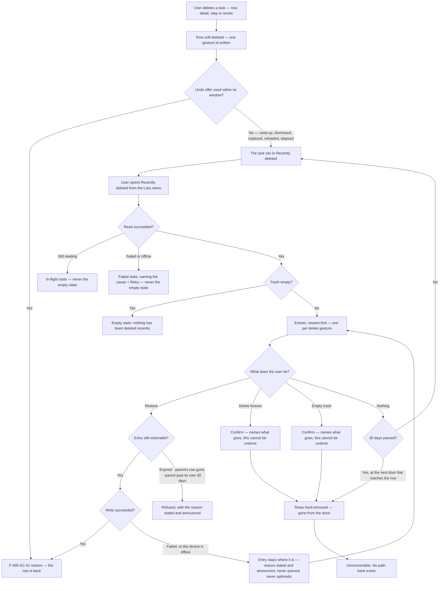
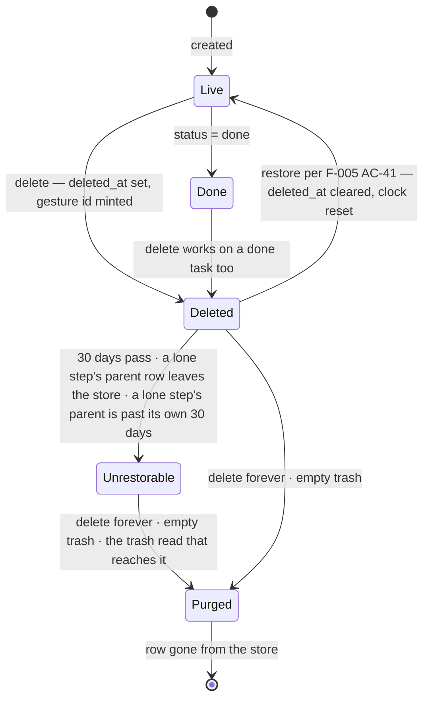

# Feature: Recently deleted (the trash)

**ID**: F-006
**Slug**: recently-deleted
**Status**: `draft` (**revision 5 — the Gate 1 round-2 revision, and the last one; there is no round 3.** Nine lenses returned **14 HIGH · 20 MEDIUM · 3 LOW, 37 findings**, all dispositioned in `docs/reports/gate1-lenses/F-006-revision-5-log.md`. **17 ACs before, 17 after — nothing added, renumbered or deleted**, and that constraint is the owner's, taken on a measurement rather than on taste: of round 2's 14 HIGH, **7 sat on AC-14 / AC-15's read permission added in revision 4, 3 on AC-17 created by a revision-3 fix, 4 on clauses revision 3 added — and 0 on text that existed at round 1 and survived it.** Every new HIGH was on text no lens had read, so **a revision that adds is a revision that ships unreviewed text**: this one amends. **The central fix is C1** — the owner's read permission was unimplementable, because the sentence it authorises has no declared spoken frame and an unframed utterance *fails* (`F-002 AC-22`); the two frames it needs are routed to design in `## Impact` §9 and §10 (owner, `docs/reports/owner-decision-2026-08-21-the-model-authors-the-reply.md` §1). **C2 is the same sentence from the other end** — a turn asking for an act on a row the assistant has just named as being in the trash is answered by naming the trash and the way to reach it, **never by `no_match`**. **Round 2's routed question came back unanimous: all nine lenses judged the dead end acceptable and none asked the owner to reverse it** — what they found is that the decision was not yet *sayable*. **Revision 4's record, kept:** revision 4 — an amendment, not a review round. It folds in the owner's answer to OQ4 (`docs/reports/owner-decision-2026-08-19-carried-notice-placement-and-timer.md` §8): **the assistant may read the trash, and still may neither write to it nor address a row in it.** `AC-14` splits — the **write** refusal is inherited from `F-005 AC-36`, the **read** permission is this feature's own decision with its own reason; `AC-4` is unchanged in substance and now says *in its own text* that addressing is not reading; `AC-5` gains one clause (the assistant's read is that read, a caller and not a second door); `AC-15` stops presenting the absence of a voice path as an accessibility strength. **17 ACs, unchanged — nothing added, renumbered or deleted.** OQ4 closes; the dead end the decision deliberately leaves open is named in AC-14 and routed to round 2. **Gate 1 round 2 had not run when revision 4 was written** — revision 4 is what its nine lenses read. **Revision 3's record, kept:** revision 3 — the Gate 1 round-1 revision. Nine lenses returned **REJECT: 21 HIGH · 29 MEDIUM · 6 LOW, 56 findings**, all dispositioned in `docs/reports/gate1-lenses/F-006-revision-3-log.md`. **The round cap is 2**, so what follows this is at most one targeted re-review of the ACs each lens raised findings on. **The central fix is C1 — a trash entry's membership is now a closed set, stated once in AC-6**, and AC-9, AC-11 and AC-12 refer to that statement instead of re-deriving it (AC-17 deliberately acts on a different set and says so); 7 of 9 lenses found the old wording independently. **17 ACs, up from 16 — one added.** `AC-17` splits *empty trash* out of AC-11, which bundled four independently-failing guarantees under one id and hid the fact that the two destructive acts are **keyed differently** (a gesture's membership versus every deleted row of the account) — which is C1's own subject. Nothing was renumbered and nothing was deleted. **Revision 2's record, kept:** revision 2 — an amendment, not a review round; it folded in the owner's 30-day answer, bound retention to reachability rather than storage, and closed OQ1. **Revision 1's record, kept:** revision 1 — first pass, Gate 1 not yet run.)
**Last Updated**: 2026-08-21

---

## Links

```yaml
primary_module:    assistant
secondary_modules: []
depends_on:        [F-001, F-005]
implemented_in:    []
designed_in:       []
api_endpoints:     ["GET /tasks", "DELETE /tasks/{id}", "POST /tasks/{id}/restore"]
tested_by:
  api:    []
  web:    []
  mobile: []
known_bugs: []
```

---

## Purpose

**The app can delete a task in one tap and has nothing behind it.** This feature is the
net: a *Recently deleted* place a deleted task sits in for 30 days, from which
the user can put it back or destroy it for good.

The owner asked what comparable products do, and the answer is why this is a
requirement rather than a nicety (`docs/reports/owner-decision-2026-08-19-carried-notice-placement-and-timer.md` §4):

| App | Delete | Net behind it |
|---|---|---|
| Apple Reminders | yes | *Recently Deleted*, **30 days**, then permanent |
| TickTick | yes | Trash |
| Things 3 (Mac) | yes | Trash, emptied by hand |
| Things 3 (iOS) | yes | **none** — permanent, and delete is deliberately multi-step |
| Todoist | yes | no trash; daily backups (paid) |

**No product on that list drops delete, and only one has no net — and it pays for it by
making delete deliberate.** This app has a one-tap delete on every list row on both
clients (`src/assistant/mobile/components/TaskList.tsx` calls `controller.removeTask`),
so without this feature it would have the least safety of any of them.

### F-005 is waiting on this, and the dependency is a shipping order

`F-005 AC-43`'s undo offer **elapses after ten seconds**, and `F-005 AC-33` half (ii)
declares that elapse conformant with WCAG 2.1 AA's **2.2.1 Timing Adjustable** *because an
equivalent untimed path to the same outcome exists*. For four of AC-43's five classes
— delete from the detail (AC-31), delete from a list row (AC-42), delete a step
(AC-14), delete a series (AC-30) — **that path is this feature, and it does not exist
yet.** So `F-005 AC-43`'s ten-second elapse on `CN-UNDO` **does not ship before F-006
does**, and until then that offer keeps its four pre-elapse enders. An AC claiming AA
conformance on a timer whose untimed equivalent was never built is a false claim, which
is why the order is written into both specs rather than left in the decision document.

**How a user reaches this feature at the moment they need it is `F-005 AC-43`'s, not
this spec's** *(owner, 2026-08-21 — `owner-decision-2026-08-19-carried-notice-placement-and-timer.md`
§7, option A: when `CN-UNDO` reaches its ten seconds, **what replaces it names the trash
as where the task went**)*. Recorded here once and referenced, never restated: the rule
lives in `F-005 AC-43`, its copy is design's, and the F-005 amendment is **T-185**. The
product lens's finding was not that a Lists-menu row is the wrong inbound path — it was
that this spec **declined three other inbound paths in three separate `## Impact`
subsections and no AC owned the sum**, so the decision was accumulated rather than taken.
`## Impact` §4 now points at the owner's answer and settles nothing.

`F-005 AC-41` also records that its restore **has no read path that returns a deleted
row** and that nothing has ever purged one. Both are this feature's.

---

## What already exists, measured rather than assumed

**Deletion has been soft since F-001. Nothing here is being recovered from nothing, and
no migration is owed.** Re-measured on `data/assistant.json`, 2026-08-21 — every figure
below was independently re-derived by four Gate 1 lenses and all four reproduced exactly:

| Fact | Measurement |
|---|---|
| Rows in the store | **839** tasks across **207** accounts |
| Soft-deleted rows | **57**, across **20** accounts — so **187 accounts have nothing deleted at all** |
| Of those, carrying a `delete_gesture_id` (ADR-012) | **4**; the other **53** predate the field and are the legacy case ADR-012 answers |
| Deleted steps (`parent_id` set) / deleted series rows (`series_id` set) | **0** / **0** |
| Deleted rows whose `status` is `done` | **2** — AC-3's completed-state case ships on day one |
| Largest single account's trash, counted in **entries** | **9** — small enough that AC-11's and AC-17's confirmations can name what they destroy |
| Accounts holding **≥1 deleted row and zero live rows** | **4** — AC-4's raw-cardinality readers are live today, not hypothetical |
| Oldest soft-delete in the store | **2026-08-16** — nothing on disk is older than five days |
| Rows ever removed by a retention rule | **0**. Nothing has ever purged one |

The mechanism is already built: `deleted_at` and `delete_gesture_id` are stored fields
(`src/assistant/api/types.ts:44`), `DELETE /tasks/{id}` sets `deleted_at` and mints one
gesture id per gesture (`plan.ts:851`, ADR-012), `GET /tasks` filters deleted rows out
(`app.ts:422`), and `POST /tasks/{id}/restore` clears `deleted_at` for the whole
recorded membership (`app.ts:568-628`, ADR-012).

**What is missing is four things and only four:** a read path that returns deleted rows,
the 30-day retention, permanent deletion, and the surface. Without the second, this is not
a trash — it is a leak that happens to be recoverable.

---

## The structural answer, in one sentence

**The trash is a lifecycle state like `Done`, not a container like `Inbox`.**

`ADR-009 § Amendment 2` models open tasks on two independent axes — a date axis
(Today · Upcoming · `undated`) and a filing axis (Inbox · personal lists) — with `Done`
the gate that empties both. **The trash is on neither axis.** Built as a fifth *filing*
destination it repeats the exact category error the four-buckets decision fixed, and
`INV-INBOX-FILING` is the standing warning about that family of mistake. What that
means concretely is `## Impact` §2 and §3.

---

## Users & Permissions

| Role | Can do | Cannot do |
|------|--------|-----------|
| Authenticated user | Open *Recently deleted*; put an entry back; destroy one entry for good; empty the trash | See or restore another account's deleted rows; recover a row more than 30 days after it was deleted; undo a permanent deletion |
| Assistant (AI) | **Say what is in the trash, and that a named task went there** — **top-level tasks only**, in one of the two frames AC-14 owes `§ Spoken frames`, through AC-5's read and no other door. A turn asking for an act on a row it has just named as being in the trash is answered by **naming the trash and the way to reach it by hand** | Restore, destroy, empty — or be handed a deleted task as a **handle**: a deleted row is in no handle list (`turns.ts:396`), so no turn can name one as the target of an action, and no turn may write one (AC-4, AC-14). **Speak a step's title** — that is AC-7's surface-only exception. **Answer such a turn with `no_match`** — the task *was* matched (AC-14). **It can say where the task went and cannot act on it**; round 2's nine lenses all judged that dead end acceptable, and found its cost is the missing **sentence**, not the missing action |
| The system | Remove a row deleted more than 30 days ago, at the doors named in AC-12 | Remove a row on any timer — **there is no scheduler in this app** (`## Ops`) |

---

## User Flow





---

## Acceptance Criteria

**Platform tags decide which QA tier verifies an AC**, exactly as in F-005 — they scope
verification, they do not describe where the code lives.

**This feature ships on web and on the phone at the same time**, and that is not
symmetry for its own sake: the one-tap row delete this trash exists to make safe is
already shipped on **both** clients, and the Lists menu that carries the entry is one
presentation on every platform (`docs/design/_shared/components.md § ListsMenu`). A
web-only trash leaves the phone with a one-tap delete, a ten-second window and no net —
the exact configuration the owner chose the trash to avoid.

### The surface

- [ ] **AC-1** (web, mobile) — **The Lists menu carries a *Recently deleted* entry, and it is peer to `Done`, not to `Inbox`.** It belongs with the rows that answer *what is this task doing* — the views and the gate — and never in the filing group beneath Inbox, which is where the personal lists will append. Where exactly it renders within that group, and its wording, are design's (`components.md § ListsMenu`); **which kind of row it is, is not.**
  - **It carries no count.** Every number in that menu is `collectionCount(tasks, c, now)` over the live rows, and a deleted row is in no collection by AC-4 — so a number here would be the one number in the column produced by a different mechanism while looking identical. It would also read as an inducement to open a place whose whole value is that you rarely need it. *(Design may still want a "there is something in here" mark; that is a mark, not a count, and it is design's call — **answered at Gate 1: no mark**, see Open Question 3.)*
  - **The placement half needs an observable it does not have today, and this AC owes it rather than assumes it** *(tester-mobile F2)*. `§ ListsMenu` settled *"no new testid — `menu-collection-row` is the LM-COLLECTION exemplar"* when Upcoming was added, and the phone's only Lists-menu observable is `expectedShellIds()` (`mobile/model/a11y.ts:384`), which returns a **set**: a fifth row changes nothing in it. **So the only assertion this AC would otherwise admit — "the group gained a row" — passes for a row drawn in the filing group this AC forbids, and for the fifth `Collection` member `## Impact` §2 calls the category error: the test would certify the defect.** This row therefore **carries its own contract testid**, distinct from the `LM-COLLECTION` exemplar, and it is **not** an `LM-COLLECTION` member — that family is defined as *"rows the app always has and computes on device"* and this row computes nothing on device, it points at a network read (design F6b). Which family it joins, which id it carries, and whether the existing four-row set assertions become five are `## Impact` §9's, routed to `§ Testid catalogue — app shell` and to F-003's closed catalogue.
- [ ] **AC-2** (web, mobile) — **Opening it shows the account's deleted entries, newest deletion first, and it is a surface with a named edge and a named return.**
  - **Four states, not two, because this is fed by a new network read** *(design F1, tester-mobile F1, dev-mobile F4)*: **in flight**, **failed**, **offline**, and **loaded** — of which loaded may be empty. The empty state says nothing has been deleted recently; it is the ordinary state of this surface, not a failure, and it must not be drawn as one. **The reverse is the one that costs a task and it is now forbidden by name: a read that is still running, that failed, or that could not be attempted because the device is offline must never render the empty state.** *187 of 207 accounts have nothing deleted, so the empty render is right often enough that a wrong one will not look wrong* — which is why this is an AC and not a drawing note. The phone already carries the vocabulary for this shape (`mobile/model/tasks-view.ts:66` — `'default' | 'empty-first' | 'empty-collection' | 'loading' | 'error'` with a `'none' | 'retry' | 'offline'` banner) and it exists *because* that read can be slow, fail, or be offline; this surface has the same property and gets the same treatment. Deleted rows are in no local store by AC-4, so **there is nothing to fall back on when the read fails** — the failed state takes the surface, names the cause, and offers Retry (`components.md § SurfaceError`, `§ InlineRetryBanner`).
  - **It is a surface, it is reached by one edge, and leaving it returns to the menu it was opened from** *(dev-mobile F1)*. `information-architecture.md` §4's rule is *"nothing reaches a surface except through an edge on this list"*, and every other Lists-menu row is a `select-collection` edge landing on **S2 Tasks**, where `shellBack()` returns `consumed: false` — **so on S1/S2 the Android back press exits the app, deliberately.** Inheriting that here means back exits the app from a surface reached in two taps. **This surface is not a collection on S2**; it is its own surface with its own edge (S3 → trash) and its own return (trash → S3), and the Android back press on it takes that return. `F-005 AC-45` is the precedent — one surface, its edges enumerated, written into the IA at the moment the surface is introduced — and it is followed here rather than left to an implementer to invent. The IA entry is `## Impact` §10's, with a named writer.
  - **Ordering key** *(tester-web F7)*: entries order by the **gesture's** `deleted_at`, newest first. That is well defined for a cluster because the delete writes one instant to every row of the gesture (`plan.ts:851` writes `ctx.at`), and ties — two gestures inside the same instant — break by the entry's addressing id (AC-6) so the order is total and an assertion cannot flake.
- [ ] **AC-3** (web, mobile) — **An entry says what it holds, when it was deleted, and when it goes.**
  - **What it holds** *(product F1)*: the entry **names the task it covers.** Nothing in revision 2 required this — *"title"* appeared once in the whole spec, in AC-7, as a prohibition — while AC-2 fixed ordering, AC-3 fixed two dates and AC-6 fixed the unit, so the one thing the user reads to tell one entry from another was constrained by nobody. Restore is this feature's entire value and it must not be a guess. For a **cluster** (AC-6) the entry names the task the gesture addressed and says **how many rows come back with it**; for a **series** (AC-8) it says how many occurrences come back; for a lone deleted **step** it is AC-7's rule. Wording, truncation and the overflow shape are design's (`§ Spoken frames`' `title_list` publishes the house rule: up to 3 names, then *"and N more"*).
  - **Whether the task was completed when it was deleted** *(design F5)*. The state diagram carries `Done --> Deleted` and **2 of the 57 deleted rows are `done` today**, so an entry drawn like every other tells the user a completed task is an open one — and AC-10 then returns it to **Done**, the one collection whose empty state is defined as having no action, so the restore whose destination is least discoverable would be the one whose entry gave the least warning.
  - **The two dates: when it was deleted, and when it stops being recoverable** — 30 days after the deletion. A trash that does not say how long you have is a promise the user cannot act on; this is the observable half of AC-12. **What the entry states is the date the row stops being recoverable**, which is exactly what AC-12's predicate tests — not a date the bytes leave the disk, and **no wording about that date may promise it**. **The ban is on the retention copy and on nothing else** *(product F4)*: AC-11's and AC-17's confirmations say *this cannot be undone*, and for those two acts it is **true** — they hard-remove the rows. Read surface-wide, the ban would catch the one copy on this surface that is accurate, and the User Flow already draws it on both confirmations. **`§ Buttons`' one-word-per-concept table binds *delete* to "removing a task" and has no word for *stops being recoverable*, so the obvious copy — "Deletes forever on 20 Sep" — makes exactly the promise AC-12 excludes** (design F6a). That word is owed to the table **before the screens are drawn**; `## Impact` §9 routes it.
  - **The date has one producer, and it is the server** *(architect F4, dev-api F6, dev-web F4, dev-mobile F5, tester-mobile F3)*. `## Data`'s retention row is read by server-side doors and this AC renders on two clients, so **the cheapest implementation computes `deleted_at + 30 days` locally — two more copies of the constant and two more clocks, against a predicate that runs on the server's.** This AC promises the date *is exactly what AC-12's predicate tests*, so that drift is a spec violation nobody can see until a user hits it: **the e2e harness holds both clocks at one instant, so a divergent implementation passes its tests and drifts only in production** (dev-web F4). **The date the entry states is produced by the server, on the same read that lists the entry, against the same clock AC-12's predicate uses. No client derives it.** *(`platform/mobile.md`'s standing rule for the zone is the same shape: report, do not compute. `F-005 AC-44` is one seam per side, which is not the same thing as one answer — this AC needs the one answer.)*

### What the surface lists, and what an entry is

- [ ] **AC-4** (api, web, mobile) — **A deleted task appears in no collection, in no count, and in no handle a turn can act on, while it sits in the trash.** It is not in Today, Upcoming, Inbox or Done; it is in neither expression of `INV-INBOX-FILING`; it is not in the interpreter's handle list, so **no turn can name it as the target of an action**; and it is not returned by `GET /tasks`. This is what "lifecycle state, not container" means as an assertion, and it is falsifiable at each of those readers separately. **The trash's own read is the single exception and is the only one** (AC-5).
  - **This AC governs addressing, not reading, and collapsing the two reverses a decision** *(the owner's decision of 2026-08-21, `docs/reports/owner-decision-2026-08-19-carried-notice-placement-and-timer.md` §8 — closing OQ4)*. The assistant **may say** what is in the trash and that a named task went there — that permission is **AC-14's**, it is exercised through **AC-5's** read, and it puts nothing into the handle list. What this AC forbids is the row being a **target**: *"delete the dentist task"* must never resolve to a row already deleted, and no turn may write one. **Widening this AC to admit reading would make a deleted task addressable, which is not what was decided** — a later reader who meets AC-14's read permission and "reconciles" it here has overturned the owner's line, not tidied the spec.
  - **The readers that count raw rows are named too, because the enumeration above is `inCollection`-shaped or server-side and they are neither** *(tester-web F2)*. `web/components/TasksSurface.tsx:413` is `nothingAnywhere = state.tasks.length === 0`, and `:414`'s `loading` and `:420`'s `failedBlank` derive from it — **cardinality of the raw array, never `inCollection`.** **Measured: 4 accounts in the live store already hold ≥1 deleted row and zero live rows**, so an account holding only deleted rows would render the empty-*collection* state instead of first-run and would never render the skeleton. `F-005 AC-35` had to name this exact reader class for the identical negative about steps; this AC repeated the negative and omitted it. **A deleted row is not in `state.tasks` at all** (`## Impact` §3), so the guarantee is that these readers keep counting live rows only — falsifiable directly at that line.
- [ ] **AC-5** (api) — **One read path returns deleted rows, it is the only one that does, and it is scoped to the caller's own rows.** Every other read that keeps a deleted row out of something a caller can see keeps its `deleted_at` filter unchanged — `## Impact` §1 enumerates them — the reads and the write guards both — in one place, **and this AC states no count of its own**: four Gate 1 lenses counted revision 2's headline and got four different numbers, and *"a test written to the number asserts over a set that excludes the site that matters"* (dev-mobile F7). **The enumeration is the contract; the number is not.** Another account's deleted rows are not reachable through this read by any argument, exactly as `POST /tasks/{id}/restore` is scoped today. **The assistant's read (AC-14) is *this* read**: the owner's decision §8 permission adds a **caller** to this path and not a second path, so *"it is the only one"* is unchanged by it — and a second reader of deleted rows opened in the turn path would break this AC and AC-4 together. **What the turn caller does *not* inherit is AC-12's removal write** *(architect F1, dev-api F1)*. Revision 4 stated that the assistant's read is *this* read while AC-12 put the retention **removal write** on that same read, and the two composed into *asking the assistant about the trash hard-removes rows* — unstated, and with two bad outcomes: a fixture that asks the assistant anything about the trash **purges before its own assertion**, making AC-12's row-count observable unattributable, or architecture exempts the caller and *"the removal write happens on the trash read"* is false for one of its two callers with nothing saying so. **It is stated here: the expiry *predicate* is evaluated for both callers — so the assistant never names an expired row — and the removal *write* happens on the surface's read only. A question purges nothing.**
- [ ] **AC-6** (api, web, mobile) — **A trash entry is a delete gesture, not a row — and its membership is a closed set, stated here once.**
  - **The closed membership rule.** An entry's membership is **exactly the rows that one delete gesture trashed**: the rows carrying its `delete_gesture_id`, or the single row when that field is `null`. **Nothing is ever added to that set** — not a parent, not a step, not a row from another gesture, not a row that arrived by an invariant. **AC-9, AC-11 and AC-12 all act on *this* set and none of them re-derives it. AC-17 is the one act that deliberately does not — it addresses no entry and takes every deleted row of the account — and it says so in its own text rather than leaving the difference to be inferred.** *(This sentence is the fix for the finding 7 of 9 Gate 1 lenses raised independently. Revision 2 defined *delete forever* as *"the same membership AC-9's restore would have put back"* — and AC-9's restore pulls in a still-deleted **parent** regardless of gesture (`app.ts:605-618`), which AC-6 makes a separate entry with its own `deleted_at` and its own expiry. Read one way, destroying a stale entry hard-removed a **live** task; read the other, the AC contradicted its own wording. Both readings were reachable, because `plan.ts:105` cascades over **live** steps only, so *"delete a step, then delete its parent"* is genuinely two gestures.)*
  - Deleting a task with steps trashed N+1 rows under one `delete_gesture_id` (ADR-012) and restoring puts back exactly that set, so the trash shows **one** entry for it and never N+1. A row whose `delete_gesture_id` is `null` is its own entry — **measured, that is 53 of the 57 rows in the store today**, so on real data almost every entry is currently a singleton and an implementation that only handles clusters is untested by the live store.
  - **Grouping is server-side and an entry is addressed by any one of its member task ids** *(architect F3's directive; tester-api F4, dev-api F4, dev-web F3, dev-mobile F6)*. `delete_gesture_id` is declared internal and never serialized by **both** ADR-012 and `api-contracts § Task on the wire`, so **client-side grouping — the option revision 2 left open and the one that looks cheapest — is unbuildable without amending a `## Data` row**, and 53 of 57 rows carry `null`, which is not a group key at all. Addressing by a member task id is the restore's own precedent (`POST /tasks/{id}/restore` takes a member id and resolves the membership server-side) and it keeps the gesture id internal. **This closes the option rather than offering it.**
- [ ] **AC-7** (web, mobile) — **A step deleted on its own is in the trash, it is identifiable there, and it is never drawn as a top-level task.**
  - Its entry is presented as a step **of the parent it belongs to** — resolved through the step's own `parent_id`, which the delete leaves untouched.
  - **This surface renders the step's own title, as a scoped exception to ADR-013 stated here rather than derived** *(product F1, product F3)*. ADR-013 forbids the undo path from ever rendering a step title on the grounds that *"a step is neither drawn nor addressable"*, and `F-005 AC-35` excludes steps from every collection and every count — **but those rules were written for surfaces the user did not ask to see the step on. Here the user is choosing which deletion to reverse.** Naming the entry by the parent alone fails the AC's own stated purpose: **two steps deleted from one parent in two gestures produce two entries a user cannot tell apart.** So the entry names **both** — the step, and the parent it belongs to — and this is the one surface in the product where a step title is rendered. The exception is scoped to this surface and to nothing else; `## Impact` §10 routes the ADR-013 note. **The turn path is explicitly not it** *(product F2)*: `turns.ts:390` names *"read step titles aloud"* as the handle list's own reason for excluding steps, so AC-14's read is bounded to top-level tasks and **a step title is never spoken.**
  - **An entry whose parent's row has left the store is stated, not left undefined** *(dev-api F2, dev-web F1, dev-mobile F6, tester-mobile F6)*. The ordering is reachable and not contrived: delete step S alone (gesture A), delete parent P separately (gesture B), then *delete forever* B — or restore A and re-delete it, which resets S's clock (AC-12) so P expires first. The step entry then has a `parent_id` pointing at no row. **It stays listed and it says its parent is gone; it is not restorable, and AC-9 states the refusal.** **The entry carries the parent's title and the parent's state — live, deleted, or gone — and the server produces both on the trash read, by AC-3's producer rule** *(dev-web F1)*. Without them the clause above **cannot be rendered**: the client has only `parent_id` on the wire, a live parent resolves from `state.tasks`, a deleted one **only by joining across trash entries**, and a gone one **not at all** — so the three cases are indistinguishable on the client and **an implementation that renders nothing for all three passes every fixture built on a live parent.** `## API Touch Points` carries the requirement on AC-5's read. *(The three alternatives were each worse. Restoring it anyway produces a live row in no collection, no handle list and no trash — **permanently invisible**, which is the state `app.ts:602`'s own comment calls unreachable. Destroying the step's entry along with its parent's would put back exactly the cross-entry destruction AC-6 just closed. Leaving it undefined is what nine lenses objected to.)*
- [ ] **AC-8** (web, mobile) — **A deleted series is one entry.** `DELETE /tasks/{id}?scope=series` trashes every unfinished occurrence and their steps under one gesture id and leaves the completed occurrences alone (`F-005 AC-30`); the trash shows one entry for the gesture, and restoring it is AC-9's restore over AC-6's membership. **What restoring does to the repeat itself is not settled here — see `## Impact` §6 and Open Question 2.**

### Putting a task back

- [ ] **AC-9** (api, web, mobile) — **Restoring from the trash is `F-005 AC-41`'s restore and nothing else — and it has refusals, which revision 2 did not state.**
  - No second un-delete mechanism is built: `POST /tasks/{id}/restore` already clears `deleted_at` across the recorded membership, keeps id, `step_order`, `series_id` and `created_at`, is a stated no-op on a live row, and is scoped to the caller (ADR-012, `api-contracts.md`). Two mechanisms answering one gesture is L-005's shape and this feature deliberately adds none.
  - **The restore's parent invariant is a restore-only rule and it does not widen AC-6's membership** *(dev-api's sharpening of architect F1; tester-web F3, design F4, dev-mobile F6)*. Restoring a step whose parent is still deleted restores the parent too (`api-contracts § POST /tasks/{id}/restore`, evaluated *after* the membership set is assembled). That parent may be **a row from another entry**, so a restore is the one act in this feature that can reach beyond the entry it was asked about. **It is never silent: the outcome names the entry restored and says that a second entry came back with it, and the list re-renders without both.** It never *destroys* anything, which is why the invariant survives here and AC-11's destroy set does not inherit it. **The invariant is subject to AC-12 without exception, and revision 4's version was not** *(architect F2)*. Verified in shipped code: `app.ts:610-617` adds **any** still-deleted parent unconditionally and then clears `deleted_at` on every member — so a restore could **resurrect a row past its 30 days** while AC-12 promises reachability ends *"without exception"*. It does not: **an expired parent is never brought back**, and because the step cannot return without it, the restore is refused under (c). **AC-6's closed-membership fix closed the halves about *destroying* and *emptying* across entries; this third half was about *resurrecting* and it did not close.** Falsifiable at the api tier: seed an expired parent, call restore on its step, **without a trash read** — the product path purges the parent first, the door does not.
  - **Four outcomes, and revision 2 had two.** *(a)* **Restored** — the membership is live again. *(b)* **Already live** — the stated no-op `restored: false` (`F-005 AC-41`), which is what a double-tap produces. *(c)* **Refused — the entry is past its 30 days, or the parent row this restore must bring back with it is past its own** (AC-12). *(d)* **Refused — this is a lone deleted step whose parent's row has left the store** (AC-7). **(c) and (d) must be distinguishable at the door from each other, from (b), and from an unknown or another account's id** — a `404` is indistinguishable from an unknown id, and `restored: false` asserts the row is live, which is false in both refusal cases. **The refusals are requirements; their wire shapes are architecture's** (`## API Touch Points`). AC-16's 4.1.3 requires both refusals to be announced, **and the client cannot announce a refusal it cannot tell apart from a double-tap** (dev-api F3) — which is why this is stated here and not left to three implementers to guess separately. *This is the door `F-005 AC-33`'s AA claim rests on: a path whose refusal is silent is not an equivalent path.*
  - **This is the feature's third write, and it gets the same post-state rule as the other two** *(design F2, dev-mobile F2)*. Revision 4's four outcomes were **all server verdicts**: the read (AC-2), the destroy (AC-11) and the empty (AC-17) each had a failed state **and** an offline state, and **the one act this feature exists for had neither** — while AC-15 and AC-16 both enumerated the failure answers as *"AC-2's read, AC-11's and AC-17's writes"*, so **the hole read as a complete answer.** So, stated: **the put-back is not optimistic** — the entry leaves the list when the write **succeeds**; **a failed put-back leaves the entry where it is and states the reason**; **offline it is refused with the reason stated — never queued and never replayed.** The default the phone would otherwise inherit is `undoLastAction`'s branch (`_shared/controller.ts:1451`), which restores an undo offer that does not exist on this surface, announces `UNDO_FAILED` — **wording that names undo, not put-back** — and **checks connectivity nowhere**, so **this is the one act here that will be attempted offline.** The codebase's own default is *"apply an optimistic change, `await`, and discard it"*, which produces the row that vanishes and returns at the next refresh that AC-11 spends a paragraph forbidding for the act next to it.
  - **The control's word is not *restore*** *(design F4)*. `§ Buttons`' one-word-per-concept table already binds *"reversing a delete the user performed by hand"* to **put back** and lists *restore* among the words never used for it — and this spec says `restor*` **57 times** while *put back* appears three times, none of them in an AC body. **The spec means the mechanism**: `POST /tasks/{id}/restore` is a route and `restored` is a field, and neither is user-visible copy, so both are unaffected. **What the user reads is `§ Buttons`'** — either *put back*, or a second word the table gains if design judges a 30-day recovery a different concept from a ten-second one. **It may not be a forbidden synonym.** `## Impact` §9 routes the decision.
- [ ] **AC-10** (web, mobile) — **A restored task returns to wherever the ordinary predicates put it, this feature states no relocation rule, and the outcome is reported where the user can see it without leaving the trash.**
  - Restoring clears `deleted_at` and touches nothing else, so a task whose due date has passed while it sat in the trash lands in **Today** — because `today(t, now)` is `open(t) && day(t, now) <= 0` and that is where *every* overdue task is, not a special case this feature invents. A task with no date lands in Inbox. **Nothing is moved to Inbox on restore**: doing so would file a task the user never filed, and would be this feature writing on the filing axis, which `## The structural answer` forbids.
  - **The outcome is carried by `F-005 AC-47`'s notice family, and this is the AC's own observable rather than an inference** *(design F2, tester-web F5, dev-web F2, dev-mobile F3)*. Revision 2 justified stating no relocation rule with *"the restored task is on screen and named after the restore, so a user who disagrees can move it by hand"* — **and both halves were false.** By AC-4 the restored task cannot appear on the surface the user is standing on; on the phone one surface renders at a time, so *"on screen"* meant either a navigation no AC stated — **one that makes restoring three entries in a row impossible** — or an observable that was simply not there. And *"move it by hand"* named a remedy the phone does not have: its row has exactly three controls (`toggleTask`, `editTask`, `removeTask`), **no date control and no filing control**, and `writeField` is never called from `src/assistant/mobile/`. **Both sentences are withdrawn, not deleted, so nobody re-derives them.** What replaces them: the restore reports itself in the shell-level notice region `F-005 AC-47` publishes — visible wherever the user is, on **every** surface including this one (`information-architecture.md` §2 records that region as the first component that appears on every surface) — and **the notice names the task and the collection it landed in.** The user stays in the trash, restores three entries in a row, and is told where each went. **That a restored task cannot be re-filed on the phone is F-005's and F-003's gap, not this feature's to close** — recorded in `## Impact` §11.
  - The notice reporting a put-back carries an outcome and none of the user's own words, so **it is `F-005 AC-47`'s second lifetime group** — it may elapse. It is not an undo offer and it carries no action. **It is a new row in that family and it needs its own id** *(dev-mobile F1)*: the phone's `CarriedRowId` is a **closed union of exactly six** (`mobile/model/carried.ts:62`) whose six row states are enumerated under **one exemplar testid** in F-003's closed catalogue (`mobile/model/a11y.ts:162,192`), and `platform/mobile.md` calls that catalogue *"closed and structurally asserted"*. `## Impact` §4's *"only a new member"* is true of AC-47's **rule** and false of the phone's **union**, and §9's catalogue list omitted it — so the implementer would invent a row id inside a closed catalogue and **the QA author could not address the outcome of a put-back at all**, which is the failure AC-1 was amended to prevent one level up. §9 routes the id.
  - **The report says which of AC-9's four outcomes happened, not merely that something did** *(design F5)*. Revision 4 gave content for one — *(a)* restored, naming the task and the collection it landed in. ***(b)* already-live, *(c)* refused-expired and *(d)* refused-orphaned had none**, so three of the four outcomes AC-16's 4.1.3 requires announced had nothing to announce. And **the cascade needs a shape a singular sentence cannot hold**: AC-9's parent invariant returns **two entries**, possibly into **two collections**, in one elapsing row. All four outcomes and the cascade are reported; the wording and the two-task shape are design's (`## Impact` §9).
  - **What this AC leans on, it now names as a dependency instead of asserting as fact** *(design F6, dev-web F3)*. Putting three entries back in a row produces three reports, and **whether three can be on screen at once is `F-005 AC-47`'s anti-stacking bound, not this feature's** — under the resolution that bound pushes toward, each report replaces the one before it unread, which would make this AC's stated reason untrue for the **third** time. It is not restated: **each put-back is reported, and how many reports coexist is AC-47's.** Separately, **the second lifetime group has no timer in either client today** — `web/components/CarriedNotices.tsx` contains none and **its header states that absence as the requirement rather than an omission** — so this member elapses only once `F-005` revision 5's implementation lands, and an implementer adding a timer against that file before it does is fighting a written rule.

### Destroying a task for good

- [ ] **AC-11** (api, web, mobile) — **One entry can be destroyed permanently, and it is confirmed by name.**
  - **Its set is AC-6's membership, restricted to the rows still deleted at the moment of the act.** A member that has since been restored is live, and **a live row is never hard-removed by this act** — which is what makes *delete forever* on a stale entry safe. Nothing is added to the set: the restore's parent invariant (AC-9) is a restore-only rule and does not reach here, so destroying one entry never destroys a row from an entry the user did not select. *(Revision 2 defined this set twice — *"exactly the rows the entry covers"* and *"the same membership AC-9's restore would have put back"* — and the two definitions differed **by a task the user still owns**, on the one irreversible act in the product: tester-web F1, dev-api F1.)*
  - **The confirmation names what it is about to destroy** *(design F3)*. `components.md § Spoken frames` records the owner decision of 2026-08-17 in these words: *"a destructive confirmation names the tasks. Count-only is not a legal fallback for this row."* Revision 2 gave *delete forever* **no content requirement at all**. It gets one: the confirmation names the task the entry holds and, for a cluster or a series, how many rows go with it, using `title_list`'s published overflow rule (up to 3 names, then *"and N more"*). **Largest trash on the live store is 9 entries, so naming is affordable at real scale and the count-only fallback buys nothing.**
  - **This and AC-17 are the only genuinely irreversible acts in the product and the only place a confirmation earns its keep** — the confirmation exists here precisely because it does not exist on the ordinary delete, which has this trash behind it.
  - **The write is not optimistic, and offline it is refused rather than queued** *(dev-mobile F2, tester-mobile F5)*. `platform/mobile.md` records that this client's three shared write methods *"apply an optimistic change, `await`, and **discard** it — no read, no error branch, no refresh"*, and the obligation it states is a post-state: *"never a row that vanishes and returns at the next refresh"*. **A confirmation reading *this cannot be undone*, followed by an optimistic removal that silently reappears, is that exact failure on the one gesture where the user has just been asked to accept irreversibility.** So: the entry leaves the list when the write **succeeds**, a failed destroy leaves the entry where it is and states the reason, and **offline the act is refused with the reason stated — never queued and never replayed.** `refusesOffline` (`_shared/controller.ts:1239`) is keyed on a row found in `state.tasks`, and `## Impact` §3 requires trash rows to stay out of that array, so **every offline guard the clients have is unreachable from this call by construction** and the implementer gets no default from the codebase. *A delete forever queued offline and replayed later destroys rows after the user has left the surface, against a confirmation shown for a state that has since changed.* `F-005 AC-2`'s third state is the precedent for the refusal, and AC-15's *"works while the assistant is erroring"* is about **AI**, not the network — it reads at a glance as "offline" and it is not.
  - Hard removal is reported through the existing `removed: [uuid]` channel (`api-contracts.md § The multi-row response rule`). **Whether that channel's envelope fits is a question for architecture, not a reassurance** — see `## API Touch Points`.
- [ ] **AC-17** (api, web, mobile) — **The whole trash can be emptied, and it is confirmed by name.** *(New in revision 3, split out of AC-11 — tester-web F6. The two acts are **keyed differently**: this one is every deleted row of the account, AC-11's is one gesture's membership, and that difference is C1's own subject. Six or more P1 cases against one id also means the coverage matrix cannot show that this confirmation was never verified while AC-11's was. `F-005 AC-31`/`AC-42` is the precedent for the split.)*
  - It hard-removes **every deleted row of the account**, expired or not, and it addresses no entry. **This is deliberately not AC-6's membership** — it is the one act here keyed on `deleted_at` rather than on a gesture, and stating the difference is what stops the two acts being re-merged under one rule, which is how revision 2's AC-11 came to define its own set twice.
  - ***"Expired or not"* has an observable, and it is not a product door** *(tester-mobile F3, tester-api F2)*. An expired row is unlisted and unrestorable **whether or not this act removed it**, so that half cannot fail at any door the user can reach — and the one door that could show it, the trash read, **purges the expired rows itself first** (AC-12). **An implementation that empties only the unexpired rows passes every assertion written from this AC and leaves the expired rows on disk forever**, which is the leak `## API Touch Points` names as the failure mode, arriving through the act the user is told is irreversible. **The assertion is the account's stored row count through the raw-store harness read AC-12 already owes** — seeded and emptied **without an intervening trash read.** AC-12 owes that door; this AC cites it.
  - **The confirmation names what goes: the entries, `title_list`'s overflow shape above three, how many entries, and how many rows** *(tester-web F2)*. Revision 3 imported *"the same rule as AC-11"* — which requires **each entry's row count** — and then enumerated **entries**, and **the two readings differ by the scale of the largest irreversible act in the product**: a trash of 3 entries holding a deleted series reads *"3 entries"* under one and names **40-plus rows** under the other, and above `title_list`'s three-name cap the imported per-entry rule **cannot be expressed at all**, so no assertion could be written without choosing. Both numbers are stated, and **the row total is the number the user is actually consenting to.** A count alone is what the owner's 2026-08-17 decision excludes; the counts **in addition to** the names is what makes the scale of the act legible.
  - **The set is pinned to the confirmation, exactly as AC-11's is** *(tester-web F2, dev-mobile F3, dev-api F4, product F3)*. The act destroys **the rows the confirmation named, restricted to those still deleted at the moment of the act** — so a member put back in between is live and is never hard-removed, and **a row deleted after the confirmation was shown is not destroyed by this act.** Revision 3 named *what the client last read* and destroyed *every deleted row at act time*, and **nothing bound them**: a task deleted in between — by the other client, or by a turn, both of which can delete — **was destroyed without being named**, which is the owner's 2026-08-17 decision failing on the one act it was written for, and it is the *"confirmation shown for a state that has since changed"* failure AC-11 names in its own offline bullet, reached here with no queueing involved. **AC-11 pinned its set against exactly this; AC-17 inherited only the post-state rules.**
  - **It is offered only from a loaded trash holding at least one entry** *(product F3, tester-web F4)*. AC-2 defines in-flight, failed, offline and empty states, and **in all four there is nothing to name a confirmation from** — so an implementer would either show a confirmation naming nothing, which is **weaker than the count-only fallback the owner's 2026-08-17 decision already excludes**, or disable the control on rules nobody wrote, and **the one bulk irreversible act would behave differently on each client.** If the trash empties under the user while the surface is rendered — AC-10 puts the user here putting three entries back in a row — **the control goes with the last entry and the surface renders the empty state.**
  - The same post-state rule as AC-11 applies in full: not optimistic, a failure leaves the trash as it was and says so, and **offline it is refused rather than queued.** **And the success post-state is stated here rather than inherited** *(dev-web F4, design F7)*: AC-9 and AC-11 each state their own, and revision 3's three inherited items were **all failure halves** — dropped on the one act where the emptied list is the whole observable. **On success the trash holds no entries and the surface renders AC-2's empty state.** That state's copy — *"nothing has been deleted recently"* — is right for the ordinary case, 187 of 207 accounts, and **wrong immediately after the user destroyed nine entries by name**, so the state needs a second wording for this arrival. The state is the same; the sentence is not, and `## Impact` §9 routes it to design.
  - **It is the one act here that addresses no row**, which is exactly why AC-11's *"no new response shape is owed"* is withdrawn (`## API Touch Points`).
- [ ] **AC-12** (api) — **A deleted row stays recoverable for 30 days, the clock starts at `deleted_at`, and a restore resets it.** A restored-then-re-deleted row gets a full fresh 30 days, because `deleted_at` is cleared by the restore and re-set by the next delete — **no separate expiry field is stored**, so the expiry is always derived from `deleted_at` and there is no second value that can disagree with it. An **entry's** expiry is the shared `deleted_at` of **AC-6's membership** plus 30 days — this AC does not re-derive that set — and it is well defined because the delete writes one instant to every row of the gesture (`plan.ts:851`). *(The length was Open Question 1; the owner answered it on 2026-08-21 — `docs/reports/owner-decision-2026-08-19-carried-notice-placement-and-timer.md` §6. Apple Reminders' *Recently Deleted* is the comparable at the same number.)*
  - **The 30 days binds what stays *reachable*, not what stays on disk, and that is the promise this AC makes and is tested against.** Once 30 days have passed since `deleted_at`, the row is not listed by AC-5's read and `POST /tasks/{id}/restore` does not bring it back (AC-9's refusal (c)). That holds without exception and is the whole of what the user is promised. **It is not a promise that the row has left the store**: a row belonging to an account nobody opens the trash on stays on disk past its 30 days, and an implementation that leaves it there is conformant. **That is a trade the owner took with its cost stated, not an oversight to be repaired later** — a storage guarantee needs the background job `## Out of Scope` excludes, so *"deleted after 30 days"* is true of reachability and not literally true of storage. Reading it as a storage claim and filing it as a bug is reading a promise this AC does not make; if it ever has to become one — a data-retention obligation, a privacy commitment — that is a scheduler and a separate piece of work.
  - **What removes an expired row, stated plainly rather than implied: nothing runs on a timer.** **There is no server-side scheduler, cron or background job in this app** — verified 2026-08-21: the only timers in `src/` are client UI ones (a flash dismissal, a retry sleep, the speech port, a fixture sleep) and none of them touches the store — and this feature does not add one (`## Out of Scope`). **The expiry predicate — 30 days elapsed since `deleted_at` — is evaluated at the two doors that read a deleted row *for the user*: the trash read (AC-5) and the restore (AC-9).** So an expired row stops being listed and stops being restorable the moment it expires, whether or not anything has run. **The removal *write* happens on the trash read**: the expired rows go from the store the next time anyone opens that account's trash.
    - *"Two doors" counts the doors that hand a deleted row back to a user, not every code path that touches one* (dev-api F8). `planDelete` with `scope=series` writes `series_ended_at` onto already-deleted rows via `allow_deleted`, and AC-11 and AC-17 remove them — none of those returns a deleted row to a caller, and the phrase is written this way because *"exactly two"* is what an implementer greps against.
    - **The count is of read *paths*, and AC-5's path has two callers** *(architect F1, dev-api F1)*. AC-14's read hands a deleted row's content back to a user **through the turn**, which is this AC's own definition of a door — so under that definition the turn looked like a third, and revision 4 touched AC-4, AC-5, AC-14 and AC-15 and **left this AC alone.** It is not a third *path*: it is the second **caller** on AC-5's, which AC-5 now states in its own text. **What differs between the callers is this AC's removal write, and only that — it happens on the surface's read and not on the turn's**, so asking the assistant about the trash purges nothing. Stated here as well as in AC-5 because this is the AC an implementer greps.
    - **The turn undo is not a third door, and the reason is `ADR-004`'s idle close rather than anything this feature does** *(architect F6)*. `performUndo` replays the pre-apply row verbatim and clears `deleted_at`, so it looks like a leak; it cannot reach an expired row **only because** the window is the newest applied turn of an **open** session and `lazyIdleClose` runs inside the undo transaction at ADR-004's 180-second bound. **Lengthening that window, or adding any door that reopens a closed session's undo, falsifies *"without exception"* with no test pointed at it** — stated here so the dependency is visible from this AC rather than found again.
  - **The removal write has an observable, because otherwise the failure this AC names ships green** *(tester-api F3)*. After the trash read an expired row is not listed and not restorable **whether the write happened or never happened at all** — both hold from the reachability predicate alone — so a test asserting reachability and labelled *"retention purge verified"* certifies nothing about the purge, and *"no sweep at all leaves expired rows on disk indefinitely"*, which `## API Touch Points` names as the failure mode, would pass. **The store's row count for the account after the trash read is the assertion**, and reaching it needs a harness door that reads raw stored rows. `api-contracts § Harness doors` already publishes the write half (`POST /__qa__/seed` writes raw task and turn rows bypassing every write rule); **the read half is owed and is architecture's to shape** — `## Impact` §10 routes it. `## Ops`'s retention counter is a second, weaker observable and is not a substitute. **The same door is what AC-17's expired half is asserted through** *(tester-api F2)*: a test that seeds expired rows, **opens the trash**, empties it and asserts the trash is empty passes against an implementation whose empty ignores expired rows entirely — because this read already took them. AC-17's fixture empties **without an intervening trash read.**
- [ ] **AC-13** (api) — **A permanently removed row is gone, a turn undo never brings it back, and what the user is told about it is true.** `undo_snapshot` replays whole task rows verbatim into the store (`undo.ts:173`), and **24 of the store's 420 turns currently name a row that is soft-deleted** — measured 2026-08-21 — so this is an ordinary interleaving rather than a contrived one. The existing comparison already refuses to replay a row whose current state differs from the state the turn left it in, and `deleted_at` is in `task-equals.ts`'s field list, so the guard exists; **this AC makes it an assertion instead of an accident**, at both the soft-deleted and the hard-removed state. **Three paths now hard-remove a row and this AC covers all three** *(tester-api F3)*: AC-11's *delete forever*, AC-17's *empty trash*, and AC-12's removal on the trash read. Revision 3's `## Test strategy` named **one** fixture, so a QA author writing it against AC-11 satisfies the per-AC coverage count while **the higher-blast-radius of the two irreversible acts ships with no undo case at all** — L-012's shape, on the act that destroys an account's whole trash.
  - **The report needs a reason of its own, because the one the contract has is a false statement** *(tester-api F2)*. `skipped` is `[{task_id, title, reason: "modified_since_apply"}]` and that is its only member, so **a row the user permanently destroyed is reported to them as *"modified since apply"* — and the test that passes certifies a message that is wrong.** A distinct reason meaning *this row was permanently deleted* is a **requirement of this AC**; its wire spelling is architecture's. And `skipped` **names top-level tasks only** by the same contract section, so a purged **step** is contract-forbidden from appearing in it at all — **that gap is named here rather than left to the QA author who finds it**; how the turn undo reports a skipped step is architecture's (`## API Touch Points`).

### The bounds this surface inherits

- [ ] **AC-14** (api, web, mobile) — **The trash is per-account; the assistant may read it, and may not write to it.** Every door here is scoped by `X-User-Id` like every other route. Stated rather than assumed because two of the three doors this feature adds are **new write paths**, which is exactly where caller scoping gets missed and no other AC would turn red. **That half is fully falsifiable** — a second account's seeded rows.
  - **Why this AC is verified at three tiers, and revision 4 was `(api)` only** *(tester-web F3)*. The per-account half is an api assertion. **The read half is a sentence a user hears**, composed in `{src}/_shared/` by `F-002 AC-22`'s one composer for both clients, so frame selection and slot filling are node-testable decisions in shared model code at the web and mobile tiers too. Tagged `(api)` alone, **the sentence the user hears was verified at no tier that renders it** — and the user who asks the assistant is exactly the user who never opens the surface AC-3's dates live on.
  - **The write refusal is inherited, not taken here** — it is `F-005 AC-36`'s rule that the assistant writes only what it was granted, and this feature grants nothing. **What is this feature's own is the *shape* of the guarantee: structural, not a refusal that can be exercised, because revision 2 claimed the wrong thing** *(tester-api F5)*. It said a turn attempting a restore or a permanent delete *"is refused under `F-005 AC-40` like any other unpermitted write"* — but AC-40 and `F-005 AC-36` are **field-scoped**, restore and permanent-delete are not fields, and **no interpreted-action vocabulary contains them, so the fixture Interpreter cannot emit one and the precondition is unconstructible.** What is true and is what this AC asserts: **there is no interpreted action for either act, so no turn can reach either door** — falsifiable by reading the action vocabulary, not by attempting a refusal. **If a later feature adds such an intent, the refusal becomes owed at that moment**, and this sentence is where the next author is told so; nothing here turns red on its own.
  - **The read is permitted, and that half is this feature's own decision with its own reason** *(owner decision §8, answering product F4 and closing OQ4)*. It is **not** derived from the bullet above: `F-005 AC-36` is a **write** list and cannot settle a read, and AC-4's handle list is an **addressing** mechanism — the derivation, not the outcome, is what the finding objected to. The reason is this product's own: its stated purpose is *"the user talks to an AI assistant to create, edit, and delete todos"*, and a safety net behind delete that the assistant cannot even describe leaves *"what happened to the dentist task?"* unanswerable by the interface this product leads with. **So the assistant may say what is in the trash, and that a named task went there.** It reads through **AC-5's** read — a caller, not a new door — and the row it names still enters no handle list (AC-4) and no `state.tasks` (`## Impact` §3). **Falsifiable in one fixture:** a turn asked after a deleted task names it and says it is in the trash, while that same task is absent from every collection, every count and the handle list in that same fixture.
  - **The reply is a declared spoken frame, and the two frames it needs did not exist** *(design F1, tester-web F1, tester-api F1 — three lenses, independently, from three different closed sets)*. `components.md § Spoken frames` has **no row** that can produce this sentence, and **`F-002 AC-22` makes an utterance with no declared frame *fail* rather than ship generated text** — its test parses that section **by row id at run time**. `turn.outcome.kind` is **seven closed members** and `F-002 § What speaks, and from what` calls its table *"exhaustive and closed"*, so a question about the list returns `unsupported_query` today and **the only free-text field an implementer can reach is `unsupported_query.alternative` — which would report, as unsupported, a question the assistant has just answered.** **So the permission was unimplementable as written, and this is what round 2 found first.** The owner's answer (`docs/reports/owner-decision-2026-08-21-the-model-authors-the-reply.md` §1) is **two frames inside the existing closed five-slot vocabulary — *"it is the frames that are missing, not the slots"***: a **task-is-in-the-trash** answer taking `title`, and a **what-is-in-the-trash** answer taking `count` and `title_list`. `## Impact` §9 and §10 route them, **design named as the writer of the utterances and architect as the writer of the outcome member that selects them.**
  - **What the reply must say, so the dead end is drawn rather than merely permitted** *(tester-web F3, tester-mobile F4, tester-api)*: it **names the task**, says **it is in the trash**, and says **how to reach it by hand.** The third clause is the substance — the owner's §7 rule for the elapsed undo offer is this same argument one layer up, that *a path existing and a path being available are different things*, and **a location the user is told about and cannot act on discharges nothing unless the reply also says how to get there.** Without it, an implementation replying *"the dentist task is in the trash"* and one replying *"…— open Recently deleted from the Lists menu"* are **indistinguishable to every assertion this spec supports**, while `## Impact` §8 puts the inert message door right beside the reply. **The reply does not state the retention date**: that would need a **sixth** slot type and the owner chose the five-slot answer — the date lives on the surface (AC-3), which is the surface the reply is sending the user to.
  - **A turn asking for an act on a row the assistant has just named as being in the trash is answered by naming the trash and the way to reach it, never by `no_match`** *(product F1, tester-web F3, tester-mobile F4)*. The assistant says *"the dentist task is in the trash"*; the very next thing a user says — *"put it back"* — **reached `no_match` under revision 4: the assistant denying the task it named one turn earlier.** `turns.ts:603` **already excludes that improvisation by name**, in words written for `F-005 AC-40`: ***"`no_match` is a lie (the task WAS matched)."*** **The read grant manufactures the intent**, so this AC owes the answer rather than leaving the turn path's default to produce it. **This is `L-015`'s shape one round later:** the owner's §7 (the elapsed offer names the trash) landed in revision 3 and §8 (the assistant may read) in revision 4, **each reviewed alone** — composed, §7 signposts the trash at the moment the user has just been speaking, **routing voice users *into* the dead end rather than away from it.**
  - **The read is bounded to top-level tasks, mirroring the handle list** *(product F2)*. Revision 4 let the assistant say what is in the trash **without bound**, while AC-7 scopes the step-title exception to *"this surface and to nothing else"* — so the cheapest implementation serialises AC-5's read into the turn context and **speaks step titles**, which is exactly what `turns.ts:390`'s step exclusion exists to stop; it names *"read step titles aloud"* as its own reason. That would **break ADR-013 in the one path no AC asserted on.** Mirroring the handle list needs no ADR-013 change. *Likelihood, stated honestly: 0 of the 57 deleted rows are steps, so it is unreachable on today's data — AC-7 exists anyway, which is the answer to "then why state it".*
  - **A trash read that failed is spoken as a failure, never as an empty trash** *(design F3)*. The composer answers from an absent result set, so the cheapest implementation speaks a failed read as *"nothing has been deleted"* — **the exact substitution AC-2 forbids by name on the surface**, arriving on the one channel AC-2's clause does not reach. `SPK-FAILED-TURN` already exists to land it, so unlike the two frames above **the vocabulary is not the obstacle here.**
  - **The dead end is 180 seconds wide, not absolute, and the paragraph below reads as absolute** *(dev-api F2)*. `POST /assistant/turn/{turn_id}/undo` accepts `via: "voice"` and `performUndo` replays the pre-apply row verbatim, **so a voice undo of a delete un-deletes** — inside `ADR-004`'s 180-second idle window, on the newest applied turn of an **open** session. That is `F-001`'s undo path and not an act of this surface (AC-15), and it reaches only a delete the user made **by voice moments earlier.** Outside that window, and for every delete made by hand, the dead end is what the paragraph below describes. **An owner weighing whether the dead end is acceptable should weigh that shape and not a wider one.**
  - **The cost is not symmetric across the two clients, and it was taken with the web number in view** *(dev-mobile)*. On web the Talk panel stays mounted beside the centre and stacked surfaces slide over the centre only, so **the answer and the trash are co-visible** and *"go look"* costs one navigation with the sentence still on screen. On the phone S1 and S2 are peers, the trash is an overlay over S2, and `'go'` clears the overlay — **the answer and the remedy are never on screen together**, and the user carries the task name across three taps. The conversation persists, so nothing is lost: **three taps and a held thought, not a broken path.**
  - **The dead end this creates, and what round 2 said about it** *(owner decision §8; all nine lenses)*. The assistant can now say where a task went **and still cannot act on it** — the user is told *"it is in the trash"* and must then go there by hand. The owner's decision §8 names that as the deliberate price of keeping the one irreversible act in this product away from an interpreted intent, and **routed it to Gate 1's round-2 lenses to press on rather than settling it**, because a tester and a product lens see it differently and a spec author sees it not at all. **Round 2 pressed, and all nine lenses judged the dead end acceptable; not one asked the owner to reverse it.** What they found instead is that **the decision was not yet *sayable***: the price the owner named is paid only once the reply above exists, and until then the assistant answered *"what happened to the dentist task?"* with a no-match — **worse than the exclusion the decision overturned.** **The dead end stands. The clauses above are what make it the price the owner actually chose, and each of them turns red on its own.**
- [ ] **AC-15** (web, mobile) — **Every operation here is reachable by hand, makes zero AI calls, and works while the assistant is erroring**, asserted through F-001's harness AI-call counter. `MANIFEST ## Knowledge` declares WCAG 2.1 AA with the note that *voice-first requires a non-voice path for every action*, and that note is satisfied here **in the direction it is written**: the assistant may now *read* this surface (AC-14), but **no act here is reachable by voice**, so every action has its non-voice path and the hand path is the only one. **The absence of a voice path is no longer offered as an accessibility strength** — revision 3 offered it, and the owner's decision §8 removed the ground for it; a read path is an addition, not a substitute for a hand path. **"While the assistant is erroring" is about the AI and says nothing about the network**: what happens when the device is offline is AC-2's fourth state for the read and **AC-9's, AC-11's and AC-17's refusal for this feature's three writes.** *(Revision 4's version of this sentence named two writes and left the put-back out — which is how AC-9's missing failure and offline states read as a complete answer: design F2, dev-mobile F2.)* **The voice undo `ADR-004` already permits is not an act of this surface either** *(dev-api F2)*: it reverses the newest applied turn of an open session within 180 seconds and is `F-001`'s path, so *"no act here is reachable by voice"* stands as written, and AC-14 records the window rather than leaving it to be discovered. **The zero-AI-calls claim is about *this* path and stands exactly as it did**: opening the trash, restoring, destroying and emptying **by hand** make no AI call, which is what F-001's harness counter asserts. A question *asked of the assistant* about the trash is a turn and makes one, as every turn does — AC-14's read is not an operation of this surface and this AC does not count it.
- [ ] **AC-16** (web, mobile) — **WCAG 2.1 AA on what this feature adds, by name:** **2.1.1** — every control, including both confirmations, is keyboard-operable on web; **4.1.2** — name, role and value on the entry rows and the confirmation dialogs; **4.1.3** — the outcome of every restore, every permanent deletion and every refusal is announced, per `F-005 AC-33`'s rule that every status message a spec states is announced; **2.5.1** — no path-based gesture is the only way to reach restore or delete-forever, which binds the phone, where a swipe is the obvious drawing. **2.2.1 is not engaged by anything this feature adds** — nothing here is withdrawn by time in front of the user; the retention period is 30 days and its expiry is not an activity the user is racing.
  - **The refusals 4.1.3 governs now exist and are enumerated**, which revision 2's version of this AC required without any AC producing one *(tester-web F4)*: AC-9's expired refusal, AC-9's orphaned-step refusal, **AC-9's, AC-11's and AC-17's failed and offline refusals — all three writes, which revision 4 gave as two** — and AC-2's failed and offline read. **AC-10's report covers all four of AC-9's outcomes and the cascade**, so 4.1.3 has something to announce in each case rather than for one of four (design F5). **The expired one is reachable while the user is looking at it** — AC-12 removes expired rows *on the trash read*, so a listed entry is unexpired at list time and can expire while on screen, and AC-3 requires it to display the date it goes, so *"goes today"* is a rendered state.

---

## Data

Requirement names, not a schema. **No new stored field is required** — the first three
rows below already exist and ship. Architecture owns representation.

| Field | Type | Required | Validation | Notes |
|-------|------|----------|------------|-------|
| deleted_at | instant \| none | no | already stored; set by the soft delete, cleared by the restore and by nothing else; **it is the retention clock's start**, and the delete writes one instant to every row of the gesture. **AC-17's *empty trash* is keyed on this field and on no gesture** *(architect F3 — revision 3 listed AC-17 against `delete_gesture_id` and omitted it here, so the field keying the only account-wide irreversible act had no AC tracing to it)* | AC-3, AC-4, AC-9, AC-12, **AC-17**. Existing field (`api/types.ts:44`) |
| delete_gesture_id | gesture ref \| none | no | already stored, internal, **never serialized and not made serializable by this feature**; it is the trash entry's unit **server-side**, and an entry is addressed on the wire by any one of its member task ids (AC-6); `null` restores and destroys alone. **AC-17 is not one of its readers** *(architect F3)* — it addresses no entry and is keyed on `deleted_at` | AC-6, AC-8, AC-11. Existing field, ADR-012. **53 of 57 deleted rows carry `null`** |
| parent_id | task ref \| none | no | unchanged; a lone deleted step is identified through its parent **and by its own title on this surface only** (AC-7), and never drawn as a top-level row | AC-7, AC-9. Existing field |
| retention period | duration | yes | **30 days** (owner, 2026-08-21) — **a stated constant, not a column**; **one value, one reader tier: the server.** It bounds reachability rather than storage, it is read by the trash read and the restore, and **the date the user sees is produced by the server on the trash read (AC-3) rather than derived on either client** | AC-3, AC-12 |

---

## API Touch Points

- `GET /tasks` — **unchanged, and its `deleted_at === null` filter stays** (`app.ts:422`). This feature does not add a flag to it. A read that can be asked for deleted rows is a read every existing caller can get them from by accident.
- **A read that returns the account's deleted rows — new (AC-5).** Route shape is architecture's. **What is not architecture's, and what revision 2 wrongly left open:** it groups rows into entries **server-side**, it exposes **no gesture id** on the wire, entries are addressed by a member task id (AC-6), and it carries the **server-produced expiry date** each entry displays (AC-3). It also carries, for a lone deleted step, **the parent's title and the parent's state — live, deleted or gone** — because the client can derive none of the three (AC-7, dev-web F1). It is the only read that returns deleted rows and it is caller-scoped. **It has two callers — the surface and the turn (AC-14) — and only the surface's call carries AC-12's removal write** (AC-5, AC-12): the expiry predicate runs for both, the write does not.
- `POST /tasks/{id}/restore` — **reused as the only restore mechanism, and it gains preconditions. Revision 2's *"unchanged — nothing about it moves"* is withdrawn: it was false, and it contradicted both AC-12 and `## Impact` §10 in the same spec** *(architect F2, tester-api F1, dev-api F3, tester-web F4)*. The door has three outcomes today — `200 restored`, `200 {restored: false}` (the row is live), `404` (unknown id or another account's) — and **AC-9 requires two more: refused-because-expired and refused-because-the-parent's-row-is-gone.** Neither may collapse into an existing outcome: `404` is indistinguishable from an unknown id and `restored: false` asserts the row is live. **The requirement is that the five outcomes are distinguishable at the door; the wire shape is architecture's** — and it is a contract change to a shipped route, so it is `## Impact` §10's with a named writer. **Two more requirements land on it in revision 5**: refusal (c) widens to cover **a parent past its own 30 days** (AC-9, architect F2), because `app.ts:610-617` restores a still-deleted parent unconditionally and AC-12 promises reachability ends without exception; and **the client half — a failed or offline put-back is refused rather than queued and leaves the entry where it is** (AC-9) — which is not a wire outcome and is stated in the AC.
- **Permanent deletion — new (AC-11, AC-17), two shapes: one entry, and all.** Hard removal, reported through the existing `removed: [uuid]` field of `§ The multi-row response rule`. **Revision 2's *"no new response shape is owed"* is withdrawn** *(dev-api F7)*: that rule's envelope is `{task: Task, changed: [Task], removed: [uuid]}` where `task` is *"the row the request addressed"* — and **AC-11 destroys the addressed row while AC-17 addresses none**, so there is nothing for `task` to carry in either case. **Whether the envelope is widened, or these two doors return a different shape, is architecture's** — recorded rather than reassured, because the reassurance is exactly what stops an architect looking.
- `DELETE /tasks/{id}` — **unchanged.** It already mints one `delete_gesture_id` per gesture, which is the whole mechanism this feature reads.
- **Half answered, half owed — how the assistant's reply is composed (AC-14).** `turn.outcome.kind` is **seven closed members** and `F-002 § What speaks, and from what` is *"exhaustive and closed"*, so today a question about the trash returns `unsupported_query`, and the only free-text field an implementer could reach would report an answered question as unsupported. **Answered by the owner** (`owner-decision-2026-08-21-the-model-authors-the-reply.md` §1): two frames and their slots — `title` for the task-is-in-the-trash answer, `count` + `title_list` for the what-is-in-the-trash answer — **both inside the existing closed five-slot vocabulary, so no sixth slot type is added.** **Owed to architecture:** the `turn.outcome` member (or members) those frames select on, and the field supplying each slot. **Recorded here as well as in `## Impact` §10 because the other three owed shapes are each recorded in this section and this one was recorded nowhere** *(tester-api F1)*.
- **Recorded, not answered — how a turn undo reports a purged row and a purged step (AC-13).** `skipped`'s only `reason` is `modified_since_apply`, which is a false statement about a purged row, and the same contract section confines `skipped` to top-level tasks, so a purged step has nowhere to be reported at all.
- **Recorded, not answered — the raw-store read the harness needs (AC-12).** The retention removal has no observable at any product door. `§ Harness doors` publishes the seed path's write half; the read half — enough to assert an account's stored row count after a trash read — is owed.
- **Settled, and only its placement is open — the trash read writes** *(dev-api F5)*. AC-12 puts the retention removal on the trash read, which makes a `GET` mutate the store; **revision 2's touch point still called that "open", so an architect reading this section instead of the AC could place the sweep elsewhere and AC-12's own test would then fail against a conformant implementation.** The decision is taken: **the removal write happens on the trash read.** The alternatives and their costs, kept because the decision is unusual enough to need its record — a scheduler (out of scope), sweeping on every task write (a cost paid by every user on every keystroke to serve a surface they rarely open), or never removing anything (the leak this feature exists to close). **What is genuinely open is the implementation shape, and it has a measured cost:** `Store` exposes `read` (*"callers must not mutate"*) and `transact`, and `transact` clones the whole state and rewrites `data/assistant.json` on every call — so a naive *"GET that purges"* means a full 839-row snapshot write on **every** trash open unless the expiry predicate is checked before entering the transaction. **A read that mutates is a decision of ADR weight and `## Impact` §10 names its writer.**
- **Recorded, not answered — what a restore does to `series_ended_at`.** Measured: `plan.ts:696-702` writes `series_ended_at` on **every** row of a series delete, and `app.ts:615-620`'s restore clears **`deleted_at` only**. So restoring a series today returns the occurrences with the repeat permanently inert. See `## Impact` §6 and Open Question 2; **this spec records it and does not fix it**, because the fix is an amendment to `F-005 AC-41` / ADR-012, which are not this feature's to write.

---

## Impact on what already exists

Per feature and per artifact: what this touches, what changes there, and what breaks if
nobody looks. Written to `LEARNINGS.md` **L-013**.

### 1. The reads and the write guards that keep a deleted row out, and every one of them stays as it is

**This is the enumeration, and it is the only place the set is written.** Revision 2
carried a headline count (*"45 non-test lines across 16 files"*) and named eleven reads;
**four Gate 1 lenses re-counted the headline and got four different numbers** — 55/16,
56/15, 45/16, 44/14 — while the reads list was short by three, **including the two sites
§8 spends a paragraph arguing must not be widened.** The count is dropped from AC-5 and
from here: *"the enumeration is the contract, the number is not."*

Criterion: a read whose predicate keeps a deleted row out of a list, a count, a handle
set, or a write's own view of what is live.

| Where | Line | What it keeps out |
|---|---|---|
| `api/app.ts` | 422 | `GET /tasks` — the account's live rows |
| `api/engine/turns.ts` | 396 | the interpreter's handle list — **no turn can name a deleted row** |
| `api/engine/plan.ts` | 105 | a parent's delete cascade sweeps **live** steps only — *this is why "delete a step, then its parent" is two gestures* (AC-6) |
| `api/engine/task-fields.ts` | 413 | a step's parent must be live |
| `api/engine/task-fields.ts` | 428 | a parent's live step set, for `step_order` |
| `api/engine/undo.ts` | 33 | the undo's live step set for a parent cascade |
| `_shared/controller.ts` | 969 | arrived rows: only live rows enter `state.tasks` |
| `_shared/controller.ts` | 974 | the visible set |
| `_shared/controller.ts` | 1690 | the refresh's replacement set |
| `_shared/model/task-fields.ts` | 116 | a parent's live steps, on both clients |
| `_shared/model/task-fields.ts` | 239 | a deleted row surfaces no reminder |
| `web/shell.ts` | 206 | **the message's task door is inert for a deleted row** (`F-001 AC-31`, §8) |
| `mobile/model/task-link.ts` | 76 | the same door on the phone — **§8's paragraph is about this line** |
| `web/components/TaskDetail.tsx` | 332 | the detail resolves a live row only |

**Every one of them stays as it is.** The exception AC-5 creates is a *new* read, not a
widening of an existing one. The failure mode to watch for is the opposite of the usual:
not a site that was missed, but a site "helpfully" widened while someone builds the
trash — and a widened `turns.ts:396` puts deleted tasks back in the assistant's handle
list, which AC-4 forbids and which no test of the trash itself would catch.
**The owner's decision §8 read permission is the new reason someone will reach for that line, and
it is not a licence to widen it:** the assistant may now *say* a task is in the trash, and
that is served by AC-5's read with the turn path as a caller (AC-14) — reading is not
addressing, and this line is the addressing one.
**`mobile/model/task-link.ts:76` is the most temptingly widenable site in the codebase**
(a trash makes a deleted task's title look like it should be a link again) and it was the
one missing from revision 2's list.

**The criterion's last clause — *a write's own view of what is live* — admits ten more
sites, and revision 4's table carried none of them** *(dev-api F3, architect F4)*. **This is
the half that matters most for this feature, because the two doors it adds are writes on
deleted rows and this section is what tells their implementer what not to widen.**

| Where | Line | What it keeps out |
|---|---|---|
| `api/app.ts` | 498 | `PATCH /tasks/{id}` 404s on a deleted row — `deleted_at` is not patchable, which is why restore is its own route (ADR-012) |
| `api/app.ts` | 524 | `DELETE /tasks/{id}` 404s on an already-deleted row. **The most consequential line in either table: widening it turns the shipped soft-delete route into a hard-delete route** and removes the net this feature is |
| `api/app.ts` | 654 | acknowledging a reminder on a deleted row is a no-op |
| `api/app.ts` | 690 | `POST /tasks/{id}/repeat-preview` 404s on a deleted row |
| `api/engine/turns.ts` | 646 | apply time — a turn does not write a row deleted since it resolved |
| `api/engine/turns.ts` | 789 | a pending question's re-validation — a task deleted since the ask is dropped from the confirmed set |
| `api/engine/plan.ts` | 301 | planned edits skip a row deleted since resolve |
| `api/engine/plan.ts` | 677 | the bulk path does the same |
| `api/engine/plan.ts` | 588 | a deleted candidate produces no series-successor plan |
| `api/engine/undo.ts` | 49 | the undo's successor guard — a deleted successor is not removable |

**Neither table is a licence, and both carry the same instruction: none of these lines
moves.** AC-11's and AC-17's doors are new code; they do not widen an existing guard. *(No
headline count is stated for either table — L-027, and the four different numbers four lenses
got from revision 2's headline are why.)*

**One client site reads deletedness rather than filtering it out, and it is not in either
table above because it is the opposite shape:** `_shared/controller.ts:1015` ends an
outstanding notice when a write returns the row **soft-deleted**. It is the only existing
consumer of a soft-deleted arrival on the client, and it is named so that a trash
implementation does not "tidy" it away.

### 2. `Collection` is a closed vocabulary of four, and the trash is not a fifth member

`src/assistant/_shared/model/tasks.ts` declares `Collection = 'inbox' | 'today' |
'upcoming' | 'done'` and derives four things from it: `COLLECTION_GROUPS`,
`COLLECTIONS`, `collectionName()`, and `dueAtForCollection()`. Adding a member is the
obvious way to draw AC-1's menu row and **it is the category error**, concretely:

- `inCollection()` (`tasks.ts:387`) is evaluated over `state.tasks`, which holds only
  live rows — so a `'trash'` member would count **zero forever** while looking correct.
- `dueAtForCollection()` is create-in-context: a `'trash'` member makes *"create a task
  while viewing the trash"* a reachable state with a defined due date.
- `COLLECTIONS` is described in its own comment as *"order is contract, not
  presentation"* and is read by set assertions in both clients' tests.

**And the menu's own click-through contract is typed on it, which is the pressure that
makes the wrong answer the shortest one** *(dev-web F6, dev-mobile F1)*: `web/components/ListsMenu.tsx:94-96`
types the panel `active: Collection` / `onPick: (c: Collection) => void`, wired to
`shell.pickCollection` (`web/App.tsx:130`), and the phone's
`mobile/components/ListsMenu.tsx:66` declares `ICON: Record<Collection, typeof Clock>`,
which makes a fifth member a **typecheck failure** rather than a design choice. So AC-1's row has
nowhere to click through to without changing that contract — **changing it is the work,
and adding `'trash'` to the union is the thing §2 exists to prevent.** Which vocabulary
the row *does* belong to is architecture's call, and AC-2 states what the destination is:
a surface, not a collection on S2.

**What breaks if nobody looks:** the menu row renders, the count reads zero, and the
first bug filed is "the trash count is wrong" — against a design that was never capable
of producing a number.

### 3. Deleted rows must not enter `state.tasks`, and nothing in the client would stop them

`inCollection()` **never checks `deleted_at`** — it checks the step gate, the done gate,
`isFiled` and `due_at`, and nothing else. The rows are kept out upstream, at
`controller.ts:969/974/1690`. So the moment a trash implementation puts deleted rows into
the same array to save a fetch, **every deleted task silently joins Inbox, Today or Done
and every count that reads them**, with no error anywhere. This is the single most likely
way to break AC-4, and it breaks it in the client, where no API test can see it. The
trash's rows belong in their own state, separate from `state.tasks`.

### 4. F-005 — what unblocks, and what stays blocked until this ships

- **`F-005 AC-43`'s ten-second elapse on `CN-UNDO` unblocks when this ships**, and not
  before (`## Purpose`). `F-005 AC-33` half (ii)'s AA claim rests on it.
- **What replaces the elapsed offer names the trash** — owner, 2026-08-21, §7. **That is
  `F-005 AC-43`'s clause to carry and `T-185`'s to write; this subsection records it and
  settles nothing.** *(Revision 2 declined three inbound paths here, in §8 and in the
  AC-4 bullet below, each defensibly and none of them owned by an AC — which is how a
  product decision got accumulated instead of taken. The owner has now taken it.)*
- **`F-005 AC-41`'s "the recovery has a depth of one" ceases to be true** in the good
  direction: all four mechanisms that end the undo offer (used up, replaced, reloaded,
  elapsed) end a *shortcut*, and the trash is the remedy. That is exactly what closing
  `F-005 OQ13` asserted, and this feature is what makes the assertion true.
- **`F-005 AC-42`'s row-delete undo and `AC-31`'s detail delete are unchanged.** This
  feature adds no second delete gesture and no second restore.
- **`F-005 AC-4`** — a failure whose cause is that the task is gone produces no notice.
  Unchanged: a task in the trash is still gone from every live surface, so nothing here
  makes that AC's terminal state wrong.
- **`F-005 AC-47`'s notice family gains a producer** — AC-10's put-back report. It carries
  an outcome and none of the user's words, so it is the family's second lifetime group and
  may elapse. **"Only a new member" is true of AC-47's *rule* and false of both clients**
  *(dev-mobile F1, dev-web F3)*: the phone's `CarriedRowId` is a **closed six-member union**
  (`mobile/model/carried.ts:62`) whose rows sit under one exemplar testid in F-003's closed
  catalogue, so the new row is a **catalogue change** and §9 routes its id; and **the second
  lifetime group has no timer in either client today** — `web/components/CarriedNotices.tsx`
  contains none and its header states that absence as the requirement — so this member
  elapses only once `F-005` revision 5's implementation lands, and until it does an
  implementer either ships a notice that never elapses or adds a timer against a file that
  forbids one.

### 5. Permanent deletion meets records that are replayed verbatim

`undo_snapshot` stores whole task rows and `performUndo` writes them back into the store
(`undo.ts:173`). **Measured: 24 of the store's 420 turns name a row that is currently
soft-deleted, and all 24 are `applied`** — so purging is not a rare interleaving.

The existing guard holds: a row is replayed only when its current state matches the state
the turn left it in, and `deleted_at` is in `task-equals.ts`'s field list, so a
soft-deleted row is *skipped* rather than resurrected. For a **hard-removed** row the
same comparison also skips, because `cur` is absent while `post_apply` is not. **The
guard is real and it is currently an accident of two unrelated decisions**, which is why
AC-13 makes it an assertion. What breaks if nobody looks: a purge implemented as
`delete state.tasks[id]` plus a `post_apply` cleanup would flip the row into the
`removedByThisTurn` branch — *absent and expected-absent* — and undo would **re-create a
row the user permanently destroyed.**

**What the user is told about it is a second obligation and it is not currently
satisfiable** — `skipped`'s only reason is `modified_since_apply`, and a purged step
cannot appear in `skipped` at all (AC-13, `## API Touch Points`).

### 6. The series delete's end marker is not cleared by the restore, and this feature is where it becomes visible

`plan.ts:696-702` writes `series_ended_at` on every row of a series delete — including
the completed occurrences it deliberately leaves alone — and `app.ts:615-620`'s restore
clears `deleted_at` and advances `updated_at`, **and nothing else**. So restoring a
series-deleted set returns the occurrences with `series_live: false` and the repeat
permanently dead.

**This contradicts `F-005 AC-43`'s *"it reverses exactly the action it was offered for
and nothing else"*, for the one class where the delete did two things.** It is invisible
today because the undo offer is the only door to that restore and the window is seconds
wide; the trash makes it a thing a user does days later, deliberately, expecting the
task back. **It is F-005 / ADR-012's defect, not this feature's** — recorded here and
routed, not fixed (Open Question 2, assigned to architect as **T-181**). Measured:
**0 rows in the store carry `series_id` and `deleted_at` together**, so nothing is
currently broken on disk.

### 7. `INV-INBOX-FILING` is untouched, and that is worth stating

`open_all` and `inbox_count` both count **open** tasks, and `open(t)` is `status !==
'done'` — neither expression's subject is narrowed by this feature, because a deleted row
is excluded upstream of both by AC-4 rather than by a new clause inside either. F-005
narrowed both subjects at once (steps), and `data-model.md` records that two subjects
narrowing silently is how the two facts get re-merged. **This feature narrows neither.**
Anyone who finds themselves editing that invariant while building the trash has taken a
wrong turn.

### 8. F-001's message door stays inert for a deleted task, and must not be "fixed"

`web/shell.ts:206` and `mobile/model/task-link.ts:76` both gate the message's task door on
`t.deleted_at === null` over `state.tasks`, and `F-001 AC-31` revision 7 states the reason:
*"the deleted task stays inert for its own reason — no row exists to reach."* A trash makes
that sentence look stale, and it is not: `F-001 AC-31`'s door switches to **a collection
that holds the row**, and by AC-4 no collection holds a deleted row. Making the door open
the trash is a new requirement for `F-001` to take, not a repair. Unchanged by this feature.
**The owner's decision §8 read permission raises the pressure on these two lines and does not move
them**: the assistant can now name a deleted task in a reply, so a message can reference
one — and the door beside it stays inert. That is the same dead end AC-14 records, arriving
at the one site where an implementer will most want to "fix" it without a requirement.
**Both lines are now in §1's enumeration**, which is where an implementer looking for the
filter list will find them.

### 9. Design and the testid contract

- `components.md § ListsMenu` describes **four** built-in rows (`LM-COLLECTION`: Today ·
  Upcoming · Done · Inbox) with `collectionCount` as their source and two visual groups.
  AC-1 adds a fifth row that is in the first group, has **no count**, and is **not an
  `LM-COLLECTION` member** — that family is defined as *"rows the app always has and
  computes on device"* and this row points at a network read (design F6b). So this is
  **not** an additive block: the section's "four built-in rows" wording, its single
  `Source` cell, the `menu-collection-row` exemplar rule, and every existing set assertion
  over four rows all change. Which family the row joins and which id it carries are
  design's; **that it carries a contract testid of its own is AC-1's** (tester-mobile F2).
- **The phone's testid catalogue is closed** (`F-003`), and this feature adds a surface,
  two confirmation dialogs, per-entry controls and a menu row to it. `F-005 ## Impact` §8
  already carries four such design debts; **this is a fifth and it is listed here so it is
  routed rather than believed-recorded.** `§ Testid catalogue — app shell` is the section
  that gains rows, and it is in §10's table.
- **The two confirmations are one variant of a shipped pattern, not two new components**
  (design). `components.md § ListEditorSheet` already publishes a modal anatomy — bottom
  sheet on phones, centred dialog ≥1024px, three testids, and **a failed state that does
  not close**, which is exactly AC-11's and AC-17's post-state rule. Its third sibling is
  already owed by `F-005 AC-30`'s undrawn series-delete confirmation. **Three one-off
  dialogs is how a modal vocabulary forks**, so the debt is *one variant of
  `§ ListEditorSheet`*, not two components. The `danger` button variant reserved for
  *"confirm-delete contexts only"* already exists.
- **`§ Buttons`' one-word-per-concept table owes a word for *stops being recoverable***
  (design F6a, AC-3). *Delete* is bound to *"removing a task"*, so the obvious copy makes
  the storage promise AC-12 excludes. F-005 routed this class of obligation to that table
  before screens were drawn; this feature creates one and it is routed here.
- **`components.md § Spoken frames` owes two rows, and this is the fix for the finding
  three lenses raised independently** (AC-14; design F1, tester-web F1, tester-api F1).
  That section is **F-002's** owning artifact, its test **parses it by row id at run time**,
  and `F-002 AC-22` makes an utterance with no declared frame **fail** — so without the rows
  the owner's read permission cannot be built at all. The two: a **task-is-in-the-trash**
  answer taking `title`, and a **what-is-in-the-trash** answer taking `count` and
  `title_list`. **Both fit the existing closed five-slot vocabulary, so no sixth slot type
  is added** — which is why AC-14's reply does not state the retention date. The row ids,
  the utterances and the overflow behaviour are design's; **that these two rows exist, and
  their slots, is the owner's decision**
  (`docs/reports/owner-decision-2026-08-21-the-model-authors-the-reply.md` §1). The
  `turn.outcome` member each frame selects on is architecture's, and §10 carries both
  writers.
- **`§ CarriedNotice`'s row family gains a seventh member** (AC-10; dev-mobile F1).
  `CarriedRowId` is a closed union of six (`mobile/model/carried.ts:62`) whose six states
  are enumerated under one exemplar testid (`mobile/model/a11y.ts:162,192`), and
  `platform/mobile.md` calls the catalogue *"closed and structurally asserted"*. The
  put-back report needs its own row id there; **without it the outcome of the act this
  feature exists for cannot be addressed by a test at all.**
- **`§ Buttons`' one-word-per-concept table owes a decision, not only a word** (AC-9;
  design F4). It already binds *"reversing a delete the user performed by hand"* to
  **put back** and lists **restore** among the words never used for it. Either a 30-day
  recovery is that same concept and takes *put back*, or design judges it a different one
  and **the table gains a second word** — it may not reuse a forbidden synonym. This is a
  second obligation on that table, distinct from the word for *stops being recoverable*
  above, and both are owed **before the screens are drawn**.
- **AC-2's empty state owes a second wording** (AC-17; design F7, dev-web F4). Its copy is
  *"nothing has been deleted recently"*, which is right for the ordinary case — 187 of 207
  accounts — and **wrong immediately after the user destroyed nine entries by name.** The
  state is the same; the sentence is not.
- **AC-2's four states and AC-9's refusals and failure states need drawings** — `§ SurfaceError`,
  `§ InlineRetryBanner`, `§ Skeletons` and `§ OfflineBanner` are the existing vocabulary,
  and `information-architecture.md` §6 is where a surface's empty / loading / failing row
  is written. Design's own count of this surface's implied states was **~25 implied, 9
  named** in revision 2; the ACs above name the six that carry a rule and leave the rest as
  ordinary drawing work.

### 10. Documents that become wrong the moment this is architected — with the agent that writes each

**Revision 2 named eight documents and no writers, and said `ADR-009` *"becomes wrong"*
while naming nobody to fix it** (architect F5). A pointer with no owner is how an
obligation gets believed-recorded.

| Document | What changes | Writer |
|---|---|---|
| `api-contracts.md § GET /tasks` | *"deleted rows filtered out"* stays true, and now has a named exception elsewhere in the file | architect |
| `api-contracts.md § The multi-row response rule` | `removed:` gains two producers (AC-11, AC-17); its comment says *"today exactly one producer"*. **And its envelope's `task:` cell has no filler for either** | architect |
| `api-contracts.md § POST /tasks/{id}/restore` | gains **two new outcomes** (AC-9) — a contract change to a shipped route, not a note | architect |
| `api-contracts.md § Task on the wire` | **stays as it is** — `delete_gesture_id` remains internal (AC-6). Listed because revision 2 omitted it and the client-grouping option would have changed it **unrouted** (architect F3) | architect (no-change confirmation) |
| `api-contracts.md § Harness doors` | the raw-store **read** half, for AC-12's removal-write observable | architect |
| `api-contracts.md § POST /assistant/turn` — processing rule 5's interpretation context | **new in revision 4**: the assistant may read the trash (AC-14) while a deleted row stays out of the handle list (AC-4). Rule 5 reads *"the user's current tasks"* — **one set doing both jobs**, so reading and addressing now have to be separated in the contract, and separating them by widening the handle set breaks AC-4 | architect |
| `api-contracts.md` — the turn-undo `skipped` shape | a reason for a purged row; how a purged **step** is reported (AC-13) | architect |
| `data-model.md § task` | `deleted_at`'s note gains the retention clock; `delete_gesture_id` gains its second reader | architect |
| `ADR-009 § Amendment 2` | the two-axis table gains a row that is on **neither** axis, beside `Done` | **architect — a new ADR amendment, not a table edit** |
| **a new ADR — a read that mutates the store** | AC-12 puts the retention write on the trash read. Decision of ADR weight; the alternatives and the `transact` cost are in `## API Touch Points` | **architect** |
| `ADR-012` | Open Question 2, if the owner answers it in the direction that changes the restore | architect, after the owner |
| `ADR-013` | AC-7's scoped exception — a step title is rendered on this surface and nowhere else | architect |
| `information-architecture.md` §2, §3, §4, §6 | **§2** gains the surface; **§3** gains the capability row; **§4** gains the edge and the return, whose absence is what leaves Android back unanswered (dev-mobile F1); **§6** gains this surface's empty / loading / failing row (AC-2) | design |
| `docs/design/_shared/components.md § ListsMenu` | §9 above | design |
| `docs/design/_shared/components.md § Testid catalogue — app shell` | the menu row's id, the surface's ids, the two confirmations' ids | design |
| `docs/design/_shared/components.md § Buttons` | a word for *stops being recoverable* (design F6a) | design |
| `F-005 AC-43`, `AC-33` | their shipping-order dependency is discharged when this lands; **AC-43 also gains the owner's §7 clause — T-185** | spec-agent (T-185) |
| `docs/specs/_shared/platform/web.md § F-005` | **already stale, found by this gate, not caused by it**: it says `ShellSurface` is `'talk' \| 'tasks' \| 'settings'` and the code declares four (`web/shell.ts:56` includes `'detail'`). It matters here because AC-2's surface is placed relative to that union | architect |

### 11. What the clients must build that no wire change reveals

- **Routing *delete forever* / *empty trash* through `removed:` is a no-op on the client**
  *(dev-web F5)*. `applyWrite` (`controller.ts:948-976`) builds `new Set(result.removed ?? [])`
  and uses it **only to skip rows already in `state.tasks`** — which by §3's own rule can
  never hold a trash row. So the destroyed entries stay on screen until the trash is
  re-read. **AC-11's *"no new response shape is owed"* was true of the wire and false of
  the client**, and it is exactly the kind of reassurance that makes an implementer stop
  looking. The trash's own state drops the entry; the shared path does not do it.
- **A restored task cannot be re-filed on the phone at all** *(dev-mobile F3)*. The phone's
  row has three controls (`toggleTask`, `editTask`, `removeTask`) and `writeField` is never
  called from `src/assistant/mobile/`, so there is no date control and no filing control.
  **This is F-005's and F-003's gap, named here because AC-10 used to justify itself with
  that remedy** — the justification is withdrawn (AC-10) and the gap is recorded, not fixed.
- **Every offline guard the clients have is unreachable from this feature's three writes**
  *(dev-mobile F2)*. `refusesOffline` (`_shared/controller.ts:1239`) is keyed on a row found
  in `state.tasks`, which §3 forbids for trash rows, so the refusal, the `local === true`
  short-circuit and the revert-on-failure are all out of reach and **the implementer gets no
  default from the codebase.** **AC-9, AC-11 and AC-17 state the required behaviour
  directly** — revision 4's version of this bullet said *"three writes"* and named two, which
  is the same hole AC-9 carried and is the evidence the spec supplied against itself
  *(design F2, dev-mobile F2)*.

---

## Ops

- **No scheduler, no background job, no cron — and this is a decision, not an omission.**
  The app has none today and this feature adds none (`## Out of Scope`). AC-12 states what
  that costs.
- **Observability** — counters for entries restored, entries permanently deleted, trashes
  emptied, and **rows removed by retention**, the last counted separately because it is the
  only removal no user asked for. **The retention counter is not AC-12's test observable** —
  a counter can be incremented by an implementation that removes nothing; AC-12 names the
  raw-store read instead.
- **Feature flag / rollback** — N/A this phase: prototype server, no deployment target.

## Test strategy

- **AC-4 is a membership assertion at five readers, not one** — `GET /tasks`, both
  collection counts, the interpreter's handle list, `INV-INBOX-FILING`'s two expressions,
  **and the raw-cardinality readers at `TasksSurface.tsx:413-420`**. Its instructive
  mutation is putting deleted rows into `state.tasks`: the trash surface passes and three
  collections quietly gain rows (§3).
- **AC-6's fixture must include a `null`-gesture row**, because that is 53 of the 57 rows
  on the live store and a cluster-only fixture never exercises the singleton path.
- **AC-6, AC-7, AC-9 and AC-11 need the two-gesture step fixture, and it must be
  constructed** — delete a step alone, then delete its parent. **0 of the 57 deleted rows
  carry `parent_id`, so no fixture derived from real data reaches it**, which is precisely
  why it is named here: it is the state seven Gate 1 lenses reached by reading and no test
  written from the live store would find. Its three cases: restore the step's entry (the
  parent comes back and a second entry leaves — AC-9), *delete forever* the parent's entry
  (the step's entry survives and becomes unrestorable — AC-7), and restore that orphaned
  entry (refused — AC-9).
- **AC-14 has two halves and both are testable now** — the write half is read off the action
  vocabulary (no intent exists); the **read** half is a turn: ask after a deleted task and
  the reply **names it, says it is in the trash, and says how to reach it by hand**,
  composed from one of `§ Spoken frames`' two new rows. **Four assertions, and the dead end
  is invisible to the suite without them** *(tester-mobile F4, tester-web F3, product F1,
  product F2)*: the reply carries a declared `frame_id` that resolves in that section
  (`F-002 AC-18(b)`'s existing mechanism, not a new one); a follow-up turn saying *"put it
  back"* produces the naming answer and **not `no_match`**; the reply **names no step
  title**; and a turn asked while the trash read fails produces the failure frame and **not
  the empty-trash sentence.** Without the second, *"it is in the trash, I'll put it back"*
  satisfies AC-14 as written, contradicts AC-4 and AC-15 **in the user's understanding
  rather than in the store**, and turns nothing red. **Its instructive mutation is putting
  the row in the handle list to serve the answer** — the read passes and AC-4 fails at five
  readers, which is the failure `## Impact` §1 names.
- **AC-9's failed and offline post-states are asserted at the model tier, not on a device** —
  the entry stays, the reason is stated and distinguishable from a double-tap, nothing is
  queued. Same connectivity seam as the two destructive writes.
- **AC-17's expired half is asserted on stored rows, and the fixture must not open the
  trash first** *(tester-mobile F3, tester-api F2)*. Seed expired rows, empty the trash
  **without an intervening trash read**, and assert the account's stored row count through
  AC-12's raw-store harness read. A fixture that opens the trash first asserts nothing about
  the empty: AC-12's removal write has already taken the expired rows, so an implementation
  whose empty ignores them passes.
- **AC-17's confirmed set needs a fixture where the two sets diverge** — show the
  confirmation, delete another task through a second caller, confirm. The row deleted after
  the confirmation survives.
- **AC-13 needs a turn whose snapshot names the purged row** — 24 such turns exist on the
  live store, so the fixture is a copy of a real state rather than a construction. **All
  three purge paths need the case** *(tester-api F3)*: AC-11's *delete forever*, AC-17's
  *empty trash*, and AC-12's removal on the trash read. Written against AC-11 alone, the
  per-AC coverage count is satisfied while the higher-blast-radius act ships with no undo
  case — L-012's shape.
- **AC-12's expiry is testable only with an injectable clock**; `F-005 AC-44`'s clock seam
  is the one to use, not a second one. **Its removal *write* is a separate assertion and
  needs the raw-store harness read** — asserting reachability and labelling it *"purge
  verified"* is the false green tester-api F3 named.
- **The mobile tier's split is stated here rather than left to the phase-4 author**
  *(tester-mobile F4; corrected by tester-mobile F1 and F2, which found the revision-3 fix
  wrong three ways)*. `F-003 ## Verification status` records that **no suite in this repo
  has ever run on a simulator, emulator or device**, so the split exists to stop a ticked
  box on a mobile AC reading as a device pass.
  **The ACs carrying `(mobile)` are AC-1, AC-2, AC-3, AC-4, AC-6, AC-7, AC-8, AC-9, AC-10,
  AC-11, AC-14, AC-15, AC-16 and AC-17 — the enumeration is the contract and no count is
  stated** (L-027). *Revision 3 said twelve, thirteen carried the tag, **AC-8 and AC-16's
  4.1.3 were in neither group**, and **AC-12 — `(api)` only — sat in the mobile list**, so a
  phase-4 author grepping for their AC found nothing for two of them: the same "no rule,
  both improvisations known-bad" state the split was written to end.*
  **The split is by observable — decision versus render — and not by AC name**
  *(tester-mobile F1)*, because the rule an AC adds and the pixels it implies do not verify
  at the same tier:
  - **Node-testable headlessly, as decisions in shared model code:** AC-4's membership ·
    AC-6's grouping · AC-9's four outcomes, its expired-parent refusal **and its
    refused-offline decision** · AC-10's report content and its row id · AC-12's expiry
    predicate · AC-14's frame selection, its never-`no_match` rule and its top-level-only
    bound · AC-15's AI-call counter · **AC-2's "a read in flight, failed or offline never
    renders the empty state"** · **AC-11's and AC-17's "offline the act is refused rather
    than queued"**, and AC-17's pinned set.
  - **Requiring a device or a rendering harness:** AC-1's placement · AC-2's four
    *rendered* states · AC-3's rendering · AC-7's presentation · AC-8's single-entry
    drawing · AC-11's and AC-17's confirmation *dialogs* · AC-16's 2.5.1 and 4.1.2 · **and
    AC-16's 4.1.3 announcements.** This group is routed to F-003's existing debt list and
    **is not ticked on a node run.**
  *Revision 3 sent AC-2's four states and both confirmations **wholly** to the device group,
  so the two prohibitions it had just added for the phone landed in the group defined as
  "not ticked on a node run" and were **verified at no tier at all** — while the seam exists
  and a test already uses it:* `MobileControllerDeps.connectivity`
  (`mobile/controller.ts:123,144`), driven by `setOnline` (`_shared/controller.ts:805`),
  exercised at `mobile/__tests__/lifecycle.test.ts:460`.
  F-005's precedent is the model: state the split, route the debt, do not let a ticked box
  on a mobile AC read as a device pass, and do not assert the prop instead of the observable
  (L-002).

## Out of Scope

- **A scheduler, a background purge, a cron job or a push-driven expiry.** AC-12 puts the
  removal on the doors that already exist. Adding a scheduler is a platform change with
  its own failure modes and no other feature needs one yet.
- **An offline queue for any of this feature's three writes.** AC-9's put-back, AC-11's
  *delete forever* and AC-17's *empty trash* all refuse offline rather than queueing; a replayed permanent deletion fires against a state the confirmation no
  longer describes. `F-005 OQ6` is the precedent for declining a durable client queue.
- **Undoing a permanent deletion, backups, and export.** AC-11 and AC-17 are irreversible
  by design; that is what the confirmations are for. Todoist's daily-backup model is the
  alternative and it is a different product decision.
- **A trash per personal list.** `lists` and `tasks.list_id` do not exist (ADR-009
  § Amendment 2 §3). When they do, a deleted task's filing cell comes back with it via
  AC-9's untouched restore, and nothing here needs to change.
- **Restoring into a chosen collection.** AC-10 restores in place; a "restore to…" picker
  is a filing gesture and belongs with UC-41.
- **Showing deleted tasks anywhere except this surface** — no strikethrough rows in
  collections, no "recently deleted" section in the Logbook (UC-45 is out of scope
  entirely), no deleted rows in search (UC-37, also out of scope).
- **Admin or cross-account recovery.** AC-14 is per-account and nothing here is an
  operator tool.
- **Purging done tasks, archived tasks, or old turns.** This feature removes deleted rows
  only. Nothing else in the store has a retention rule and this spec does not give it one.

## Open Questions

Plain questions first; the AC each would change is in brackets. **OQ1 and OQ4 are closed by
the owner and are kept below rather than deleted** — a closed question that still shows what
was decided, and what the decision cost, is what stops it being re-asked in three weeks.
**OQ2 is open and is the owner's**, not architecture's: it changes a promise the user
sees; it is assigned as **T-181**. **OQ3 is answered by Gate 1's design lens.** **OQ4 closed
in revision 4**; what its answer left open on purpose was named in AC-14, and **round 2
answered it — all nine lenses judged the dead end acceptable, and what they found is that
it was not yet *sayable***, which is what AC-14's two frames fix.

1. **CLOSED 2026-08-21 by the owner**
   (`docs/reports/owner-decision-2026-08-19-carried-notice-placement-and-timer.md` §6).
   **30 days, reachability-scoped.** After 30 days a deleted task can no longer be
   recovered, and the row is removed **when someone opens the trash**, not by a clock →
   **AC-12**; the date each entry states → **AC-3**. **The owner was asked to choose
   between two different promises and took the cheaper one with its cost on the table:**
   reachability needs nothing new, because the predicate is evaluated at the two doors
   that already reach a deleted row; storage needs a background job this app does not
   have and `## Out of Scope` excludes. **So an account nobody opens the trash on keeps
   its rows on disk past 30 days — accepted, not overlooked**, and AC-12 says so in the
   AC text rather than in a note, because that is the one thing about this feature a
   later reader is most likely to file as a bug. *The question is kept rather than
   deleted, on `F-005 OQ6`'s precedent, because the second half is the part that would
   otherwise be re-opened.* It read:
   > **How long does a deleted task stay recoverable, and is that a promise about
   > reachability or about storage?** [AC-12, AC-3] Apple Reminders is the reference point
   > at **30 days**; TickTick and Things keep a trash until it is emptied by hand. Measured
   > here: nothing on disk is older than **five days**, so **at any value from 7 days
   > upward, today's purge removes nothing** — the choice costs nothing to make now and
   > gets expensive once users have learned it. The second half is AC-12's stated limit: with
   > no scheduler, retention binds what is *reachable*; a storage guarantee needs a
   > background job this spec excludes. **Recommendation: 30 days, reachability-scoped**,
   > matching the closest comparable product and the owner's own reference point.
2. **When a deleted series is restored, does the repeat come back to life?** [AC-8, and an
   amendment to `F-005 AC-41` / ADR-012] Today it does not: the series delete writes
   `series_ended_at` on every row and the restore clears only `deleted_at`, so the
   occurrences come back with the repeat permanently dead (`## Impact` §6). **What breaks
   if nobody decides:** `F-005 AC-43`'s *"it reverses exactly the action it was offered
   for and nothing else"* is false for that one class, and the user gets their tasks back
   without their repeat and is told nothing. **Two answers, both defensible** — the
   restore also clears `series_ended_at`, which makes the reversal complete and means a
   restore can revive a series the user ended deliberately; or the restore leaves it, and
   the trash entry must say so, which needs copy design does not have. **No recommendation
   is offered**: this is a question about what the user meant by the gesture, and the two
   readings are genuinely different products. **Assigned to architect as T-181; this spec
   does not answer it.**
3. **ANSWERED at Gate 1 by the design lens — no mark on the menu row.** [AC-1] Three
   reasons, and the second is measured: in this menu **the absence of a number is already
   a signal** (counts are *"omitted at zero"*, so a bare row reads *nothing here*, and a
   dot beside it is a second signal contradicting the first); **the mark has no colour
   available** — all five accents are assigned, the semantically correct one is `danger`,
   reserved for confirm-delete contexts and an alarm on a permanent navigation row, and
   the only unassigned treatment is `text.muted`, which at dot size is not a signal; and
   its information value is near zero, because it answers *"is anything in the trash"*
   while the user's question is always *"is my task in there"*. **This is `F-005`'s design
   finding D14 exactly — *"pick an accent from unspent tokens" naming an empty set* —
   which cost that spec three revisions to notice.** The honest options are the count or
   nothing, and AC-1 already chose. **Reversing is cheap.**
4. **CLOSED 2026-08-21 by the owner**
   (`docs/reports/owner-decision-2026-08-19-carried-notice-placement-and-timer.md` §8).
   **The assistant may read the trash. It still may not write to it, and a deleted task is
   still not addressable.** Read → **AC-14**'s second half, which now carries its own reason;
   address → **AC-4**, unchanged in substance and now saying so in its own text; write →
   **AC-14**, unchanged and never in question. **The owner was shown that the read exclusion
   was being presented as *derived* — from `F-005 AC-36`, which is a write list — and chose
   the wider answer with its cost on the table:** the assistant can say where a task went and
   cannot act on it, so the user is told *"it is in the trash"* and must then go there by
   hand. **That dead end is the price, it is named in AC-14, and the owner's decision §8 routed it to Gate 1's
   round-2 lenses rather than settling it** — a tester and a product lens see it differently
   and a spec author sees it not at all. **Round 2 returned: acceptable, unanimously — and
   the cost is the missing *sentence*, not the missing action.** Nobody asked the owner to
   reverse it; what nine lenses found is that the reply the permission authorises had **no
   declared spoken frame**, so the assistant answered *"what happened to the dentist task?"*
   with a no-match — **worse than the exclusion the decision overturned.** Fixed in revision
   5: AC-14 and `## Impact` §9 / §10. *The
   question is kept rather than deleted, on OQ1's precedent, because the derivation error is
   the half that would otherwise be re-made.* **One line of it is superseded and is flagged
   rather than edited:** the quoted cost of answering yes — *"a read-only handle class the
   interpreter can resolve but not write"* — is **not** what was chosen. AC-4 keeps the
   handle list closed, and the answer is served by AC-5's read with the turn path as a
   caller. It read:
   > **NEW — may the assistant *read* the trash?** [AC-4, AC-14, AC-15] *(product F4.)*
   > AC-14 argues the assistant's exclusion from `F-005 AC-36`'s closed permission list —
   > **which is a write list** — while AC-4 removes deleted rows from the handle list, which
   > is an **addressing** mechanism, and AC-15 then presents the total absence of a voice
   > path as an accessibility strength. **The write half is a sound safety decision. The read
   > half is a separate product decision that no source settles and that this spec presented
   > as derived.** On a product whose stated purpose is *"the user talks to an AI assistant
   > to create, edit, and delete todos"*, the safety net behind delete has no voice at all,
   > including read-only: **"What happened to the dentist task?" is unanswerable.** *Partly
   > mitigated:* a delete made **by voice** is a turn, so `F-001 AC-5`'s turn-shaped voice
   > undo still covers that path — this question is about a delete made by hand and asked
   > about later. **What it would cost to answer yes:** a read-only handle class the
   > interpreter can resolve but not write, which is a new concept in the turn path and not
   > a small one. **What it costs to leave open:** nothing until architecture, and then it
   > is a shape decision made without it. **No recommendation** — this is a scope call about
   > what the assistant is for, and this spec has taken the narrow reading by default and
   > named it rather than continuing to present it as derived.
