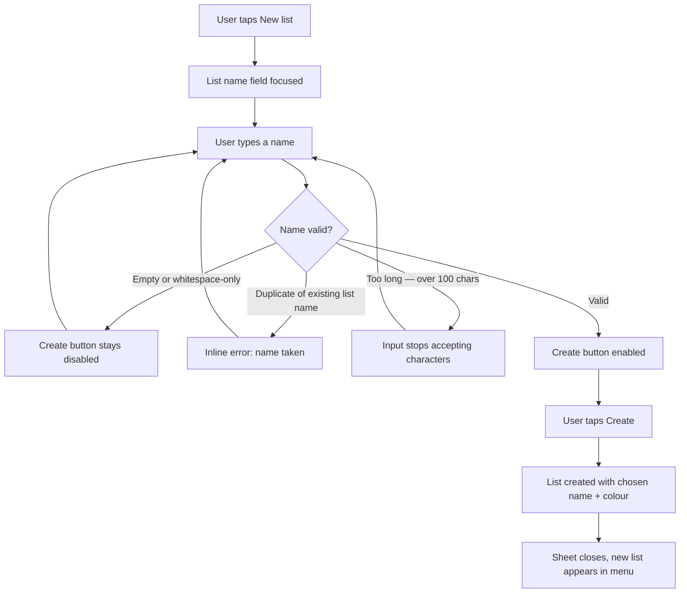
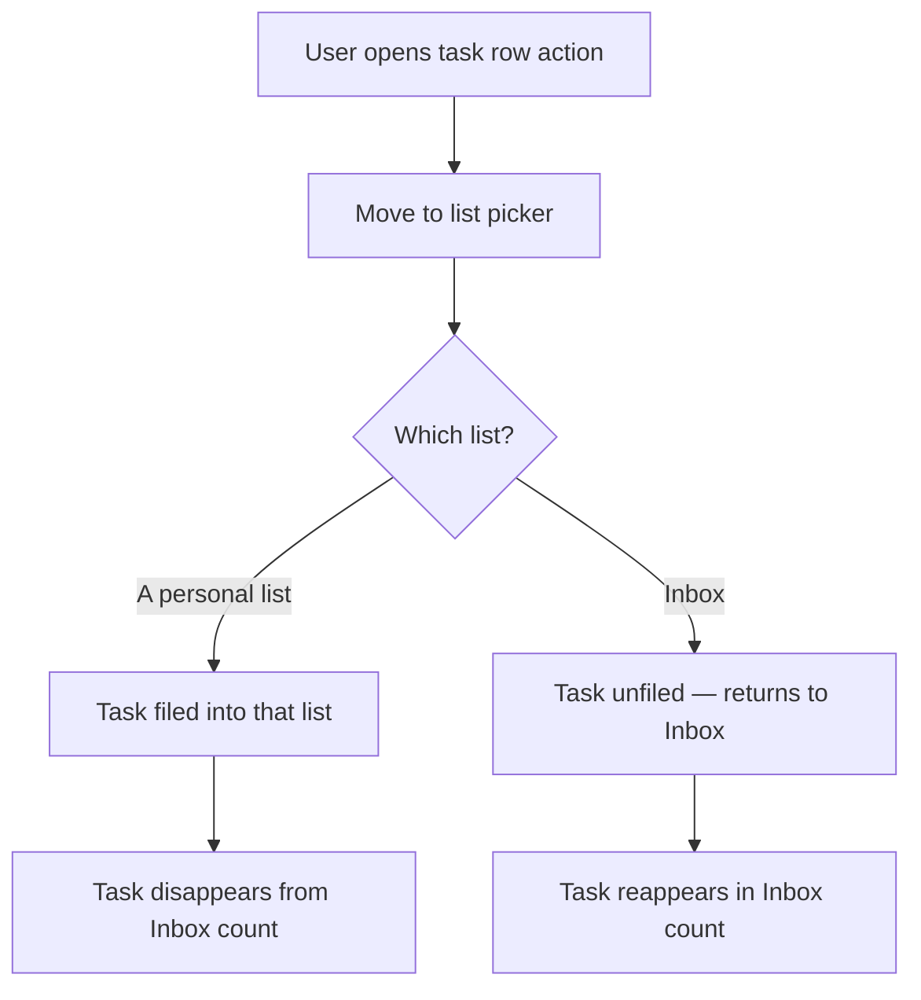
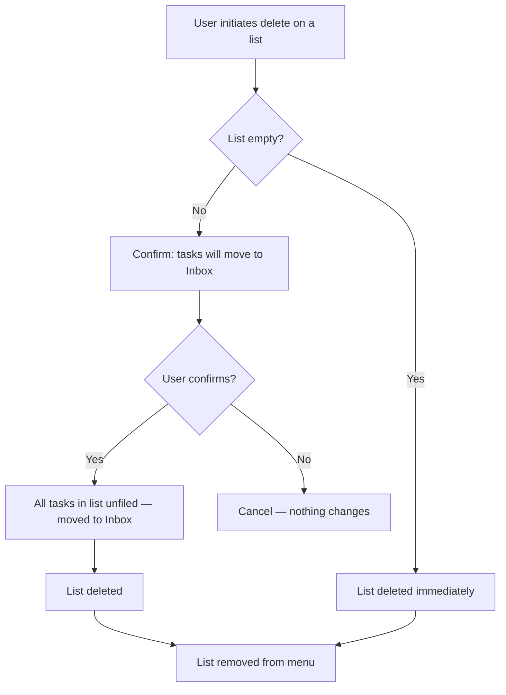
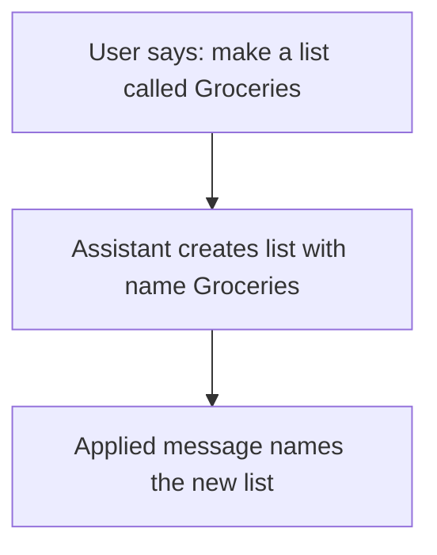
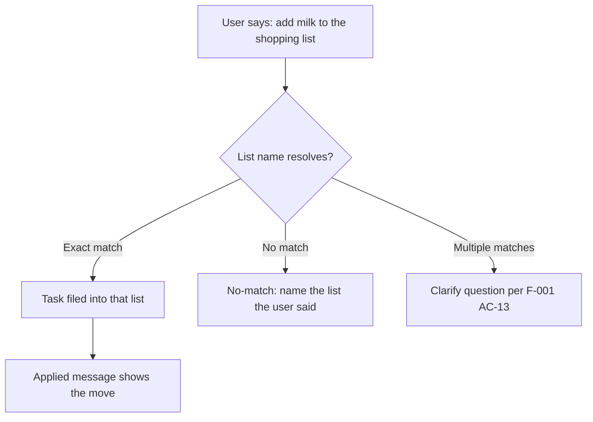

# Feature: Personal lists

**ID**: F-008
**Slug**: lists
**Status**: `draft`

## Links

- primary_module: assistant
- depends_on: [F-001, F-005, F-006]
- designed_in: []
- implemented_in: []
- api_endpoints: []
- tested_by: { api: [], web: [], mobile: [] }

## Purpose

A personal list is a named container on the filing axis (`data-model.md
§ The four collections`). It lets a user organise tasks beyond the single
Inbox that exists today. The data model already reasons about the filing axis,
the `isFiled` predicate, and `INV-INBOX-FILING`; it says `lists` does not
exist. This feature makes it exist.

## Users & Permissions

| Actor | Can do | Cannot do |
|---|---|---|
| Authenticated user | Create, rename, recolour, delete own lists; file a task into one list; unfile a task (move to Inbox) | See or affect another user's lists or filed tasks |
| Assistant (AI) | Create a list by voice; move a task to a named list by voice; move a task to Inbox by voice | Invent a list name the user did not say (route through F-001 AC-13 clarify); rename, recolour or delete a list |

## User Flow

### Create a list

### File a task

### Delete a list

### Voice: create a list

### Voice: move a task to a list

## Data

### `list` entity (new — also added to `data-model.md`)

| Field | Type | Required | Constraints | Notes |
|---|---|---|---|---|
| id | uuid | yes | server-generated | AC-1 |
| user_id | uuid | yes | FK, account scope (ADR-005); a user sees only their own lists | AC-1, AC-14 |
| name | string | yes | 1–100 chars, trimmed, whitespace-only rejected; **unique per user_id** (case-insensitive) | AC-1, AC-3, AC-24 |
| color | enum — index 0–6 into `tokens.json listColor.palette` | yes | default: 0 (Grey) | AC-2; stored as the index, rendered as the hex |
| position | integer | yes | sparse, gaps of 1024; assigned on create, rewritten on reorder | AC-10 |
| created_at | iso8601 | yes | server-set at creation | AC-1 |
| updated_at | iso8601 | yes | bumped on every write (rename, recolour, reposition) | AC-4, AC-5 |

### `task.list_id` (new field on `task`)

| Field | Type | Required | Constraints | Notes |
|---|---|---|---|---|
| list_id | uuid &#124; null | no | FK `list.id`; null = Inbox (unfiled). A deleted list's tasks have `list_id` set to null before the list row is removed | AC-6, AC-7, AC-8 |

**Existing rows.** 0 of the current rows carry a `list_id`. No migration;
`null` means Inbox, which is what every task is today. `isFiled(t)` in
`tasks.ts` already answers `listIdOf(t) !== null` and returns `false` for
every row — shipping this field makes it return `true` for filed tasks with
no code change to the predicate.

## Acceptance Criteria

### List CRUD

- [ ] **AC-1** (api) — Creating a list persists a row with the user's name (trimmed), chosen colour index (or default 0), a server-generated id, and the owning user_id (account scope, ADR-005). Timestamps created_at and updated_at are server-set. The list appears in the menu on the next read.
- [ ] **AC-2** (api) — Colour is one of seven fixed values (indices 0–6 into `tokens.json listColor.palette`). A create or recolour request outside that range is refused with `400 INVALID_INPUT`.
- [ ] **AC-3** (api, web) — A list name that is identical (case-insensitive, after trimming) to an existing list of the same user is refused. The error is surfaced inline in the create/rename form: *"A list called {name} already exists."*
- [ ] **AC-4** (api) — Renaming a list updates the name; the list retains its id, colour, position and all filed tasks. The duplicate-name rule (AC-3) applies.
- [ ] **AC-5** (api) — Recolouring a list updates only the colour index; name, position and filed tasks are unchanged.

### Delete

- [ ] **AC-6** (api) — Deleting an **empty** list (no tasks filed in it) removes the list row. No confirmation required.
- [ ] **AC-7** (api) — Deleting a **non-empty** list requires confirmation. On confirmation: every task whose `list_id` pointed to this list has `list_id` set to `null` (moved to Inbox), then the list row is removed. The tasks are not deleted, not soft-deleted, and not sent to the trash.
- [ ] **AC-8** (web) — The confirmation names the count: *"Move {n} tasks to Inbox and delete {name}?"* Two controls: confirm (destructive) and cancel. Cancel returns to the menu with no change.
- [ ] **AC-9** (api) — A deleted list is **not** sent to F-006's trash. The list entity has no soft-delete lifecycle; deletion is permanent and immediate. The tasks it held survive in Inbox.

### Filing

- [ ] **AC-10** (api, web) — A task can be filed into exactly **one** list or into no list (Inbox). Filing is a property of the task (`task.list_id`), not a membership table. The filing axis is a partition: every open, non-step task is in exactly one filing cell (Inbox or a personal list) at all times.
- [ ] **AC-11** (api) — Filing a task into a list writes `list_id` on the task row. The task leaves Inbox (if it was there) and enters the list. Its date-axis membership (Today, Upcoming, undated) is unchanged — the two axes are independent.
- [ ] **AC-12** (api) — Moving a task to Inbox sets `list_id = null`. The task leaves its list and enters Inbox.
- [ ] **AC-13** (api) — Filing and unfiling a step is refused. A step's filing is its parent's filing; changing `list_id` on a row where `parent_id` is non-null returns `400 INVALID_INPUT`.

### Collections and counts

- [ ] **AC-14** (api, web) — A personal list is a collection. It appears as a row in the Lists menu (LM-LIST family in `components.md`), with the list name, its colour dot, and its task count. Tapping it shows the tasks filed in that list on the Tasks surface.
- [ ] **AC-15** (web) — `INV-INBOX-FILING` holds: `inbox_count` equals `open_all` count minus the sum of all personal-list counts. Neither number is derived from the other; both are computed from the tasks. The equality that held while no task was filed (both equal) now diverges, and a re-merge reintroduces the bug the 2026-08-18 split fixed.
- [ ] **AC-16** (web) — The `Collection` type gains personal list ids. `inCollection` for a personal list tests `task.list_id === list.id && !done && !isStep`. The function must not be a single classification returning exactly one answer — a task is in a date cell and a filing cell simultaneously.

### Assistant integration

- [ ] **AC-17** (api) — The assistant can create a list by voice: *"make a list called Groceries"*. An applied-turn outcome names the created list. The list is created with the default colour (index 0). No voice path for choosing a colour — that is hand-only (AC-2).
- [ ] **AC-18** (api) — The assistant can move a task to a named list: *"move this to Work"*, *"add milk to the shopping list"*. List-name resolution uses exact match (case-insensitive). A name matching zero lists produces a `no_match` outcome naming what the user said. A name matching two or more lists routes through F-001 AC-13's clarify path. The task is filed per AC-11.
- [ ] **AC-19** (api) — The assistant can move a task to Inbox: *"move this to Inbox"*, *"unfile this"*. The task is unfiled per AC-12.
- [ ] **AC-20** (api) — The assistant may **not** rename, recolour or delete a list. An attempt produces a `refused` outcome (`F-005 TurnOutcome.refused`). The refusal is expressed — it can be attempted and the outcome is visible — not a silent ignore.
- [ ] **AC-21** (api) — The assistant may **not** invent a list. *"Add milk to Groceries"* when no list named Groceries exists produces `no_match`, not a create. Creating requires an explicit create verb (AC-17). This routes through the same principle as F-001 AC-13 (no silent data creation on ambiguity) and F-005 AC-36 (the assistant's permission boundary is stated, not assumed).
- [ ] **AC-22** (api) — When `F-005 AC-50`'s open-task hint resolves a pronoun to a task, moving "it" to a list files that task per AC-11. The hint is a resolution aid, not a scope filter — the same rule AC-50 states.

### Limits

- [ ] **AC-23** (api) — A user may have at most **50** personal lists. An attempt to create the 51st is refused with a visible message. The limit is high enough to be unreachable in normal use and low enough to bound the menu scan.
- [ ] **AC-24** (api) — List name max length is **100** characters. Enforced on create and rename. The input field stops accepting characters at the limit.

### Undo

- [ ] **AC-25** (api) — Filing a task by voice (AC-18, AC-19) is an ordinary applying turn. It produces an `undo_snapshot`, occupies the undo window, and is undoable per F-001 AC-5/AC-6. Undoing it restores the previous `list_id`.
- [ ] **AC-26** (api) — Creating a list by voice (AC-17) is an applying turn that creates a new entity. Undoing it removes the list row **and** unfiles all tasks whose `list_id` pointed to it (sets their `list_id` to null), regardless of how they were filed — matching AC-7's delete semantics. (OQ-1 closed: option (a), T-230.)

## API Touch Points

Endpoint names only; shapes go in `api-contracts.md`.

- `POST /lists` — create
- `GET /lists` — list all for user
- `PATCH /lists/{id}` — rename, recolour, reposition
- `DELETE /lists/{id}` — delete (with confirmation token if non-empty)
- `PATCH /tasks/{id}` — `list_id` added to the patch allowlist
- `POST /assistant/turn` — interpreter gains list-create and list-move verbs

## Impact

### 1. `data-model.md` — `lists` exists now

Line 177 said `lists` does not exist; `§ isFiled` said no `list_id` ships. Both corrected. The `isFiled` seam in `tasks.ts` activates with no code change.

### 2. `INV-INBOX-FILING` diverges

The invariant `open_all === inbox_count` diverges the moment a task is filed. It was written to survive this: both are computed independently and neither is derived from the other.

### 3. `Collection` type and `COLLECTION_GROUPS` widen

`Collection = 'inbox' | 'today' | 'upcoming' | 'done'` gains dynamic list ids. `COLLECTION_GROUPS` gains a third group below Inbox. `COLLECTIONS` stops being a compile-time constant. Every site that switches on `Collection` or iterates `COLLECTIONS` must handle the new members. `collectionCount` gains a `list_id`-filtered variant. **This is the change with the most downstream sites.**

### 4. `F-005 AC-36` — the interpreter's allowlist

AC-36's four permitted fields (`note`, `priority`, `due_at`, `reminder_at`) gain `list_id`. The interpreter's `ContextTask` projection needs `list_id` so the assistant can see where a task is filed. **This is a product decision** — see OQ-2.

### 5. `undo_snapshot` and `turn.diff` widen

`list_id` is a new nullable field on `task`. `turn.diff` gains `list_id` rows. F-005 AC-34's absent-key rule applies: pre-F-008 snapshots do not report every task as modified.

### 6. `F-006` — deleted list's tasks go to Inbox, not trash

Deleting a list unfiles its tasks (AC-7). Restoring a previously-filed task returns it to Inbox, not to the deleted list.

### 7. Unblocked design surfaces

`components.md § ListEditorSheet` (*"depends on a field that does not exist"*) and `information-architecture.md § 7` (S3 personal-lists section, S5 New list, S2 header naming a list, per-row Move to list) are all unblocked.

## Out of Scope

- Drag-to-reorder lists in the menu (position field supports it; no gesture specced)
- Shared lists (multi-user)
- List-level settings (default due date, default priority)
- Archiving a list
- Sub-lists or nested lists
- Smart lists / saved filters
- Colour icon (the owner decided: colour dot, not icon)
- Voice rename, recolour or delete a list (AC-20 — hand-only)
- ~~Moving multiple tasks to a list in one gesture (batch move)~~ — **now specced in F-009 AC-13** (bulk move to list via multi-select)
- Default list for new tasks (hand-created tasks go to Inbox; IA §7 §9 deferred)

## Open Questions

- ~~**OQ-1**~~ — **Closed (T-230): option (a).** Undoing a voice-created list unfiles its tasks back to Inbox. The alternative (dangling `list_id` read as Inbox) is a silent inconsistency; option (a) matches AC-7's delete semantics, so one rule covers both undo and delete. AC-26 amended in place.
- ~~**OQ-2**~~ — **Closed (T-230): yes.** The assistant may set `list_id`, adding it to `F-005 AC-36`'s allowlist. F-008's own permissions table already grants *move a task to a named list by voice*; answering no would leave the spec contradicting itself. A misfiled task costs one move to fix, and the per-turn undo already covers it.
- **OQ-3** — The `Collection` type is a string union today. Adding dynamic list ids means either widening the type to `string` or using a branded type. **Architecture decision — routed to architect-agent** (not a product question).
