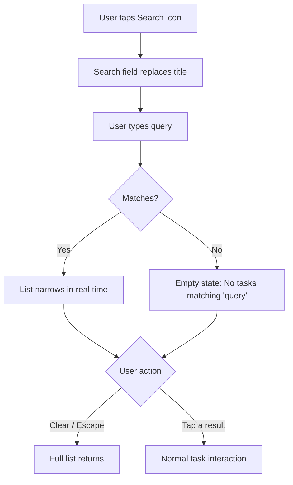
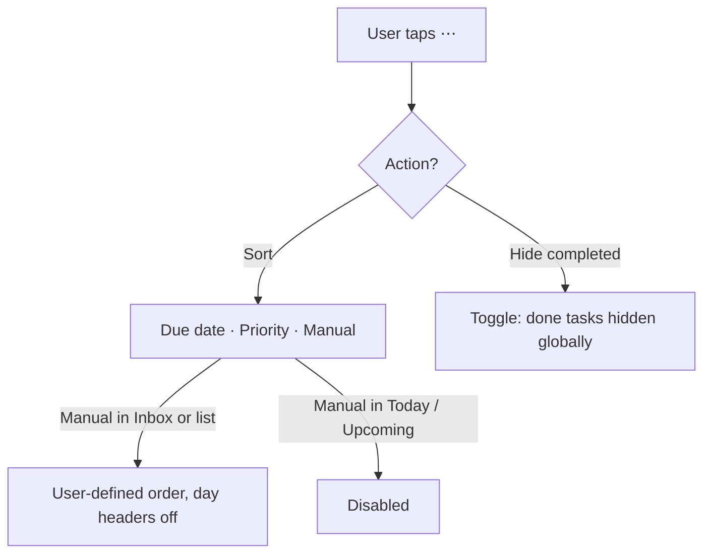
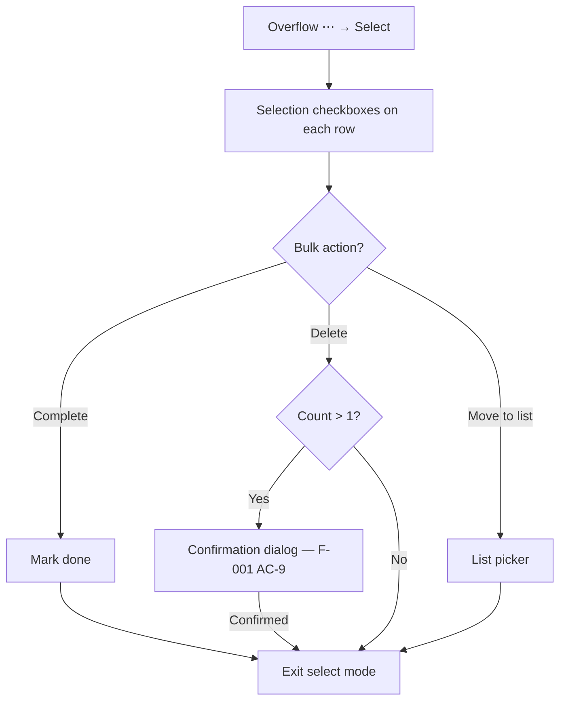

# Feature: List actions — search, sort, hide completed, select

**ID**: F-009
**Slug**: list-actions
**Status**: `draft` (**Revision 1, 2026-08-22 (T-234)**: AC-6 amended in place — screen-reader reorder is deferred by owner decision, with the deferral explicitly bounded to reorder (delete is not covered; F-001 AC-33 stands). **AC-15 is new**: Tab navigation to every task row and every row control, unconditional on sort mode. The lists-vs-tasks reorder inconsistency is recorded as accepted in `## Out of Scope`. No AC was renumbered or deleted; 14 become 15.) (**Revision 2, 2026-08-22 (T-243)**: AC-15 re-tagged `(web, mobile)` and reworded — the requirement is now sequential navigation with per-platform realisation named for web and mobile, not Tab specifically. The mobile half anchors the existing `TaskList.tsx` accessibility structure where each row control is independently reachable by VoiceOver and TalkBack. AC-15 now names its link to AC-6's screen-reader reorder deferral in one clause. No AC was renumbered or deleted; count unchanged at 15.)

## Links

- primary_module: assistant
- depends_on: [F-001, F-005, F-006, F-008]
- designed_in: []
- implemented_in: []
- api_endpoints: []
- tested_by: { api: [], web: [], mobile: [] }

## Purpose

The task-list header's Search button and overflow menu (`shell-search-button`, `shell-overflow-button` — drawn in `app-shell.html` T-227) have nothing behind them. This feature specifies the four actions they gate: search, sort, hide completed, and multi-select for bulk operations.

## Users & Permissions

| Actor | Can do | Cannot do |
|---|---|---|
| Authenticated user | Search, sort, hide/show completed, select and bulk-operate on own tasks | Affect another user's tasks or preferences |
| Assistant (AI) | Nothing — these are hand-only list controls | Search, sort, change hide-completed, or multi-select |

## User Flow

### Search

### Overflow menu (sort, hide completed, select)

### Select tasks

## Data

### `task.sort_order` (new field)

| Field | Type | Required | Constraints | Notes |
|---|---|---|---|---|
| sort_order | integer | yes | sparse, gaps of 1024; assigned on create; rewritten on drag reorder within a filing cell | AC-5, AC-6 |

**Existing rows.** 839 rows. Migration: assign from `created_at` order within each filing cell. Inert until manual sort is selected.

### Preferences (new — embedded in user/account row)

| Field | Type | Required | Constraints | Notes |
|---|---|---|---|---|
| hide_completed | boolean | yes | default: `false` | AC-7; global — all collections except Done |
| sort_preferences | `Record<CollectionId, SortOrder>` | no | default: `{}`; absent key = `'due_date'`; `SortOrder = 'due_date' | 'priority' | 'manual'`; `'manual'` valid only for filing-axis collections | AC-4 |

## Acceptance Criteria

### Search

- [ ] **AC-1** (web, mobile) — Tapping Search reveals an inline text field, hides the surface title, and gives it focus. The close control or Escape closes search and restores the full list.
- [ ] **AC-2** (web, mobile) — Search is **live filtering by title only**: each keystroke narrows the current collection to tasks whose title contains the query (case-insensitive substring). Notes, steps and other fields are not searched. Completed tasks follow the hide-completed preference (AC-7). Deleted tasks (F-006) are never included.
- [ ] **AC-3** (web, mobile) — Zero matches shows an empty state naming the query: *"No tasks matching '{query}'."*

### Sort

- [ ] **AC-4** (api, web, mobile) — The overflow menu offers three sort options: **Due date** (default), **Priority**, **Manual**. The active option is indicated. The choice persists per collection in `sort_preferences`.
- [ ] **AC-5** (api, web, mobile) — **Manual sort** is available only in filing-axis collections (Inbox, personal lists). In Today, Upcoming and Done, Manual is disabled or absent. When active, tasks appear in `sort_order` order; day headers are suppressed in Inbox. `sort_order` uses the same sparse-integer scheme as `list.position` (F-008): gaps of 1024, assigned on create.
- [ ] **AC-6** (web, mobile) — **Drag-to-reorder** is available only when manual sort is active. Web: drag handle on each row, click-and-drag. Mobile: long-press then drag. Writes the moved task's `sort_order`; sparse gaps avoid cascading writes to other rows. **No Move up / Move down alternative is provided.** Pointer drag is the only reorder mechanism. **Screen-reader reorder is deferred** (owner decision 2026-08-22, T-234): VoiceOver and TalkBack cannot perform a custom drag, and reorder is cosmetic — it changes display order within a filing cell, not task data or membership — so a screen-reader user cannot reorder tasks, and that is accepted for this control. **This deferral covers reorder and nothing else.** Delete is also gesture-hidden (swipe-left on mobile, hover/focus-within on web), and F-001 AC-33 requires a no-gesture path for it — VoiceOver rotor custom action and TalkBack custom action menu — because delete destroys data. The reasoning that justifies deferring screen-reader reorder does not extend to delete; the two are treated differently because one is lossy and the other is not.
- [ ] **AC-6a** (api) — **Priority sort** orders high → medium → low → none. Within each group, by due date (earliest first, undated last).

### Hide completed

- [ ] **AC-7** (api, web, mobile) — The overflow menu contains a **Hide completed** toggle. When active, `status === 'done'` tasks are excluded from every collection **except** Done. Persists in `hide_completed`.
- [ ] **AC-8** (web, mobile) — Toggle takes effect immediately, no reload. Label: *"Hide completed"* when off, *"Show completed"* when on.

### Select tasks

- [ ] **AC-9** (web, mobile) — **Select** in the overflow menu enters multi-select mode: selection checkboxes appear on each row, a toolbar at the bottom shows bulk actions, a selected-count is displayed. Exit: **Done** button or deselect all.
- [ ] **AC-10** (web, mobile) — Tapping a row toggles its selection. At least one selected task is required for bulk actions to be enabled.
- [ ] **AC-11** (web, mobile) — **Bulk complete**: marks all selected tasks as done.
- [ ] **AC-12** (api, web) — **Bulk delete** of more than one task requires confirmation, extending F-001 AC-9's principle to the hand path. The confirmation is a **dialog** (not a conversation message) naming the count and task titles; the server refuses an unconfirmed bulk delete. A single selection deletes immediately with undo per F-005 AC-42. Deleted tasks enter F-006's trash.
- [ ] **AC-13** (web, mobile) — **Bulk move to list**: list picker shows all personal lists plus Inbox. Selecting a destination files all selected tasks per F-008 AC-11/AC-12. Steps cannot be selected — a step's filing follows its parent (F-008 AC-13).

### Keyboard and accessibility

- [ ] **AC-14** (web) — Search field reachable by keyboard shortcut (`/` or platform find shortcut). Overflow menu is keyboard-navigable. Multi-select supports Space to toggle, Enter to confirm.
- [ ] **AC-15** (web, mobile) — **Every task row and every control on a row is reachable by sequential navigation, with a visible or announced focus indicator.** This is unconditional — it applies regardless of sort mode, selection mode, or any other list-action state. **This is the reachability guarantee that AC-6's screen-reader reorder deferral depends on:** a screen-reader user cannot reorder tasks, and that is accepted only while every row and every control on it remains independently reachable by other means. This is a general navigation requirement for the task list surface, not a reorder affordance — it does not enable reorder by keyboard or assistive technology and is not conditional on manual sort. Per platform: **(web)** Tab order follows DOM order, which matches visual order; the focus ring follows `tokens.json focusRing` (2px inset, `accent`). **(mobile)** VoiceOver (iOS) and TalkBack (Android) sequential swipe navigation reaches each row and each control — checkbox, title, delete — as its own accessibility element; the row container does not collapse its children into a single focusable unit. Hardware-keyboard focus (iOS Full Keyboard Access, Android with an attached keyboard) follows the same element order.

## API Touch Points

- `PATCH /users/{id}/preferences` — `hide_completed`, `sort_preferences`
- `PATCH /tasks/{id}` — `sort_order` on patch allowlist
- `POST /tasks` — `sort_order` assigned on create
- `PATCH /tasks/bulk` — bulk complete, bulk delete (confirmation token per F-001 AC-9)

## Impact

### 1. `data-model.md` — `task` gains `sort_order`
839 rows need migration values from `created_at` order per filing cell. Inert until manual sort is selected.

### 2. F-005 §1's closed field lists
`TASK_PATCH_FIELDS` and `TASK_CREATE_FIELDS` gain `sort_order`. **`DIFF_FIELDS` must not** — reorder is not assistant-visible. `ContextTask` does not need it.

### 3. F-001 AC-9 — bulk delete extended to hand path
Confirmation rule now applies to hand-initiated multi-deletes from select mode. The API's confirmation-token mechanism serves both paths; the hand path uses a dialog, not a conversation message.

### 4. `groupTasks` respects sort mode
Manual sort in Inbox returns a single group by `sort_order` instead of day-bucketed groups. Personal lists already return ungrouped.

### 5. Preferences — new concern
No preferences entity exists. Theme is client-side only. These are the first persisted user preferences — storage routed to architect-agent (OQ-1).

## Out of Scope

- **Filter** (e.g. "show only overdue work tasks"). The sidebar collections — Today, Upcoming, Inbox, each personal list — already serve the common filtering. A filter engine adds a query language, saved filters and a composition UI; none of that is needed at this scale. **Deliberate and reasoned**, not deferred.
- Search notes or step titles (title-only for MVP); search across all collections (scoped to active)
- Saved searches; bulk edit fields (priority, due date); sort by alphabetical or creation date
- Voice commands for any of these four actions (hand-only controls)
- Drag-to-reorder lists in the menu (remains F-008 out-of-scope)
- **Lists reorder by menu item (F-008 `PATCH /lists/{id}`), tasks reorder by drag (AC-6).** This inconsistency is noticed and accepted (owner decision 2026-08-22, T-234). Lists have a small cardinality (single digits) and a position field already writable via the API; tasks within a filing cell can number in the hundreds and drag is the conventional gesture. Harmonising the two — either adding drag to lists or adding a menu reorder to tasks — is not planned and would require its own spec.

## Open Questions

- **OQ-1** — Preferences storage (columns on `account`, separate JSON, new entity). Architecture decision — routed to architect-agent.
