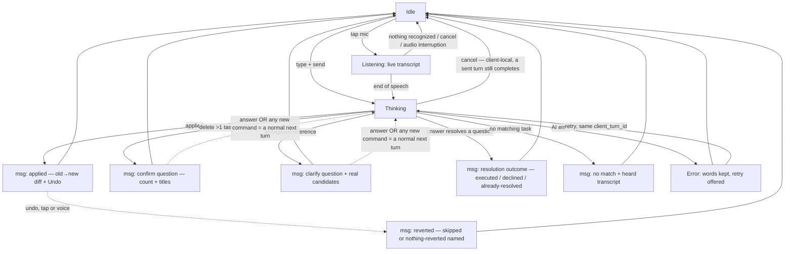

# Feature: Voice-first Assistant View

**ID**: F-001
**Slug**: voice-assistant-view
**Status**: `draft` (revision 3 — final Gate 1 revision, `reports/gate1-review-F-001.md ## Round 2 results`; round cap reached)
**Last Updated**: 2026-08-16

---

## Links

```yaml
primary_module:    assistant
secondary_modules: []
depends_on:        []
implemented_in:    [src/assistant/api/, src/assistant/web/, package.json]
designed_in:       [design/_shared/DESIGN.md, design/_shared/tokens.json, design/_shared/components.md, design/assistant/screens/voice-assistant-view.html, design/assistant/screens/voice-assistant-view-ios.html, design/assistant/screens/voice-assistant-view-android.html]
api_endpoints:     ["POST /assistant/turn", "GET /assistant/session", "POST /assistant/session/close", "POST /assistant/turn/{turn_id}/undo", "GET /tasks", "POST /tasks", "PATCH /tasks/{id}", "DELETE /tasks/{id}"]
tested_by:
  api:    [qa/assistant/F-001/api/, qa/assistant/automation/api/F-001-voice-assistant-view.spec.ts, qa/assistant/runs/2026-08-16-api-execute.md]
  web:    [qa/assistant/F-001/web/, qa/assistant/automation/e2e/F-001-voice-assistant-view.spec.ts, qa/assistant/runs/2026-08-16-web-execute.md]
  mobile: []
known_bugs: []   # BUG-001 fixed 2026-08-17 (T-023/T-026); the record stays in qa/_shared/bugs/
```

---

## Purpose

The main view of the redesigned todo-ai: the user speaks to an AI assistant to create, edit, and delete todos. Voice is the primary input; the **todo list on screen is the source of truth** the user verifies with their eyes. The assistant interprets server-side, applies changes visibly, and every applied change is attributable, reviewable, and reversible. Voice is never the only path — every action has a tap/type equivalent (WCAG 2.1 AA), and the core list works untouched when AI is off, erroring, or offline (existing ADR-7).

## Users & Permissions

| Role | Can do | Cannot do |
|------|--------|-----------|
| Authenticated user | Speak/type to create, edit, complete, delete todos; answer or ignore assistant questions; undo applied turns by tap or voice; manage the list by touch alone | See or affect another user's tasks or transcripts |
| Assistant (AI) | Propose and apply changes to the speaking user's tasks; ask clarifying/confirmation questions as conversation messages | Apply a multi-task delete without an affirmative answer (server-refused, AC-9); mutate data in a turn that asks a question (asking turns apply nothing, AC-1); invent tasks for no-match input (AC-14) |

## Conversation model

One state count, replacing rev 1's three disagreeing lists (Gate 1 C6). The surface has exactly **four states**: **idle · listening · thinking · error**. Everything else is a **message** in the conversation, never a state: applied (diff + Undo) · reverted (skipped tasks named; all-skipped → nothing-reverted, AC-7) · undo-refused (AC-6) · clarify question · confirm question · resolution outcome (executed / declined / declined-superseded / already-resolved, AC-10, AC-11) · no-match (quoting the heard transcript) · session-closed boundary marker (carrying the closed session's terminal outcomes, AC-28) · queued-turn notice. A pending question **blocks nothing** — no modal, no lock, no timeout (owner decision D2). The mic control has three modes orthogonal to the states: available · dimmed (permission denied **or** transient recognition failure, AC-21, AC-22 — the message states which) · hidden (no capability). Design derives its screens from this list and no other.

**Naming convention (read before any AC below).** The state names, message kinds and affordance names used throughout this spec — idle, listening, applied, reverted, no-match, Undo, retry, send — are **concept names in this spec's own prose**, written in English because English is this spec's writing language. They are **not shipped strings**. The user-visible wording of every label, message and accessible name — and the language it is written in — is the design system's to specify (`design/_shared/components.md`); no AC in this spec mandates a literal English string in the product. Where an AC quotes an utterance the user *says* (AC-5's "hoàn tác" / "undo"), that is recognizer input vocabulary, not UI copy, and the distinction is deliberate.

## User Flow



These edges are the complete transition list (AC-29). Cancel is client-local (AC-3): a turn already sent still completes server-side and its late outcome renders as the matching message above. Mic modes and the offline handover are not conversation states — see Conversation model and Lifecycle.

### Lifecycle

- Background/kill while **listening**: recognized-so-far text persists in the client pending store; reopening shows it in the composer (AC-26).
- **Audio interruption while listening** (incoming call, system assistant, audio-focus loss): behaves exactly as cancel-while-listening — capture stops, recognized-so-far text is preserved in the composer, no turn is sent (AC-3, AC-26).
- Background/kill while **thinking**: the turn — already sent under its client id — resolves server-side; the outgoing turn survives the kill in the local store until the server acks it (AC-27); reopening within the open session shows its outcome message.
- Background with a **question unanswered**: nothing changes; questions are messages and survive as messages, no timeout. Session close while unanswered = declined, visible on next open (AC-28). This replaces rev 1's AC-5×AC-13 contradiction.
- **Session close**: idle auto-close leaves a visible marker; an open session resumes visibly; a stale/closed session starts clean (AC-28).
- **Offline**: no half-running conversation — the surface says so and hands over to the list (ADR-7). A turn already in flight when the connection drops queues and replays visibly (UC-13 AC-13.2); input made while offline goes through the local no-AI path (AC-25).

## Acceptance Criteria

### Interpretation & visibility
- [ ] **AC-1** (api, web) — A spoken/typed sentence is interpreted server-side; an **applying** turn's changes land atomically (all-or-nothing) and appear in the on-screen todo list within the same turn — the list, not the chat reply, is where the result lives. Carve-out (resolves rev 1 AC-1×AC-5): a turn that produces a **question** (clarification, bulk-delete confirmation) applies nothing; its visible same-turn result is the question message itself.
- [ ] **AC-2** (web) — While listening, a live transcript renders as words are recognized. Listening that ends with nothing recognized returns to idle visibly and sends no turn.
- [ ] **AC-3** (web) — Cancel is **client-local**: there is no cancel endpoint, and a turn that has been sent always runs to completion server-side. While listening, cancel keeps the text in the composer and sends nothing; while thinking, cancel returns the surface to idle with words kept, and the sent turn's late outcome still renders as a message per its kind — applied → applied + Undo (never pretending the cancel won); question → the question message renders and D2's resolution rules apply; failed → error message. A cancelled turn that never reached the server renders nothing. A mobile audio interruption while listening (call, system assistant, audio-focus loss) triggers cancel-while-listening semantics with the text preserved.
- [ ] **AC-4** (web) — Every AI-applied change is attributable in place: changed rows (`turn.changed_task_ids`) are marked; an **edit** shows old → new per field (`turn.diff`); a **create** is marked new with no fabricated old value; a **delete** is named by title in the turn's outcome message, since no row remains. Only the turn's own changes are marked — rows changed by hand or by other turns are never attributed to this turn. Rows and messages show the user's words and real task titles — internal agent refs (raw task uuids and draft-ref tokens of the `#d1` style) never render (UC-52 AC-52.10); the fixture table carries a row asserting this (Test strategy).

### Undo contract
- [ ] **AC-5** (api, web) — The newest applied turn (in AC-8's sense: a turn that applied changes) has a one-gesture undo, reachable by tap **and by voice**: saying "hoàn tác" / "undo" undoes the turn and never becomes a task with that name (UC-52 AC-52.18; mechanism = Open Question 6). Undo covers the whole turn: a 4-task turn reverts all 4.
- [ ] **AC-6** (api) — Revert shapes, via `POST /assistant/turn/{turn_id}/undo` from the `turn.undo_snapshot` captured at apply time: edit → prior field values restored; create → created tasks removed and staying removed on a fresh task-list read; delete → tasks restored with all fields intact. The observable for "survives sync" is a read-back: a subsequent task-list `GET` returns the reverted values. The undone turn stays visible, marked undone (`turn.status`). Server enforcement: the window check and the revert run in **one transaction**; undo of a turn that is not the newest applied turn, or whose session is closed, is refused with a visible outcome message stating why; undo of an already-undone turn is idempotent — the same success outcome, no second revert.
- [ ] **AC-7** (api, web) — Undo never clobbers later work: a task modified after the turn (by hand or by a later turn) is skipped, and the reverted-outcome message names every skipped task. Zero silent overwrites. Modified-since detection is **snapshot comparison** — a task counts as modified iff its current state differs from the task's **post-apply state**: the state immediately after this turn applied, before any later turn touched it. (Comparing against the pre-apply snapshot would flag the turn's own change as a modification and undo could never revert anything.) AC-12 uses the same rule against the state captured when its question was asked. If every task is skipped, the outcome message says nothing was reverted — it never renders as a successful revert.
- [ ] **AC-8** (web, api) — Undo is one level and session-bounded: available while its turn is the newest applied turn of the open session; a newer applied turn or session close ends it and the affordance visibly disappears. No hidden timer. "A newer applied turn" means a newer turn that applied changes (`changed_task_ids` non-empty); a turn that mutated nothing neither holds nor ends the undo window. An undo attempted outside the window — by voice or by a stale affordance — yields AC-6's visible refusal outcome: never silence, never a task named "undo".

### Bulk-delete confirmation (owner decision D2)
- [ ] **AC-9** (api, web) — A delete touching more than one task executes only after confirmation. The question is a conversation **message** naming the count and the task titles; the server refuses to apply an unconfirmed bulk delete. A single-task delete applies immediately with undo.
- [ ] **AC-10** (api, web) — Resolution, with no timeout anywhere: only a **clearly affirmative** answer executes; a negative answer declines; **any unrelated new command supersedes the question — the delete is declined and the new command proceeds normally**; session close with the question unanswered declines. An **unclassifiable** utterance — not affirmative, not negative, not an interpretable command — executes nothing and the question stays pending, still resolvable by exactly D2's events (answer, supersede, session close). The answer travels as a normal turn — spoken, typed, or a tap sending the option's literal text (UC-54 AC-54.7, UC-08 AC-08.3); there is no separate confirm protocol. One-shot resolution and ordering: the server processes a session's turns **serially in receipt order**; a question resolves exactly once; a spoken or typed answer binds to the newest unresolved question, while a tap carries an explicit binding to its question's turn; an answer arriving after its question is already resolved applies nothing — it **never** executes the questioned delete — and yields a visible already-resolved outcome.
- [ ] **AC-11** (web) — Every resolution path produces a visible outcome message (executed / declined / declined-because-superseded / already-resolved); nothing resolves silently (resolves rev 1 AC-5×AC-7), and the pending question blocks nothing — list, manual edits and other commands all work while `turn.question` is unanswered. An **executed** outcome has the full applied-message anatomy: changed rows marked, actual count and titles named, diff where applicable, and Undo (AC-4, AC-5 apply to it unchanged).
- [ ] **AC-12** (api) — On an affirmative, the server re-validates the named tasks before deleting; tasks deleted or changed since the question was asked — detected by AC-7's snapshot-comparison rule, against the state captured at ask time — are dropped, and the outcome states the actual count and names.

### Clarification
- [ ] **AC-13** (api, web) — A reference matching ≥ 2 tasks gets a clarify-question message presenting the actual candidates; no data changes until answered; answering works by tap (the option's literal text), voice, or typing, as a normal turn under AC-10's one-shot binding rules; an unrelated command supersedes the question visibly and proceeds (same D2 rule). UC-08's edge table applies as written.

### Honesty on no-match
- [ ] **AC-14** (api, web) — A command matching no task applies zero task mutations and answers with a message **quoting the heard transcript** — a misheard word is distinguishable from an absent task. Bounded check: task table unchanged, no unrelated task edited, no task created.
- [ ] **AC-15** (api) — Questions **about** the list ("what's on Sunday?") need the UC-54 `find_tasks` engine and are out of this feature's scope: the assistant answers that it cannot do that yet **and names the working alternative — looking at the on-screen list and its existing filters** — zero mutations, no fabricated answer.

### Idempotency
- [ ] **AC-16** (api) — Every turn carries a client-generated `turn.client_turn_id`; retry re-sends the same id and the server treats it as the same turn — a retry whose original actually succeeded applies nothing twice (UC-25 AC-25.3). Dedupe is **per-status**: a replay of a turn whose status is applied, asked, or undone re-serves the recorded outcome without re-executing; a replay of a **failed** turn re-attempts it (failed → pending under the same id). Dedupe scope is **account-level**, with retention at least as long as the offline replay window (AC-25); a replay arriving after session close targets the new session and the id is still recognized.

### Manual path & accessibility
- [ ] **AC-17** (web) — Typed composer input goes through the same interpretation path as speech.
- [ ] **AC-18** (web) — All list operations (create, edit, complete, delete) are doable by direct touch without the assistant, with **zero AI calls** — asserted via the harness AI-call counter.
- [ ] **AC-19** (web) — The new conversation UI meets these WCAG 2.1 AA criteria by name: **2.1.1** (mic, undo, candidate and confirm controls keyboard-operable), **4.1.2** (those controls expose name/role/value), **1.4.3** (contrast on transcript, diff and outcome messages), **2.5.3** (visible labels match accessible names), **4.1.3** (status messages) — **every message the conversation adds** (applied, reverted / nothing-reverted, undo-refused, clarify question, confirm question, resolution outcome, no-match, session-closed boundary marker, queued-turn notice — the full list in Conversation model) is announced to assistive technology through a live region on the conversation surface itself, without moving focus; an error message is announced immediately rather than queued behind earlier output. Announcing the state word alone (idle / listening / thinking / error) does **not** satisfy this: a screen-reader user must receive the same information a sighted user gets from reading the new message — what changed, how many, which tasks by title, and that undo is available. Verified against a real screen reader, not inferred from markup (W3C F103).

### Speech capture (STT locus — Gate 1 C2)
- [ ] **AC-20** (api, web) — Speech-to-text runs on the client (device/browser capability); the server receives recognized **text** only — no audio in the turn payload. A device or browser without the capability hides the mic without error, detected by capability, never by platform name (UC-23 AC-23.3).
- [ ] **AC-21** (web) — Permission is requested before the first talk attempt, with a short explanation — not at app open (UC-23 AC-23.1) — and the request covers **every** permission the platform requires for capture + recognition: dual on iOS (microphone + speech recognition), single on Android and web. Denial of **any** required permission: the mic stays visible but dimmed; activating it leads the user to (or tells them) where to re-grant; typing fully works.
- [ ] **AC-22** (web) — A transient recognition failure (language pack unavailable, service busy) shows a visible message; while the capability is down the mic renders in the **dimmed** mode (its message states the transient cause, distinguishing it from permission-denied) and returns to available when recognition recovers; typing is unaffected throughout.

> Known platform asymmetry (Gate 1 C2): common browser speech APIs route audio through the browser vendor's servers, so web may lose voice **input** when offline while mobile recognizes on-device — AC-25's local no-AI path is the floor either way, and the vendor routing belongs in the privacy policy, not in this app's payload (AC-20 keeps our server audio-free).

### Failure paths
- [ ] **AC-23** (api) — `turn.transcript_raw` is persisted before interpretation is attempted; a failed or blocked turn never loses the user's words (the failed turn is recorded in `session.messages` too), and retry does not require re-speaking (UC-25 AC-25.1).
- [ ] **AC-24** (api, web) — When AI errors, the conversation surface says so and offers retry; the full todo list remains usable by hand (create, edit, complete, delete).
- [ ] **AC-25** (web) — Offline there is **no half-running conversation**: the surface states it and hands over to the list (ADR-7); input still creates tasks through the local no-AI path; a turn already in flight when the connection dropped queues and replays visibly (UC-13 AC-13.2).

### Lifecycle & states
- [ ] **AC-26** — **[RESERVED — moves wholesale to the mobile follow-up feature; not part of F-001's api/web scope, see Out of Scope]** Backgrounding or kill while listening loses no words: recognized-so-far text persists in the `client.pending_input` store and reopens into the composer.
- [ ] **AC-27** — **[RESERVED — moves wholesale to the mobile follow-up feature; not part of F-001's api/web scope, see Out of Scope]** Backgrounding or kill while thinking: the turn resolves server-side under its `turn.client_turn_id`; the outgoing turn stays in the kill-surviving `client.outgoing_turn` store until the server acknowledges its id, so a kill never loses a sent-but-unacked turn; reopening within the open session shows its outcome message; unanswered questions and the undo affordance reappear per their own rules (AC-8, AC-10).
- [ ] **AC-28** (api, web) — Session lifecycle is visible: idle auto-close leaves a marker message, `session.status` becomes closed with the close reason recorded; reopening an open session resumes it visibly; a stale/closed session starts clean rather than pointing at yesterday's tasks; close with a question unanswered = declined, outcome visible on next open. A clean start renders exactly **one** boundary message carrying the closed session's terminal outcomes: the close marker, every question declined by name, and any turn that resolved between last foreground and close (applied or failed, tasks named). `GET /assistant/session` returns these boundary outcomes to the client.
- [ ] **AC-29** (web) — The surface is always in exactly one of the four states (idle / listening / thinking / error); questions and outcomes are messages, never blocking states. Bounded transition rule: the only state transitions are the edges of the User Flow flowchart, and each one has a visible cue — there is no transition outside that list.

## Data

| Field | Type | Required | Validation | Notes |
|-------|------|----------|------------|-------|
| session.id | uuid | yes | — | one open conversation per user; account-vs-device scope is Open Question 4 |
| session.status | enum(open, closed) | yes | closed sessions accept no turns | close reason recorded (AC-28) |
| session.messages | turn[] | yes | server is source of truth | failed turns recorded too (AC-23) |
| turn.client_turn_id | uuid | yes | client-generated, unique per turn | dedupe key (AC-16, AC-27) |
| turn.status | enum(pending, applied, asked, failed, undone) | yes | transitions exactly: pending → applied \| asked \| failed; applied → undone; failed → pending (same-id retry) | drives AC-6, AC-16, AC-27; dedupe is per-status (AC-16) |
| turn.transcript_raw | text | yes | persisted before AI call | AC-23 |
| turn.changed_task_ids | uuid[] | yes | may be empty | drives AC-4 marking + AC-5 undo scope |
| turn.diff | {task_id, field, old\|null, new\|null}[] | yes | old=null for create, new=null for delete | drives AC-4; task_id attributes each pair in a multi-task turn |
| turn.undo_snapshot | task[] | applying turns only | captured immediately **before** apply, inside the apply transaction; create → records the created task ids (nothing pre-existing to snapshot) | drives AC-6 revert shapes + AC-12's ask-time snapshot comparison; AC-7's modified-since check uses post-apply state instead, not this snapshot |
| turn.question | object \| null | no | {kind: bulk_delete\|clarify, task_ids, options, resolution} | a message, never app state — AC-9..13; no timeout (D2) |
| client.pending_input | text | local only | survives process kill (mobile) and tab close/reload (web: durable browser storage) | AC-26; text only, never audio |
| client.outgoing_turn | turn | local only | held until the server acks its client_turn_id; survives kill (mobile) and reload (web) | AC-27; drives queued replay (AC-25) |
| task.* | existing | — | unchanged from current todo-ai model | see Out of Scope |

## API Touch Points

- `POST /assistant/turn` — one conversation turn (interpret + apply atomically). **A new contract, not an extension of `chat-intent`** (Gate 1 C12): it adds server-side task writes and crosses ADR-9's no-real-ids / draft-ref boundary — the superseding ADR must be recorded before implementation (Open Question 5). Confirmation and clarification **answers are normal turns on this endpoint**; a tap sends the option's literal text (UC-54 AC-54.7) — no hidden protocol. The server processes a session's turns serially in receipt order (AC-10).
- `GET /assistant/session` — read open-session history (resume, AC-28) **and**, on a clean start, the closed session's boundary outcomes: close marker, questions declined by name, turns resolved between last foreground and close (AC-28).
- `POST /assistant/session/close` — close session, record reason
- `POST /assistant/turn/{turn_id}/undo` — revert an applied turn (AC-5..8); refusal and idempotency rules in AC-6.
- Removed from rev 1: `POST /assistant/turn/confirm` — replaced by the normal-turn answer rule above.
- Deliberately absent: a cancel endpoint. Cancel is client-local (AC-3); a sent turn always runs to completion.

## Ops

- **Observability** — turn outcome counter by `turn.outcome.kind`; undo refusal counter by `detail.reason`. Prototype: in-process counters, no exporter (ADR-001).
- **Rollback criteria** — N/A this phase: prototype server, no deployment target and no live users to roll back for.
- **Feature flag** — N/A: F-001 is the app's main view, not an increment behind a flag.

## Test strategy (api)

- The stub replaces **model interpretation only** — and that includes answer classification: whether an utterance is affirmative, negative, or unclassifiable comes from fixture rows, while turn orchestration, confirmation gating and resolution, persistence, dedupe and undo run real — otherwise a green suite tests the stub.
- One canonical utterance → intent fixture table, kept with the api test cases (MANIFEST `test_cases_api`), shared by QA and implementers. It carries ambiguous-answer rows asserting **zero deletion** (AC-10) and an internal-ref row asserting no uuid/draft-ref token ever renders (AC-4).
- Failure injection: model error, timeout-then-late-success (AC-16), unconfirmed bulk delete refused (AC-9), undo racing a later mutation (AC-7), **cancel racing apply** (AC-3 — late outcome renders applied + Undo), and mid-apply failure proving atomicity leaves zero partial writes (AC-1).
- An AI-call counter in the harness proves the zero-AI-call assertions (AC-18, AC-25).
- The session idle-close timer is injectable in the harness, so AC-28's close paths run in test time (Open Question 2 owns the production number and the timer's owner).
- Web **and mobile** get a speech test seam — an injectable transcript source plus capability and failure injection (no capability, permission denied, transient recognition failure) — so listening-state and mic-mode tests need no real audio (AC-2, AC-20–22).

## Coverage of existing UCs (re-derived against 02-use-cases.md + 11-uc-conversation.md)

- **UC-52** — **partial.** Covered: UC-52 AC-52.1 (talking surface is the main view — Purpose), UC-52 AC-52.3 persistence half (AC-23), UC-52 AC-52.7 (AC-24, AC-25), UC-52 AC-52.10 (AC-4), UC-52 AC-52.18 (voice undo, AC-5); partial: UC-52 AC-52.4 (AC-28 gives the boundary marker, not the review timeline). Not covered here: UC-52 AC-52.2/52.5/52.6 (history review + turn→task navigation — need the history-read endpoint, follow-up feature), UC-52 AC-52.8, UC-52 AC-52.9 (drawer assumption = Open Question 1), UC-52 AC-52.11, UC-52 AC-52.12, UC-52 AC-52.13–17 (transcript search), and every speech-output clause → F-002.
- **UC-01–04** — **partial.** Capture path, live transcript, pre-AI persistence carried (AC-1, AC-2, AC-23); interpretation-quality ACs (UC-01 AC-01.1 latency, UC-02 datetime, UC-03 splitting, UC-04 decomposition) belong to the existing engine and are not re-verified here.
- **UC-05, UC-06** — **partial.** Per-field old→new diff (AC-4); anaphora quality (UC-05 AC-05.1) inherited, not restated.
- **UC-07** — covered (AC-5..8). **UC-08** — covered (AC-13).
- **UC-09** — **partial.** Manual inline fix remains (AC-18); UC-09 AC-09.2 (next AI turn sees hand edits) is not restated — the freshness guarantee must ride the turn contract = Open Question 7.
- **UC-11, UC-13** — covered (AC-25–29): visible close, resume, pending store, queued replay.
- **UC-23** — covered (AC-20–22).
- **UC-24** — **partial.** No-junk honesty + transcript echo (AC-14); the offer-to-record path (UC-24 AC-24.3/24.4) is not specced here — follow-up.
- **UC-25** — **partial.** UC-25 AC-25.1 → AC-23; UC-25 AC-25.3 → AC-16; UC-25 AC-25.2 (error telemetry, three-failures suggestion) not restated.
- **UC-54** — **partial.** Only the confirmation rule ships (AC-9–12, from UC-54 AC-54.6/54.7); the `find_tasks` engine is out of scope (AC-15).
- **UC-31–48 (CORE)** — unchanged; they are the fallback AC-18/AC-24/AC-25 stand on. **UC-53** — not covered, separate feature.

## Out of Scope (this iteration)

- **Speech output / talk-back (UC-20).** F-001 ships without voice output. **This sequences against ADR-11**, which pulled talk-back into the MVP as the product's differentiator; the product owner accepted that on 2026-08-16 (Gate 1 D1) with a binding commitment: **F-002 (talk-back, UC-20) is the immediately-next feature after F-001 — not backlog.** Until F-002, every assistant reply is text-only; UC-20 AC-20.2's "text always exists" makes that a safe intermediate state.
- **Whole-list voice commands and list questions (UC-54 `find_tasks`)** — only the confirmation rule ships; a list question gets an honest not-yet answer that names the working alternative, with zero mutations (AC-15).
- **History review timeline (UC-52 AC-52.2/52.5/52.6) and transcript search (UC-52 AC-52.13–17)** — need the history-read endpoint and search index; follow-up features.
- **OS hand-off doors (UC-53)** — separate feature with its own permission questions.
- **Wake word / always-on mic** — privacy and battery decision not yet made; v1 is tap-to-talk.
- **Real backend** — MANIFEST declares prototype-grade; api ACs are testable against the contract with a stub server (see Test strategy).
- **task.* changes** — none; this feature adds no task fields.
- **Mobile (React Native) surface** — deferred to a follow-up feature (F-002+); the AC set carried by this spec is unchanged except AC-26/AC-27 (session lifecycle while backgrounded/killed), which move wholesale to that feature since they have no meaning on web.

**Considered and rejected:** confirmation dialogs on every AI change — undo-instead-of-confirm stays the rule (UC-33 precedent, 11-uc §4); confirmation is reserved for multi-task deletes, where undo saves the data but not the trust (AC-9). Building all three platforms (api, web, mobile) at once — web-first is the pipeline decision: prove the voice UX on one platform before forking three.

## Open Questions

1. Does the assistant view replace list navigation (drawer with Inbox/Today/…) or sit above it? Assumption: drawer and full list stay reachable (UC-52 AC-52.9). — design-agent + product-agent
2. Session idle-close timing: client code uses ~3 min, UC-11 says 2 — two numbers, no measuring instrument (11-uc §6.2). AC-28 makes the boundary visible, so the number must be unified before ship; until then carry current behaviour. Also undecided: which side **owns** the timer — server closes on idle vs client requests close (the harness makes it injectable either way, see Test strategy). — architect + product
3. Session entity: reuse `capture_sessions` (then UC-12's 30-turn 409 limit applies to assistant turns) or a new entity? The 409 close path's interaction with AC-28 hangs on this. — architect
4. One open `session.id` per **account** or per **device**? Not enforced server-side today (11-uc §4); two devices = two parallel open sessions until decided. — architect
5. ADR for the ADR-9 crossing: `POST /assistant/turn` writes tasks server-side with real ids — the superseding ADR must be written before implementation. — architect
6. Voice-undo mechanism for AC-5: client-side closed phrase list vs a model `undo_turn` tool (11-uc §6.19). The need is fixed in AC-5; the mechanism is an architecture/design call. — architect + design-agent
7. UC-09 AC-09.2 — an assistant turn issued right after a manual edit must see the edited state (snapshot freshness). Not restated as an AC here; the freshness guarantee must ride the `POST /assistant/turn` contract. — architect
