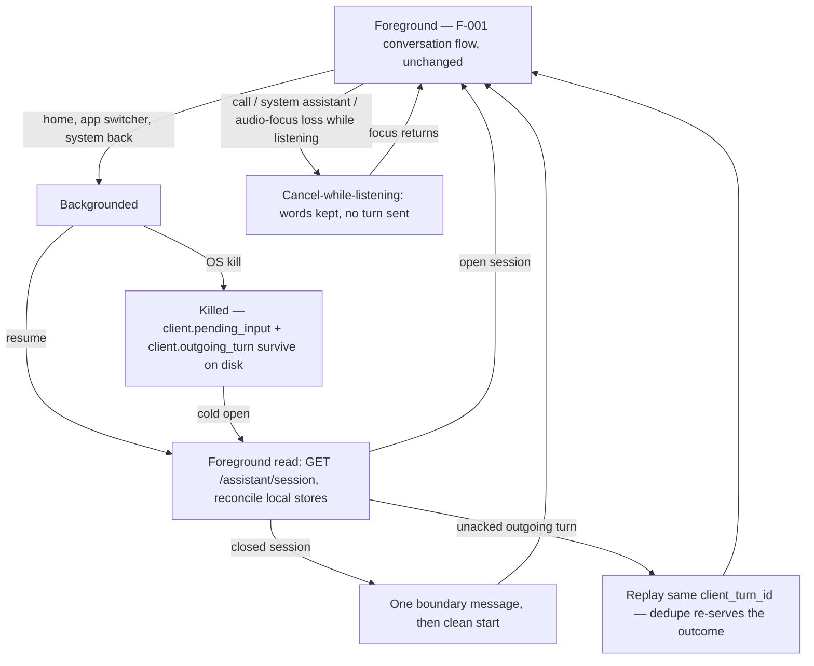

# Feature: Mobile (React Native) Assistant Surface

**ID**: F-003
**Slug**: mobile-surface
**Status**: `draft` (revision 1)
**Last Updated**: 2026-08-16

---

## Links

```yaml
primary_module:    assistant
secondary_modules: []
depends_on:        [F-001]
implemented_in:    [src/assistant/mobile/, src/assistant/_shared/]
designed_in:       [design/assistant/screens/voice-assistant-view-ios.html, design/assistant/screens/voice-assistant-view-android.html]
api_endpoints:     []   # no new endpoints — mobile is a second client against F-001's eight
tested_by:
  api:    []
  web:    []
  mobile: [qa/assistant/F-003/mobile/, qa/assistant/automation/mobile/F-003-mobile-surface.spec.ts, qa/assistant/runs/2026-08-17-mobile-execute.md]
known_bugs: []
```

---

## Purpose

Bring the F-001 voice assistant to iOS and Android as a React Native client. **The server contract is finished and unchanged** — mobile is a second client against F-001's eight endpoints, not a new backend surface. What is genuinely new is everything the OS owns and a browser tab does not: two permission models instead of one, a process that the OS can kill at any moment, audio the phone can take away mid-sentence, a software keyboard, and a system back gesture. This spec owns exactly that boundary. Behaviour that F-001 already fixed is referenced, never restated — one conversation reducer, one message vocabulary, one testid catalogue across all three clients.

Feature ordering note: **F-002 is talk-back (UC-20)**, the binding commitment from Gate 1 decision D1. This feature is F-003 and does not ship speech output.

## Users & Permissions

| Role | Can do | Cannot do |
|------|--------|-----------|
| Authenticated user (mobile) | Everything F-001's user row grants, from a phone: speak/type to create, edit, complete, delete todos; answer or ignore questions; undo by tap or voice; manage the list by touch alone | See or affect another user's tasks or transcripts; recover words the app never captured |
| Assistant (AI) | Unchanged from F-001 — same server, same refusals (AC-9, AC-1 carve-out, AC-14) | Unchanged from F-001 |
| Operating system | Deny or revoke capture permissions; take audio focus; background or kill the process; hide the surface behind a keyboard | Silently discard the user's words — every OS event above has a specified, visible outcome here |

## Parity with F-001

F-001's 29 ACs are the behaviour contract. Their disposition on mobile, in full — this table is the enumeration AC-1 binds:

- **Hold identically; QA cites the F-001 id, no mobile fork (21):** AC-1, AC-2, AC-4, AC-6, AC-7, AC-8, AC-9, AC-10, AC-11, AC-12, AC-13, AC-14, AC-15, AC-16, AC-17, AC-18, AC-20, AC-22, AC-23, AC-24, AC-29. Nine of these (AC-6, AC-10, AC-12, AC-15, AC-16, AC-23, plus the api halves of AC-1, AC-7, AC-9) are server-side and cost the mobile client no behaviour at all.
- **Hold, with a mobile clause added here (6):** F-001 AC-3 → AC-7 (audio interruption); F-001 AC-5 → AC-9 (one-gesture undo by touch); F-001 AC-19 → AC-12 (native screen-reader announcement); F-001 AC-21 → AC-2 / AC-3 (the permission split); F-001 AC-25 → AC-4 (offline recognition); F-001 AC-28 → AC-8 (foreground resume trigger). The F-001 behaviour continues to hold in full — the clause adds, it never narrows.
- **Reserved in F-001, moved wholesale here (2):** F-001 AC-26 → **AC-5**, F-001 AC-27 → **AC-6**. Substance unchanged; they carry mobile platform tags for the first time.

**No F-001 AC is web-only and dropped.** The only two whose *web* instantiation (tab close, reload, durable browser storage) has no mobile analogue are the two reserved ACs, re-expressed here in process-kill terms.

## User Flow

F-001's conversation flow is unchanged and not restated. The flow this feature adds is the lifecycle one:



## Acceptance Criteria

### Parity
- [ ] **AC-1** (mobile) — Every F-001 AC listed as *hold identically* in the Parity table is observably true on the mobile surface, verified by the mobile test tier against the same conversation reducer and outcome→message mapping the web client uses. A behaviour may not be forked per platform: a divergence discovered during implementation is a spec question routed back through the orchestrator, never an implementer's local call.

### Permissions — the platform split
- [ ] **AC-2** (ios) — iOS requires **two** grants, microphone **and** speech recognition. Both are requested before the first talk attempt, never at app open, behind one short explanation covering both (F-001 AC-21). The two dialogs are shown **in sequence**, microphone first, and a microphone refusal **ends the sequence** — the speech-recognition dialog is not shown, since recognition is inert without a microphone and spending the remaining prompt on it changes nothing the user can perceive. The state that leaves (mic `denied`, speech `undetermined`) is a legitimate resting state with its own message, not an incomplete request. `client.permission_state` tracks each grant separately. **Any** partial denial — either one denied, both denied — produces F-001 AC-21's dimmed mic, not a hidden one; the message names which capability is missing, and activating the dimmed mic offers a CTA (`assistant-permission-cta`) that deep-links to the app's Settings page. Typing is fully unaffected in every combination.
- [ ] **AC-3** (android) — Android requires a **single** grant (`RECORD_AUDIO`); a grant makes the mic available with no second prompt. Denial dims it (F-001 AC-21). Android's **permanently-denied** state is a distinct path: the OS will not show the prompt again, so activating the dimmed mic must not re-request — the CTA sends the user to App info → Permissions, and the message says the grant has to be made there. A first-time denial that is not permanent may re-request on the next talk attempt.
- [ ] **AC-4** (mobile) — Offline, mobile diverges from web: on-device recognition may still work, so being offline does **not** by itself dim or hide the mic. Recognized text is never discarded — while offline it lands in the composer and goes through F-001 AC-25's local no-AI path, and no assistant turn is attempted; the surface states it is offline (F-001 AC-25 handover, ADR-7) rather than showing a half-running conversation. A recognizer that is present but has no pack for the interface language is F-001 AC-22's transient case (dimmed, message states the cause), not the no-capability case (F-001 AC-20, hidden).

### Lifecycle — backgrounding and kill (reserved from F-001)
- [ ] **AC-5** (mobile) — *Originates as F-001 AC-26, reserved for this feature; substance unchanged.* Backgrounding or kill while **listening** loses no words: recognized-so-far text persists in the `client.pending_input` store, survives process kill, and reopens into the composer.
- [ ] **AC-6** (mobile) — *Originates as F-001 AC-27, reserved for this feature; substance unchanged.* Backgrounding or kill while **thinking**: the turn resolves server-side under its `turn.client_turn_id`; the outgoing turn stays in the kill-surviving `client.outgoing_turn` store until the server acknowledges its id, so a kill never loses a sent-but-unacked turn; reopening within the open session shows its outcome message; unanswered questions and the undo affordance reappear per their own rules (F-001 AC-8, AC-10). Mobile clause on the reconciliation: an outgoing turn that survived a kill is replayed under the **same** `client_turn_id`, so a turn the server already applied re-serves its recorded outcome (`replayed: true`, F-001 AC-16) and never applies twice; the acked turn is then cleared from the store.
- [ ] **AC-7** (mobile) — Audio interruption while listening — incoming call, system assistant (Siri / Google Assistant), audio-focus loss, output-route change — behaves exactly as cancel-while-listening (F-001 AC-3): capture stops, recognized-so-far text is preserved per AC-5, **no turn is sent**, and the surface returns to idle visibly. The audio session is released so the interrupting app's audio is not blocked, and the mic returns to available when focus comes back — without re-prompting for permission.
- [ ] **AC-8** (mobile) — Every foreground transition (resume or cold open) re-reads `GET /assistant/session` **before** accepting new input, and renders whatever the server reports: an open session resumes visibly, a closed one renders exactly one boundary message and starts clean (F-001 AC-28). Local stores reconcile against that read, never override it — the server is the source of truth for conversation history; `client.pending_input` and `client.outgoing_turn` are the only local survivors, restored per AC-5 and AC-6.

### Touch, keyboard, navigation
- [ ] **AC-9** (mobile) — Every interactive element in the design mockups' testid catalogue has a touch target of at least **44×44 pt on iOS** and **48×48 dp on Android**, measured as hit area rather than painted size. F-001 AC-5's undo stays **one gesture** by touch — no confirm sheet, no long-press, no swipe discovery required.
- [ ] **AC-10** (mobile) — The software keyboard never occludes the composer or the newest conversation message; opening or dismissing it changes no conversation state and neither sends nor cancels a turn. Composer text survives keyboard show/hide and device rotation. Send is reachable from the keyboard's own action as well as from `assistant-composer-send` (F-001 AC-17's typed path is otherwise unchanged).
- [ ] **AC-11** (mobile) — System back navigation is never destructive: Android system back and iOS back-swipe out of the assistant view do **not** cancel an in-flight turn, do **not** close the session, and do not discard composer text — leaving the view is a background transition and AC-5/AC-6 govern it. With the keyboard open, Android back dismisses the keyboard first and leaves the view on the second press. Session close remains explicit or idle-driven only (F-001 AC-28, ADR-004).
- [ ] **AC-12** (mobile) — F-001 AC-19's live-region requirement maps to the native announcement APIs: **every** conversation message (the full list in F-001's Conversation model) is announced to VoiceOver / TalkBack without moving focus, and an error message is announced immediately rather than queued. Announcing the state word alone does not satisfy this — the screen-reader user receives what changed, how many, which tasks by title, and that undo is available. **Identity and announcement are two different attributes and must never be conflated.** Accessibility *identity* — the **same 22 values** as the web `data-testid` catalogue, none invented — rides one React Native `testID` prop, which surfaces as `accessibilityIdentifier` on iOS and as the view's **`resource-id`** on Android (one contract, one source prop, three surface spellings: `data-testid` · `accessibilityIdentifier` · `resource-id`). The human-readable *announcement* text this AC requires rides `accessibilityLabel`, which surfaces as **`contentDescription`** on Android — so `contentDescription` carries message content (what changed, how many, which tasks by title, that undo is available) and never a catalogue id. Putting identity on `contentDescription` would make TalkBack read the token "assistant-message-bubble" aloud instead of the message, failing this AC's own announcement requirement. Verified against a real screen reader on a device, not inferred from the tree (W3C F103).

## Data

No server entity changes: `session`, `turn` and their embedded shapes are F-001's, unchanged. `client.pending_input` and `client.outgoing_turn` carry over from F-001 unchanged; `client.permission_state` is introduced here and is now declared in `data-model.md ## Client-side stores`. This feature is where the mobile half of all three becomes binding.

| Field | Type | Required | Validation | Notes |
|-------|------|----------|------------|-------|
| client.pending_input | `{text, updated_at}` | local only | text only, never audio | carried from F-001; survives process kill and reopens into the composer (AC-5) |
| client.outgoing_turn | `POST /assistant/turn` payload + `{sent_at, attempts}` | local only | held until the server acks its `client_turn_id`; cleared on ack | carried from F-001; survives kill, replays under the same id (AC-6) |
| client.permission_state | `{microphone, speech_recognition?}` each `granted \| denied \| permanently_denied \| undetermined` | local only | `speech_recognition` present on iOS only; `permanently_denied` reachable on Android only | new here; drives the mic mode in AC-2 and AC-3 |
| task.* | existing | — | unchanged | see Out of Scope |

## API Touch Points

Mobile calls F-001's eight endpoints **unchanged and adds none**: `POST /assistant/turn`, `GET /assistant/session`, `POST /assistant/session/close`, `POST /assistant/turn/{turn_id}/undo`, `GET /tasks`, `POST /tasks`, `PATCH /tasks/{id}`, `DELETE /tasks/{id}`. Shapes, auth (`X-User-Id`), error envelope and the unknown-field rejection policy come from `api-contracts.md` verbatim — the mobile client invents nothing (ethos §9). Two mobile-specific notes: the base URL cannot be `localhost` on a physical device (Open Question 3), and `GET /assistant/session` acquires a second caller — the foreground transition of AC-8, in addition to F-001's resume.

## Ops

- **Observability** — client-side counters for permission-denial by kind (AC-2, AC-3), audio interruption (AC-7), and kill-surviving replay (AC-6). Prototype: in-process counters, no exporter (ADR-001). Server counters are F-001's, unchanged.
- **Rollback criteria** — N/A this phase: prototype-grade, no store distribution and no live users (ADR-001). The endpoints this feature calls are already deployed and unchanged by it, so there is nothing new on the server to roll back.
- **Feature flag** — N/A: the mobile app is a separate binary, so shipping or not shipping it is the flag.

## Test strategy (mobile)

- **Unit tier runs under Node with vitest — no simulator, no emulator, no Metro** (`specs/_shared/platform/mobile.md ## Test Harness`: `npx vitest run src/assistant/mobile`). React Native is not imported by `model/` or `ports/`, which is what keeps the tier device-free; anything native is mocked at the port boundary, never inside a test.
- **The transcript seam extends to mobile** — F-001's Test strategy already grants it. On mobile it is the `TranscriptSource` port: an injectable transcript plus capability and failure injection. The permission matrix is enumerated, not sampled: iOS ×4 (both granted, mic denied, speech denied, both denied → AC-2), Android ×3 (granted, denied, permanently denied → AC-3), plus no-capability (F-001 AC-20) and transient failure (F-001 AC-22, incl. AC-4's missing language pack).
- **Kill is simulated at the port boundary.** A real process kill cannot happen in node, but the ACs' observable is that the store's contents outlive the model — a `DurableStore` double whose contents survive constructing a fresh model instance reproduces exactly that, and is the assertion for AC-5 and AC-6. AC-6's replay half asserts the client re-sends the same `client_turn_id` and renders `replayed: true` without a second application.
- **Lifecycle and connectivity** come from the `AppLifecycle` and `Connectivity` doubles: background, foreground, audio interruption and focus regain drive AC-7 and AC-8; online/offline transitions drive AC-4.
- **What a device-lab or manual pass still owes** (not claimable from the unit tier, and not to be reported as covered by it): real permission dialogs and the Settings deep link (AC-2, AC-3); a real incoming call interrupting capture (AC-7); a real OS memory-pressure kill (AC-5, AC-6); VoiceOver and TalkBack announcement (AC-12); keyboard occlusion and rotation (AC-10); system back and back-swipe (AC-11); on-device recognition while offline in the interface language (AC-4); touch-target measurement on a device (AC-9).

## Out of Scope (this iteration)

- **Speech output / talk-back (UC-20)** — that is **F-002**, the binding next feature per Gate 1 decision D1; taking it here would fork the commitment across two specs. **Considered and rejected:** shipping talk-back on mobile first because the platform makes TTS easy — it would give mobile a capability web lacks and split the one conversation contract AC-1 exists to hold.
- **Push notifications** — every outcome in this feature is already visible on next foreground (AC-8); a notification adds a delivery channel with its own permission, quiet hours and tap-routing rules, and would need ACs none of F-001's cover. **Considered and rejected:** notifying on a turn that resolved while backgrounded — AC-6 already shows that outcome on reopen, so the notification would be redundant before it was useful.
- **Home-screen widgets and Live Activities / ongoing notifications** — a second, non-interactive rendering surface with its own state contract; nothing in F-001's message vocabulary maps to it. **Considered and rejected:** a "listening" ongoing notification — it implies background capture, which wake-word/always-on is deferred for (F-001 Out of Scope).
- **Deep links, share-sheet and OS hand-off doors (UC-53)** — F-001 already defers UC-53 as a separate feature with its own permission questions; mobile is where it will land, but not here. **Considered and rejected:** a minimal share-to-create intent — it is a second input path that bypasses the assistant turn entirely, so it belongs to the UC-53 feature that can spec its no-AI semantics properly.
- **Offline-first sync beyond F-001 AC-25** — the local no-AI path plus queued replay is the floor and the ceiling this iteration. **Considered and rejected:** a full local task mirror with conflict resolution — it needs a merge policy the product has not chosen, and AC-4's honest offline handover is testable today.
- **Tablet and landscape layouts** — the mockups are phone-portrait; a tablet layout is a design deliverable that does not exist. **Considered and rejected:** letting the phone layout stretch — it would ship an untested surface the design agent never reviewed.
- **App-store packaging, signing, OTA updates and crash reporting** — prototype-grade, no distribution target (ADR-001). **Considered and rejected:** wiring a crash reporter early — with no store build there is no fleet to report from.
- **`task.*` changes** — none; this feature adds no task fields. **Considered and rejected:** a client-only `synced_at` marker for AC-4's offline creates — `POST /tasks` already takes a client-generated id and treats the `409 TASK_ID_EXISTS` replay as its ack (api-contracts.md), so no new field is needed.

**Considered and rejected (feature-level):** shipping mobile as a WebView wrapper of the web surface — it would inherit the browser speech API's server-routed, online-only recognition (losing AC-4) and has no kill-surviving storage for AC-5/AC-6, so the two ACs this feature exists to deliver would be exactly the two it could not. Also rejected: forking the conversation reducer per platform for "native feel" — the parity table only stays checkable if there is one reducer, and every divergence worth having is already named as an AC here.

## Open Questions

1. Which React Native storage implementation backs `DurableStore` (AsyncStorage vs MMKV)? The port makes it swappable and the unit tier uses a double either way, so this blocks nothing before implementation. — architect
2. Minimum supported OS versions. iOS speech-recognition availability and Android on-device recognizer availability both vary by version and OEM, which decides how often AC-4's offline path and F-001 AC-20's hidden-mic path are actually reached. — product + architect
3. Base URL for a physical device: `localhost:4460` is unreachable from a handset, so the prototype needs a LAN host or emulator alias, and a way to set it per build. — architect
