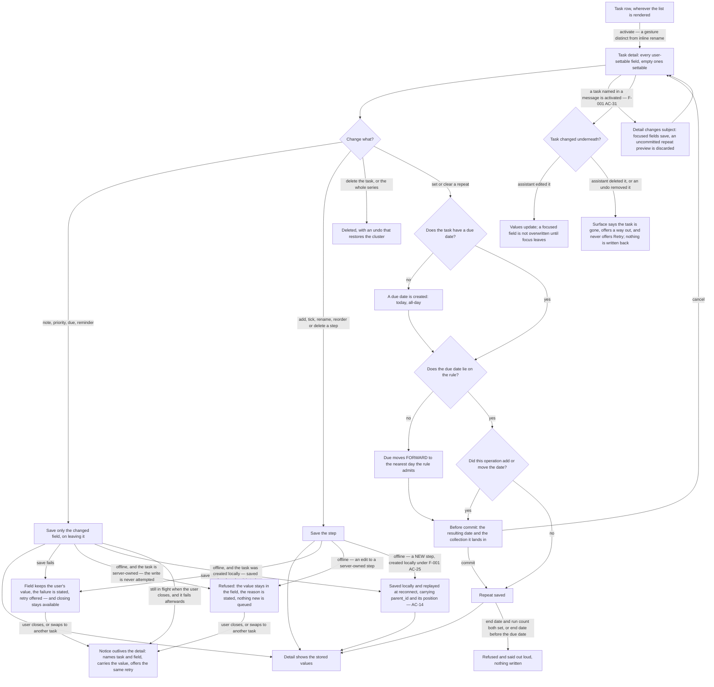
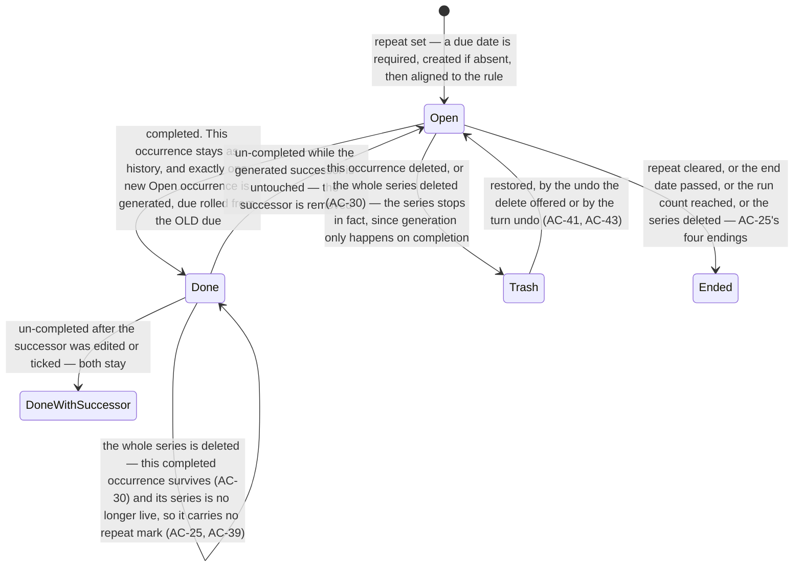

# Feature: Task Detail — every field a task has, by hand

**ID**: F-005
**Slug**: task-detail
**Status**: `draft` (**revision 4 — the final amend pass, and there is no fourth review.** The owner **closed Gate 1** on 2026-08-19 (`reports/owner-decision-2026-08-19-close-gate-one.md` §1) and scoped this pass deliberately: **fix every finding where the spec contradicts itself, another spec, or an owner decision; record — do not answer — every finding that asks for a mechanism the spec cannot state.** The split is not a compromise. Only the spec can say which of its own two sentences is true, so a contradiction is fixed here; an unstated mechanism is what the architecture phase exists to state, and making this pass invent one means architect either inherits a guess or unpicks it. **Amend-only still holds: 48 ACs before, 48 after, nothing renumbered, nothing deleted, nothing added.** Three owner answers of 2026-08-19 are folded in, each with the consequences that follow automatically: **the hand-action undo renders in AC-47's notice family** (so a reload is a fourth ender of AC-43's offer, OQ13 carries both causes of permanent loss, and the row's mark budget is three **without** the undo); **acknowledging a passed reminder is a deliberate per-reminder act on the surfacing** (so an offline acknowledgement is not recorded and the reminder re-surfaces at the next open); and **AC-2's third state is scoped to a server-owned row**, the qualifier the owner's own decision already carried. Round 3 returned **REJECT — 25 HIGH · 22 MEDIUM · 11 LOW across nine lenses**; the disposition of all 58 is `reports/gate1-lenses/F-005-revision-4-log.md`. **Revision 3's record, kept:** **revision 3 — the Gate 1 round-2 revision.** Round 2 returned **REJECT — 40 HIGH · 44 MEDIUM · 15 LOW across nine lenses**, and the owner **waived the round cap once**, with a constraint that is the substance of the waiver rather than a footnote: **revision 3 amends existing acceptance criteria only and adds none** (`reports/owner-decision-2026-08-18-round-three-and-offline.md` §1). The mechanism that produced round 2 was *a revision adds ACs → the new ACs are unreviewed → the next round finds them*; no new ACs is what makes this the last round rather than the third of an unknown number. **Still 48 ACs. Nothing renumbered, nothing deleted, nothing added.** The owner's second answer of the same date is folded in — **an offline field edit to a server-owned task is refused, with the user's value kept on screen and the reason stated** *(the scoping qualifier is revision 4's; revision 3 wrote the rule without it)* — which closes **OQ6** and settles AC-47's reload half. The re-review after this one is targeted: each lens re-reads only the ACs it raised findings on, and `reports/gate1-lenses/F-005-revision-3-log.md` — one row per finding, all 99, with the exact AC ids touched — is what determines that set. **Revision 2's record, kept:** revision 2 — the Gate 1 round-1 revision. Round cap is 2; this is the last revision that gets reviewed. Sources: `reports/gate1-lenses/F-005-consolidated.md` and the five persisted lens returns beside it (L-009), and `reports/owner-decision-2026-08-18-f005-gate1.md` — four owner answers that are decisions, not suggestions. **No AC was renumbered and none was deleted.** AC-38 … AC-46 are new; the disposition of every round-1 finding is `reports/gate1-lenses/F-005-revision-2-log.md`. **Amended in place 2026-08-18 (T-153), before round 2 reads it** — deliberately not a revision 3, because the round cap is 2 and an amendment folded in now is *reviewed*, whereas the same change made after round 2 would ship unreviewed. Two owner answers of that date, `reports/owner-decision-2026-08-18-detail-trap-and-message-door.md`, both found in composition rather than by a lens: **AC-2's fourth sub-bullet is narrowed** — closing the detail is always available, and a failed write's value moves into a notice that outlives the surface, with revision 2's wording and its product-F10 reason kept and its overruling reason stated — and **AC-47 and AC-48 are new**, the notice family and what the surface does when `F-001 AC-31`'s door changes its subject. **48 ACs. No AC was renumbered and none was deleted.**)
**Last Updated**: 2026-08-19

---

## Links

```yaml
primary_module:    assistant
secondary_modules: []
depends_on:        [F-001]
implemented_in:    []
designed_in:       []
api_endpoints:     ["GET /account", "PATCH /account", "GET /tasks", "POST /tasks",
                    "PATCH /tasks/{id}", "DELETE /tasks/{id}",
                    "POST /tasks/{id}/restore", "POST /tasks/{id}/reminder-ack",
                    "POST /tasks/{id}/repeat-preview", "POST /assistant/turn"]
tested_by:
  api:    []
  web:    []
  mobile: []
known_bugs: []
```

---

## Purpose

A saved task has exactly one thing you can change by hand today: its title, and only on web. Everything else a task is — when it is due, when it should speak up, how urgent it is, what it actually involves, whether it comes back next week — is either unreachable or does not exist. This feature builds the surface where all of it lives.

**The sharpest fact in the current model, and the one worth carrying into every decision below: the data already separates the deadline from the reminder — two distinct moments, exactly as UC-27 AC-27.2 requires — and the user can reach neither.** `due_at` and `reminder_at` both exist and are both patchable (`TASK_PATCH_FIELDS`, `src/assistant/api/app.ts:135`); no client sets either, and there is no picker anywhere. `priority` exists as a free `string | null` with no control and no visual mark. `note`, sub-tasks and recurrence do not exist at all. The data is careful and there is no door.

This is also the surface `todo-ai ADR-11`'s second path has been leaning on since F-001: *"the full todo list remains usable by hand"* (F-001 AC-18, AC-24, AC-25). Without a place for a task's own fields to live, the by-hand path can create, tick, rename and delete — and nothing else.

**Naming convention.** Field names and state words below (`note`, `repeat`, `step`, "occurrence") are this spec's own vocabulary. They are not shipped strings; the user-visible wording of every label, message and accessible name is the design system's (`design/_shared/components.md`), as F-001 `## Naming convention` already establishes.

## What revision 2 changed, and why

Round 1 returned **REJECT — 20 HIGH, 34 MEDIUM, 8 LOW** across five lenses, and four escalated questions came back answered. The five changes with the widest reach, so a reader who stops here has the load-bearing half:

1. **`reminder_at` stops being a write-only data path.** The owner chose an option this spec did not contain: passed reminders are shown **when the app opens** — no scheduler, no push, no permission prompt, no UC-26 dependency (**AC-38**). AC-11 no longer has to be a control that both promises delivery and announces its own uselessness.
2. **Un-delete is a new write path, and this spec now says so.** Three ACs asserted on a restore that **nothing in the system can perform** (architect F2, dev F1). `## API Touch Points`'s *"No new assistant endpoints"* was **false**; it is corrected, and **AC-41** states the restore. The owner's delete answer makes this mandatory rather than optional: the list row's delete gains the undo it never had (**AC-42**), and the hand-action undo those ACs assert on is finally defined (**AC-43**).
3. **Four ACs and one flow branch gave three different answers to one question.** Setting a repeat on a dateless task now has **one** operation order, disclosed before commit, with the collection consequence stated once (AC-22, AC-23, and the corrected flowchart).
4. **The assistant's half of this feature was a permission, not a capability.** The interpreter's 23 fixture rows contain two edit rows and neither touches a field this feature adds, so an implementation that allowlists four fields and leaves every one unreachable **passed AC-36 completely**. AC-36 now requires **one fixture row per permitted field**, requires the refusal to be *expressible* so it can be attempted, and **AC-40** moves every field rule off the HTTP door and onto the write.
5. **"Web-first" was never a fact about where the behaviour lands.** Four behaviours reach the phone whether or not the phone is in scope, and platform tags decide which QA tier covers an AC — so `(api)` / `(api, web)` meant **no mobile tier would ever verify them**. AC-2, AC-13, AC-19, AC-26 and AC-35 now carry `(mobile)`, and AC-38/AC-39/AC-42/AC-43 carry it by construction.

## What revision 3 changed, and why

Round 2 read nine lenses against 48 ACs, eleven of which no lens had ever seen, and returned **99 findings**. Every one has a disposition in `reports/gate1-lenses/F-005-revision-3-log.md`; the six changes with the widest reach are here, so a reader who stops at this section has the load-bearing half.

1. **An offline field edit **to a server-owned task** is refused, and the app says so (AC-2's third state).** *(The scoping qualifier is revision 4's — see `## What revision 4 changed` §1; revision 3 wrote the rule without it and thereby removed a working path.)* The owner's answer, and the question it answers had a false premise this revision corrects rather than inherits: OQ6 asked whether an offline edit is *kept and sent later, or lost*, and the spec recorded the behaviour as already defined by AC-2. It was not. `toggleTask`, `editTask` and `removeTask` all **return before attempting anything** while offline and `persistLocal()` saves only locally-created rows, so an edit to a server-owned task is **never sent, never queued, and silently replaced at the next refresh**. AC-2's two states were *in flight* and *failed*; this one is **never attempted**, which is why AC-2's guarantee could not reach it. **OQ6 closes**, and with it AC-47's open half: the notice **does not survive a reload**.
2. **Close-then-fail is the ordinary order, and neither AC covered it** (three lenses, on the owner's own decision). AC-47's trigger was keyed to the write's state *at the moment of closing*, and AC-2's in-flight bullet described only a successful resolution — so a write pending at the close and failing after it was covered by nothing, and the trade the owner made (give up the hold, gain the notice) bought nothing on the most likely close. AC-47's trigger is now *fails at any point after being started on this detail*.
3. **The clock became a zone problem (six lenses).** AC-44 asserted the seam and left the outcome in a sub-bullet, said the client had no seam when it has one, and put the zone on the only path none of its computations use. It is inverted: **the date outcomes are the assertion**, both seams are drivable by the harness and held at one instant, and the zone is **one stored source read on every write path** rather than a field that rides a turn.
4. **Two directives were true as edits and false as outcomes.** *"Pick an accent from unspent tokens"* (AC-9, `## Impact` §8, OQ5) named an **empty set** — all five accents carry assigned meanings — while three marks want the same row in one release; the mark is now carried **without colour** unless a new token is added to the system first. And the seed path three ACs depend on was a sentence in `## Test strategy` with no mechanism and no owner — the same shape revision 2 refused for AC-41, now a `## API Touch Points` obligation bound into AC-8, AC-15 and AC-34.
5. **Four round-2 corrections to this document's own record.** `## Impact` §1's list was short by two and misfiled the turn-path **create** allowlist among harmless constructors — so the voice decision's create half ships with the reminder silently dropped; §7 and §9 contradicted each other about `uc-coverage-map.md` D8, whose **definition** is still the stale one; §12 overstated the shipped mobile behaviour and its account figure is **190**, not 193; and four round-1 dispositions logged `resolved` did not land (the seed path, the clock seam, the refusal's scope, the series-delete undo).
6. **Accessibility stopped being an enumeration.** AC-33's 4.1.3 list is now a rule — *every refusal and every status message this spec states is announced* — because four announcements had fallen outside a closed list four ACs pointed at; **2.2.1 Timing Adjustable** is named, which both AC-43 and AC-47 reason about without citing; and AC-33 carries `(mobile)`, because four obligations put affordances on the phone and pointed at a `(web)` AC for their coverage.

**No acceptance criterion was added.** Where a finding could only be closed by a new AC it would have been named as an owner decision rather than taken quietly; none was — every one of the 40 HIGH is closed by amending an AC, `## Impact`, `## API Touch Points`, `## Data`, `## Test strategy` or `## Open Questions`.

## What revision 4 changed, and why

Round 3 read nine lenses against the 48 ACs and returned **58 findings**. Its headline is the
one that decided this pass's scope: **the dispositions landed — essentially every one of them —
and the damage was done by the amendments themselves**, six lenses saying so in their own words
and three naming the same mechanism, *an amendment that closes a finding and opens a defect in
the same paragraph*. A fourth review round was the rejected option; the owner closed the gate
instead and split the findings by owner. Every one has a disposition in
`reports/gate1-lenses/F-005-revision-4-log.md`. The changes with the widest reach:

1. **AC-2's third state is scoped to a server-owned row, and the word is the owner's** (four
   lenses: dev-web H1, dev-mobile F1, architect F1, product P14). The decision document says
   *"an edit to a **server-owned** task is never sent"* and revision 3 wrote the rule without
   *server-owned*. The shipped guard has three disjuncts, and for a **locally-created** row
   `persistLocal()` saves the edit and `pushLocalTasks` replays it — so the unscoped rule
   **removed working behaviour**, and its first arm fires **while online**, where *"you are
   offline"* is not a true thing to say. The refusal is now the server-owned case; an edit to a
   locally-created row is kept and replayed exactly as it is today, and *"no queue, no durable
   store, no replay"* is restated as *no **new** ones*.
2. **`## Out of Scope` no longer forbids the change AC-14 requires** (dev-web H2, dev-mobile F2,
   architect F1). One section said *"no widening of `pushLocalTasks`'s replay literal"* and AC-14
   requires exactly that widening — **there is one literal**, and read the wrong way an
   offline-created **step** replays with `parent_id` dropped and **returns as an ordinary
   top-level task, in every collection and every count**, which is what AC-35 exists to prevent.
   What the owner rejected is queue-and-replay for offline *edits*, not the create-replay's field
   set; the flowchart's offline edge is split accordingly.
3. **The hand-action undo has one home, and a reload ends it** (owner §2; design D21, product P13,
   tester T38). Three amendments had put it in three places. It renders where AC-47's notice
   renders — reachable from wherever the user is — and because that family does not survive a
   reload, **AC-43's *"and by nothing else"* was false**: the reload is named as a fourth ender,
   OQ13 is re-stated to carry both causes of permanent loss, and `## Impact` §8's mark budget is
   **one** list of three (AC-9, AC-17, AC-39) instead of two lists of three that disagreed.
4. **Acknowledging a passed reminder is defined, and the offline half changes with it** (owner §3;
   six lenses on the term, five on the offline clause). It is a **deliberate per-reminder action on
   the surfacing**: opening the task does not count, scrolling past does not count, rendering does
   not count, and there is no bulk dismissal. AC-38's headline no longer says *surfaced once* over a
   sub-bullet that says the surfacing persists, and an **offline acknowledgement is not recorded** —
   the reminder re-surfaces at the next open, which contradicts nothing and replaces the
   queue-and-replay shape the OQ6 answer forbids by name.
5. **Four places where the new rule landed and the sentence it replaces was left standing.** AC-47's
   bullet 4 (*"never the stored value"*, contradicted by the supersession rule written to replace
   it), AC-33's 2.2.1 sentence (the weaker predecessor of AC-43's rule, **quoting AC-43 as saying
   something it no longer contains**), AC-45's retracted *"F-001 AC-32's non-stale list"* clause, and
   `## Impact` §4's invariant, withdrawn in revision 2 and still asserted. Each is now withdrawn
   **with its reason recorded**, not deleted.
6. **Two amendments that were complete on one class and silent on the other.** AC-46 governs a row a
   turn *creates* **or changes** and its revert rule described only created rows — so **no cascaded
   step was ever reverted**, the exact defect `## Impact` §4 says AC-46 closes; the condition is now
   stated per class. AC-25's *"all three ways"* a series ends omitted AC-30's series delete, so
   `series_live` stayed true for a deleted series and AC-39 marked it forever.
7. **What this pass did not answer, and said so.** The timezone's write path (**no account entity
   exists in the store at all**, and **0 of 790 rows carry `due_all_day`**, so the refusal is
   write-shaped while AC-13's use of it is a read), the **53 of 790 rows already soft-deleted with no
   `delete_membership`** across 18 accounts, how a set-valued recurrence member appears in a diff row
   that declares `old|null, new|null`, where AC-15's prior position comes from, and how the run count
   is derived from a model that records no completion — all recorded as obligations in
   `## API Touch Points` with the finding's own words about what is unknown. The one that is a
   **product** choice — a locally-created row deleted **while online**, where `removeTask`
   short-circuits regardless of connectivity — is **Open Question 16**.

**No acceptance criterion was added, renumbered or deleted.** Where a finding could only be closed by
a new AC it would have been named as an owner decision rather than taken quietly; none was.

## Scope — which use cases are in, and which are not

`specs/_shared/uc-coverage-map.md` item #5 puts this feature here with the sentence *"Every remaining CORE field needs somewhere to live. Without it, 35/36/39 have no home."* That is what decided the set.

| UC | In? | Why |
|----|-----|-----|
| **UC-27** — edit a saved task by hand, every field | **in** | The feature itself. |
| **UC-44** — a note on a task | **in** | The owner's *"description"*. The source calls it `note`; one concept, one name. |
| **UC-35** — priority by hand, urgency visible in the list | **in** | One AC's worth of behaviour and it rides on this surface (map #6). |
| **UC-34** — deadline & reminder by picker | **in** | The field exists and is patchable; only the control is missing (map #3). Recurrence needs it (AC-22). |
| **UC-36** — sub-tasks, full CRUD, user-ordered | **in** | Map #11. Its home is Task Detail in the source's own main flow. |
| **UC-39** — recurring | **in** | Map #12, the largest CORE item, and named by the owner. Depends on UC-34 and UC-36, both in. |
| **UC-33** — delete, with undo | **in** (was *partly in*) | **Widened in revision 2 by the owner's decision.** The detail's own delete and the parent→step cascade (AC-31, AC-19) were always here; the **list row's delete now gains the same undo** (AC-42), because two doors to one destructive action must not have different safety. The undo itself is AC-43 and the restore it needs is AC-41. |
| **UC-26** — reminder delivery | **partly in** | **New in revision 2.** Not scheduling and not notifications — only the in-app half the owner chose: on open, a reminder whose moment has passed is shown (AC-38). Scheduling, push and permissions stay out. |
| **UC-04** — AI sub-task decomposition | **out** | It is the AI layer over UC-36, not a field. It needs a model, and there is none (map D1). F-005 unblocks it; map Tier 2 #13 is its place. |
| **UC-18** — open a task, tap mic, edit by voice | **out, deliberately** | See Out of Scope — its actual requirement is already met, and its flow costs a second mic locus. |
| **UC-49** — start date | **out, and contested** | The owner named it; the source declines to write ACs for it and UC-39 refuses it a field on purpose. Open Question 1. |
| UC-37 search · UC-45 Logbook · UC-42 Upcoming · UC-43 drag ordering of *tasks* · UC-46 dates in quick-add · UC-41 lists | **out** | Each is its own surface or its own field. Sub-task ordering (UC-36) is in; top-level task ordering (UC-43) is not — they are different fields. |

**None of this is greenfield, and that is the most useful thing to know before building it.** `specs/_source/todo-ai/04-feature-audit.md` records **all six** of the original in-scope UCs as ✅ Done in the product this one redesigns — UC-27, UC-34, UC-35, UC-36, UC-39 and UC-44, with named modules (`priority.ts`, `subtasks.ts`, `recurrence.ts`, `parseDateTime`, `normalizeNote`) and a migration for `series_id`. So this feature is a **re-implementation against a different architecture**, and that audit is the record of what it cost the first time. Four of its findings are written into the ACs below rather than left to be rediscovered: the `childrenOf` / `subtasksOf` split (AC-15), `setMonth`'s month-end overflow (AC-24), the three fields a generated successor silently lost (AC-27), and the fact that completing a parent **cascades to its steps** (AC-19) — which is the built behaviour, and it is not what this spec's first draft assumed.

One more, and it is about this repo rather than that one. The audit names a recurring failure it calls a **write-only data path**: *"a data path that exists visibly in the schema, and no route in the product runs through it."* `recurrence` was the first instance it found. **`reminder_at` was that exact shape here** — a column, a patch field, zero rows, no consumer. Revision 1 wrote AC-11 against it and, in doing so, proposed to make it a *user-visible* write-only path; the owner's answer (AC-38) closes the path instead of labelling it.

## Impact on what already exists

*"F-005 có lẽ là feature mới nhưng lại liên quan tới những feature đã tồn tại nên nó phải handle được những gì đã có, những gì mới, impact changes."* — the owner, 2026-08-18. This section is the answer, and it is written to be checked line by line. It names what F-005 **changes or breaks** in artifacts that already work, not what it adds. `LEARNINGS.md` L-013 is the entry this section exists under.

**Round-1 status of this section, recorded because it is the part most likely to be trusted without checking.** Four of the five lenses verified its code claims against the repo rather than reading them. Every checkable claim in §1–§6, §8 and §9 held; the product lens called it *"the best-evidenced part of the spec"*. **§7 was where it stopped short, and it stopped short on a stale fact** — corrected below. Three subsections are new in revision 2 (§10, §11, §12) and each exists because a lens found a collision this section had missed.

### 1. The task's field list is enumerated in sixteen places, and seven of them gate behaviour

The briefing named two. Measured across `src/**` excluding tests and `dist/`, `reminder_at` — a proxy for "somewhere that lists the task's fields" — appears at **thirteen sites**, and the dev lens found a **fourteenth** that carries the field list without carrying `reminder_at` (`TASK_CREATE_FIELDS`, `app.ts:134`), so the proxy under-reports by exactly the shape of its own definition. **Round 2 found two more and re-classified a third** (dev-web H4, dev-backend F4): a fifteenth list inside `pushLocalTasks`, a sixteenth in `ContextTask`, and `NewTaskFields` — filed below in revision 2 among the harmless constructors — is actually the **turn-path create allowlist** and gates behaviour. So the count is **sixteen**, and **seven** are closed lists that decide what happens — **seven, matching the table below, and the arithmetic is the check: 7 gating + 9 remaining = the sixteen this heading claims** *(revision 3 said "six" above a seven-row table in three places, and `## API Touch Points` compounded it by describing seven as six-plus-one — dev-web L1, dev-backend F7)*. Each fails differently:

| Site | What it actually gates | What breaks if F-005 is silent about it |
|------|------------------------|------------------------------------------|
| `engine/apply.ts:28` `DIFF_FIELDS` | **Both** the assistant's write allowlist and the source of `turn.diff`, for create, edit **and** delete | The worst of the seven, because it fails quietly *and* it fails an existing AC. `applyEdit` pushes the task into `changed_task_ids` regardless, then writes only fields in this tuple — so a turn "editing" an unlisted field marks the task as changed, changes nothing, and produces an **empty diff**. F-001 AC-4 then renders a message that names a task and cannot say what happened to it. |
| `api/app.ts:135` `TASK_PATCH_FIELDS` + the `taskChangesFrom` switch | The `PATCH` allowlist and per-field validation, behind `rejectUnknownFields` | The detail surface cannot save the field at all — `400 unknown field`. Loud rather than silent, which is the one mercy on this list. |
| `api/app.ts:134` `TASK_CREATE_FIELDS` | The `POST` allowlist | A step cannot be created, because a create carrying a parent is refused. `reminder_at` is not creatable either — an existing gap this feature inherits. **AC-14 and AC-41 now enumerate what this list must carry**, because architect F11 showed the alternative is POST-then-PATCH with a window in which a step exists at an undefined position and AC-3 renders it to every other client. |
| `engine/task-equals.ts` `FIELDS` | Modified-since detection for F-001 AC-7 and AC-12 | Its own comment calls it "the full task shape" and it is a hand-kept enumeration. It happens to contain `updated_at`, so a hand edit to an unlisted field **is still detected** — the safety net under AC-5 holds by accident of one field rather than by design. **Two consequences round 1 added:** a later tidy-up dropping `updated_at` would turn AC-7 into a silent clobber with nothing reporting it (dev, tester T8); and *widening* the list is the opposite hazard — every pre-F-005 `post_apply` record then compares unequal to a live row (`undefined` stored vs `null` live) for every new field at once, so an undo across the change reverts nothing and reports **every** task as modified (architect F8). AC-34 now covers both directions. |
| `engine/serialize.ts` `TaskWire` / `serializeTask` | The wire shape | The field exists on the server and no client can see it. |
| `engine/apply.ts:22-27` `NewTaskFields` | The **turn-path create allowlist** — `applyCreate` builds the new row from it | **Misfiled in revision 2 as a harmless constructor** (dev-backend F4). `applyCreate` hardcodes `reminder_at: null` and carries no `note`, and the interpreter's create shape is `{title, due_at?, priority?, status?}` — so *"add a task to call the dentist and remind me at nine"* creates the task and **silently drops the reminder**, on the exact field the owner's voice answer exists to make reachable. AC-36 now requires a fixture row per permitted field on the **create** path as well as the edit path, which is what would otherwise have shipped green. |
| `_shared/controller.ts:733-739`, inside `pushLocalTasks` | The **offline→online replay projection** — a hand-enumerated `{id, title, due_at, priority, status}` | **A fifteenth list, on the client, and it drops fields silently** (dev-web H4, dev-mobile F5). It is not a constructor, so "a missed field is `undefined` rather than its declared empty value" does not reach it, and every field on `TaskCreateBody` is optional, so widening the type produces **no compile error** here. A note, reminder, step, priority or repeat set on an offline-created task is accepted by the surface and **discarded at reconnect**; a task created offline while viewing Today replays as a bare local midnight with no `due_all_day`, which is the defect AC-13 forbids (§10). It is shared code, so the phone has it too. This is also why *queue-and-replay* was the expensive answer to OQ6: it widens the one replay path that already silently drops five fields. |

The remaining sites are `TaskRow`, `TaskChanges`, `TaskCreateBody` / `TaskPatchBody` (`_shared/api/client.ts`), **`ContextTask`** (`ports/interpreter.ts:24-30`) and four **row constructors** that build a task literal — `apply.ts:49`, `app.ts:323`, `_shared/controller.ts:673` *(cited as 681 in revision 2 — dev-web L3)*, `_shared/testing/fixtures.ts:25`. `ContextTask` is the **read** side of the same decision and carries handle, title, status, `due_at` and `priority`: the assistant cannot *see* the note or the reminder it is now permitted to change, so *"push the reminder an hour later"* has nothing to read (dev-backend F4, AC-36). A new field missed in a constructor is `undefined` rather than its declared empty value, and `undefined` versus "no value" is exactly the distinction AC-6 makes observable on read-back. **That rationale covers the four constructors and does *not* reach `ContextTask`** (dev-backend F7): `ContextTask` is a **projection**, so a field missing from it is missing from what the model can see, silently and with no type error — the same reason the rationale did not reach `pushLocalTasks`. It is listed here rather than among the gating seven because it gates what the assistant can **read** rather than what any write path admits; AC-36 states the requirement.

**Two structural facts about these lists that revision 1 missed, both from the architect lens, and both of which change what "add the field name" means:**

- **One of the new names is an object, and four of these mechanisms are scalar-only by construction.** `cloneTask` is a shallow spread, `taskEquals` compares `===` per field, `applyEdit`/`applyDelete` write whole field values into `DiffRow.old/new`, and the row constructors build flat literals. A shallow clone means the undo snapshot and the live row **share one `recurrence` object**: mutating the rule mutates the snapshot, so AC-34's *"restoring never unsets"* and AC-5's modified-since both stop holding, and undo **overwrites the user's edit instead of skipping and naming it** — the exact F-001 AC-7 guarantee. It is invisible in every test that builds its own fixture, because the identity comparison passes for the same reason the bug exists. **AC-21 now states the requirement** (flat scalars, or deep copy on capture plus structural comparison in modified-since); which one is architecture's call.
- **`DIFF_FIELDS` cannot stay one constant.** AC-36 requires its *write-allowlist* half to exclude `parent_id`, `step_order` and `recurrence.*`; F-001 AC-2 and AC-4 require its *diff* half to describe a create or a delete **completely**, and `applyCreate`/`applyDelete` enumerate every non-null member. Narrow it and deleting a repeating task emits a diff that omits the recurrence; widen it and AC-36's refusal has no allowlist to hang on. **The constant splits into two lists** — that is a statement this spec owes, not a preference (AC-36).

**So "out" has to mean something, and here is what it means (AC-36).** The assistant may set `note`, `priority`, `due_at` and `reminder_at` — and after the owner's decision it must actually be **able** to, which is a different claim from being permitted to (AC-36, AC-40). It may **not** set `parent_id`, `step_order`, or any `recurrence.*` field: those are structural, and the interpreter is a 23-row fixture table with no vocabulary for them (map D1). That is a refusal, not an omission — and revision 2 makes it an *expressible* refusal, because a refusal that cannot be attempted is untestable (tester T1).

### 2. F-001 — the diff is the same object twice

AC-4's per-field `old → new` renders `turn.diff`, so widening `DIFF_FIELDS` widens what a message shows. One consequence design has to answer rather than discover: **a note edit would put a note body on both sides of a diff row** — up to the "very long" case UC-44 contemplates — inside a message bubble specced for a title and a due-meta line (`components.md § TaskRow`, § Message bubbles). **Creates and deletes are the sharper case** (architect F6): `applyCreate` and `applyDelete` enumerate every non-null field, so deleting a repeating task with a note and eight steps emits a diff row per field of a row nobody is looking at. AC-4's "only the turn's own changes are attributed" is unaffected.

### 3. F-002 — the briefing's read, corrected, and the correction is the finding

The starting set says the first turn setting a recurrence has no spoken frame and must fail under F-002 AC-22. **It would not.** `F-002 ## What speaks, and from what` is keyed by **message kind**, not by field, and it already carries a row for *applied — edit, non-title field* (`count`, `title` by local lookup). A turn that sets a note or a priority selects that existing frame and speaks normally. **No new `SPK-*` row is owed for the permitted half** — and that is worth stating, because the opposite assumption would have bought F-005 a dependency on a wording deliverable that design has not written. **The qualifier is revision 3's correction** (dev-backend F1): this finding was checked against the *applied — edit, non-title field* row, which is the **permitted** half of AC-36 only. The **refused** half has no frame and no outcome to select one — `TurnOutcome`'s six members contain no refusal and F-002's speech table is closed — so a refused turn **is** a new frame, and it is owed. AC-36 states the outcome; **the wording is F-002's, and that makes it a dependency on another spec rather than a contract item this one discharges** *(**the analogy is corrected in revision 4** — dev-backend F6: revision 3 wrote *"exactly as AC-41's restore was `api-contracts.md`'s"*, which compares a **cross-spec amendment** to an **in-feature contract item this spec already discharges in `## API Touch Points`** — so it read as handled, and downstream agents read the spec, not the revision log where the routing lives)*. *(Both the dev and architect lenses re-checked this against F-002's table and confirmed it.)*

**The consequence and the routing, stated in the form §13 and §14 use, because this is the same kind of item and had none of the three:** F-002's `## What speaks, and from what` is **declared exhaustive and closed** and `TurnOutcome`'s six members contain no refusal, so **a refused turn selects no frame**. *If the amendment is not made, F-005 ships a refusal that AC-36 requires to be spoken and F-002 has no row to speak it with* — the turn is refused, the user hears nothing, and a passing F-002 AC says the speech table is complete. **It is F-002's amendment to make. Routed to the orchestrator.** The equivalent obligation inside this feature — the outcome's *shape* — is `## API Touch Points`'s, and it is discharged there; the two are not the same item.

What *is* owed is the honest version: F-002 AC-3 fixes **one sentence per turn and never a field-by-field reading**, so every F-005 field speaks as "updated X" and names no field. That is only acceptable because F-002 AC-2 guarantees the visible message loses nothing — which is item 1 again. **If `DIFF_FIELDS` omits the field, the screen shows nothing either, and AC-2's guarantee has nothing left to be measured against.** The two collisions are one collision, and closing item 1 closes both.

**What the owner's voice decision adds here.** The four value fields become reachable by voice (AC-36), so the *applied — edit, non-title field* frame stops being a theoretical row and starts carrying real traffic on the day F-005 ships. It still needs no new frame. What it does need is F-002's own reading of it to be true for a field whose value is a paragraph: the frame speaks a count and a title and never the value, which is the right behaviour for a note and is worth having said once.

### 4. Undo replays whole rows, and the rows already written are the old shape

`undo.ts:98` restores by **whole-row replacement** — `state.tasks[entry.id] = cloneTask(entry)`. A snapshot captured before F-005 carries no `note`, no `parent_id`, no `recurrence.*`, so replaying it onto a widened row **unsets those fields**; `serialize.ts:125` puts snapshots on the wire as `TaskWire`, so old ones also serialize short, and `question.ask_snapshot` (**F-001** AC-12 — qualified, because F-005's own AC-12 is the date-picker shortcuts and an unqualified reference resolves to the wrong one inside this document; tester T30) has the same shape and the same exposure. Reach is narrow — undo is one level and session-bounded, and sessions idle-close at 180 s — but the store is a persisted JSON file, so a session open across the change reaches it. **AC-34 states the requirement. The method is not to be invented:** ADR-009 met this exact class by narrowing the *write* vocabulary and leaving stored records alone, on the grounds that *"these are past states; rewriting them so an enum reads tidily would make the app report a diff the user never saw"* (`data-model.md § status`). Copy that.

**Revision 2 adds the half this analysis missed: it is a row-set problem as well as a row-shape one** (architect F4). A voice turn can set `status: 'done'` — `status` is in `DIFF_FIELDS` — and under AC-26 that generates a successor. The successor is created outside `applyCreate`, so it is **not in `created_ids`, not in `undo_snapshot`, not in `post_apply`**. Undoing that turn reopens the completed row and leaves the successor standing: **two open occurrences of one series**, which is a **half-reverted turn** — the failure AC-46 calls worse than no undo. *(**Revision 4 withdraws the words that used to close this sentence**, *"violating the invariant the whole recurrence section rests on"* — tester T41. That invariant was *"exactly one open occurrence exists per series at any moment"*, and **AC-26 withdrew it in revision 2 because AC-28 deliberately leaves two open**; it is also the state AC-30's plural branch is reachable through. A QA author reading this subsection for AC-46's fixture would have written an assertion that is **red on AC-28's own path**. What is wrong here is that the turn's consequences were reverted in part, not that two rows are open.)* The same hole swallows AC-19's cascade — steps ticked by their parent are not in the snapshot either, so undo leaves them done. **AC-46 closes it**: a row the server creates or changes *as a consequence of* a turn belongs to that turn's undo record, exactly as a row the turn wrote directly does.

And the gate in front of the replay fails the other way (architect F8): widening `task-equals`'s field list makes every pre-F-005 `post_apply` record compare unequal to a live row. The two records need **opposite** treatments — an absent key in a stored record means *"not recorded"* and must compare equal to whatever is live, while an absent key on replay means *"do not write"*. AC-34 now states both.

### 5. The collection model changed twice on 2026-08-18 and F-005 lands on top of it

`inCollection` (`_shared/model/tasks.ts:385`) reads exactly three things: the done gate, `isFiled`, and `due_at`. **A step that is a task row is therefore in Inbox** — it is unfiled — **and in Today if it has a date**, counted by `collectionCount` and `openTodayCount`, and drawn as a top-level row beside its own parent. Any answer is defensible; none is not. **AC-35 gives it:** steps are in no collection and in no count, gated in `inCollection` alongside the done gate and **never through `isFiled`** — calling a step "filed" would hand the filing axis a cell that is not a container and break the reading INV-INBOX-FILING depends on, which is the split `components.md § LandingSummary` made on 2026-08-18.

**Revision 1 called `inCollection` "the one predicate every count reads". It is not, and this is the finding two lenses reached independently** (dev F3, architect F12). **Six live readers**, five of which never consult it:

| Reader | What it decides | What a step does to it |
|---|---|---|
| `inCollection` (`_shared/model/tasks.ts:385`) | every collection membership and `collectionCount` / `openTodayCount` | the one AC-35 already reached |
| web `TasksSurface.tsx:241-249` | `nothingAnywhere`, `loading`, `failedBlank` — raw `state.tasks.length` | a user whose only rows are steps never sees the first-run state |
| mobile `model/tasks-view.ts:111,113` | **chooses between `ET-FIRST` and `ET-COLLECTION`** | the same user is told *"this collection is empty"* on their first ever run |
| mobile `index.ts:244` | `hasTasks` | as above, on the shell |
| mobile `a11y.ts:278` | which a11y ids **must exist** | the id set expects a row that is never drawn |
| `engine/turns.ts:370-378` | the interpreter's **handle list** — every live undeleted row, sorted by `created_at` | see §12 |

AC-35's own falsifiable claim — *"in no count"* — **failed at five sites its directive did not reach, and failed silently.** AC-35 now names all six, and the test note asserts the first-run/empty-collection choice rather than membership alone.

Two more, both new behaviour rather than a break:

- **Completing a repeating task moves a row into Upcoming.** The successor's due is rolled forward (AC-26), so Today's count falls by one and Upcoming's rises by one in the same gesture — the first action in this app where finishing something *adds* a row to a collection. `LandingSummary` speaks about those numbers and F-005 does not tell it what to say → Open Question 10.
- **AC-17's remaining-step count is a new number about a different set.** `components.md § PathSwitch` fixes the collection counts as one number with one definition; the step counter must read as a different measure and must not be sourced from `collectionCount`, or it becomes a second definition of a number four artifacts already agree on (L-004).

**And the invariant's subject narrows** (architect F12). Excluding steps from every count falsifies the sentence `INV-INBOX-FILING` is written in: both `open_all` and `inbox_count` come to mean "every open **non-step** task". Today they are **exactly equal — 716, across all 190 accounts** *(190 distinct `user_id`s among open rows, 197 across all 790; revision 2 said 193 — dev-backend F8)* — **and they are two different facts**; the invariant's whole guard is that its two expressions are deliberately **not written the same**, because equal numbers are how someone later concludes they are one fact and merges them. Two subjects narrowing at once, silently, is the re-merge risk arriving through a side door. `data-model.md § INV-INBOX-FILING` and `ADR-009 § Amendment 2 §5` are added to §9's routing list, and AC-35 states that the two expressions narrow **together and stay separate**.

### 6. `priority` is a migration of live data, not a new field

Today `TaskChanges.priority` accepts **any** string (`app.ts:151`); AC-8 makes it four values. So the narrowing is **a new rejection on an endpoint that currently accepts anything** — an old client or a fixture row sending a free string begins receiving `400`. The data itself is clean: 790 rows, 783 `null` and 7 `"high"`, all legal under the new set (measured 2026-08-18). ADR-009's precedent applies a second time — **narrow the write path, keep reads tolerant**: a stored value outside the set reads as `none` rather than breaking a client, exactly as `status: 'today'` is read as inert rather than deleted.

**The tolerant read has no reachable fixture through the API** (tester T7): the same AC's write path refuses exactly the value the read is meant to tolerate. `## Test strategy` now names the seed path that constructs it, because an untestable tolerance is indistinguishable from an absent one.

### 7. Mobile — what "web-first" does and does not buy

**Revision 1 put this to the owner as a scope question and did so on a fact that had stopped being true.** It argued against pulling mobile in because *"the phone is still missing rename and delete on its rows"* (inherited faithfully from `uc-coverage-map.md` D8). That was false by the time it was written: `mobile/components/TaskList.tsx` calls `controller.editTask` (line 71) and `controller.removeTask` (line 136). **The owner was told the premise was wrong before answering and chose web-first anyway**, so the decision stands on the facts. **The correction to `uc-coverage-map.md` is not done, and revision 2 said it was** (dev-mobile F7): D8's two *rows* carry "closed 2026-08-18", but **D8's definition block at `uc-coverage-map.md:244-248` still reads *"implements add and toggle only: no rename, no delete"***, and that file's own convention (line 48) is that divergences are *"defined once in `## Divergences`; rows reference them"* — **so the canonical text is still the false one.** §9 was right that it is owed; this subsection was wrong that it was done. It is the identical fact that produced round 1's false premise and that the owner had to be corrected on before answering, which is why it is worth two mentions rather than one.

**The decision is: the detail surface is web-only this phase, and the behaviours that reach the phone regardless are handled inside F-005.** That second half is the whole content of this subsection, because platform tags decide which QA tier covers an AC, and tagging a behaviour `(api)` or `(api, web)` means **no mobile tier ever verifies it**. Four behaviours land on the phone whether or not the phone is in scope:

| What reaches mobile | How it gets there | Tag change |
|---|---|---|
| A mobile tick on a **repeating** task generates a successor — *a row the user did not create, dated next week, with no repeat indicator anywhere on that client* | server-side generation (AC-26) | AC-26 → `(api, mobile)`; **AC-39** is the new minimum obligation |
| A mobile tick on a **parent** completes steps that client never renders | server-side cascade (AC-19) | AC-19 → `(api, web, mobile)` |
| The step exclusion, the `due_all_day` reading and the write-result handling are implemented in `src/assistant/_shared/`, **which the mobile client compiles** | shared model / shared controller | AC-35, AC-13, AC-2 → `(… , mobile)` |
| A **reminder set by voice** — the turn path is on both clients — with nothing on the phone that ever shows it | AC-36 (owner's voice decision) meeting AC-38 (owner's reminder decision) | **AC-38 → `(web, mobile)`; see Open Question 11** |
| A **priority set by voice**, with nothing on the phone that ever shows it either — *"make this high priority"* succeeds and the phone is byte-identical afterwards | AC-36 meeting AC-9, which is the only AC that renders priority and was `(web)` | **AC-9 → `(web, mobile)` as a bound; Open Question 11 widened to cover it** |

**A sixth reaches the phone in revision 4 and it is not a leak but a placement:** the owner put AC-43's undo offer in AC-47's notice family (2026-08-19), and AC-2's mobile half already needed a persistent home for a refused or failed value on a client whose rename input unmounts on blur — so **AC-47 carries `(web, mobile)`** for the notice's lifetime, reach and content, while its detail-close trigger stays web-only because there is no detail (tester-mobile M16, dev-mobile F3). Left `(web)`, the phone's copy of those rules would be verified by no tier, which is the exact failure this subsection exists to catch.

**The fifth row is revision 3's, found by the mobile tester lens (M1), and it is the fourth row's twin.** No client renders priority today — zero matches in `mobile/components/`, `web/components/` and `_shared/model/` — so a phone user can set a priority by voice and nothing on that client ever shows it: the write-only data path AC-38 exists to close, rebuilt for a different field. It gets the same remedy as the reminder: AC-9 carries `(mobile)` as a **bound** (urgency is identifiable on any client that draws task rows, visually and in the accessible name; the form is design's and moves when the Tasks surface is specced), and the alternative — refuse priority-setting by voice on mobile, or accept the invisibility — joins **Open Question 11**, which already holds exactly this composition for reminders. One question, two instances, rather than two questions with one shape.

The fourth row is not in the owner's answer: it is what the owner's *reminder* answer and the owner's *voice* answer produce together. Answer 3 makes `reminder_at` settable by voice, and voice is on both clients; answer 1 makes a passed reminder visible **on open**. If AC-38 were web-only, a phone user could set a reminder by voice and the app would never mention it again — recreating, on the phone, the exact write-only data path answer 1 exists to close. AC-38 therefore carries `(mobile)` as a **bound** (the user learns, on open, that a reminder's moment has passed) rather than as a drawn surface, and Open Question 11 puts the alternative — refuse voice reminder-setting on mobile instead — to the owner.

**One piece of good news, checked rather than assumed** (product F4): AC-35 *does* hold on mobile, because `mobile/model/tasks-view.ts` re-exports from `_shared/model/tasks.ts`, so the single `inCollection` gate reaches both clients. That is the shared-model decision working. The other three have no such backstop — which is precisely why they are stated here instead of being arrived at.

`F-003 ## Parity with F-001` counts **29** of F-001's ACs; F-001 has had **32** since revision 4, and F-003's own index row records the debt. F-005's ACs do not enter that table, and the mobile-tagged ACs above are F-005's own — but the count correction is owed either way (§9).

### 8. Design and the testid contract

AC-9's urgency mark, AC-17's step counter **and AC-39's repeating-series indicator** change `TaskRow`, whose anatomy `components.md § TaskRow` fixes as *checkbox + title + due meta* and whose ids the shell catalogue enumerates (`§ Testid catalogue — app shell`). **Revision 2 named two of the three** (design D17): AC-39 arrived in the same revision and is a third mark on a row that already carries the AI-change marker, the done treatment and the Overdue heading's danger colour. The asymmetry is deliberate and is recorded rather than left to be noticed: AC-17 is `(web)`, AC-9 and AC-39 are `(web, mobile)`, so the phone's row gains two of the three marks — and **`F-003` specs the mobile list and its id catalogue is closed**, so the mobile ids are owed to that catalogue rather than invented (dev-mobile F6). A new surface needs its own catalogue section before implementation or reviewer C14 has nothing to check the build against. F-005 writes no design; it names the debt.

**The debts this subsection owes design, listed rather than implied, because a pointer that names no item is how an obligation gets believed-recorded** *(design D27 — AC-43 routes its label obligation to "§8, §9" and only §9 carried it, which is D14's own failure mode)*: **(a) one word for the hand-action undo, distinct from the turn undo's**, added to `§ Buttons`' one-word-per-concept table before the screens are drawn — that table binds *undo* to reversing the last applied **turn** and forbids *revert*, *roll back*, *take back* and *restore* as synonyms, and `§ SaveNotice` has already declined to carry an undo action in writing (AC-43); **(b) the row's mark budget** over the three marks above; **(c) whether AC-47's notice family and AC-38's surfacing are one component family or two**, which is one decision and not two questions (AC-38, AC-47); and **(d) the mobile ids for AC-42/AC-43's undo offer, which is an element that does not exist** — F-003's catalogue is closed and structurally asserted, so a QA author cannot invent a selector for it at phase-4 authoring (tester-mobile M15, dev-mobile F6). §9 routes each artifact; this list is what §9 routes them *for*.

**And the debt has a colour in it that revision 1 did not see** (design D9, the finding that lens most wanted the owner to have). AC-9 told design to start from the original product's **single amber `!`**. `DESIGN.md` assigns `question` amber to **open question** and states *"no colour appears without its meaning"*. Following the recommendation would put a second meaning on the one accent that has exactly one — on rows that already carry the Overdue heading's lateness, and in the live store **all seven dated open rows are overdue**, so the amber mark would land against a `danger` heading on every row of Today. It would also add two marks to `§ TaskRow` **one day after** `§ TaskList` spent an explicit argument keeping it clean. **AC-9 carries the shape and not the colour.** Revision 2 then said *"the accent is design's to pick from unspent tokens"* — **and that names an empty set** (design D14, the finding that most needed saying twice). The accents are exactly five and every one has an assigned meaning under `DESIGN.md § Colour rules 1`: cyan the user's voice, violet the assistant, green added, red removed/danger, amber open question. There is no sixth. So the directive was **true as an edit and unexecutable as an outcome**, repeated in three places (AC-9, here, OQ5) so that every reader believed it solved, and the likely build was design silently re-spending an assigned accent — the collision D9 was raised to prevent. **The mark is carried without colour** — shape, weight and the accessible name — **unless a new accent token is added to the design system first**, which is a change to the system rather than a pick from it. And the budget is stated once, **over the same three marks this subsection opens with** *(corrected in revision 4 — design D23)*: **AC-9's urgency, AC-17's remaining-step count and AC-39's repeating-series indicator** — so design decides the row's mark budget as one decision instead of three additions. **AC-43's undo affordance is not on this list**, because the owner placed it in AC-47's notice family on 2026-08-19 rather than on the row (`reports/owner-decision-2026-08-19-close-gate-one.md` §2, design D21). *Revision 3 used the word "three" twice, two paragraphs apart, for **two different sets** — AC-17 in the first and not the second, AC-43 in the second and not the first, and neither was the union. The budget exists so design decides the row **once** instead of absorbing independent additions; stated against the wrong count it decides the wrong thing, on a row whose own record spent an explicit argument keeping it clean one day earlier ("One signal, not two", `§ TaskRow` Overdue).* The violet constraint travels with the affordance rather than with the row: `§ UndoAffordance`'s violet is fixed as *"the assistant's own act"*, so AC-43's offer cannot use it **wherever it renders**.

Design's own arithmetic, recorded because it is the honest measure of what is still owed: **~48 distinct surface states are implied and revision 1 named about 20**, concentrated in the repeat picker (11 implied, 0 named), the pickers, and the step list. Revision 2 closes the ones that were *decisions* rather than drawings — the containment (AC-45), the commit model (AC-20), the loading state (AC-45), the failure scope (AC-2), the reorder mechanism's shape (AC-16), the delete control count (AC-30) — and leaves the drawings to design-agent, which is the correct split.

### 9. Documents that become wrong the moment this is architected

Not this spec's to edit — listed so the orchestrator can route them:

- `data-model.md § task` still reads *"existing todo-ai model — unchanged, no new fields"* and *"F-001 adds no task fields"*.
- `api-contracts.md § Prototype task CRUD` lists the create and patch shapes — and **now also owes the restore path** (§11, AC-41).
- `uc-coverage-map.md` rows UC-27 / 34 / 35 / 36 / 39 / 44 all read MISSING *(unexamined)*; **D8 is stale** and says the phone has no inline rename and no delete (§7).
- `information-architecture.md §7` names `note` and `parent_id` among the fields blocking things it did not design — **three of its four named blockers are this feature** — and **§1a / §3 now owe the detail an entry**, because the IA enumerates exactly five surfaces and says *"nothing reaches a surface except through an edge on this list"* (AC-45).
- `data-model.md § INV-INBOX-FILING` and `ADR-009 § Amendment 2 §5` — the invariant's two expressions narrow together (§5).
- `F-003 ## Parity`'s 29-vs-32 count is owed an update either way.
- **`F-001 AC-24` is owed an amendment, and it is the one item on this list that is not a documentation tidy-up** (§13).
- **Added in revision 3**, each named by a lens that read the artifact rather than the spec:
  - `uc-coverage-map.md` **D8's definition block** (`:244-248`), which is the canonical text and is still stale while its rows are corrected (§7, dev-mobile F7).
  - `ADR-009 §4`, and the two shipped web assertions that cite it — `web/__tests__/collections.test.ts:793` and `web/__tests__/app.test.tsx:1052`, both pinning `dueAtForCollection('today')` to local midnight (§10, AC-13, tester W11). They stay green: AC-13 changes the flag and the formatter, not the stored instant.
  - `api-contracts.md § Creating a task in a collection`, which fixes the Today row as a bare local start and is the third writer of one (§10, AC-13, dev-mobile F5).
  - `data-model.md § assistant_turn`, `api-contracts.md POST /assistant/turn` **rule 6** (snapshot captured immediately before apply) and the undo endpoint's *"Revert shapes"* enumeration — all three falsified by AC-46 as written (architect F2).
  - `api-contracts.md § Prototype task CRUD` additionally owes the **zone** on the task-write path (AC-44), the **acknowledgement** write behind AC-38, and the **seed path** three ACs depend on (`## API Touch Points`).
  - `information-architecture.md` **§4** (the edge table — F-005 adds three edges, not one) and **§6** (the per-surface empty / loading / failing table, which is where AC-45's loading clause and AC-4's terminal state have to be recorded) — design D18. §1a and §3 were already listed.
  - `design/_shared/components.md` **§ SaveNotice** (its lifetime rule 3 clears on leaving the surface, which AC-47 forbids), **§ Buttons**' one-word-per-concept table (which binds *undo* to the turn undo and forbids the synonyms AC-43 would need), and **§ LandingSummary** (already routed for AC-26's counts, now also for AC-38 below the split) — design D15, D19, D16.
  - **`F-001 AC-31`'s activatability gate** — the one item here that is again not a tidy-up. See §14.
  - `api-contracts.md:353-358`'s accepted-window record, which covers `toggleTask` **only**; AC-2's mobile bullet cited it for all three write methods (dev-mobile F10, corrected in AC-2).
- **Added in revision 4**, each named by a round-3 lens:
  - **`F-002 ## What speaks, and from what`** — the **refused-turn frame** (§3, AC-36). It is a cross-spec amendment with a consequence, not a documentation tidy-up, and §3 now states it in the form §13 and §14 use (dev-backend F6).
  - `design/_shared/components.md` **§ SaveNotice**, a second time and for a different reason: revision 3 routed it because its **lifetime rule 3** clears on leaving the surface, which AC-47 forbids. It is now also the **phone's** home for AC-2's refused or failed value and for AC-43's undo offer (AC-47 carries `(web, mobile)`), and on the phone `PathSwitch` between Talk and Tasks is one tap and is primary navigation — so the rule as written clears the value on the app's commonest gesture (dev-mobile F3, tester-mobile M16).
  - **`F-003`'s closed testid catalogue** — AC-42/AC-43's undo offer is **an element that does not exist** on the phone, and the selector contract forbids a QA author inventing one at phase-4 authoring. AC-9's and AC-39's mobile bounds are accessible-name assertions on the existing `taskRow` and need no new id; this one does (tester-mobile M15, dev-mobile F6, `## Impact` §8's debt list).
  - **`data-model.md § assistant_turn`'s `diff` shape** — it declares `{task_id, field, old|null, new|null}[]` and two of AC-21's six recurrence members are **sets** (architect F3). Recorded in `## API Touch Points` as unanswered; the document is routed here because whichever shape architecture chooses, this declaration and F-001 AC-4's `old → new` rendering are what it has to meet.
  - **`mobile/model/task-link.ts:54`** — the **second** message-door gate (§14, dev-web M1). F-001's amendment has to reach both predicates or the door means two different things on two clients.

### 10. The behaviour AC-13 forbids is already shipped

Found by the dev lens; named in none of revision 1's nine subsections. `dueAtForCollection('today')` returns **local midnight** — online and offline, on both clients — for every task created while viewing Today (`_shared/model/tasks.ts:268`, and its own comment says the day's local start is "derivable and honest"). `formatDue` returns `clock(d)` **unconditionally** for a same-day due (`_shared/model/format.ts:30`); the midnight suppression on the next line applies only to *other* days. **So those rows already render as "12:00 AM" today** — a fabricated midnight displayed as a time the user never picked, which is AC-13's stated failure, shipped, on the default landing collection.

Three consequences:

1. AC-13 forces a change to an **F-001 create path** (`dueAtForCollection`) and a **shared formatter** (`formatDue`), on both clients. Neither is a new file and neither was named. **Which half of that create path changes is now stated, because two shipped assertions turn on it** (tester W11): the **stored instant does not change** — `dueAtForCollection('today')` keeps writing the local start of the day, which `web/__tests__/collections.test.ts:793` and `web/__tests__/app.test.tsx:1052` both pin with an ADR-009 §4 citation — and what changes is that the row is **marked all-day at creation** and that `formatDue` stops printing a clock time for an all-day due. Left unstated, the implementer meets those two green tests head-on and arrives legitimately at the *weaken the assertion* decision the ethos forbids, because the spec asked for it. *(The same shape exists once at the api tier and resolves the other way: `api/__tests__/tasks.test.ts:74` asserts that `POST /tasks` with `reminder_at` returns 400 naming the field, and `## API Touch Points` requires that to invert — a deliberate change, not a weakening.)* **A third writer of a bare local midnight exists and §10 named two**: `pushLocalTasks`'s replay literal (§1, AC-13, dev-mobile F5).
2. **What a pre-F-005 row with no `due_all_day` reads as is now decided rather than left open** — §6 does this work for `priority` and nothing did it for `due_all_day`. The rule: **an absent `due_all_day` reads as all-day when the stored instant is the local start of its own day, and as timed otherwise.** This is safe rather than a heuristic, and the reason is measurable: **no picker exists today**, so no stored due was ever a time a user chose; the only writer of a bare local-midnight due in this codebase is `dueAtForCollection('today')`, which never asked. A user who genuinely wanted midnight could not have expressed it.
3. It is a **fix**, not a regression, and it should be recorded as one: rows created before F-005 stop claiming a time nobody picked.

### 11. Nothing in the system can un-delete a row

Found independently by the architect and dev lenses, and it is the finding that makes `## API Touch Points`'s central claim false. `DELETE /tasks/{id}` sets `deleted_at`; `PATCH` **404s** on any deleted row and `deleted_at` is not in `TASK_PATCH_FIELDS`; `GET /tasks` filters deleted rows out; a re-`POST` under the same id answers **409**; `undo.ts` reverts only rows in a **turn's** snapshot, and a hand delete from the detail creates no turn, so there is nothing to revert. The web client fires the `DELETE` immediately with no window.

Revision 1 asserted on a restore in **three** ACs (AC-15's undone step delete returning to its position, AC-19's parent-and-steps cluster, AC-31's immediate undo) and the owner's delete decision adds a **fourth** (AC-42, the list row). None of them is buildable. Left unresolved, the implementer either invents a contract or downgrades the undo to a client-side delay — and a client-side delay **cannot** satisfy AC-15's *"returns to the position it held, because the order lives on the record that came back"*: that sentence names a server row, not a client buffer.

**AC-41 states the restore as a new write path**, and `## API Touch Points` is corrected. Whether it is a route or a patchable field is architecture's; that it exists, that it restores a parent and its steps **in one call**, and that it is the mechanism AC-43's undo calls, are not.

### 12. Steps become voice-addressable handles, and the message link goes inert

Found independently by the architect and dev lenses, and it is the sharpest example of why AC-35's single-predicate directive was not enough. `turns.ts:370-378` builds the interpreter's context from **every live undeleted row of the user's**, sorted by `created_at` — it never consults `inCollection`. So **a task with eight steps contributes nine handles.** The assistant can address, rename, complete and bulk-delete steps as though they were top-level tasks, and their titles appear in a `bulk_delete` question's `task_titles` and in `ask_snapshot`: *"delete everything"* would read out step titles the user has never seen in a list.

**The consequence is worse than the change** (dev F5): F-001 AC-31 makes a task named in a message a **door to that task**, and it opens by bringing the row into view **in the task list** — which AC-35 makes empty for every step. So the assistant would report changing a task and **the link would lead nowhere, with no explanation available to the user.** It also dilutes the handle list that the whole UC-18 out-of-scope argument rests on. *(**Revision 3 narrows the wording** — dev-backend F8: the shipped behaviour is better than "inert control". `mobile/model/task-link.ts` renders a task the current collection does not hold as **plain text, deliberately not a control**, quoting AC-31 in its header, and web's `ConversationPane.tsx:71` does the same. The defect is a door that silently is not one, which is §14's subject; it is not a dead button.)*

And the spec's own test note asserted `inCollection` membership only — **so this passed green.** AC-35 now names the handle list as the second reader of "the task list", AC-36 states that a step is not addressable, and `## Test strategy` asserts the handle list directly. One fix closes both halves: a step that is never a handle is never named in a message, so the inert link cannot arise.

### 13. F-001 AC-24's "zero actions" clause is false while the detail is open

The one item here that changes an existing **acceptance criterion** rather than a document. F-001 AC-24 states the by-hand list's reachability as a bound and gives its reason explicitly: *"at or above `tokens.json breakpoints.split` the list is already on screen (zero actions) … while below the split it is one tap — an AC naming either arrangement would be false in the other."*

AC-45 places the detail in the column the task list occupies above the split (the shell has three surface values and a **container query with no width read in JavaScript**, so the detail must be one application state that CSS places at both widths — a second state selected by measured width is not buildable here). While the detail is open, the list is therefore **not** on screen at any width, and AC-24's zero-actions clause is false for that state.

**The correct bound is the one AC-24 already uses below the split, applied at both widths: at most one action.** Closing the detail is that action, and it must not be hidden or disabled by the failure being recovered from — which is AC-24's own condition. This is a one-clause amendment to F-001 AC-24, it is not F-005's to write, and it is a **dependency**: if it is not made, F-005 ships a state that contradicts a passing F-001 AC. Routed to the orchestrator.

**Resolved 2026-08-18 (T-145, T-153), and the second half is the one that mattered.** F-001 revision 5 made the amendment — closing the detail is named as the one action at both widths. That left a second composition open, because revision 2's AC-2 held the detail open over an unresolved write: the one action existed but was **unavailable in exactly the state AC-24 is written for**, since a server outage fails the write and the turn together. The owner's answer (`reports/owner-decision-2026-08-18-detail-trap-and-message-door.md` §1) narrows AC-2 rather than AC-24 — **closing is always available**, and a failed value moves into the notice AC-47 now requires. F-001 revision 6 records the closure. Both halves of §13 are now discharged; what F-005 still owes downstream is AC-47's notice, which design has not drawn.

### 14. The message door's own gate decides who gets AC-48, and it was written for a different postcondition

**New in revision 3, from the web dev lens (H3), and it is the second item in this section that changes an existing acceptance criterion rather than a document.** AC-48 is reached through `F-001 AC-31`'s door, and that door has a gate revision 6 did not amend: `canReveal(taskId)` is `state.tasks.some(t => t.id === taskId && inCollection(t, collection, now))` (`shell.ts:114`), and `DEFAULT_COLLECTION = 'today'`. A task outside the collection currently on screen renders as **plain text**, never as a control (`ConversationPane.tsx:71`). So **a dateless task the assistant just created is already not a door** — which is the common case, not an edge.

The gate's stated reason does not survive the new route. F-001 AC-31 justifies the plain-text rendering as *"rendered as an inert control it would be an affordance that does nothing"* — true while the postcondition is *bring the row into view in the list*, and **false once the postcondition is a detail that needs nothing from the list**. Both available answers cost something, which is why this is named rather than settled here:

- **Leave the gate alone** and the swap route is dead for a large, ordinary class of named tasks, in exactly the arrangement F-001 revision 6 calls the one where the case is *"most obviously alive"* — the dead-link shape the owner's decision rejected, arriving through the gate instead of the route.
- **Branch the gate on whether the detail is open** and a link appears and vanishes as the detail opens and closes with the row unchanged, and the shipped meta string *"tap a task to find it in the list"* (`ConversationPane.tsx:131-136`), chosen width-independent on purpose, becomes false for that state.

Compounding both: while the detail is open the gate consults `shell.collection`, **a list AC-45 puts on screen at no width** — activatability decided by a filter the user cannot see.

**And the gate is two predicates, not one** *(added in revision 4 — dev-web M1)*. The mobile client has its own: `taskLinkState(…)` at `mobile/model/task-link.ts:54` returns `'link' | 'inert'` from `collectionTasks(…)`, consumed by `AssistantScreen.tsx:24` and `a11y.ts:39` against the reserved id `talk-task-link`. Neither this subsection nor §7's leak table named it. **This matters because this subsection's whole value is that it routes an amendment to F-001**: routed as *"one predicate"*, F-001 amends `shell.ts` and **the phone keeps the collection filter**, so F-001 AC-31's door means two different things on two clients, decided by a filter the user cannot see on either. That is L-005's shape on the very finding this subsection exists to prevent. The recommendation below is one predicate at **both** sites.

**This is F-001's amendment to make, and it is a dependency of AC-48**, exactly as §13 was of AC-45: if it is not made, F-005 ships a route that is dead for the common case while a passing F-001 AC says it is alive. Routed to the orchestrator; AC-48 records it. This spec's recommendation, since one is owed: **gate the door on the task existing and not being deleted, not on the collection currently shown**, and let the postcondition differ by state — the list scrolls to the row when the list is what is on screen, the detail changes subject when the detail is. That keeps one predicate, keeps the meta string true at both widths, and is the reading under which F-001 AC-31's *"a message is a door to the task it changed"* is a fact about the message rather than about the filter.

## Users & Permissions

| Role | Can do | Cannot do |
|------|--------|-----------|
| Authenticated user | Open any of their tasks and set every field on it: note, priority, due, reminder, steps, repeat; complete, un-complete and delete it — from the detail **or from a list row, with the same undo either way** (AC-42); restore what they just deleted (AC-41, AC-43); end a repeat or delete a whole series | See or affect another user's tasks; set a value the pickers cannot express (AC-21); leave a repeating task without a due date (AC-22); reach a *step* from any collection, count or search of top-level tasks (AC-35); **change a field on a *server-owned* task while offline — the edit is refused with the value kept on screen and the reason stated, and nothing new is queued for later (AC-2). An edit to a task they created offline is kept and replayed, as it is today** |
| Assistant (AI) | Set the four **value** fields — note, priority, due, reminder — by voice, and it must actually be able to, not merely be permitted to (AC-36, AC-40). Change a task while this surface has it open, through the same turn path as before | Overwrite a field the user currently has focus in (AC-3); set any **structural** field — `parent_id`, `step_order`, `recurrence.*` — a turn attempting one is refused, the task is unchanged, and the refusal is its own spoken outcome rather than a silence or a matching failure (AC-36, AC-40); **address a step at all**, since steps are not handles (AC-35); bypass a field rule the HTTP door enforces (AC-40); silently win a conflict — every change it makes here is visible in the same turn |

## User Flow



**The dateless-repeat branch is the one thing this diagram gets asked about, so it is drawn explicitly.** Setting a repeat on a task with no due date does **two** things in **one order**: it creates a due (today, all-day — AC-22) and then aligns that due to the rule like any other (AC-23). Revision 1 gave three different answers to this — AC-22 said Today, AC-23 implied Upcoming, and the diagram skipped alignment altogether — and they differ in *which collection the task lands in*, which is a number on the landing summary. There is one answer now and it is here, in AC-22 and in AC-23.

### The life of one repeating occurrence



## Acceptance Criteria

**Platform tags decide which QA tier verifies an AC**, so they are a scoping instrument and not a description of where the code lives. Five ACs gained `(mobile)` in revision 2 for behaviour that reaches the phone whether or not the phone's surface is in scope (`## Impact` §7); nothing gained `(mobile)` for a screen this feature does not build.

### The surface

- [ ] **AC-1** (web) — Activating a task row, wherever the task list is rendered, opens that task's detail in **one action**, showing every **user-settable** field this spec names: title, note, priority, due (with its all-day character), reminder, steps, and the repeat. A field with no value renders as an **empty, settable, reachable** control — never as absent, and *never as absent from the surface's own account of itself*, which is the guarantee and is weaker than "eleven empty inputs are drawn at once". **`due_all_day`, `parent_id`, `step_order` and `series_id` are not user controls** and are excluded from this obligation: the first is a consequence of whether a time was picked (AC-13), and the other three are structure. The obligation is stated as a bound rather than as a named control, for the reason F-001 AC-24 states: the list is on screen beside the conversation at or above `tokens.json breakpoints.split` and is a separate surface below it, and an AC naming either arrangement is false in the other.
  - **The activation gesture is distinct from inline rename and both stay on the row.** F-001 AC-18 puts an inline rename on the web row and `components.md § AppFrame` fixes tapping a task title on iOS/Android as *entering rename*. "Activating a task row" must therefore name a gesture that is not the rename gesture, or F-005 takes a shipped affordance away by collision. (Mobile has no detail surface this phase, so the iOS/Android half of that collision does not arise here; it is recorded so that it is not re-derived when it does.)
  - **"The surface's own account of itself" is the accessible enumeration of its own controls, and naming it is what makes the bound assertable** (tester W5). Revision 2 replaced a 13-row table with a guarantee that named no object, so both available tests were wrong — asserting seven visible controls over-constrains a compliant implementation that collapses empty fields behind a disclosure, and "reachable" had no budget. **Every one of the seven user-settable fields appears in that account whether or not it holds a value, and each is reachable from the opened detail in at most one further action** — a disclosure is that action, and it counts once per field, not once per surface.
  - **Reaching the detail from a message costs two actions, not one** (design D1). F-001 AC-31's door lands on a *row*; opening that row's detail is the second. AC-1's "one action" is measured from a row, which is where it is written, and this note exists so the two are not later read as one claim.
- [ ] **AC-2** (api, web, mobile) — Every change is a **field-level** write: the request carries the fields the user changed and no others. Falsifiable both ways — the request body contains exactly the changed keys, and a value changed on the same task by an assistant turn between load and save is still present afterwards. A whole-object write that happens to look correct fails this AC. `updated_at` advances on every accepted change (UC-27 AC-27.1). **A write that fails or is refused leaves the user's value in the field**, states what happened, and offers a retry — it never silently reverts to the stored value, because a field that snaps back while someone is looking away is indistinguishable from one that saved.
  - **The save model, stated so that every test step is not a guess** (tester T9, design D5): **value fields save on leaving the field**; the **repeat picker is the one control with an explicit preview-then-commit**, because AC-22, AC-23 and AC-25 have outcomes that must be seen before they happen and a save-on-blur control has nowhere to show them. No third model.
  - **Concurrent failures report once, not N times** (design D4). Several fields can be in flight together; each keeps its own value and its own retry, and the failures aggregate into **one** status message naming the fields that failed. One polite announcement per failure technically satisfies 4.1.3 while making the surface unusable for exactly the users AC-16 and AC-33 exist for.
  - **Closing is always available; on a failed write it is the user's value that moves, not the guarantee** *(product F10, **narrowed 2026-08-18** by the owner's decision — `reports/owner-decision-2026-08-18-detail-trap-and-message-door.md` §1)*. Revision 2 held the surface open over an unresolved write; this narrows that to a rule about **where a failed value lives**, because the hold itself was the only thing that could trap the user. Two states, kept apart because only one of them can:
    - **A write still in flight.** Closing is honoured at once, and the write is neither cancelled nor discarded — it resolves against the stored task whether or not the surface that started it is still on screen. **The surface never holds itself open waiting for it**: an unresponsive server is exactly where *"closing waits for in-flight writes to resolve"* and *"the detail cannot be closed"* are the same behaviour, and the user cannot tell which one they are in. **And a write that fails *after* the close is the same failure as one that failed before it** *(tester W1, design D13, architect F4 — **revision 3**, and the gap they found is in the owner's own decision rather than in a lens's blind spot)*. Neither of these two states is keyed to the instant of closing: an in-flight write that later fails enters the failed state below and AC-47's notice carries it, exactly as it would have done had the failure arrived a second earlier. **The ordinary order in an outage is close, then fail** — leaving a field is the gesture that precedes closing, so the write is in flight precisely when the user closes — and on that path the trade the owner made, *give up the hold and gain the notice*, would otherwise have bought nothing. `## Ops` counts two categories of failed write and has no third, which is the same fact seen from the other side.
    - **A write that has failed.** While the detail is open, this AC's governing sentence is unchanged — the value stays in the field, the failure is stated, a retry is offered. **On closing, the value and its failure move into the notice AC-47 requires**, which outlives the detail. The guarantee survives the surface it was typed into instead of being held hostage by it.
    - **A write to a *server-owned* task that is never attempted, because the app is offline.** *(**New in revision 3**: the owner's answer to OQ6 — `reports/owner-decision-2026-08-18-round-three-and-offline.md` §2. **Scoped in revision 4** to the rows the owner's own decision names.)* **The edit is refused. The user's value stays in the field, and the reason given is an offline refusal rather than a failure** — the app does not accept the change and then lose it. **There is no *new* queue, no *new* durable store and no replay of edits**: the refused edit is not kept for later, and nothing on the surface may imply that it is. *"Try again when you are back online"* is honest; a spinner, a pending badge or a silent acceptance is not.
      - **The qualifier is the owner's, and revision 3 dropped it** (dev-web H1, dev-mobile F1, architect F1, product P14 — four lenses, independently). The decision document says *"an edit to a **server-owned** task is never sent"*; the rule was then written without *server-owned*. The shipped guard is `task.local === true || this.state.offline || !this.onlineNow()` (`_shared/controller.ts:603,619,631`) — **three disjuncts, and the unscoped rule inverted the behaviour on the first of them.** So the refusal is scoped by **row provenance**: it covers a row the server already holds (`local !== true`), and nothing else.
      - **An edit to a locally-created row is kept and replayed, exactly as it is today.** `persistLocal()` genuinely saves the edited row (`:693-694`), `pushLocalTasks` genuinely replays it, and `pendingLocalTasks()` prefers state *"because it carries edits made since"* (`:769-771`). **That store and that replay ship today and this AC neither builds nor widens them for edits** — which is why *"no queue, no durable store, no replay"* above is stated as *no **new** ones*. Written unscoped, this state **removed working behaviour**: create a task offline under F-001 AC-25, then be unable to fix a typo in it — and QA writes from this spec, so the test would have asserted the refusal and the regression would have shipped green.
      - **The first disjunct fires while the app is online, and the refusal must never claim otherwise.** An unsynced local row whose replay failed stays `local: true` with connectivity restored. Scoping the refusal by provenance removes that case entirely: **the offline refusal is stated only when the app is actually offline**, so the reason given is never one the user can disprove by looking at their connection.
      - **The question had a false premise and correcting it is most of the answer** (dev-web H1, dev-mobile F2). OQ6 asked whether an offline edit is *kept and sent later, or lost*, and this spec recorded the behaviour as already defined by the two states above with only durability open. It was not: `toggleTask`, `editTask` and `removeTask` all **return before attempting anything** while `state.offline` is set (`_shared/controller.ts:586-637`), and `persistLocal()` saves **only** rows the user created locally — so an edit to a server-owned task is today **never sent, never queued, and silently replaced by the server value at the next refresh or reload**. That is exactly the silent revert this AC's governing sentence forbids, arriving with nothing having failed, which is why the two states above could not reach it: they are *in flight* and *failed*, and this one is **never attempted**. F-001 AC-25 makes offline a first-class state, so this is the ordinary case and not an edge.
      - **The refusal is the observable, on both clients.** The value stands in the field, the reason is announced under AC-33's 4.1.3, and the retry is the same single retry path AC-47 names — invoked by the user, never by a timer and never by reconnection. **A refused-offline value that is still unsaved when the surface closes joins AC-47's notice**, for the reason AC-47 exists: a guarantee that survives only while its surface does is not a guarantee. That is not a queue — nothing replays it, and the notice does not outlive a reload (AC-47) — and it is stated here because leaving it unstated is L-005's shape, one door guarded and one not.
      - **Why not queue-and-replay, recorded because it is what users expect from a todo app.** It was declined for cost, not principle: it needs a durable store and conflict rules for a server row that moved meanwhile, and it widens the one replay path that **already silently drops five fields** (`pushLocalTasks`, `## Impact` §1) into a carrier for **edits**. Widening a path with a known silent-drop defect so it can carry more fields is the expensive order. If offline editing becomes a real requirement it is its own feature with its own spec (`## Out of Scope`).
        - **This is not a freeze on that literal, and revision 3 read as though it were** (dev-web H2, dev-mobile F2, architect F1). **AC-14 widens the same literal by two structural fields on the *create* path** — `parent_id` and the step's position — so that an offline-created step does not replay as a top-level task. That is a different change with a different reason, it is required rather than rejected, and `## Out of Scope` now says so in the sentence that previously forbade it. What was declined is queue-and-replay **for edits**; what AC-14 requires is that the create-replay stop dropping the two fields that decide whether the row comes back as a step.
    - **What revision 2 said, and why it moved — the earlier reasoning is not withdrawn.** It said *"The surface does not close while a write is unresolved … Closing waits for in-flight writes to resolve; on failure the surface stays, states it, and offers retry"*, on product F10's ground that *leaving a field is the gesture that precedes closing, so the surface disappearing over its own write is the likely case, and AC-2's last sentence has no field to leave the value in once the surface is gone*. **That argument is correct against the case it was looking at, and it is why AC-47 exists** — the value does need somewhere to live. What it was not looking at is the composition `specs/_shared/LEARNINGS.md` **L-015** records: **a server outage fails the write and the turn at once**, so the detail holds itself open in the column the by-hand list would occupy (AC-45) at exactly the moment the conversation is in the failure state `F-001 AC-24` promises a one-action route out of. The hold is the only thing making that action unavailable, and it removes it at the one moment ADR-11's second path is what keeps the product usable.
    - **The two rejected alternatives, recorded so neither returns as an oversight.** *Close and discard the value loudly* — cheapest to build, and it takes typed work away at the moment the app has already failed the user. *Keep the hold and give `F-001 AC-24` an exception for it* — which spends the one guarantee that AC's bound exists to make.
  - **The mobile half is the shared controller, not a screen — and its obligation is a post-state, not a non-regression.** `toggleTask`, `editTask` and `removeTask` apply an optimistic local change, then `await` the result and **discard it entirely** — no read, no error branch, no refresh (`_shared/controller.ts:586-637`) — and both call sites fire them as floating promises (`mobile/components/TaskList.tsx:71,136`). *(Revision 2 said `api-contracts.md` "records that as an accepted window"; it records it at `:353-358` for `toggleTask` **only**, inside one narrow stale-client scenario one page-load wide. `editTask` and `removeTask` have no such record — dev-mobile F10.)* Making error surfacing a contract means changing that shared controller — which changes F-001's row behaviour on **both** clients — rather than adding a second write path, which is the duplication this spec objects to elsewhere.
    - **What a mobile tier verifies, stated as an outcome, because *"did not regress"* is not a testable claim** (tester M2): after a row write the server refuses, the row shows the value the server holds and the failure is stated — **never a row that vanishes and returns at the next refresh**, which is this AC's opening sentence exactly (a failed delete today removes the row locally, does not delete it on the server, and hands it back on the next read). And the phone's gap is **one level earlier than the close** (dev-mobile F4): the mobile rename is a `TextInput` that unmounts on blur, so there is no field for the value to stay in. The obligation there is that the value is not lost silently; `components.md § SaveNotice` is the persistent, dismissible home the phone already has reserved for it (AC-47, dev-mobile F8).
      - **The phone owes the retry too, and the two ACs had been pointing at each other** (tester M16, dev-mobile F3). This AC's governing sentence is `(api, web, mobile)` and requires the value kept, the failure stated **and a retry offered**; the mobile bullet narrowed that to *"the value is not lost silently"* and routed the retry to *"the same single retry path AC-47 names"* — while AC-47 was `(web)` and said *"AC-2's mobile half is where the phone's obligation is stated"*. **Neither said whether the phone owes a retry, and each said the other did.** It does: **on the phone the refused or failed value, its reason and a user-invoked retry live in the notice, and AC-47's lifetime rules bind that notice on the phone as they do on web** — it does not self-dismiss, and it is **not** cleared by leaving the surface. AC-47 now carries `(web, mobile)` for exactly that half. This matters more on the phone than on web: `§ SaveNotice`'s Lifetime rule 3 clears on *"leaving the surface — another collection, Settings, or Talk"*, and on the phone `PathSwitch` between Talk and Tasks is **one tap and is primary navigation**, so built to the catalogue as written a value refused offline is cleared by the next tap to Talk — the silent loss this AC's opening sentence forbids, one gesture later. `§ SaveNotice` is already routed for amendment in `## Impact` §9; it is routed there for this reason as well as for AC-47's.
    - **The client applies what a write returns** (dev-backend F3, dev-mobile F2, tester M3). A response carrying more than one row (AC-26) updates **every** row it carries, on both clients — so a successor or a cascade caused by a phone tick is drawn without waiting for an unrelated refresh. Without this AC-39 is **vacuously true on the platform it was created for**: the successor is never drawn, so no mutation of the repeat indicator can turn the mobile case red.
    - **Offline, the mobile tick on a server-owned row has the same two problems as the mobile edit** (dev-mobile F2): it never reaches the server and it is erased by the next refresh, so the user ticks a repeating task, sees it go done, and finds it open again with no successor and no message. AC-2's offline state above governs it — refused, stated, nothing new queued — and AC-26's per-occurrence generation rule is not violated, because **there is no completion**, not because generation was skipped. *(A tick on a **locally-created** row is the other branch above: it is saved locally and replayed, as it is today. A locally-created row can carry no repeat — the repeat picker is web-only and on the detail — so no successor question arises on that branch.)*
- [ ] **AC-3** (web) — **The task changing underneath the user is a normal event, not an error.** While the detail is open, an assistant turn or an undo that touches this task updates the displayed values within that turn, with no manual refresh and no re-navigation — the guarantee F-001 AC-32 makes for the list, applied to this surface. **One exception, and it is absolute: a control the user currently has focus in is never overwritten while it has focus.** The incoming value applies when focus leaves.
  - **"Has focus" is defined per control class, because it is not the same event in each** (design D3, tester T16). The exception covers: a **text field** (title, note, a step's name) while it holds the caret; a **picker** while it is open; the **priority control** while it holds focus; the **step list** while a move is in flight; and the **repeat picker** while it holds an uncommitted preview. For the last two, "focus leaves" means the move or the preview resolves — a reorder in flight when the steps change underneath must not snap and must not silently discard.
  - **What both-pending resolves to, as a precedence rule with one observable** (tester T3, **rewritten in revision 3** after tester W2 showed revision 2's conditional had two readings with opposite outcomes and a summary sentence whose two halves could not both hold). *"The deferred value applies only if it still differs from what was stored"* resolves either against the store **after** the user's save — in which case the assistant's value always differs and always replaces the user's edit on screen — or against the value the arrival came from, in which case it never applies at all. The spec's own `## Test strategy` calls this the highest-value single case in the feature, so a test written against it would have encoded whichever the implementer chose. **The rule, in one sentence: the user's edit always reaches the store, and the control always displays what the store holds.** In order: the focused dirty value saves as though focus left it; when that write resolves, the control displays **the value the store holds once both writes have resolved, in the order the store accepted them**. So an assistant value that arrived while the user was typing and a user value saved afterwards leave the **user's** value on screen, and an assistant write the store accepts **after** the user's save is displayed like any other arriving change. **The arrival cue fires exactly when the displayed value changes**, and not when a deferred value is discarded by a later write.
    - **The rule is scoped to writes the store *accepted*, because unscoped it licenses exactly what AC-2 forbids** (tester W1's shape, raised in round 3 as tester-web R1). *"The user's edit always reaches the store, and the control always displays what the store holds"* was written unconditionally. If the user's own write **fails, or is refused offline**, the store still holds the assistant's arrived value — so read literally this AC required the control to display it, in the same instant AC-2's governing sentence requires the opposite (*"a write that fails or is refused leaves the user's value in the field … it never silently reverts to the stored value"*). **The behaviour it would have licensed is verbatim what AC-2 forbids**, and revision 3's own reasoning establishes an outage as the ordinary producer of a failed write — so this is the common case, not an interleaving. **So: this precedence rule governs *accepted* writes only.** When the user's own write fails or is refused, **AC-2 governs the control** — the user's value stands in the field with its failure stated and its retry offered — **the deferred assistant value is neither applied nor discarded: it is already stored, so it is simply what a reopen or a successful retry resolves against** (AC-47's supersession rule is the same fact seen from the notice). And **the arrival cue does not fire on a reversion caused by a failure**: the cue announces a value that landed, and nothing landed. Revision 2's two-sided guarantee — *"the user's edit is never lost to an arrival and an arrival is never lost to an edit"* — is **withdrawn as a summary**: the first half is true and is kept above, the second is false as stated, because an arrival can be superseded by a write the user made afterwards. Keeping both halves is what made the clause unfalsifiable.
  - **The arrival cue is re-subjected, not borrowed** (tester T16, design D3). F-001 AC-31's `diffFlashHold` / `diffFlashFade` is defined as a tint across a **row background** and is an *arrival* cue for a value that has landed. A form control has no equivalent surface and a deferred value has not landed. So: the constants are inherited, the subject is the control that changed, and **a control holding a deferred value shows nothing until it applies** — design owns the treatment, this AC owns the timing.
- [ ] **AC-4** (web) — **The task being deleted underneath is a normal event too.** When the open task is deleted — by an assistant turn, or by an undo removing a task that turn created — the surface says so and offers no further edits. Nothing the user had typed is written back: a stale save never resurrects a deleted task and never revives a field on one. The user's unsaved text is not thrown away silently either; it stays legible on the surface that is telling them the task is gone.
  - **A notice outstanding for this task ends here, and says so** (tester W9, design D20). AC-47 forbids *creating* a notice for a write that failed **because** the task was gone; a task deleted **after** a notice already exists is the other direction, and revision 2 left it reachable from an ordinary sequence — fail a write, close the detail, say *"delete that"*. Deletion of the task (by a turn, from the detail, or from a list row) **ends any outstanding notice for it**: reported once, with the value it was carrying still legible in that report, and with **no retry**, for the same reason retry is refused here. A retry pointed at a soft-deleted row is either dead or a resurrection door.
    - **That report has a lifetime and it is AC-47's, not a timer** (design D26). The report is the **last legible copy of text the user typed** and it is the one ending that offers no retry, so if it self-dismissed the value would be lost **by elapse** — which is the single failure AC-47 exists to prevent, arriving one ender over. AC-47's no-self-dismiss rule and AC-33's 2.2.1 therefore bind it: **it ends when the user dismisses it, and by nothing else except a reload** — it does not time out and it is not cleared by a navigation or a surface change. It is a report rather than an affordance, which is why 2.2.1 needed saying here rather than being assumed.
  - **It is a terminal state and it needs an exit** (design D8). `§ SurfaceError` is the nearest existing shape and its whole anatomy is a **Retry** — the one action that must never be offered here. So this state offers a way back to the list and **no retry**, and the unsaved text stays legible until the user leaves.
- [ ] **AC-5** (api, web) — A hand edit made here participates in F-001's undo contract **unchanged**, and this AC exists because this surface is the first way to reach that state for any field but the title: an edit here makes the task *modified-since* under AC-7's snapshot comparison, so a later undo of the assistant turn that touched it **skips that task and names it** in the reverted message. No new rule is introduced; what is new is that a user can now cause it.
  - **Proving it requires holding `updated_at` equal** (tester T8). `task-equals`'s field list contains `updated_at`, so a hand edit to **any** field is detected as modified-since whether or not the edited field ever joined the comparison — the assertion passes for a reason unrelated to what it claims (L-012). The proof is a case in which `updated_at` is held equal and the field alone differs.
- [ ] **AC-45** (web) — **Where the detail lives, stated once, because three readings of it are three different products** (design D1, dev F6). `information-architecture.md` enumerates exactly five surfaces and says *"nothing reaches a surface except through an edge on this list"*; F-005 adds one surface and one edge, and this AC is that statement.
  - **It is a single application state placed by CSS at both widths — never two states selected by a measured width.** The shell's `ShellSurface` is `'talk' | 'tasks' | 'settings'` and the layout branch is a **container query with no width read in JavaScript**; a JS width branch does not exist and is not to be introduced (`owner-decision-2026-08-17-desktop-list-is-primary.md`, constraint 2, is the same rule stated for F-001 AC-1).
  - **Above the split it occupies the column the task list occupies; below the split it is the surface reached from Tasks.** The conversation stays rendered above the split, so **AC-3's arriving change keeps a subject**. *(**Revision 2's clause *"and F-001 AC-32's non-stale list"* is struck here in revision 4** — dev-web L2. It survived verbatim four bullets above the bullet that withdraws it, and this is the bullet a reader stops at, because it is the layout one. With the detail in the list's column the list is rendered at **no** width, and F-001 AC-24 revision 5 says explicitly that *"AC-32 is conditional on the list being rendered"* — so the struck clause reads as licence to keep the list on screen as a third column, which is the reading `## Impact` §13's amendment depends on being **wrong**. The full correction is the "what keeps a subject above the split" bullet below; it is kept there and the falsified sentence no longer stands above it.)*
  - **The consequence is named rather than discovered: F-001 AC-24's "zero actions above the split" clause is false while this surface is open** (`## Impact` §13). The list is not on screen at any width in that state, so the honest bound is AC-24's own below-the-split one applied at both — **at most one action**, and the affordance that closes the detail is neither hidden nor disabled by the failure being recovered from. That amendment is F-001's to make and is a **dependency of this feature**, not a note. **Made 2026-08-18** (F-001 revision 5), and **completed by revision 6**: AC-2's narrowing above makes the closing affordance unconditionally available, which is what AC-24's *neither hidden nor disabled* condition needs in the state that produces both failures at once (`## Impact` §13).
  - **The runtime consequence, stated so the AC is not verified by grepping for a width read** (tester W10, and L-002's rule that a source grep is evidence rather than proof): **crossing `breakpoints.split` while the detail is open changes nothing about what it holds** — same task, same focused field, same dirty value, same uncommitted repeat preview, same outstanding notice. A two-state implementation that resets on the crossing passes every other test this AC supports while the grep stays clean, because a width read can live in a hook, a media-query listener or a resize observer.
  - **What keeps a subject above the split is AC-3, and F-001 AC-32 is simply not in force while this surface is open** (dev-web L1). Revision 2's sentence — *"the conversation stays rendered above the split, so AC-3's arriving change and F-001 AC-32's non-stale list keep a subject"* — reads as licence to keep the task list on screen as a third column, which is the reading `## Impact` §13's amendment depends on being **wrong**: with the detail in the list's column the list is rendered at **no** width, and F-001 AC-24 revision 5 says explicitly that *"AC-32 is conditional on the list being rendered."* The conversation stays; AC-3 keeps its subject; AC-32 resumes when the list does.
  - **Three edges, not one, and two navigations that already existed have an answer owed** (design D18). The IA's rule is that *"nothing reaches a surface except through an edge on this list"*, so an undercount at the moment the surface is introduced is how the map goes stale on day one. The edges are: **row → detail** (AC-1, wherever the list is rendered), **message → a different task's detail** (AC-48's swap), and **detail → back to the list**. The two navigations the IA §4 table already contains: below the split, `PathSwitch` to Talk and back to `Tasks · N`; above the split, S3 and S4 stacking over the centre the detail now holds. **In all of them the detail is not preserved — leaving the Tasks surface closes it, and `Tasks · N` returns the user to their list, not to a detail they had forgotten.** Anything a close would otherwise have lost is governed by AC-2 and AC-47 — **except one object, and revision 4 names it rather than leaving the justification false** (design D25). **An uncommitted repeat preview is neither an in-flight write, a failed write, nor an offline-refused write, and it is not a failure at all**, so AC-47 never carries it and AC-2's states do not reach it. **AC-48 already decided this exact case at the swap door — the preview is discarded, and the user is told, once, as a status message under AC-33's 4.1.3 — and the same rule applies here at the close door**, for the reason AC-48 gives: it is the only control in the feature with a deliberate multi-step configuration, the user has already seen AC-23's disclosure, and silence is the same silence AC-2 spends a whole sub-bullet forbidding for a smaller object. *(Without this the sequence is ordinary and the outcome differs by door: configure a repeat, see the disclosure, tap `Talk` before committing — silent at the close door, announced at the swap door, same object, same release. L-005's shape on a door revision 3 opened.)* With that stated, the close is unconditionally safe and the justification above is true of everything the detail holds. §9 routes IA **§4** and **§6**, the latter being where this AC's loading clause and AC-4's terminal state have to be recorded.
  - **A loading state exists and is distinguishable from an empty task** (design D8). Under AC-1 every empty field renders as an empty control, which is *visually identical to a surface that has not read the task yet* — so a user's first look at their own task would be a lie that corrects itself. `§ Skeletons` states the rule; this surface obeys it.
- [ ] **AC-47** (web, mobile) — **A failed write outlives the surface it was typed into.** *(New, 2026-08-18: the obligation created by the owner's answer to `F-001` Open Question 10 — the notice family AC-2 recorded as a road not taken is now a requirement.)* **A write started on this detail that fails does not vanish with the surface — whenever it fails.** *(**Trigger widened in revision 3**: tester W1, design D13 and architect F4 each found independently that revision 2 keyed it to the write's state *at the moment of closing*, which excludes the ordinary order in an outage. Leaving a field is the gesture that precedes closing, so the write is in flight exactly when the user closes, and it fails after — on that path revision 2's AC-2 said only that the write *"resolves against the stored task"* and this AC had not fired, so the value was lost silently: what AC-2 forbids, one door over from where the owner's decision closed it.)* When the detail closes, or changes subject (AC-48), and a write started on it is in the failed state AC-2 describes **or enters it afterwards**, **the failure does not close with the surface.** It becomes a notice that survives the close, **carries the user's value**, **names the task and the field** it belongs to, and offers **the same retry** AC-2 offers in the field. This is what makes AC-2's *"never silently reverts"* true of a value whose surface is gone.
  - **Whose later write supersedes it, because "a later successful write" had two readings and the assistant is now one of the writers** (tester W3, dev-web H2). AC-36 makes `note`, `priority`, `due_at` and `reminder_at` assistant-settable and requires a fixture row for each, so a turn writing the same field is ordinary rather than contrived. **A later successful write supersedes the notice whoever made it — the user's retry or an assistant turn — and a supersede by a turn is announced rather than silent**: the notice reports that the field now holds a newer value and which one, instead of disappearing. That keeps both guarantees the two readings each broke: the typed value is never discarded without saying so (this AC's own rule), and AC-3's live-update guarantee stays true for that field (a stale failed value is never shown over a newer stored one). **Reopening the detail on a task with an outstanding notice shows the user's failed value only while nothing newer has been stored**; once something has, the field shows the stored value and the notice carries the superseded text until it is dismissed.
  - **It persists until the user resolves it, and elapsing is not a resolution.** It ends when a retry succeeds, when the user dismisses it, **or when the task itself is deleted** (AC-4, tester W9, design D20) — reported once, with no retry, because a retry aimed at a deleted row is dead or a resurrection. **A later successful write does not end it; it supersedes it** — the notice stands, carrying the superseded text and no retry, until the user dismisses it, which is what bullet 1 requires and what stops a typed value disappearing without being mentioned. *(Revision 3 listed supersession among the enders **and** required the notice to report the supersession *"instead of disappearing"*, in the same AC. Revision 4 keeps the reporting half, because it is the one the guarantee needs, and moves supersession out of the ender list where it contradicted it.)* It does **not** end by timing out, by a navigation, or by the app changing surface — an auto-dismissing notice reproduces the exact silent loss AC-2 forbids, one screen later.
  - **One notice per task, not one per field** — the same aggregation AC-2 already requires of concurrent in-field failures, for the same reason: N polite announcements satisfy 4.1.3 while making the product unusable for the users AC-16 and AC-33 exist for. It joins AC-33's 4.1.3 list.
  - **The notice and the surface never disagree, and there is one failure behind both.** Reopening the detail on a task with an outstanding notice shows that field holding **the user's value**, still failed, still offering retry — **unless something newer has been stored, in which case the supersession rule above governs and the field shows the stored value.** Retrying from the notice and retrying from the field are **one retry path called from two places**: they retry the same write once and resolve the same notice. Two implementations of one postcondition drift, and this is L-005's shape (one door guarded, one not) applied to a recovery path.
    - **Revision 2's sentence said *"never the stored value"* and revision 4 withdraws it, with its reason recorded rather than deleted** (tester-web R2, dev-web H3). It read: *"Reopening the detail on a task with an outstanding notice shows that field holding **the user's value**, still failed, still offering retry — **never the stored value**."* That was written when the user was the only writer of the field. **AC-36 made the assistant a writer of all four** and requires a fixture row per field, so a turn writing the same field is ordinary rather than contrived — and the supersession rule added in revision 3 to cover it says the opposite in the same AC, under a heading (*"the notice and the surface never disagree"*) that reads as the authoritative reconciliation. The absolute is the one that moves, because it is the one that is false: showing a stale failed value over a newer stored one breaks AC-3's live-update guarantee for that field.
    - **A superseded notice reports; it does not offer retry.** Bullet 1's *"still offering retry"* inherited into the superseded case is a control that **overwrites the newer stored value with the stale failed one** — the resurrection door AC-4 and this AC close everywhere else. So: while nothing newer is stored, the notice carries the value and **a working retry**; once something newer is stored, the notice carries the **superseded text** — what the user typed, that it was not saved, and that the field now holds a newer value — **and no retry**, until the user dismisses it. Retyping the value is the available action and it is an ordinary edit, not a recovery path.
  - **A failure whose cause is that the task is gone produces no notice** (AC-4). There is nothing to retry and nothing to write into: a notice offering retry on a deleted task is either dead or a resurrection, and AC-4 forbids both. AC-4's terminal state — unsaved text legible on the surface that is reporting the deletion, a way back, **no retry** — remains the whole of that case.
  - **"Persists" is not "is visible", and where it renders is a requirement rather than a drawing** (design D15). Three readings are three different products — scoped to Tasks, re-appearing only on return to Tasks, or visible wherever the user is — and **only the third makes AC-2's promise true**, so that is the requirement: **the notice is visible wherever the user is** — not merely reachable from there — including Talk and Settings and at both widths. *(**Verb tightened in revision 4**, design D24: the reading selected is *visible*, and revision 3 stated the requirement as *reachable*, which admits a badge-then-tap design in which, during an outage, the user's typed value is one navigation away rather than in front of them. A value one navigation away is the loss this AC exists to prevent, wearing an affordance.)* The catalogue pushes the other way and design must not follow it: the only strip family that exists is the Tasks surface's banner stack, and **`§ SaveNotice`'s lifetime rule 3 clears the notice on *"leaving the surface — another collection, Settings, or Talk"***, which is precisely what this AC forbids. Two further states are design's to draw and this AC's to bound: **N tasks each with an outstanding notice do not stack into a column that obscures what they report on** (`§ SaveNotice`'s own rule, and AC-2's aggregation reasoning), and the notice has a form above the split as well as below it.
  - **The component family is *nearly* there, and revision 2's claim that it does not exist is corrected** (dev-mobile F8). `components.md § SaveNotice` is a **persistent, dismissible, in-flow strip**, drawn in all three shell mockups, with **two ids already reserved on mobile** (`tasks-save-notice`, `tasks-save-notice-dismiss`, recorded in `SHELL_IDS_BLOCKED` as designed-and-not-built), and its central argument — *"a component that exists because something vanished may not itself vanish on a timer"* — **is this AC's no-self-dismiss rule, already reasoned**. It reports a success with an unexpected destination rather than a failure, so it is not the same component; but the phone already has the reserved home that AC-2's mobile half and AC-43's mobile undo offer both need, and design decides **once** whether this is that family widened or a sibling beside it.
  - **Where the mechanism lives follows from the supersession rule, and it is shared code** (dev-web M3). The notice has to see **every** write to that task's field — the retry, an assistant turn, an undo, and a background refresh — and only the shared controller and `state.tasks` observe all four; React state owned by the detail cannot see a turn's write. So the mechanism lands in `_shared/`, **which the mobile client compiles** — a fifth instance of the pattern `## Impact` §7's four-row table exists to enumerate, and the table predates this AC. Its `(web)`-not-`(mobile)` tag reasons about the *surface*, which is correct and does not answer where the mechanism lives; AC-2's mobile half is where the phone's obligation is stated.
  - **What it looks like is design's; this AC deliberately does not draw it.** What is *not* design's: that it outlives the detail, that it carries the value, that it names task and field, that it offers retry, that it does not self-dismiss, **and where it renders — visible wherever the user is, at both widths, per the binding two bullets above** *(added in revision 4, design D24: this list reads as the AC's own summary of its non-negotiables, and placement was bound in one bullet and omitted from it, so a reader following the list alone puts the notice in the only strip family that exists — whose `§ SaveNotice` lifetime rule 3 clears it on leaving the surface, which is precisely what this AC forbids)*.
  - **It is the second thing in this spec that renders outside a surface's own lifetime**, the first being AC-38's passed reminder on open. Whether the two share one component family is design's call and this AC assumes neither — it is named here only so design is not asked the same question twice, and so a single family, if design chooses one, is chosen deliberately rather than by whichever AC is built first.
  - **It does not survive a reload, and that is now decided rather than deferred.** *(Revision 2 routed it to OQ6; the owner **answered OQ6** on 2026-08-18 — an offline edit is refused rather than queued, so there is no durable store here and nothing to carry across a reload. Product P7 raised the deferral as blocking, and this is the answer to it.)* The notice **binds within the running app and no further**: a reload ends it, and the value it carried is gone with it. The honest reading of the cost is that reload is the first thing a user does when an app misbehaves during an outage, which is exactly why the notice must not *also* be dismissible by a timer, a navigation or a surface change — those are the losses this AC can prevent, and it prevents all of them.
  - **AC-43's undo offer is the same kind of object and renders in the same place, and that is now the owner's decision rather than this AC's inference** (tester T28; **owner, 2026-08-19** — `reports/owner-decision-2026-08-19-close-gate-one.md` §2; design D21, product P13). Deleting a step and then closing or swapping the detail is a surface teardown, which is none of AC-43's endings; without this, the one otherwise-irreversible action in the feature loses its only reversal to a navigation — the loss this AC exists to prevent, one door over. AC-43 states the rule; this AC is where it renders. **Three amendments had put the offer in three places** — *in place at the moment of the action*, *where AC-47's notice renders*, and counted among the marks that want the task's row — and three readings are three products. The owner picked this one because it is the one that survives a surface change: a row-local offer loses the reversal exactly when the user navigates away, which on the phone is one tap and is the app's primary gesture.
    - **The consequence is that a reload ends the undo offer, and AC-43 now says so.** This family does not survive a reload (bullet below); an offer that renders in it cannot. AC-43's *"and by nothing else"* was written against three enders and is false with a fourth, so it names the reload — and because the reload is a **second** cause of permanent loss for a deleted row, **OQ13 is re-stated to carry both** rather than asking the owner about depth with one of its two causes hidden.
    - **This AC's `(mobile)` half is exactly this and AC-2's phone obligation, and nothing more.** The phone has no detail and therefore no close for a failure to outlive — but it does have AC-43's undo offer (`(web, mobile)`) and AC-2's refused or failed value, and both need a home whose lifetime is this AC's.
  - **An offline refusal joins it** (AC-2's third state): a value refused because the app is offline and still unsaved when the surface closes is carried here, with the same reason and the same user-invoked retry. It is not a queue — nothing replays it, and it dies with a reload like every other notice.
  - **`(web, mobile)` — and revision 3's `(web)` was checked, correct at the time, and falsified by the owner's answer of 2026-08-19** (tester-mobile M16, dev-mobile F3). Revision 3 reasoned: the phone has no detail surface this phase (`## Out of Scope`), so there is no close for a failure to outlive. **That reasoning is still true of the *trigger* and is no longer true of the *family*.** Two obligations now render in this family on the phone: AC-43's undo offer, which carries `(mobile)` and which the owner placed here, and AC-2's mobile half, whose refused or failed value has no field to stay in because the mobile rename unmounts on blur. **So the phone's half of this AC is the notice's lifetime, reach and content** — it carries the value, names task and field, offers the retry, does not self-dismiss, and is **not cleared by leaving the surface**; the detail-close trigger stays web-only because there is no detail. Tagging matters because platform tags decide which QA tier verifies an AC (`## Acceptance Criteria` preamble): left `(web)`, the phone's copy of these rules is verified by nobody, which is the shape `## Impact` §7 exists to catch.
- [ ] **AC-48** (web) — **The detail can change subject while it is open, and the outgoing task's pending work is settled by the change of subject — the new subject renders without waiting for it.** *(**Wording corrected in revision 3**, architect F9: revision 2's *"settled before the new subject renders"* contradicted its own sub-bullets and would have had an implementer block the swap on an in-flight write — reproducing on the swap door the exact hold the owner's answer removed from the close door. The swap is honoured at once; the writes it starts resolve behind it, and one that fails goes to AC-47's notice.)* *(New, 2026-08-18: the surface's half of the owner's answer to `F-001` Open Question 11.)* The route in is `F-001 AC-31`'s door: at or above `tokens.json breakpoints.split` the conversation renders beside the detail (AC-45), so a task named in a message is activatable while a **different** task's detail is open, and activating it **replaces the open detail with the named task's**. **The route is F-001 AC-31's and is not restated here**; what follows is what this surface does at the moment of the change.
  - **Every field that is focused and dirty saves as though focus left it** — AC-2's save-on-leave model, unchanged. The subject change *is* a focus-leaving event, so an edit in flight is not discarded by it; a save that fails at that moment goes to AC-47's notice, which is why the swap cannot lose it.
  - **AC-3's focus exception does not apply, and the reason is a distinction AC-3 does not draw.** AC-3 protects the user from a value **the system brings** — an assistant turn, an undo — landing in a control they are working in. What arrives here is not a value in a control but **a different task on the surface**, and it arrives because **the user asked for it**. A control holding focus therefore does not veto it: nothing except the change the user just requested would satisfy the request, and a detail that refuses to leave a focused field is the trap AC-2 above just stopped setting. AC-3's exception remains absolute for what it is written about.
  - **An uncommitted repeat preview is discarded, not committed.** AC-22, AC-23 and AC-25 exist so that a collection consequence is seen before it happens; committing a preview on the way out is precisely the undisclosed commit they forbid. A **step move in flight** is a dispatched write and resolves like any other (AC-2), rather than being discarded.
  - **The discarded repeat preview is discarded *visibly*** (product P6). Every other value in flight at that moment is saved and every failure is stated; the one thing thrown away is the only control in the feature with a deliberate multi-step configuration, after the user has already seen AC-23's disclosure. The discard is the right call — committing it is the undisclosed commit AC-22, AC-23 and AC-25 exist to forbid — **and the user is told it was discarded**, once, as a status message under AC-33's 4.1.3. Silence here is the same silence AC-2 spent a whole sub-bullet forbidding for a smaller object.
  - **An outstanding undo offer survives the swap** (tester T28, AC-43, AC-47): it is a task-level obligation, not a surface-level one, and it renders where AC-47's notice renders. It is listed here beside the preview and the in-flight move so the settle list is complete.
  - **The route in has a gate this AC does not control, and it is a dependency rather than a note** (dev-web H3, `## Impact` §14). `F-001 AC-31`'s door is rendered as a real control only when `canReveal` finds the task **in the collection currently on screen** — and while the detail is open, that collection is a list on screen at no width, so a dateless task the assistant has just created is not a door at all. The postcondition this AC provides needs nothing from the list, which falsifies the gate's own stated reason. **F-001 owes the amendment**; without it the swap is dead for the common case, in the arrangement F-001 revision 6 calls the one where it is most obviously alive.
  - **A deferred incoming value that never applied is not "lost" by the swap, and this is stated so nobody builds a queue for it.** AC-3 defers an arriving value while its control has focus and shows nothing until it applies; the value it defers is **already stored**, so when the subject changes the user's own edit saves (above) and the deferred value simply stops having a control to land in. Reopening that task shows it. Nothing is carried across the swap, and nothing needs to be.
  - **It is also a legitimate exit from AC-4's terminal state.** A detail whose task was deleted underneath can be replaced by a named task's detail; AC-4's "a way back to the list" is not the only door out of it, and the unsaved text it holds is governed by AC-4, which offers no retry and therefore leaves nothing for AC-47 to carry.
  - **Why this is an AC and not left to F-001 AC-31 plus AC-2 and AC-3.** Those three settle the route and the saving and leave exactly one thing unanswered: **whether a focused control blocks an arriving *subject***, since AC-3's exception is written about an arriving *value*. That question is about this surface, it has to be answered somewhere, and an implementer reading only AC-3's word *absolute* would answer it the other way.
  - **This behaviour was unbuildable under revision 2's AC-2.** With the hold in place, a detail with a failed write could not close, so the swap would have to be refused or would silently drop the failed value. The two owner answers of 2026-08-18 are read against each other here deliberately, per **L-015**: answer 2 is only buildable because answer 1 exists.

### The two text fields — title and note (UC-27, UC-44)

- [ ] **AC-37** (api, web) — *(Numbered last, written here: the title was missing from this spec until `04-feature-audit.md` was read.)* The title is editable on this surface, and **an empty title is refused — the task keeps the name it had.** Blank, whitespace-only and newline-only are all empty. The original product enforced exactly this in its update path rather than in its UI, which is the right place for it: a rename by voice, by inline edit on a row, or from here all reach the same rule, and an anonymous task is not recoverable by looking at it. (F-001 AC-18's inline rename on the list is a second door onto this field, so the guard belongs on the transition — L-005 — and **AC-40 is where that now binds**, because today the guard lives on the HTTP boundary and the turn path walks past it.) **Any maximum length is stated and refused, never silently truncated** — the rule AC-6 states for the note, applied here for the same reason (product P12).
- [ ] **AC-6** (api, web) — The note is read and edited on this surface; leaving the field saves it. **Empty, whitespace-only and newline-only input is stored as no note at all, never as an empty string** — the distinction is observable on read-back. Line breaks survive the round trip. A long note **scrolls within the surface and is never truncated**; the height at which it starts scrolling is design's number, and *"never truncated"* is the falsifiable half. A URL inside a note stays plain text this version — it does not become a link.
  - **Any length bound is stated and refused, never silently truncated** (product P12). *"Never truncated"* is a rendering guarantee, not a licence for an unbounded write on a field the assistant can also set (AC-36). If architecture sets a maximum, a write exceeding it is **refused under AC-18's rule with the value left in the field**, and the number is recorded in `## Data`. This spec sets no number; what it fixes is that the failure mode is a refusal the user can see, not a cut they cannot. *(Revision 1 said line breaks survive "any export". **Nothing in this repo exports anything**, so that clause was a permanently green line in the coverage matrix — tester T13 — and it is removed rather than left to be counted as coverage.)*
- [ ] **AC-7** (web) — **The list row shows the title and nothing else about the note**: no marker, no icon, no preview line. This is an assertion of absence and must be written as one.
  - **Its source is the source product's own removal decision, and only that** (product F9). UC-44 AC-44.2 records that the original shipped a `¶` marker and then removed it, and recorded the lesson that the AC had fixed a *solution* before anyone checked the *need*. **Revision 1 additionally claimed "no comparable app marks notes in a list view", and that claim is false** — Apple Reminders renders note text as a second line and TickTick surfaces descriptions in the list column. The claim is withdrawn, because keeping it would repeat the cited lesson in the opposite direction: absence would be the fixed solution. The prohibition stands on the removal decision alone, and **Open Question 12 puts the need back to the owner.**

### Priority (UC-35)

- [ ] **AC-8** (api, web) — Priority has **exactly four states — none, low, medium, high** — each settable and clearable in one action. A write carrying any other value is rejected — **and that rejection is new on an endpoint that accepts any string today** (`app.ts:151`), which makes this a migration rather than an addition. **The data is clean, measured rather than assumed:** of 790 rows in `data/assistant.json` on 2026-08-18, 783 hold `null` and 7 hold `"high"`; no live value falls outside the new set. (The 7 come from one fixture row, `fixture-table.ts:17`.) **Reads stay tolerant while the write path narrows** — a stored value outside the set reads as `none` rather than breaking a client, the same move ADR-009 made for `status: 'today'`. The tolerant read's fixture cannot be built through the API, since this AC's own write path refuses exactly the value it must tolerate; `## Test strategy` names the seed path that constructs it. *(The original product shipped these as **Urgent / Normal / Low**, three words in which "Normal" is the absence of a mark rather than a level. Same shape, different vocabulary; which words ship is design's, with Open Question 5.)*
  - **`none` is the absence of a stored value, not a stored string** (architect F8). That is what makes `## Data`'s `Required: yes` and §6's migration-free claim true at the same time — the 783 `null` rows already **are** `none`. The alternative is observable and wrong twice: `applyCreate` skips null fields when building a diff, so a literal `'none'` would add a `priority: none` row to F-001 AC-4's message on **every** create; and `taskEquals` compares `===`, so stored `null` against live `'none'` would report every pre-F-005 row modified in the very gate AC-34 exists to protect. The spec states this explicitly for `due_all_day` and for AC-10's clear; priority is the field that got neither, with 783 live rows.
  - **The fixture that proves the tolerant read is a contract obligation, not test guidance** (tester T22). An out-of-set stored priority cannot be constructed through this AC's own write path, so the **seed path is named in `## API Touch Points`** with what it must be able to construct. Revision 2 dispositioned this as resolved on the strength of a `## Test strategy` sentence with no AC, no endpoint, no mechanism and no owner — **the same shape this spec refused for AC-41**, which is why AC-41 was promoted from prose to an AC. Prose in a non-normative section discharges nothing: architect writes contracts from `## API Touch Points`, and the QA tier discovers the gap at execute, one gate too late.
- [ ] **AC-9** (web, mobile) — **Urgency is readable from the list without opening anything.** A row conveys its task's priority both visually and through its accessible name; `none` renders no mark at all, so the marks stay meaningful. **The mark's shape starts from the original product's single top-level `!`** — chosen after comparing Apple Reminders (`!` / `!!` / `!!!`) and Todoist (three coloured flags, rejected for breaking a one-accent rule), recorded in `04-feature-audit.md`, and worth inheriting rather than re-deriving. **Its colour does not.** Revision 1 said "a single amber `!`"; `DESIGN.md` has already assigned `question` amber to **open question** and states *"no colour appears without its meaning"*, and in the live store all seven dated open rows are overdue, so an amber mark would appear against a `danger` heading on every row of Today. **Revision 2 replaced amber with *"design's to pick from unspent tokens"*, and that directive names an empty set** (design D14): the accents are exactly five — cyan the user's voice, violet the assistant, green added, red removed/danger, amber open question — every one already carries an assigned meaning, and `DESIGN.md § Colour rules 1` states *"no colour appears without its meaning"*. So: **the mark is carried without colour** — shape, weight and the accessible name — **unless a new accent token is added to the design system before these screens are drawn**, which is a change to the system rather than a pick from it. A mark carried by colour alone fails AC-33's 1.4.3 regardless. **This obligation lands on a surface that has no spec yet** (F-001 `## Out of Scope`: the Tasks surface is a separate feature with its own F-id) **on web; on mobile `F-003` specs the list and its id catalogue is closed** (dev-mobile F6), so the mobile ids are owed to that catalogue rather than invented. It lives here, exactly as F-001 AC-32 lives there, so that the guarantee is never unowned, and it moves when the web spec is written.
  - **Which of the four states carry a visual mark, because one glyph cannot render three levels** (tester W15). The inherited vocabulary is deliberately **one glyph**, not Apple's graduated `!` / `!!` / `!!!`, and 1.4.3 forbids carrying the difference in colour — so: **`none` never renders a mark, `high` always does, and whether `low` and `medium` render one is design's within the one-glyph vocabulary** (Open Question 5). **All four states are distinguished in the accessible name regardless**, which is the half assertable across the whole set and the half AC-33's 4.1.2 covers. Without this, an implementation marking only `high` passes every test this AC supports while two of four states have no defined observable at all.
  - **It carries `(mobile)` as a bound, and the reason is the owner's voice answer rather than the owner's mobile answer** (tester M1, `## Impact` §7's fifth row). AC-36 makes `priority` settable by voice and the turn path runs on both clients, so a phone user can say *"make this high priority"*, have the write succeed, and find the phone **byte-identical afterwards** — the write-only data path AC-38 exists to close, rebuilt for a different field. The mobile obligation is the bound, not a drawn control: urgency is identifiable on any client that draws task rows, visually and in the accessible name; the form is design's, on the same *moves when that surface is specced* precedent AC-38 uses. **Open Question 11** carries the alternative.
  - **Three marks want this row in one release, and revision 4 corrects which three** (design D14, D17, **D23**). They are: **this one** (urgency), **AC-17's remaining-step count** and **AC-39's repeat indicator**. `§ TaskRow` already carries the AI-change marker, the done treatment and the Overdue heading's danger colour. The count is stated here and in `## Impact` §8 so the row's mark budget is **one** decision. *(**AC-43's undo affordance is not one of them** — the owner placed it in AC-47's notice family on 2026-08-19, not on the row. Revision 3 counted it here and in §8's budget paragraph while §8's opening sentence counted AC-17 instead, so *"three"* named **two different sets two paragraphs apart** and design would have decided the budget against the wrong count. One list now, in both places. The violet exclusion that used to hang off the undo affordance moves with it: it is `§ UndoAffordance`'s constraint and it applies wherever that offer renders.)*

### Deadline and reminder (UC-34, UC-27 AC-27.2)

- [ ] **AC-10** (api, web) — The due date (`due_at`) and the reminder (`reminder_at`) are each set and cleared from this surface by picker, with **zero AI calls**. Clearing stores no value (not a zero date, not an empty string), observable on read-back.
  - **Writing or clearing `reminder_at` clears `reminder_shown_at`** (tester T20, architect F6). The marker is keyed to the instant that was surfaced, so a reminder moved to a new moment is a new reminder and surfaces again. Without this the **second** reminder a user ever sets on a task is dead on arrival, invisibly — nothing renders the marker and the happy-path case passes in every variant.
- [ ] **AC-11** (web) — **They are two moments, and the surface says which one makes a sound.** Setting a due date never creates a reminder — *"the report is due Friday, remind me Wednesday"* is an ordinary sentence a single merged field cannot express, and attaching a reminder to every deadline guesses that every deadline deserves noise. The reminder control names itself as the one that alerts. **And after the owner's decision it can say that honestly, because the app now does it** (AC-38): revision 1 required this one control to promise an alert *and* disclose that no alert is delivered, which no copy satisfies — what would have shipped is either a promise the app breaks or a control announcing its own uselessness. **The permanent-disclaimer requirement is removed**, and with it the banner problem design flagged (D12: every explanatory strip in the catalogue reports a *transient* condition; nothing renders a permanent capability disclaimer on a single control).
- [ ] **AC-38** (api, web, mobile) — **A reminder whose moment has passed is shown when the app opens.** This is the whole of reminder delivery in this phase and it is deliberately not scheduling: **no scheduler, no push, no notification permission prompt, and no dependency on UC-26.** On open, every reminder of the user's whose instant is in the past **and which the user has not yet acknowledged** is surfaced, naming its task and reachable from there; a reminder on a task that is done or deleted is not surfaced. **"Already acknowledged" is a stored fact and not a session fact** — `reminder_shown_at` on the task — so **an acknowledged reminder** does not reappear on every launch, on the next device, or after a reload. **An unacknowledged one does reappear**, at every open, until it is acknowledged or the task is completed or deleted.
  - **Revision 3 said "surfaced once" over a sub-bullet saying the surfacing persists, and revision 4 strikes the first** (tester T32, tester-mobile M13). The opening paragraph read *"is surfaced **once**"* and *"does not reappear on every launch, on the next device, or after a reload"*, while the acknowledgement sub-bullet below said the marker is written on acknowledgement *"and the surfacing **persists across opens** until then"*. **Two citable answers to this AC's highest-value case** — open, do not acknowledge, reopen — and `## Test strategy` sides with the sub-bullet. **This is the AC's single falsifiable clause and the whole reason it carries `(api)`**, so leaving both would have made the one server-persistence assertion in the AC unwritable. The no-reappearance guarantee is scoped to an **acknowledged** reminder, which is what it was always for: it exists so that resolving a reminder resolves it everywhere, not so that rendering one spends it.
  - **It carries `(mobile)` because voice does.** AC-36 makes `reminder_at` settable by the assistant and the turn path is on both clients, so a phone user can set a reminder that a web-only AC-38 would never mention again — recreating on the phone the exact write-only data path this decision exists to close (`## Impact` §7). The mobile obligation is a **bound**: the user learns, on open, that a reminder's moment has passed. The form is design's, on the same "moves when that surface is specced" precedent as AC-9. **Open Question 11** puts the alternative to the owner.
  - **Render is not resolution** (product P1, design D16). Revision 2 made *"already shown"* a durable fact and left *"shown"* meaning **rendered**, so a user who opens the app, is interrupted and closes it has **spent their only delivery — on every device, permanently — while the task is still undone.** AC-47, written the same day, forbids exactly this for a strictly less important object (*"elapsing is not a resolution"*) and names this AC as its sibling: a failed write is protected from vanishing and the reminder the user asked for was not. So `reminder_shown_at` is written **when the user acknowledges the surfacing, not when it renders**, and the surfacing persists across opens until then. It also ends when the task is completed or deleted, and when `reminder_at` is written or cleared (AC-10). This is L-015's shape between two owner answers of one day — each correct alone, neither read against the other on this axis.
    - **What acknowledging *is*, because "shown" was undefined and "acknowledges" was equally undefined** *(**owner, 2026-08-19** — `reports/owner-decision-2026-08-19-close-gate-one.md` §3; six lenses found the term open: tester-web R5, tester-mobile M13, design D22, product P15, tester T32, dev-mobile F4)*. **It is a deliberate action taken on the surfacing itself, one per reminder.** Three readings are explicitly **not** it: **opening the task does not count, scrolling past does not count, and rendering does not count.** Which control carries the action is design's; that the action exists, is deliberate, and is per-reminder is not. **The reason the line is drawn here is the case every lens described:** a user taps to look, is interrupted, closes the app — and under any looser reading the reminder is **spent permanently, on every device**, which is the exact defect the acknowledgement model was introduced to close.
    - **There is no bulk dismissal, and the cost of that is accepted knowingly** (product P15, declined by the owner). Ten passed reminders take ten gestures. The product lens argued for an aggregate exit on market grounds — persistent-until-dismissed patterns that work always pair persistence with an explicit dismissal, and reminders that return after a dismiss are the single most complained-about behaviour in the category. It was declined because **a single gesture that retires reminders the user has not read is the looser reading wearing a convenience label, and it fails on the same case.** If the N-gesture cost bites in practice it is a later, cheap addition; a reminder wrongly retired is not recoverable. The cost is stated here rather than only in a decision document, so it can be overturned by someone reading the AC.
    - **The negative case is what makes this assertable, and it is constructible now** (tester-web R5): open, **do not acknowledge**, reopen, and the reminder is still there. Revision 3 could not support that case, because *"do not acknowledge"* was not a constructible precondition while the gesture set was open — so the only writable assertion was that reminders never retire, which passes against an implementation that acknowledges on any incidental interaction. That implementation is *"render is resolution"* renamed.
  - **"When the app opens" is two doors, and one of them cannot write** (tester M4, dev-mobile F1). `init()` (cold open) and `onForeground()` (resume) are both openings — `F-003 AC-8` names both in one breath **because BUG-002 was one obligation installed at one door**, and this is L-005's shape on the very file L-005 names in its scope line. The obligation attaches to the **transition**, through the single installer every door calls, not to one caller; a phone user's ordinary open is a resume, and a foreground happens dozens of times a day. Because `reminder_shown_at` is a **stored** fact, two doors racing is a write race rather than a display glitch, and `## Test strategy` requires one structurally distinct case per door. **An offline open surfaces what the client already holds and writes nothing** — `refreshTasks()` returns early while `state.offline` — **and an acknowledgement made offline is not recorded: the reminder re-surfaces at the next open.**
    - **Revision 3 said the acknowledgement "is recorded when connectivity returns", and that is the one mechanism the owner's own answer forbids by name** *(tester T33, tester-mobile M12 and M13, dev-mobile F4, product P16 — five lenses; corrected by the **owner, 2026-08-19** §3)*. AC-2's third state, written in the **same revision**, says *"there is no queue, no durable store and no replay… the retry is invoked by the user, **never by a timer and never by reconnection**"*, and `## Out of Scope` repeats it verbatim. **Queue-and-replay for one field is queue-and-replay**, arriving through a side door, and it was declined on cost. Three implementations were citable and they differed observably (acknowledge offline, reload, reconnect, reopen). It also had **two doors of its own** — `setOnline()` → `reconnect()` fires only if the OS reports the transition while foregrounded, while `onForeground()` reconciles without it — enumerated nowhere, **one clause after this AC installed L-005's remedy for the opening doors**. And there was nothing to hold it in: the client's only durable store saves `local === true` rows, and an offline **cold** open holds no server rows at all, so *"surfaces what the client already holds"* surfaces nothing.
    - **So the honest default, which contradicts nothing and needs one sentence:** offline, the surfacing renders from what the client holds, an acknowledgement changes nothing durable, and **the reminder is surfaced again at the next open**. The cost is a repeated surfacing for a user who is offline across two opens; the alternative costs a durable store, conflict rules and a second unguarded transition, for one field. **The app being killed while offline needs no separate answer under this rule** — there was nothing pending to lose.
  - **N passed reminders are one surfacing, not N** (tester W7, product P3). The aggregation AC-2 and AC-47 both state, for the same 4.1.3 reason — a user returning after two weeks meets the whole set at once, and the absence of a rule here would read as deliberate beside two siblings that have one. Ordered by reminder instant, oldest first, and **only what the user acknowledges is marked**: ten surfaced together of which three were acted on do not silently retire the other seven.
  - **Who writes the marker, and why this AC now carries `(api)`** (tester W7, tester T21). The **server** writes it, on an acknowledgement the client sends. This AC's one falsifiable clause — *"an **acknowledged** reminder does not reappear on the next launch, on the next device, or after a reload"* *(scoped in revision 4 — tester T32)* — is a **server-persistence** assertion observable at no other layer, and revision 2 tagged the AC for two client tiers, both of which pass against an in-memory flag; `reminder_shown_at` was in `## Data` and in no AC any api tier owned. `## API Touch Points` names the write, and AC-40 makes it a rule-binding question rather than a schema one.
  - **Below the split the app opens on Talk** (design D16), where `components.md § LandingSummary` already owns what is said on open. Whether the surfacing shares AC-47's family, `§ LandingSummary`, or neither is design's **one** decision — the two obligations' lifetimes are opposite (AC-47 never self-retires; this one retires on acknowledgement), so a shared family needs a per-instance lifetime rule. §9 routes `§ LandingSummary` for this as well as for AC-26's counts.
- [ ] **AC-12** (web) — The picker offers shortcuts alongside the calendar — **today at 18:00, tomorrow at 09:00, this weekend** (UC-34 main flow names them). Each resolves to a specific instant computed from the clock AC-44 names, and a task given today's date joins the Today collection by ADR-009's rule, which is a visible consequence and not a surprise.
  - **"This weekend" is defined, because its two siblings are exact and it was not** (tester T5): the **nearest of Saturday 09:00 and Sunday 09:00 that is still in the future**. That answers the boundary a picker gets wrong — today already being Saturday, or Saturday evening — with one rule and no hole.
  - **The calendar offers a date with no time, and that path is required** (design D7). AC-13 forbids a fabricated time on a date-only due and revision 1 gave the user **no way to produce one**: all three shortcuts carry times, and an implementer left to choose the calendar's default will pick a time — shipping the exact defect AC-13 cites from the original product (say "Friday", get 9:00).
- [ ] **AC-13** (api, web, mobile) — **A due date set without a time never displays or behaves as a time the user did not choose.** `due_all_day` is a requirement, not a schema instruction: a date-only deadline must be distinguishable from one at midnight, because AC-22 creates date-only deadlines by rule and a fabricated 00:00 would show up as a time the user never picked. How it is represented is architecture's call — the original product carried an `allDay` flag for exactly this reason (`04-feature-audit.md` UC-34).
  - **The behaviour this AC forbids is already shipped, on both clients, on the default landing collection** (`## Impact` §10). `dueAtForCollection('today')` writes **local midnight** for every task created while viewing Today, and `formatDue` returns `clock(d)` unconditionally for a same-day due — so those rows render as **"12:00 AM"** today. This AC therefore changes an F-001 create path and a shared formatter, which is why it carries `(mobile)`: the wrong rendering is on the phone too, and so is the fix.
  - **A stored row with no `due_all_day` reads as all-day when its instant is the local start of its own day, and as timed otherwise.** This is decided, not inferred: **no picker exists today**, so no stored due was ever a time a user chose, and the only writer of a bare local-midnight due is the create path above.
  - **The stored instant does not change; the flag and the formatter do** (tester W11). `dueAtForCollection('today')` keeps writing the local start of the day — two shipped web assertions pin exactly that and cite ADR-009 §4 as the reason (`web/__tests__/collections.test.ts:793`, `web/__tests__/app.test.tsx:1052`) — and **this AC does not ask anyone to turn them red.** What changes is that the row is **marked all-day at creation** and that `formatDue` stops printing a clock time for an all-day due. Stated because the alternative reading puts whoever ships it in front of the *weaken the assertion to green* decision the ethos forbids, arrived at legitimately because the spec asked for it (§9 routes ADR-009 §4).
  - **The zone is the user's, and the server owns the absent-flag read** (tester T23, tester M6). *"That day's local start"* is meaningless without a zone, and this AC is tagged for three tiers that would each answer it from their own — the server without a zone at all, each client in its device zone, so **one row would get three answers** (a row created on a laptop in UTC reads all-day there and 07:00 on a phone in UTC+7). So: a **stored** `due_all_day` is authoritative wherever it is present, and the absent-flag reading is resolved **server-side in the zone AC-44 names** and carried on the wire. One answer per row, asserted the same way by all three tiers.
  - **The third writer of a bare local midnight is the offline replay, and revision 2 named two** (dev-mobile F5). `createLocalTask` builds the row client-side from `dueAtForCollection`, and `pushLocalTasks` re-POSTs it under an inline five-field literal (`_shared/controller.ts:733-739`) carrying no `due_all_day` — and every field on `TaskCreateBody` is optional, so widening the type produces **no compile error** there. A task created on the phone while offline and viewing Today replays as exactly the defect this AC forbids, through the one path this AC did not name and invisibly to type-checking. `api-contracts.md § Creating a task in a collection` joins §9's routing list.
- [ ] **AC-44** (api, web, mobile) — **The date outcomes are what this AC asserts; the clock seam is how they are met.** *(**Inverted in revision 3** — product P5: revision 2 asserted the seam and left the outcome in a sub-bullet as a *reason* for it, so **an implementation with a perfect seam and an hour of DST drift passed**. That is a code-existence AC, which this spec has none of anywhere else. Six lenses reached this AC independently — tester T23, tester W4, tester M6, dev-backend F2, dev-web M1+M2, dev-mobile F9, product P5 — which is the most-converged finding of round 2.)* **The outcomes:** a daily 09:00 repeat rolled across a DST boundary is still due at **09:00 wall-clock**, not an hour either side; AC-23's alignment, AC-24's clamp and AC-26/AC-27's roll produce the same date whichever machine computes them; and AC-12's shortcuts and AC-13's all-day reading resolve to **one answer per row**, not one per tier. **How they are met:** every date computation this feature performs resolves against a **single injectable clock seam per side** — never an inline `new Date()` — and **the test harness can set every seam and hold them at one instant and one zone for the length of a run**, which is the half revision 2 left out: the web harness drives only `POST /__qa__/advance-clock` over the server-side `FakeClock` while the browser under test runs on the real wall clock, so the two sides are **already at different instants today** (tester W4). Without it, a web e2e test computes its expected date from one clock while the app uses two, and `## Test strategy`'s *"green until a Friday CI run"* is the failure mode this AC is named as the remedy for — adopted and unusable by the tier that needs it, which is **L-014's shape**.
  - **The client seam exists. Revision 2 said it did not, and that is the half that decides what gets built** (dev-web M1, dev-mobile F9). `ControllerDeps.now` is injectable, stored and defaulted (`_shared/controller.ts:57-65,119,138`) and already feeds `dueAtForCollection` on **both** clients — the exact computation AC-13 and AC-22 depend on. The inline sites number **five**, not three, two of them mobile (`mobile/components/TaskList.tsx:222`, the single render clock deciding the Overdue/Today grouping, and `mobile/model/tasks-view.ts:106`), and there are **nine further defaulted `now: Date = new Date()` parameters** — eight in `format.ts` and `_shared/model/tasks.ts`, and **a ninth at `mobile/model/task-link.ts:54`**, which decides the message door's `link`/`inert` answer from a wall clock *(added in revision 4 — dev-web L3; it is the same file `## Impact` §14's second predicate is about)*. A *default* is what makes a missed injection silently wall-clock instead of a type error, which is the class this AC singles out. Told the client has no seam, an implementer builds a second one: **two clocks on one client**, which is what this AC exists to forbid (L-004). The existing seam is widened where the view layer needs a `Date` rather than the ISO string it returns; it is not duplicated.
  - **The zone is one stored source read on every write path, and not a field that rides a turn** (tester T23, dev-backend F2, dev-web M2). `req.timezone` is allowlisted on `POST /assistant/turn` **alone**; `POST` / `PATCH` / `DELETE /tasks` run `rejectUnknownFields` and answer **400** to a client that sends one, and the `Clock` port is `now(): number` with no zone at all. **Every computation this AC names is triggered by a task write** — setting a repeat is the detail's picker (AC-20, zero AI calls) → `PATCH`; completing is a tick from the detail, a web row or a **phone** row → `PATCH` — so the zone was available at one of four doors, which is L-005's shape on the AC written to close a clock gap. So: **the user's `timezone` is stored on the account and read by every path that computes a date**; where it is stored is architecture's, that it is one source rather than one request's field is not. **What this spec does not state, and does not invent, is the path by which it is *written*** — *"refreshed from what the client reports"* names no door, and there is **no account entity in the store today** to hold or refresh it, so an account that has never sent a turn has no zone and every date computation is refused. **That is recorded as an obligation on architecture in `## API Touch Points`, with the read-side gap beside it**, rather than answered here (tester T34, dev-backend F1/F2, tester-mobile M14, product P17). A computation that needs it and has none is **refused under AC-18's rule rather than falling back to the server's own zone** — a silent fallback is a date that is a day out for exactly the users it is invisible to. `## API Touch Points` carries it, beside the restore.
  - **`(mobile)`, because the phone computes dates too** (tester M6, dev-mobile F9). The one-seam-per-side rule covers the mobile client and its two inline sites; AC-13's all-day reading reaches it through the same stored `timezone` rather than through the device's, which is what stops one row reading all-day on a laptop in UTC and 07:00 on a phone in UTC+7.

### Sub-tasks (UC-36)

- [ ] **AC-14** (api, web) — Full CRUD on steps from this surface with **zero AI calls**: add by typing, tick and untick each one, rename, delete. **A step is created in one call** — `POST /tasks` accepts `parent_id` and the rest of the field set, and a step created without a position is **appended last, positioned by the server**. Not POST-then-PATCH: between the two calls the step exists at an undefined position, and AC-3's live-update guarantee renders that state to every other client watching (architect F11).
  - **The same window is open at the offline create door, which revision 2 did not name** (architect F10). F-001 AC-25 creates a task **locally, under a client-generated id**, and replays it on reconnect — so a step created that way has a position the client either invented or does not have, and a server that assigns on replay overwrites it *after* the user has seen the list and possibly reordered it. **The replay carries the step's `parent_id` and its position, and the server preserves a position the replay supplies rather than reassigning it.** (That literal is `## Impact` §1's fifteenth closed list and carries neither field today.)
    - **`## Out of Scope` said the opposite and now does not** (dev-web H2, dev-mobile F2, architect F1). As a consequence of the OQ6 answer it read *"no widening of `pushLocalTasks`'s replay literal"*, full stop — one literal, two opposite instructions, and an implementer who read that section last does not widen it. What the owner declined is **queue-and-replay for offline edits**; this clause is a **create**-path field set, and it is the difference between an offline-created step returning as a step and returning as a top-level task. `## Out of Scope` carries the qualification, and this sentence and that one are now the same instruction read from two sides.
  - **Any bound on the number of steps is stated and refused, never silently enforced** — the rule AC-6 states for text length (product P12).
- [ ] **AC-15** (api, web) — **The order of the steps is the user's, and it survives a restart.** Reordering persists (`step_order` on the step's own record) and is **never derived from a step's date** — a step that has a deadline does not jump. Four edges the source fixes: dropping a step where it already was writes nothing and **creates no undo entry** (AC-43 is what that assertion now has an object to be made against); a list of one step cannot be reordered because there is nowhere to drop it; a **done** step can still be moved, since "finished" does not mean "no longer part of this list"; and **deleting a step and then undoing returns it to the position it held**, because the order lives on the record that came back — which is a **server row, not a client buffer**, and therefore requires AC-41. **One implementation, not two** — the original product found it had *two* functions answering "which steps does this task have", one sorted by the user's order and one not, with the unsorted one being the one both clients drew from; nobody saw it because until drag shipped there was no order to lose (`04-feature-audit.md` UC-36). That is L-004's shape and it is the specific way this AC fails.
  - **A move is one write, and that is a requirement rather than an observation** (tester T27, architect F1, F7). Positions are represented so that moving one step among N changes **one** row — a sparse or fractional position; which is architecture's choice — because both alternatives break something already stated: N separate writes make AC-43's single-action undo reverse N writes with no stated grouping, and they render the intermediate orders to every other client through AC-3, the window AC-14 refused for POST-then-PATCH. If architecture cannot avoid renumbering siblings, the move is **one request that returns every row it changed** (AC-26) and is undone as one unit.
  - **What the reorder undo replays** (architect F7): the moved step's **prior position, carried by the move's own response**. No new record is owed, and this is not the case this AC rules out by name — that one is a *restore after delete*, where the row itself must come back with the order on it, which is why AC-41 exists. AC-43's reorder offer is in place and lives as long as the offer does, so the value it replays is one the client already holds; it is written back through the same write path the move used.
- [ ] **AC-16** (web) — **Reordering has a keyboard-operable, single-pointer alternative** — dragging is never the only way (WCAG 2.1 **2.5.1** pointer gestures, **2.1.1** keyboard). This is not a nicety on a voice-first product whose MANIFEST standard is WCAG 2.1 AA: a path-based gesture as the sole mechanism excludes exactly the users the second path exists for.
  - **It is a move mode, and it is a component rather than a sentence** (design D10): idle → grabbed → moving → dropped → cancelled, with **a position announced on every move** (4.1.3), plus the two conditional cases AC-15 already fixes — it does not appear on a one-step list, and a drop where the step already was announces nothing and creates no undo entry. Naming the shape here is what stops the accessible path being built last and worst on the feature whose own AC says that path is who the second path exists for.
  - **What enters `cancelled`** (tester W13): the user abandons the move — the keyboard cancel, and a pointer release outside the list — and the step **returns to the position it held**, announced like any other position change (4.1.3). Which gestures those are is design's; that the state has a trigger and that the trigger is reachable by keyboard is not, on the one state revision 2 left without an entry condition.
- [ ] **AC-17** (web) — **How many steps are left is readable without opening the task** (UC-36 AC-36.1) — a task with steps shows its remaining count in the row, visually and in its accessible name; a task with no steps shows nothing. The count is a **different number about a different set** and is never sourced from `collectionCount` (L-004, `## Impact` §5). Same home note as AC-9: the row belongs to the Tasks-surface spec when it exists.
- [ ] **AC-18** (api) — **What a step is, and is not.** A step has exactly one parent (`parent_id`). **A step has no steps of its own** — one level, and a write attempting deeper nesting is **refused with a stated reason and nothing written**, rather than flattened or silently dropped. A step has no repeat of its own; only a top-level task can repeat, and the same refusal applies. Where a step lives — which is to say, nowhere but inside its parent — is AC-35, because that answer has to be given in six specific places.
  - **Every refusal in this spec names its outcome, and this is where that is stated once** (tester T10): a refused write returns a stated reason, writes nothing, and is announced under AC-33's 4.1.3. *"Not expressible"* without an outcome leaves a test author three choices — 400, ignored, coerced — and the wrong guess **passes against a system that silently drops the field**, which is the exact failure AC-36 refuses elsewhere in this spec.
  - **The refusal's scope is the whole write, not the offending field** (tester T19). *"Writes nothing"* means the request or the turn writes **nothing at all**: a write carrying one legal and one illegal field — *"set the note and rename it to nothing"*, which is the ordinary case now that four fields are speakable — leaves the task exactly as it was, and **the task does not enter `changed_task_ids`**, so no message can name a task and then fail to say what happened to it (the F-001 AC-4 failure `## Impact` §1 exists to prevent). Revision 2 stated the outcome and left its scope open, which left three separately guessable observables: was the legal field written, was the task marked changed, was a diff rendered. One rule closes all three.
- [ ] **AC-19** (api, web, mobile) — **What happens to a step when its parent moves.** All four cases, because these are where an under-specified spec hands the decision to whoever writes the code:
  - **Parent completed** — **the steps are completed with it.** This is the built behaviour of the product being redesigned (`04-feature-audit.md` UC-32: *"Done kéo theo sub-task"*) and it is what makes UC-39's *"the next occurrence has all its steps back, unticked"* mean anything. *(This spec's first draft decided the opposite — that ticking a parent should claim no work the user did not do — and the audit says otherwise. The audit wins: it is evidence of a shipped decision, not a preference.)*
  - **Parent completed with steps outstanding** — allowed. The remaining count informs; it never gates. A todo app that refuses to let you finish something is arguing with its user.
  - **Parent un-completed** — **the cascade is undone, and only the cascade.** A step that the cascade ticked comes back unticked; a step the user had already ticked before stays ticked. **Which is which is recorded, not inferred: the cascade sets `completed_by_parent` on each step it ticks, and clears it on any step the user ticks or unticks by hand.** Revision 1 stated the rule and gave nothing to read it from, and the plausible invention — compare a step's `updated_at` to the parent's — is wrong for the exact case the rule exists to protect: tick a step, tick the parent a second later, lose your own tick on un-complete (product F1). This is AC-28's five-conditions form applied one level down.
  - **Parent deleted** — its steps go with it, and **the undo restores the whole cluster in one call** (AC-41, AC-43) (UC-33 AC-33.2, verbatim: the source refuses a confirmation dialog here on the grounds that an action with an undo does not also need a question).
  - **This AC carries `(mobile)` because the cascade is server-side and the phone can fire it.** A mobile tick on a parent completes steps that client never renders; nothing on that client is wrong afterwards *provided* AC-35 holds there — which it does, through the shared `inCollection` — so the mobile obligation is that the cascade neither corrupts the list nor leaves a step visible. That is a verification, and without the tag no tier performs it.

### Recurrence (UC-39)

- [ ] **AC-20** (api, web) — **Setting and clearing a repeat needs no AI** (UC-39 AC-39.4): it is a picker, not a sentence. This diverges from UC-39's main flow step 1, which sets the cadence in natural language — **this repo has no model** (map D1, `ADR-001`), so a spoken cadence has nothing to interpret it. The picker is therefore the whole mechanism, not the fallback.
  - **It is the one control on this surface with preview-then-commit** (AC-2, design D5), because AC-22, AC-23 and AC-25 have outcomes that must be visible *before* they happen, and a save-on-blur control has nowhere to render a refusal.
  - **The picker offers named cadences that resolve into AC-21's rule set** (product F12). *"Every weekday"* is expressible — weekly, interval 1, five weekdays — but a user looking for it looks under **Daily**, which is exactly where AC-21 removed it, so the correct model reads as a missing feature for a common cadence. Named cadences cost no model change; they are labels over rules that already exist.
- [ ] **AC-21** (api) — **The shapes that exist, exactly, and nothing else is expressible.** Every N days, weeks, months or years (`recurrence.frequency` × `recurrence.interval`). A weekly rule may name `recurrence.weekdays`; a monthly rule may name `recurrence.month_days` (1–31). Two deliberate exclusions, both with the source's reasoning: **no hourly repeat** — each occurrence is a row, so a four-hour cycle produces six rows a day and drowns the history for one task; what answers "remind me every few hours" is a reminder, and every task already has one. **No weekday selection under a daily rule** — "daily, but only Mondays and Fridays" is not daily, it is weekly on two days, and offering both is two paths to one cadence. A write outside these shapes is refused under AC-18's refusal rule. *(The source contains both readings: an earlier struck-through line gives `days?` meaning under DAY and WEEK, and a later paragraph on the same date reverses it with an argument and calls the earlier one "bản đầu". This spec follows the later one and records the contradiction rather than inheriting it silently.)*
  - **Recurrence is the first non-scalar field this model has ever carried, and four existing mechanisms are scalar-only by construction** (architect F1). `cloneTask` is a shallow spread, `taskEquals` compares `===` per field, `applyEdit`/`applyDelete` write whole field values into `DiffRow.old/new`, and the row constructors build flat literals. Under a shallow clone the **undo snapshot and the live row share one `recurrence` object**, so editing the rule edits the snapshot and both AC-34 and AC-5 stop holding — invisibly, because the identity comparison passes for the same reason the bug exists. **The requirement: recurrence is represented so that cloning, equality and diffing remain correct** — flat scalar columns, or deep copy on snapshot capture plus structural comparison in modified-since. Which one is architecture's call; that one of them is chosen deliberately is not.
  - **Whichever is chosen, `turn.diff`'s declared shape does not change** (architect F5). `data-model.md § assistant_turn` declares `diff: {task_id, field, old|null, new|null}` with `null` as the sentinel for the absent side, and F-001 AC-4 renders `old → new` per field; an object on either side collides with the sentinel and with that rendering, and `applyCreate`/`applyDelete` enumerate every non-null member, so it would be emitted on **every** create and delete of a repeating task. **A recurrence change is reported in the diff as per-member rows** — frequency, interval, weekdays, month_days, until, count — whatever the storage underneath is. `## Impact` §2 went as far as note bodies in a diff row and stopped before the type.
    - **Two of those six members are sets, and this spec records that rather than resolving it** *(**recorded for architecture in revision 4** — architect F3)*. Revision 3 called all six *"scalar fields"*, and `## Data` declares `recurrence.weekdays` as a **day-of-week set** and `recurrence.month_days` as an **int set 1–31**. The diff row's declared shape is `{task_id, field, old|null, new|null}` and F-001 AC-4 renders `old → new` per field — so the rule holds for four members and **fails on two**, and it fails on **every create and delete of a repeating task with a weekly or monthly rule**, which is the ordinary case rather than an edge. **How a set-valued member appears in a diff row is a contract question and it is recorded in `## API Touch Points`, unanswered**: whether it is one row carrying a rendered set, one row per member, or a member excluded from the diff with the consequence stated, changes what F-001 AC-4 renders, and picking one here means architect inherits a guess about a document this spec does not own.
- [ ] **AC-22** (api) — **A repeating task always has a due date, and this is an invariant, not a default.** The cadence rolls the old due into a new one; with no due there is nothing to roll from, and a "Monday weekly" task anchored to whenever it got ticked drifts to Wednesday over a few late weeks, silently. So: **setting a repeat on a dateless task sets the due to today, all-day (AC-13's date-only form, no invented time), and that created due is then aligned to the rule exactly as any other due is (AC-23).** That order is the whole of the fix for revision 1's three-answer problem, and it is stated in one place: **create, then align.** The collection the task lands in follows from the aligned date and from nothing else — Today when the rule admits today, Upcoming when it does not.
  - **The created date is disclosed before commit, on the same rule as AC-23's moved date.** Revision 1 required disclosure for the *smaller* consequence (a due shifting within the same week) and none at all for the larger one (a task with no date acquiring one, entering Today, and moving a count the landing summary speaks about). The asymmetry would read to an implementer as deliberate (product F8, design D6). It is not. **Any date this operation adds or moves is shown before the repeat is committed**, and announced under AC-33's 4.1.3.
  - **Clearing the due date of a repeating task is refused**, with a message naming the action that ends the repeat. It is never accepted by silently ending the repeat — a destructive side effect of a smaller action is how a user loses something they did not know they were touching. (The source's edge case for a dateless repeating task is unreachable under this invariant, and is not implemented.)
- [ ] **AC-23** (api, web) — **The due date must lie on the rule.** When the chosen rule does not admit the current due — due Wednesday, rule "weekly on Monday and Thursday" — the due moves **forward** to the nearest day the rule admits, never backward (backward lands it in the past and the task is overdue the instant the rule is set), and **the surface shows the resulting date, and the collection it lands in, before the user commits**. A first occurrence falling on a day the rule excludes is wrong exactly once, and nothing afterwards explains it. This alignment applies to a due the user set, to a due AC-22 just created, and to a due that was already there when the rule changed — **one operation, one order, three entry points**.
  - **This is not in tension with AC-29, and the boundary is here** (tester T12). AC-23 governs **the occurrence in front of you at the moment the rule is set or changed**: change a Monday task to "weekly on Thursday" and its due moves to Thursday now, disclosed before commit. AC-29 governs **history**: occurrences already completed are never rewritten, and the rule change reaches every occurrence generated afterwards. Revision 1 supported both readings of the same gesture and this sentence is the one that removes the second.
- [ ] **AC-24** (api) — **Month-day overflow lands on the last day of the month.** A rule naming day 31 in a 30-day month falls on the 30th; in February, the 28th or 29th. It never spills into the next month — that is wrong in both the day and the month — and it never skips the month, which would make the task vanish from four months a year with nothing to explain it. **The concrete failure is known and was shipped once**: adding a month to 31 January with the platform's own date arithmetic yields 3 March (`04-feature-audit.md` UC-39, `shiftByRecurrence`). The clamp is not a nicety on top of the date library; it is the thing the date library gets wrong. **Candidates are de-duplicated after clamping** — `{30, 31}` in April both resolve to the 30th, and a rule that produces one date twice is a defect that only becomes visible once the set has two members, which is precisely why the month-boundary table the test strategy asks for would not have contained it (architect F13).
- [ ] **AC-25** (api, web) — **A series ends by an end date or by a number of runs, never by both.** The picker offers one; a write carrying `recurrence.until` **and** `recurrence.count` is refused, because "which one wins" is a question with no right answer. The end date is inclusive. An end date **earlier than the due date is reported, not silently corrected** — the user may be about to change the due date next, and a date that moves on its own while they are still typing is worse than a sentence. **How a series ends, in all four ways:** completing the last occurrence under an end date now passed, or under a run count now reached, generates **no successor** and the series is over; clearing the repeat leaves the current occurrence in place as an ordinary task, keeping its due date, its steps and everything else — ending a repeat is not deleting a task; **and AC-30's series delete ends it, because there is nothing left that can generate.** *(**The fourth is added in revision 4** — tester T39, and it is the same defect T24 closed returning through the door revision 3 opened. This AC said "all three ways" and `series_live` was defined against that list, while AC-30's series delete trashes every unfinished occurrence and **leaves every completed one, whose repeat is still set**. None of the three endings has fired for those rows, so `series_live` stayed **true for a series that no longer exists** and AC-39 marked them as repeating forever — on the phone, the only thing that explains an unexpected row, wrong on every occurrence of every deleted series.)*
  - **The run count counts completed occurrences, whether or not the row was later deleted** (architect F9). There is no stored counter — that would be wrong the first time anyone deletes an old occurrence — but deletes here are **soft**, so counting only live rows reproduces exactly the defect that reasoning cites. Counting *completions* rather than *rows* also keeps AC-30's series delete honest: it trashes every **unfinished** occurrence, none of which is a run, so ending a series never silently satisfies its own run count.
  - **`series_id` is assigned when a repeat is first set and is never cleared** (architect F10). Clearing the repeat leaves the id on the row, because AC-30 and the run count have no other key to the history. `## Data`'s requiredness cell says so.
  - **"A live series", defined once, because AC-30 and AC-39 both turn on it and nothing defined it** (tester T24, tester W6, dev-mobile F6). A task is in a **live** series when its own repeat is still set **and** the series has not ended — cleared repeat, end date passed, run count reached, **or the series deleted (AC-30)**: the four endings above, all of which end it. **A surviving completed occurrence of a deleted series is therefore not in a live series**, which is the case revision 3's three-ending list got wrong. **`series_id` is not the predicate**: this AC keeps it forever, so an implementation keyed off it passes the positive case and marks **every task that ever repeated** as repeating for good — which is the only thing on the phone that explains an unexpected row, wrong on every ex-repeating task. Liveness is a **readable fact on the wire** (`series_live`), derived server-side and carried on the task, so both clients and all three tiers read one answer rather than each deriving one; `TaskWire` carries nine scalars today and none of them is recurrence-related, so this is a wire change and is named as one. AC-30's series control and AC-39's mark both cite this sentence.
  - **Un-completing does not un-count a run** (tester T26). The count is **the number of distinct occurrences of the series that have been completed at least once**, whether or not the row was later deleted and whether or not the completion was later undone. So a mis-tap does not silently extend the series by one, and re-completing an occurrence that AC-28 left standing does not count twice — which matters because AC-28's both-rows-stay outcome is the only constructor for that state. Counting the *current* done set is the alternative and it is wrong for the exact gesture AC-28 exists to support.
    - **Nothing in `## Data` records that an occurrence was ever completed, and this AC does not invent the record** (tester T35, **recorded for architecture in revision 4**). This AC forbids a stored counter and `## Data` says runs are *"counted from completions, not stored"*, while `## Data` holds no `completed_at`, no completion event, and a `status` that carries only the **current** state — so the moment an occurrence is un-completed, **the quantity that ends every series has no source in the declared model**. The observable is exact: with `count: 3`, complete occ1, un-complete, complete again, then occ2 and occ3 — does the series end at occ3 or occ4? This is a **mechanism the spec cannot state**: what a completion record is, and where it lives, is the architecture phase's to answer, and inventing one here means architect inherits a guess. It is recorded as an obligation in `## API Touch Points` with the same words. *(C13 cannot catch this — it checks declared fields against ACs, never an AC's **need** against `## Data`.)*
- [ ] **AC-26** (api, mobile) — **Completing a repeating task never loses the work** (UC-39 AC-39.2). The completed occurrence stays as history, and **completing an occurrence generates exactly one successor for that occurrence: no occurrence generates a second, and no occurrence in a live series generates none.** *(**Phrasing corrected in revision 4** — tester T40. Revision 3 wrote the headline as *"no path generates a second, and no path generates none while the series is live"* and then added a sub-bullet making the guarantee **per occurrence and idempotent**, which is a different claim: re-completing an occurrence that AC-28 left standing is a second *path* generating nothing, and under the headline that reads as a violation. The headline now states the per-occurrence form the sub-bullet resolved it to, so the two agree — and AC-2's offline bullet, which leaned on the old phrase as a state invariant, cites the rule rather than the sentence.)* The successor's due is computed **from the previous due, not from the moment of completion**: ticking Monday's task on Wednesday still produces next Monday.
  - **Stated as a generation rule, because the invariant it replaced was broken on purpose by a sibling** (tester T2). Revision 1 said *"exactly one open occurrence exists per series at any moment"* — and **AC-28 deliberately leaves two open**, so the invariant assertion could not be written honestly: it is red on AC-28's own path. Restated as a rule about *generation*, AC-28's outcome stops being a contradiction and becomes the fixture that makes **AC-30's plural branch** ("every unfinished occurrence") reachable at all.
  - **Any write that changes more than one row returns every row it changed** (architect F5, and **restated in revision 3 as a rule rather than a list** — architect F1). `PATCH` / `POST` / `DELETE` each return a single `{task}` today. Revision 2 enumerated three such writes and **at least four more qualify**: un-completing a parent (AC-19 reverses the cascade across N steps), un-completing a repeating task (AC-28 removes the successor), restoring a cluster or a series (AC-41), deleting a series (AC-30 — neither one occurrence nor a parent-and-steps cluster), and a step move if positions are dense (AC-15). An enumeration reads as considered, so an implementer builds to its end and AC-3's no-manual-refresh guarantee has no mechanism for exactly the gestures AC-28's mis-tap recovery and AC-43's undo are built on. Either every such write is followed by a blind `GET /tasks` — which is the manual refresh AC-3 says there is none of — or each door invents its own multi-row response. **Generation happens inside the completing write's transaction**: outside it, a crash leaves a series with zero open occurrences instead of one.
  - **And the client reads the response** (dev-backend F3, dev-mobile F2, tester M3). The sender half is useless without the receiver half: both clients' only write path is the shared controller, whose three write methods today `await` the result and **discard it** — no read, no error branch, no `refreshTasks` (`_shared/controller.ts:596-636`) — while `addTask` refreshes on success and a mutating turn refreshes unconditionally. So a successor generated by a hand tick appears **nowhere** until some unrelated event refreshes, at which point a row the user never created materialises with no gesture attached. **Every row a write returns is applied to client state, on both clients.** *(`## API Touch Points` rejected the blind-`GET` alternative as "the manual refresh AC-3 says there is none of". That was wrong on the facts — `controller.ts:442` already performs exactly that after every mutating turn, and AC-3's "no manual refresh" means no user gesture. The alternative is rejected because a returned row is already in hand, not because a refresh is forbidden.)*
  - **At most one successor per occurrence, and re-completing generates nothing further** (tester T25). AC-28's both-rows-stay outcome makes a second completion of the same occurrence reachable — complete, un-complete after the successor was edited, complete again — and revision 2's *"no path generates a second"* left two defensible readings sitting directly under the only constructor for AC-30's plural branch. The guarantee is **per occurrence and idempotent**, not per completion event.
  - **It carries `(mobile)` because the phone can fire it and gets a row it did not create** (`## Impact` §7). AC-39 is the minimum obligation that follows, and AC-2's receiver clause is what makes the row appear at all.
- [ ] **AC-39** (web, mobile) — **A generated successor is never indistinguishable from a task the user created.** On every client that draws task rows, a row belonging to a live series is identifiable as repeating — visually and in its accessible name — so that a row appearing dated next week, which the user did not type, has an explanation on the surface where it appears. This is the minimum the owner's web-first decision requires, and it is the smallest thing that keeps a mobile tick on a repeating task from producing an unexplained row (`## Impact` §7).
  - **The negative case is half the AC** (tester T24, tester W6, dev-mobile F6): a task whose repeat was **cleared**, a task whose series has **ended** by an end date or a run count, **and a completed occupant of a series that AC-30's series delete removed** — all three show **no** mark. *(**The third is named in revision 4** — tester T39. AC-30's series delete leaves every completed occurrence standing with its repeat still set, and revision 3's `series_live` was defined against a three-ending list that did not include the delete, so those rows stayed live and this AC marked them as repeating forever, for a series that no longer exists. AC-25 now names four endings and this case is the negative fixture for the fourth.)* *"Belonging to a live series"* is AC-25's definition, read from the wire — keying the mark off `series_id`, the only plausibly named field and the one AC-25 never clears, passes the positive case and marks every ex-repeating task forever, which on the phone is wrong on the only thing that explains the row. **A completed occurrence of a still-live series keeps the mark** (design D17): it belongs to a series that is still running, and Done is history of work that was done.
  - **Its mobile fixture does not depend on the phone generating the successor** (tester M3). AC-2's receiver clause is what makes a phone tick draw the successor at all; without it the successor is never drawn on that client, **no mutation of the mark can turn the mobile case red, and this AC is vacuously true on the platform it was created for.** The fixture is a successor generated anywhere, read by the phone.
  - **It is a third simultaneous mark on `§ TaskRow`** (design D17, AC-9, `## Impact` §8), and **on mobile the row is specified** — `F-003` owns that list and its id catalogue is closed and structurally asserted (dev-mobile F6) — so `## Out of Scope`'s *"a list row whose surface has no spec"* is true of web only, and the mobile ids are owed to F-003's catalogue rather than invented.
  - **The asymmetry that remains is stated rather than hidden:** *setting* and *ending* a repeat live on the detail, which is web-only this phase, so a phone-only user can see and complete a repeating task and must reach a web client to end its series. The exposure is bounded by the fact that nothing on the phone can create one — the detail is web, and AC-36 refuses recurrence to voice on every client.
- [ ] **AC-27** (api) — **The successor carries everything the user set** (UC-39 AC-39.3): note, priority, and every step, **all unticked** (and with `completed_by_parent` clear, so a cascade on the new occurrence reverses correctly, **and with `reminder_shown_at` clear** — a successor inheriting it carries a reminder that never fires, which is the shipped defect this AC already names arriving one occurrence later and the write-only data path AC-38 exists to close, rebuilt one level down; tester T20, architect F6). The reminder travels too, keeping its **offset from the due date** rather than its absolute instant — an alert copied verbatim onto next month's task is already in the past, which is the same drift AC-22 exists to prevent, arriving through a different door.
  - **The offset needs an anchor and the default path has none** (product F2). AC-13 forbids an all-day due behaving as a time nobody chose, and **AC-22 creates all-day dues by rule**, so every repeat set on a dateless task starts all-day — this is the default, not an edge. **When `due_all_day` is set, the reminder's offset is a whole number of days from the due date, and the reminder keeps its own wall-clock time.** It is never measured from a fabricated local midnight, which is the anchor an implementer reaches for and is exactly what AC-13 exists to prevent. Invisible on the first occurrence; it appears on the roll.
  - **This AC has a shipped failure record and it is worth reading as a list of what to test:** the original product's generator silently lost the successor's **list**, its **reminder** and its **sub-tasks** — three separate bugs, all found at once, all invisible because each occurrence looked like a perfectly ordinary task (`04-feature-audit.md` UC-39). A fourth is this repo's to avoid rather than inherit: theirs also **placed the successor by reading the completed row's own collection**, so every generated task landed in the wrong place. Here the successor's placement follows from its rolled due date and from nothing about the row that was just ticked.
- [ ] **AC-28** (api) — **Un-completing removes the successor only when the successor is untouched.** All five conditions, and they are conjunctive: same `series_id`, created no earlier than the completion, never edited (`updated_at` equals `created_at`), not itself done, and **no step of it ticked or changed**. Otherwise both rows stay. The reason for the asymmetry is the whole point: un-ticking **is** the way to fix a mis-tap and it is closer than hunting for an undo, but it only works if it reverses the entire tick including the part the user never saw — while deleting something the user has already edited by hand is worse than leaving one extra row.
  - **"Removes the successor" is a hard removal, not a soft delete** (architect L1). Every other delete in this feature is soft and restorable through AC-41 — and a soft-removed successor is a row AC-41 can restore, producing the second open occurrence this whole section rests on not having. It is the removal undo already performs when it reverts a create, and it is the one exception to *every delete here is soft*, stated rather than left to an implementer holding both mechanisms.
  - **Undo obeys these five conditions too** (architect F3, AC-46). Once a turn-caused successor is in the turn's undo record, the obvious implementation removes it on a whole-row comparison — which is blind to condition five, since ticking a step changes the **step's** row and not the successor's, so undo would hard-delete a successor whose steps the user has worked on, in exactly the case this AC exists to protect. AC-46 states the rule; it is named here because this is where the five conditions live.
- [ ] **AC-29** (api) — **Editing one occurrence edits only that occurrence, and the change carries forward** because the successor is generated from it (UC-39 AC-39.1). Changing the **rule** applies to every occurrence generated afterwards; **history is never rewritten**, and the current occurrence's own due is handled by AC-23 at the moment the rule changes. This is how "change it from now on" works without introducing a second concept.
  - **There is no *this occurrence only* scope, and the cost is stated rather than left implicit** (product P10). A note added for one week travels to every occurrence after it, because the successor is generated from the occurrence you edited. Comparable apps prompt for the scope on exactly this gesture; this feature does not, and adding the prompt is a second concept with its own vocabulary. Recorded as **Open Question 14** — the model is defensible, its unstated cost is not.
- [ ] **AC-30** (api, web) — **Deleting names which of the two things it is about to do.** Deleting the open occurrence stops the series in fact — generation only happens on completion, and there is now nothing to complete. Deleting the **whole series** sends every unfinished occurrence to the trash and **leaves every completed one**, because those are a record of work that was actually done, not rubbish. *(Its plural branch is reachable through AC-28's two-open-occurrence outcome, which is that state's only constructor.)*
  - **The series delete is inside AC-43's undo and AC-41's restore, and its unit is the series** (tester T17). Revision 2 spent the confirmation dialog against an undo that did not cover this action: AC-43's coverage list named four actions and this was not one, and AC-41's restore was scoped to *"a parent and its steps in one call"* — not to N occurrences each with their own steps. **One undo action restores every occurrence the delete trashed, each with its steps, in one call**; it is a multi-row write and returns every row it changed (AC-26). Without this the most destructive action in the feature has no dialog **and** no defined reversal, which is worse than either alone.
  - **Two controls, not one control that asks sometimes** (design D11). "Delete this task" is present on every task; "delete the whole series" is present **only on a task in a live series**. Neither asks a pre-action question, because both have AC-43's undo and this spec twice cites the rule that an action with an undo does not also need one. One control that interrogates on some tasks and not others has no vocabulary in the catalogue anyway: `§ OptionChip` is bound to Talk's question bubbles, `§ Buttons`' danger variant is *"confirm-delete contexts only"* — the very question the precedent refuses — and the banner family is post-action.

### Delete, and the manual path

- [ ] **AC-31** (api, web) — The detail can delete its task. The delete is soft, as it already is (`deleted_at`), and it offers the **immediate undo of AC-43** — offered at the moment of the delete and rendered in AC-47's notice family rather than on the row *(owner, 2026-08-19; revision 3 said "in place" here too)* — which restores the task and its steps as one cluster through AC-41 (UC-33 AC-33.1, AC-33.2).
- [ ] **AC-41** (api, web) — **A soft-deleted task can be restored, and today nothing in this system can do that.** `DELETE` sets `deleted_at`; `PATCH` **404s** on a deleted row and `deleted_at` is not in `TASK_PATCH_FIELDS`; `GET /tasks` filters deleted rows out; a re-`POST` under the same id answers **409**; and the only un-delete that exists reverts a **turn**, which a hand delete never creates. **Four ACs assert on a restore that cannot be performed** (AC-15, AC-19, AC-31, AC-42), so this is the write path that makes them buildable.
  - **It restores a parent and its steps in one call**, so AC-19's cluster is atomic and AC-15's step returns to the position stored **on its own row** — which is why a client-side delay is not an acceptable substitute for this AC: AC-15's guarantee names a server row, not a buffer the client kept.
  - **Restoring is not creating.** The row keeps its id, its `step_order`, its `series_id` and its `created_at`; only `deleted_at` clears and `updated_at` advances. Restoring a step whose parent is still deleted restores the parent too, because a step with no parent is in no collection (AC-35) and therefore unreachable.
  - **What one restore covers is recorded by the delete, not inferred afterwards** (dev-backend F5, tester T17, architect F7). A hand `DELETE` today sets `deleted_at` on one row and **records nothing about what the gesture covered**. Keyed on `parent_id`, the restore resurrects a step the user deliberately deleted an hour earlier — an un-asked row reappearing on the surface where AC-43 promises *"it reverses exactly the action it was offered for and nothing else"*. Keyed on matching `deleted_at` timestamps, it is a coincidence rather than a key. So: **a delete records its own membership (`delete_membership`) — the rows that one gesture trashed — and the restore replays exactly that set.** The unit follows the gesture: a task and its steps for AC-31 and AC-42; **every unfinished occurrence and its steps for AC-30's series delete**. How it is recorded is architecture's; that it is recorded is not.
  - **Restoring a row that is not deleted is a no-op that says so** (tester T31) — not a `404` and not a `409`. A double-tap is ordinary on an undo that is one action away wherever the user is (AC-43, AC-47), and a silent no-op is indistinguishable from a refusal unless one of them is stated, on the newest write path in the feature.
  - **It restores only the caller's own rows** (product P11). Every existing route scopes by `userId` and the permissions table says it; a brand-new write path is exactly where that gets missed, and no AC would otherwise turn red.
  - **The recovery has a depth of one, and it is now reachable two ways rather than one** (product P4; **product P13, tester T38 in revision 4**). AC-43's offer does not stack, **and it ends on a reload** (AC-43, AC-47) — while `GET /tasks` filters deleted rows and the Logbook is out of scope. So there are **two mechanisms by which a deleted row becomes permanently unrecoverable with the row still on disk and a working restore pointed at it**: deleting a task and then deleting a step two seconds later, and reloading inside the undo window. The second matters because **a reload is the first thing a user does when an app misbehaves during an outage** — the same reasoning AC-47 uses about its own reload half — so it is not a rare interleaving. The owner decided that delete is undoable regardless of which door was used; the **depth** of that undo was never put to them, and revision 3 put the question with only the first cause named. **Open Question 13, re-stated to carry both**, and nothing here proposes a trash surface.
  - Whether this is a route or a patchable field is architecture's call. **That it exists is not**, and `## API Touch Points`'s claim that the existing endpoints carry all of this feature was false without it.
- [ ] **AC-42** (web, mobile) — **Deleting a task from a list row offers the same undo as deleting it from the detail.** After F-005 there would otherwise be two doors to one destructive action with **different safety** — reversible when it is done from the detail, irreversible when it is done from a row on web and on mobile — and users do not model *"which control did I use"*, they model *"delete is undoable here"*. The undo is AC-43's; the restore it calls is AC-41's. *(The row's delete control itself already exists on both clients: `mobile/components/TaskList.tsx` calls `controller.removeTask`. This AC adds the undo, not the control.)*
  - **The undo is offered for a delete that happened, not for one that was dispatched** (dev-backend F7). `removeTask` never inspects its result, so on a failed `DELETE` the row is already gone locally with nothing on the server to reverse — the undo would call AC-41's restore on a live row and tell the user something was restored that was never deleted. **The offer follows the write's result**, and a row delete that fails is AC-2's failed-write case (the row comes back, the failure is stated), not an undo case. This is the same receiver gap AC-2's mobile clause closes, arriving on the affordance rather than on the row.
  - **There is a third delete state and this spec records it rather than choosing** (dev-backend F5, **revision 4**). `removeTask` short-circuits on `task.local === true` **regardless of connectivity** (`controller.ts:630-634`): the row is deleted locally, no `DELETE` is sent, and **the delete genuinely happened** — reachable **while online**, and named by neither this AC nor AC-43. Both branches are wrong as written: offer the undo and AC-41's restore is aimed at a row the server never held; withhold it and the one task the user created offline becomes the irreversible destruction AC-43's coverage list exists to prevent. **This is a product choice about what the user is offered, so it is `## Open Questions` **OQ16** with the cost stated here**, not a mechanism this pass invents.
- [ ] **AC-43** (web, mobile) — **The hand-action undo, defined — because three ACs asserted on it and nothing described it.** F-001 AC-5's undo is **turn-shaped**: it reverts an assistant turn, it is reachable by voice, and a hand action creates no turn for it to revert. This is a different mechanism and the two are never substitutes.
  - **What it covers:** deleting a task from the detail (AC-31), deleting a task from a list row (AC-42), deleting a step (AC-14) — which is otherwise the one thing in this feature you can destroy irreversibly, on the surface where deletion is most casual — and a step reorder (AC-15), whose no-op case must create **no** entry; **and deleting a whole series (AC-30)** — added in revision 3, because AC-30 had already spent its confirmation dialog against this undo while this list did not name it (tester T17). Its restore unit is the series (AC-41).
  - **Its shape:** offered at the moment of the action **and rendered where AC-47's notice renders** — visible wherever the user is, not on the row the action happened on — a **single action** to reverse, and it reverses exactly the action it was offered for and nothing else. It **does not stack**: a second undoable action replaces the first offer, and the replaced action stays done. *(**Placement settled by the owner, 2026-08-19** — `reports/owner-decision-2026-08-19-close-gate-one.md` §2; design D21, product P13, tester T38. Revision 3 said *"offered in place at the moment of the action"* here, *"it renders where AC-47's notice renders"* four bullets down, and `## Impact` §8 counted it among the marks that want the **task's row** — three homes from three amendments made for three different findings, and three readings are three products. The owner chose the notice family because it is the one that survives a surface change: a row-local offer loses the reversal exactly when the user navigates away, which on the phone is one tap and is primary navigation. **The in-place sentence is withdrawn, not deleted**, so nobody re-derives it: what was right about it is that the offer appears at the moment of the action, and that is kept.)*
  - **Its lifetime and dismissal: it does not elapse.** It ends when it is used, when it is dismissed, when the next undoable action replaces it, **or when the app is reloaded — and by nothing else.** *(**The reload is added in revision 4 and it is not tidiness** — tester T38, product P13, and a consequence the owner named as automatic. The offer renders in AC-47's family, and that family **does not survive a reload**, settled on 2026-08-18 and unchanged. So *"and by nothing else"* over three enders was false the moment the placement was settled, and the two cannot both be built: honouring the three-ender list needs the durable store the owner declined at OQ6. Naming the reload is the honest half of that trade, and **it is the second mechanism by which a deleted row becomes permanently unrecoverable** — the first being that the offer does not stack. **OQ13 asks the owner about the depth of recovery and now names both causes**, because answering it with one hidden is answering a different question.)* *(Revision 2 named those three enders and then described "a floor on the duration", which reads as a timer that both does and does not exist: three implementations passed — no timer, a five-second timer extended on focus, a thirty-second timer — and the floor **was** the accessibility guarantee while being unmeasurable, so QA could not write the assertion at all; tester W8, product P8, design D19.)* This is AC-47's rule and **WCAG 2.2.1**, which AC-33 now names. It is announced under AC-33's 4.1.3 and operable under 2.1.1.
  - **A surface teardown is not one of the four enders** (tester T28). Deleting a step and then closing the detail, or swapping its subject (AC-48), does not withdraw the offer: it is a **task-level** obligation rather than a surface-level one, and it renders where AC-47's notice renders. Otherwise the one action in this feature that is otherwise irreversible loses its only reversal to a navigation — the loss AC-47 built a family to prevent, one door over.
  - **Its label is a design problem this AC creates and must not pre-empt** (design D19). `§ Buttons`' one-word-per-concept table binds *undo* to reversing the last applied **turn** and forbids *revert*, *roll back*, *take back* and *restore* as synonyms — and `§ SaveNotice` already declined to carry an undo action for exactly this reason, in writing. So this AC requires **one word for this mechanism, distinct from the turn undo's, added to that table before the screens are drawn**; which word is design's (`## Impact` §8, §9).
  - **On mobile it is neither a keyboard obligation nor a `Message`** (tester M5, dev-mobile F3). Every observable revision 2 stated for it is web-shaped: it deferred to AC-33, which was `(web)` — now corrected — and keyboard operability is not the phone's criterion. Its mobile criteria are `F-003 AC-9` and `F-003 AC-12` (AC-33's `(mobile)` half); its announcement goes through `model/announce.ts`, which builds every string from a `Message` record, so that path is **widened rather than bypassed**; its ids are owed to F-003's closed catalogue; and the existing `assistant-undo-button` is **not** reusable — it is emitted per conversation message and bound to the turn undo, which this explicitly is not. **Offline it cannot run at all**: `removeTask` never reaches the server and AC-41's restore is a server call, so the delete is AC-2's offline refusal and no offer is made.
  - **What it is not:** it is not the turn undo, it does not appear for an assistant-made change, and it never restores a row a *turn* deleted — that is F-001 AC-5's job, and two mechanisms answering one gesture is L-005's shape.
- [ ] **AC-32** (web) — **Every operation on this surface makes zero AI calls**, asserted through F-001's harness AI-call counter, and every one of them works while the assistant is erroring. This surface is part of what F-001 AC-24 and AC-25 hand over to; a by-hand path that needs the assistant to be healthy is not one.
- [ ] **AC-33** (web, mobile) — WCAG 2.1 AA, by name: **2.1.1** (every control this feature adds on web is keyboard-operable, including AC-16's reorder alternative and AC-43's undo), **2.5.1** (no path-based gesture is anything's only mechanism), **4.1.2** (name/role/value on the pickers, the priority control, each step's checkbox, and AC-9's four priority states), **1.4.3** (contrast on the priority marks and the step counter — a mark carried by colour alone fails this and AC-9 together), **2.5.3**, **2.2.1 Timing Adjustable**, and **4.1.3**.
  - **4.1.3 is a rule, not an enumeration** (tester T29, tester W12). **Every refusal and every status message this spec states is announced.** That covers what revision 2 listed — AC-2's one aggregated save failure (not one per field), the refusals in AC-18, AC-21, AC-22, AC-23 and AC-25, the date AC-22 creates and the date AC-23 moves, each position change in AC-16's move mode, AC-43's undo offer — **and the four it was never updated for: AC-40's turn-path refusals, AC-2's offline refusal, AC-38's surfacing, and AC-47's notice, which declared its own membership in a list it was not in.** The a11y cases are authored from this clause, so a closed list meant four announcements were asserted by nobody, including the one that fires during an outage when a screen-reader user has least other information. AC-48's discarded preview joins it too — **and so does AC-45's, which is the same object discarded at the close door rather than the swap door** *(revision 4, design D25: the rule above already covers it, and it is named because revision 3 announced the discard at one door and was silent at the other)*.
  - **2.2.1 is named because two ACs already reason about it and neither cited it** (product P9). AC-43's *"it does not elapse"* and AC-47's *"it does not end by timing out"* are the textbook transient-affordance-with-an-action case, and the criterion was absent from a declared WCAG 2.1 AA feature, so the thinking was done and checked by nobody. **The rule, stated at the strength its two siblings state it: no affordance, notice or report this feature adds is withdrawn by the passage of time at all — not by a timer, not by a timer that a focus or a hover extends, and not by any duration however long. Each ends only by the enders its own AC names.**
    - *(**Both halves of this bullet were wrong in revision 3 and both are corrected in revision 4** — tester-web R4. It read **"No affordance this feature adds is withdrawn by time alone"**, and **a five-second timer extended on focus satisfies that**, because that is not time *alone* — which is the precise reading tester W8 had already removed from AC-43. So the sentence here was **the weaker predecessor of the rule AC-43 now carries**, sitting in the AC the a11y cases are authored from: the tier verifying 2.2.1 would have authored from the weaker rule. And it **quoted AC-43 as saying *"a purely time-based dismissal is not sufficient"* — a sentence AC-43 no longer contains**, which is what made the error survive review, because a stale quotation reads exactly like a faithful citation of a sibling AC. Both are the same mistake: a new rule landed in one AC and its predecessor was left standing in another.)*
  - **It carries `(mobile)` because five obligations put affordances or announcements on the phone and pointed at a `(web)` AC for their coverage** (product P2, tester M5, dev-mobile F3, tester W12; **the fifth added in revision 4** — dev-mobile F5): AC-38's surfacing, AC-42's row-delete undo, AC-43's offer, AC-39's mark, **and AC-2's offline refusal**, which carries `(mobile)` and which 4.1.3 above already lists among the announcements this AC was never updated for — *"the one that fires during an outage when a screen-reader user has least other information"*, in this AC's own words. An implementer widening `announce.ts` for the undo offer alone leaves that one with no path, which is the enumeration failing the rule stated four lines above it. `MANIFEST ## Knowledge` declares WCAG 2.1 AA with the comment that *voice-first requires a non-voice path for every action*, so an uncovered platform here is a gap in a declared standard, on the feature whose own AC-16 argues that path exists for exactly those users. **The mobile criteria are not the web ones and are not re-derived here**: the counterparts are `F-003 AC-9` (touch target, one-gesture operability) and `F-003 AC-12` (native VoiceOver / TalkBack semantics), and the announcement path is `platform/mobile.md`'s — `model/announce.ts`, which today builds every string from a `Message` record, so a row-level undo offer that is not a `Message` needs that path **widened rather than bypassed**. F-003 records both counterparts as unticked with *"no headless observable at all"*; these obligations join that debt list rather than starting a second one (`## Test strategy`).
  - **1.4.3 is verified by computing the ratio from `tokens.json`, not by eye** (tester T15). The project has no axe and five of the six criteria here have direct observables; without this the half AC-9 depends on gets checked by nobody.

### What this feature does to the ones already built (see ## Impact)

- [ ] **AC-34** (api) — **Restoring a snapshot never unsets a field the snapshot predates, and comparing against one never reports a change that did not happen.** Two records, two opposite treatments, and revision 1 covered only the first (architect F8):
  - **On replay** (undo, and **F-001** AC-12's bulk-delete re-validation — the reference is to *F-001's* AC-12, not to this spec's date-picker AC of the same number, which is a collision a QA author resolving it inside this document would silently get wrong; tester T30): a field the stored record does not mention is left exactly as it is, and "no value" is never written over a value the user set. Stored records are not rewritten to the new shape — they are past states, and rewriting them makes the app report a diff the user never saw (`ADR-009`, `data-model.md § status`, the method this AC copies rather than invents).
  - **On comparison** (`task-equals`, the modified-since gate in front of the replay): an **absent key in a stored record means "not recorded" and compares equal to whatever is live.** Widening the comparison without this rule makes every pre-F-005 `post_apply` record unequal to its live row — `undefined` stored versus `null` live — for every new field at once, so an undo across the change reverts nothing and reports **every** task as modified: F-001 AC-7's skip path firing on tasks the user never touched, and a created task left standing. That is louder and more wrong than the unset-field case, and the replay rule does not fix it, because the gate compares rather than replays.
  - **The record this AC is proven against cannot be produced by today's code**, so the fixture is a contract obligation and not test guidance (tester T22): a snapshot captured by the current build is already the new shape, and **a test that captures its own snapshot cannot fail this AC**. The seed path that constructs an old-shape stored record is named in `## API Touch Points`, with AC-8's out-of-set priority and AC-15's surviving-restart store.
- [ ] **AC-46** (api) — **A row the server creates or changes as a consequence of a turn belongs to that turn's undo record.** Generation (AC-26) and the parent→step cascade (AC-19) both happen server-side, outside `applyCreate`/`applyEdit`, so today they land in **neither `created_ids`, nor `undo_snapshot`, nor `post_apply`**. A voice turn can set `status: 'done'` — `status` is in `DIFF_FIELDS` — so undoing that turn would reopen the completed occurrence and leave the successor standing: **two open occurrences of one series**, and steps left ticked by a cascade nobody can reverse. Undo reverses the whole of what the turn caused, or it reverses none of it; a turn whose consequences are half-reverted is worse than one that cannot be undone, because the user believes it was.
  - **The touched-row set is computed before the snapshot is captured, and that ordering is part of this AC** (architect F2 — one of the two findings the architect lens named as catchable by nothing downstream). `undo_snapshot` is contractually captured *immediately before* apply and `post_apply` after it, keyed by touched `task_id`; `created_ids` is written by `applyCreate`. **The rows this AC adds do not exist until *during* apply**, and AC-26's *"inside the completing write's transaction"* does not supply the ordering — being inside the transaction says nothing about being inside the capture, so an implementer who satisfies that sentence still ships a half-reverted undo, which this AC calls worse than no undo. **The write plans the rows it will create or change, records them in the turn's record, and then applies**: a successor's identity and a cascade's step ids are both knowable before the write executes. `data-model.md § assistant_turn`, `api-contracts.md POST /assistant/turn` rule 6 and the undo endpoint's *"Revert shapes"* enumeration change with it (§9).
  - **The revert condition is stated per class, because this AC governs two and revision 3's rule described one** (architect F3 and **F2**, tester T18, **dev-backend F3**). This AC's subject is a row the turn **creates *or changes***, and it names the AC-19 cascade as one of the two things it exists to cover.
    - **A row the turn *created* — the generated successor (AC-26) — is reverted only if it would still be removable under AC-28's five conditions**, and otherwise it stays. Undo removes a created row when `taskEquals(current, post_apply)` — a whole-row comparison over ten scalars — and **AC-28's fifth condition is *"no step of it ticked or changed"***, which touches the **step's** row and not the successor's. Left at the whole-row comparison, undo **hard-deletes a successor whose steps the user has worked on**, in exactly the case AC-28 exists to protect, and the natural test for this AC passes. Three answers were citable across three documents; this is the one chosen, and it is F-001 AC-7's existing behaviour for a task modified since the turn rather than a new rule.
    - **A row the turn *changed* — a step ticked by the AC-19 cascade — is reverted on its own snapshot comparison, under AC-19's `completed_by_parent` guard**, and **not** under AC-28's five conditions. *(**This is revision 4's correction and it is one word plus one clause.** Revision 3 gave the whole AC the created-class rule, and **AC-28's five conditions cannot be satisfied by a cascade-ticked step by construction**: it has no `series_id`, it was created long before the completion, and `updated_at !== created_at` because the cascade just wrote it. Read literally, **no cascaded step was ever reverted** — which is *exactly the defect `## Impact` §4 says this AC closes*, arriving through the clause written to prevent it: undoing a voice "done" on a parent with eight steps would reopen the parent and leave all eight ticked, the half-reverted undo this AC's own opening sentence calls worse than no undo. Read charitably as whole-row replay with no guard, it reverts hand ticks the user made after the turn — the case `completed_by_parent` exists to distinguish, and **L-012's shape**. Neither is caught downstream, because the natural test for this AC uses a repeating completion, which is the class the rule did cover.)* `undo.ts:98` is a whole-row replacement, so reverting the **parent** bypasses the `completed_by_parent` logic AC-19 relies on: the cascade's steps are reverted as their own rows, by the guard, not as a side effect of the parent's row being replaced.
    - **A row that is not reverted is named in the reverted turn's outcome message — unless it is a step, which is never named** (dev-backend F3). The un-reverted row goes to `undo.ts`'s `skipped` list, **which carries a `title`**, so the rule as written would put **step titles the user has never seen** into the message on any parent-with-steps undo — which this AC's own third sub-bullet exists to prevent and AC-35 and `## Impact` §12 forbid outright. So: **the skipped set names top-level tasks only.** A step that could not be reverted is reported through its parent — the parent is named and the message says its steps were not fully reversed — for the same reason a step is neither drawn (AC-35) nor addressable (AC-36).
  - **It joins the turn's undo record and *not* the message's anatomy** (dev-backend F6). `ApplyResult` emits anatomy, snapshot, `post_apply` and `created_ids` from one loop, so this is the first time the two can differ and the default route makes the choice invisibly. They differ **deliberately**: a voice *"done"* on a parent with eight steps would otherwise render nine diff lines naming **step titles the user has never seen**, since steps are neither drawn (AC-35) nor addressable (AC-36). The undo record covers what the turn **caused**; `turn.diff`, `changed_task_ids`, `created_titles` and `deleted_titles` cover what the user **asked for**.
- [ ] **AC-35** (api, web, mobile) — **A step is in no collection, in no count, and is not a handle.** It is not in Inbox, Today, Upcoming or Done; it is not counted by the path-switch badge, a collection header or a Lists-menu row; it is never drawn as a top-level row; and **it is never offered to the interpreter as an addressable task.**
  - **Six readers, not one.** The gate sits beside the done gate in `inCollection` (`_shared/model/tasks.ts:385`) — **not** in `isFiled`, because a step is not a container and calling it filed breaks the reading INV-INBOX-FILING rests on. But `inCollection` is **not** "the one predicate every count reads", which is what revision 1 claimed: five other live sites decide behaviour from raw row cardinality and never consult it — web `TasksSurface.tsx:241-249` (`nothingAnywhere`, `loading`, `failedBlank`), mobile `model/tasks-view.ts:111,113` (**which chooses between the first-run and empty-collection states**), mobile `index.ts:244` (`hasTasks`), mobile `a11y.ts:278` (which a11y ids must exist), and `engine/turns.ts:370-378` (the interpreter's handle list). **A user whose only rows are steps is told the collection is empty on their first ever run, and the a11y id set expects a row that is never drawn.** All six are in scope for this AC.
  - **The handle list is the sharpest of the five** (`## Impact` §12). A task with eight steps contributes nine handles, so the assistant can rename, complete and bulk-delete steps by name and read step titles aloud in a `bulk_delete` confirmation. And because F-001 AC-31's door opens by bringing a row into view **in the task list**, which this AC makes empty for a step, the assistant would report changing a task and **the link would be inert with no explanation**. Excluding steps from the handle list closes both.
  - **The two expressions of INV-INBOX-FILING narrow together and stay separate.** Both `open_all` and `inbox_count` come to mean "every open **non-step** task". They are **exactly equal today — 716, across all 190 accounts — and they are two different facts**; the invariant's guard is that the two are deliberately not written the same, and two subjects narrowing at once is how someone later concludes they are one and merges them (`data-model.md § INV-INBOX-FILING`, `ADR-009 § Amendment 2 §5`).
  - AC-17's remaining-step count is a **different number about a different set** and is never sourced from the collection counts.
  - **The steps-only state has one construction path, and it is named because three of the six readers are named for it** (tester M8). AC-18 gives a step exactly one parent, AC-19 takes steps with the parent on delete, and AC-41 restores the parent when a step is restored — so *"a user whose only rows are steps"* cannot be reached by deleting parents, and three readers would be named for a state no fixture can build. The path that does exist is the one those readers actually fail on: **an account whose tasks are all parents with steps, where every parent is excluded from the collection on screen** (all done, or all dated outside it), so `collectionTasks` is empty while `state.tasks` is not. **The outcome is stated per reader, not per group, because the three readers need opposite sources** *(**corrected in revision 4** — tester-mobile M11, verified by running that account through all three)*:
    - **The empty-state choice reads raw cardinality.** Mobile `model/tasks-view.ts:111,113` must return the **empty-collection** state, not the first-run one, and it reaches that only from `state.tasks.length > 0`. The web trio (`TasksSurface.tsx:241-249`) is the same reading: `nothingAnywhere` is **false** in this account, so the surface renders the empty-collection state.
    - **The id set reads the *drawn rows*.** Mobile `index.ts:244`'s `hasTasks` must be **false** here, so that `a11y.ts:276-278` requires **no** `taskRow` / `taskCheckbox` ids — because no row is drawn in that collection. Sourcing it from raw cardinality expects rows in a view that returns `tasks: []`, which is the a11y half of the same defect this AC opens with.
    - **Revision 3's alternative is withdrawn, and the reason is recorded rather than deleted.** It offered *"derive those three readers from `collectionTasks` rather than from `state.tasks.length`"* as equally satisfying this AC — and **in the very account the same sentence names, `collectionTasks` is empty, so `tasks-view.ts:113` returns `empty-first`: the first-run state the sentence forbids two lines earlier.** One rule over a group of three readers cannot hold when two of them need opposite inputs; the per-reader statement above is what replaces it.
  - **It carries `(mobile)` and the reason is good news, checked rather than assumed:** `mobile/model/tasks-view.ts` re-exports from `_shared/model/tasks.ts`, so the single `inCollection` gate already reaches both clients — while three of the five other readers are mobile files that do not.
- [ ] **AC-36** (api) — **What the assistant may and may not set — and it must actually be able to do the first half.** On the turn path it may set `note`, `priority`, `due_at` and `reminder_at`. It may **not** set `parent_id`, `step_order` or any `recurrence.*` field, and it may not address a step at all (AC-35).
  - **The permitted half is a capability, not a permission.** The interpreter is a 23-row fixture table whose **two** edit rows change `title` and `status`, and **not one of them touches a field this feature adds** — so an implementation that allowlists four fields and leaves every one unreachable passes an AC that only grants permission. On a product whose one-line purpose is that the user talks to an assistant to create, edit and delete todos, shipping six new field concepts that cannot be spoken is the wrong default (the owner's decision, 2026-08-18). **The requirement is one fixture row per permitted field** — a row that sets a note, one that sets a priority, one that sets a due date, one that sets a reminder — so the allowlist is asserted rather than assumed.
  - **The refused half must be expressible in order to be refused.** `TaskChanges` carries only title / due_at / reminder_at / priority / status, so **no fixture row can express `parent_id`, `step_order` or `recurrence.*` at all** — which means revision 1's *"refused with a visible outcome"* had no reachable test and its earliest catch was **never**. This spec chooses the **runtime refusal**, not the type-level impossibility, and the choice is the product lens's reasoning: *a refusal is a fact you can test, an incapacity is not*. So the AI-facing change shape must be able to **carry** the structural fields, and a turn carrying one is refused with a visible outcome — never silently ignored, never applied. A fixture row that *tries* is part of this AC.
  - **The reason it is refused rather than merely absent:** the interpreter has no vocabulary for structure (map D1), so an unrefused attempt would mark a task changed, change nothing, and render an empty diff — the F-001 AC-4 failure `## Impact` §1 exists to prevent.
  - **`DIFF_FIELDS` splits into two lists** (architect F6). Its write-allowlist half must exclude the structural fields; its diff half must describe a create or a delete **completely** for F-001 AC-2 and AC-4. One constant cannot be both, and narrowing it silently would make a repeating task's deletion emit a diff with no recurrence in it.
  - **"Refused with a visible outcome" needs an outcome the turn path can express, and today there is none** (dev-backend F1). `TurnOutcome` has six members — applied, question, resolution, unclassifiable, no_match, unsupported_query — and **not one of them is a refusal**; F-002's `## What speaks` is declared exhaustive and closed and has no refusal frame either. All three reachable improvisations are worse than the gap: `no_match` is a lie (the task **was** matched), the failure envelope reports a server fault for a healthy turn, and **write nothing and say nothing passes AC-40's own fixture row** if that row asserts only that nothing was written. So: **a refused turn is its own outcome** — the task is unchanged (AC-18's whole-write scope), the turn is not applied, and the user is told the change was refused and why. The **wording is F-002's**, which makes it **a dependency on another spec** — routed in `## Impact` §3 with its consequence, in the form §13 and §14 use. *(Revision 3 said *"exactly as AC-41's restore was a dependency on `api-contracts.md`"*; that comparison is withdrawn — dev-backend F6 — because AC-41's restore is an **in-feature** contract item this spec discharges in `## API Touch Points`, and reading the two as the same kind of thing is what made the F-002 amendment read as already handled.)* `## Impact` §3's *"no new SPK-* row is owed"* is corrected there, because it was checked against the permitted half of this AC only.
  - **The permitted half has a create door as well as an edit door, and the create door is the broken one** (dev-backend F4). `NewTaskFields` (`engine/apply.ts:22-27`) is the **turn-path create allowlist** — `## Impact` §1 had it filed among the harmless constructors and that is corrected — `applyCreate` hardcodes `reminder_at: null` and carries no note, and the interpreter's create shape is `{title, due_at?, priority?, status?}`. So *"add a task to call the dentist and remind me at nine"*, the most natural sentence for the field this decision exists to make reachable, creates the task and **silently drops the reminder**, with a diff that never mentions it. **One fixture row per permitted field is required on the create path as well as the edit path**: revision 2's wording is satisfied by an edit row alone, which is exactly how the create half would have shipped green.
  - **The assistant must be able to read what it may write.** `ContextTask` carries handle, title, status, `due_at` and `priority` — so *"push the reminder an hour later"* has nothing to read, and the note is invisible to the model that may now change it. The note and the reminder join the context the interpreter sees (`## Impact` §1).
  - **The refusal is verified on web as well as api** (tester W12): its *visible* outcome is an announcement, and AC-33's 4.1.3 rule now names this AC's and AC-40's refusals explicitly rather than leaving an `(api)`-tagged promise that no client tier checks.
  - The line is **values versus structure**: values are what people say out loud; structure is what people arrange with their hands, and *"make this weekly"* is the most misinterpretable sentence in the feature. Open Question 9 is answered and closed.
- [ ] **AC-40** (api) — **Every field rule binds the write, not the door.** Today `taskChangesFrom` holds *"title must be non-empty"*, the null/empty rules and (after AC-8) the priority set — and it is called **only from the HTTP handlers**. `applyEdit` assigns straight onto the row for every member of the diff tuple, so **the turn path never calls any of it**. After F-005 that means a turn can set an **empty title** (AC-37 says the task keeps its name), a **whitespace-only note** (AC-6 says that is no note), a **free-string priority** (AC-8 says four values), and an empty string where AC-10 says clearing stores no value.
  - This is L-005's shape — *a rule enforced by one entry point and merely intended by another* — and the unguarded door is **the one AC-36 deliberately widens**. AC-37 already says the guard belongs "on the transition" and then names only the surface; this AC is where that sentence acquires a mechanism.
  - **Falsifiable the same way AC-36's refusal is, and against a named turn-path observable rather than *"identically"*** (tester T19, dev-backend F1): a fixture row per rule that **attempts** the illegal value through the turn path, and the outcome is AC-36's refusal — **the task is unchanged, it is not in `changed_task_ids`, no diff row is emitted, and the user is told the change was refused**. *"Identically to the HTTP path"* had no referent: the HTTP outcome is a `400` with a field name, addressed to a client that sent a bad body, and a turn is a well-formed sentence from a person. **Same rule and same rejected value; the outcome is stated per path.** Without this the three observables are separately guessable and the wrong guess — write the legal field, mark the task changed, emit an empty diff — passes against the exact failure `## Impact` §1 exists to prevent.

## Data

Requirement names, not a schema. Architecture owns representation, nesting and wire shape.

| Field | Type | Required | Validation | Notes |
|-------|------|----------|------------|-------|
| title | text | yes | never empty; an empty write is refused and the old value stands, **on the turn path as well as the HTTP one** | AC-37, AC-40 (existing field, new guard) |
| note | text \| none | no | whitespace-only is no note; line breaks preserved | AC-6, AC-7. The owner's "description" |
| priority | enum(none, low, medium, high) | yes | other values rejected on write; **tolerated on read**; **`none` is the absence of a stored value, not a stored string** | AC-8, AC-40. Narrows today's free `string \| null`; measured migration-free |
| due_at | instant \| none | no | clearing stores no value; clearing refused while a repeat is set | AC-10, AC-12, AC-22 |
| due_all_day | flag | yes | a date-only due never renders a time; **absent on a stored row = all-day iff the instant is that day's local start** | AC-13, AC-22. Not a user control (AC-1) |
| reminder_at | instant \| none | no | independent of due_at; **surfaced on open once its moment has passed** | AC-10, AC-11, AC-27, AC-38 |
| reminder_shown_at | instant \| none | no | set when the user **acknowledges** a surfaced reminder — a deliberate action on the surfacing, one per reminder, and not opening the task, scrolling past it or rendering it; never set while offline; **cleared** when `reminder_at` is written or cleared, and never inherited by a successor | AC-10, AC-27, AC-38 |
| series_live | flag (derived) | derived | true while the repeat is set and the series has not ended by any of AC-25's **four** endings — cleared repeat, end date passed, run count reached, **series deleted**; never derived from `series_id` | AC-25, AC-30, AC-39 |
| delete_membership | record of one delete gesture | yes for a delete | the rows that gesture trashed; the restore replays exactly that set | AC-30, AC-41, AC-43 |
| timezone | zone, on the account | yes | one stored source read by every path that computes a date; a computation with none is refused. **How it is first written, and by what path it is refreshed, is unstated and is recorded for architecture in `## API Touch Points` — there is no account entity in the store today** | AC-13, AC-44 |
| parent_id | task ref \| none | no | one level only; a step's step is refused | AC-18, AC-19, AC-35, AC-36 |
| step_order | user-set position | yes for steps | per parent; never derived from a date; **assigned by the server when the create supplies none, and a position the create supplies is preserved rather than reassigned** (AC-14's replay) | AC-14, AC-15, AC-36. *Revision 3's unconditional "assigned by the server on create" contradicted AC-14 — architect F4 — and this is the cell the create contract is written from, so taken at its word it produced a `POST /tasks` that ignores or rejects a client-supplied position, silently voiding AC-14's offline-replay clause while every AC still read as satisfied* |
| completed_by_parent | flag | yes for steps | set by the cascade; cleared by any hand tick or untick of that step | AC-19, AC-27 |
| recurrence.frequency | enum(day, week, month, year) | with a repeat | no hourly | AC-20, AC-21 |
| recurrence.interval | int ≥ 1 | with a repeat | — | AC-21 |
| recurrence.weekdays | day-of-week set | no | weekly only | AC-21, AC-23 |
| recurrence.month_days | int set 1–31 | no | monthly only; 31 clamps to month end; **candidates de-duplicated after clamping** | AC-21, AC-24 |
| recurrence.until | date \| none | no | exclusive with count; inclusive; before due → reported | AC-25 |
| recurrence.count | int ≥ 1 \| none | no | exclusive with until; runs counted from **completions**, not stored | AC-25 |
| series_id | series ref | **assigned when a repeat is first set; never cleared** | shared by every occurrence of one series; survives clearing the repeat | AC-25, AC-26, AC-28, AC-30 |
| deleted_at | instant \| none | no | soft delete; **a restore clears it and nothing else** | AC-31, AC-41, AC-42, AC-43 |

**Recurrence is the first non-scalar value in this model** and four existing mechanisms are scalar-only by construction (AC-21, `## Impact` §1). Whether it is stored as flat columns or as an object is architecture's; that the choice is made deliberately, with cloning, equality and diffing in view, is this spec's.

## API Touch Points

**Revision 1 said "No new assistant endpoints. The task CRUD endpoints carry all of it." That was false**, and two lenses found it independently: four ACs assert on a restore that no route in this system can perform. The corrected statement is that the task CRUD endpoints carry all of it **except un-delete**, which is new.

- `PATCH /tasks/{id}` — the write path for every field above. `TASK_PATCH_FIELDS` grows; the request stays field-level (AC-2). It **404s on a deleted row today** and that is why it is not the restore path by default.
- `POST /tasks` — creates steps, so it must accept `parent_id`; it accepts neither `parent_id` nor `reminder_at` today, and `TASK_CREATE_FIELDS` must be enumerated in full (`note`, `due_all_day`, `reminder_at`, the recurrence fields) or adding a step becomes POST-then-PATCH with a visible undefined-position window (AC-14).
- `DELETE /tasks/{id}` — needs a **scope** for AC-30: this occurrence, or the whole series. The parameter or second endpoint is architecture's call; that the two are distinguishable is not.
- **Restore — new (AC-41).** A soft-deleted task can be un-deleted, restoring **the membership the delete recorded** in one call — a parent and its steps for AC-31/AC-42, **every unfinished occurrence and its steps for AC-30's series delete**. Route or patchable field is architecture's; that it exists, that it is scoped to the caller's rows, and that a restore aimed at a live row is a stated no-op, are not. Without it AC-15, AC-19, AC-30, AC-31 and AC-42 are unbuildable.
  - **Recorded, not answered — the rows that predate `delete_membership`** (dev-backend F4). Measured on the live store: **53 of 790 rows are already soft-deleted with no `delete_membership`, across 18 accounts, all predating the field.** AC-41 makes the restore a **general** write path, so those 53 are addressable by it, and AC-41 covers the live-row case and not this one — leaving three guesses, including **the `parent_id` key AC-41 rejects by name** because it resurrects a step the user deliberately deleted an hour earlier. **The contract owes what a restore does to a row that carries no membership record.** This is a migration question about live data, which is the architecture phase's to answer; naming a default here would be inventing one.
  - **Recorded, not answered — where a reordered step's prior position comes from** (architect F5). AC-15 gives it two sources in one sentence pair — *"carried by the move's own response"* and *"a value the client already holds"* — and two different contracts satisfy them, while the AC was amended specifically to say *"no new record is owed"*, which only the second reading makes true. **The contract owes one source.**
- **How a set-valued recurrence member appears in a diff row (AC-21) — recorded, not answered** (architect F3). `data-model.md § assistant_turn` declares `diff: {task_id, field, old|null, new|null}[]` and F-001 AC-4 renders `old → new` per field, while `## Data` declares two of the six recurrence members as **sets** (a day-of-week set, an int set 1–31). A set on either side collides with the `null` sentinel and with that rendering, and `applyCreate` / `applyDelete` enumerate every non-null member — so it is emitted on **every create and delete of a repeating task with a weekly or monthly rule**. The contract owes the shape; F-001 AC-4's rendering is the constraint it has to meet, and neither document is this spec's to change.
- `GET /tasks` — returns the new fields and each task's steps.
- **A write that changes more than one row returns every row it changed** (AC-26) — **stated as a rule, because the enumeration was short by four** (architect F1): completing a repeating task, completing **or un-completing** a parent, un-completing a repeating task, restoring a cluster or a series, **deleting a parent and its steps** (N+1 rows, and it now also writes `delete_membership`), deleting a series, and a step move if positions are dense. *(The cluster **delete** is added in revision 4 — architect F6. Revision 3's list kept the cluster *restore* and dropped the cluster *delete*, which AC-26's own text still carries, and the asymmetry reads as deliberate to whoever builds the `DELETE` response. The bullet leads with the rule, which is what makes the list an illustration rather than a boundary.)* *(Revision 2 rejected the blind-`GET` alternative as "the manual refresh AC-3 says there is none of" — **that was false on the facts**: `controller.ts:442` already performs exactly that after every mutating turn, and AC-3's "no manual refresh" means no user gesture. It is rejected because a returned row is already in hand, not because a refresh is forbidden — dev-backend F3.)*
- **And the client applies what a write returns** (AC-2, AC-26). Both clients' three shared write methods `await` the result and discard it today, with no refresh; a sender obligation with no receiver obligation leaves AC-39 vacuously true on mobile.
- **The user's `timezone`, on every task-write path (AC-44).** It rides `POST /assistant/turn` alone today and the CRUD endpoints **400** on it, while every date computation this feature performs is triggered by a task write. The contract owes one stored source the server reads on all four doors, and a stated outcome when it is absent.
  - **Recorded, not answered, in revision 4 — the write path** (tester T34, dev-backend F1 and F2, tester-mobile M14, product P17; four lenses). AC-44 says the zone is *"refreshed from what the client reports"* and **names no door**, and dev (backend) measured the reason there is none to name: **there is no account entity in the store at all** — the top-level keys are `sessions`, `turns`, `tasks`, `undo_records`, and auth is an `X-User-Id` header stub — so there is **no existing record to refresh and no existing write that could refresh it**. The consequence is not an edge: **an account that has never sent a turn has no zone, so every date computation is refused** — which is precisely the by-hand user AC-32 guarantees can work with zero AI calls while the assistant is erroring, and whom F-001 AC-24/AC-25 hand over to. **The contract owes: where the zone lives, which door first writes it, and what refreshes it.** This spec does not choose, because choosing means architect inherits a guess or unpicks one.
  - **Recorded, not answered — the refusal is write-shaped and AC-13's use of it is a read.** AC-44 routes an absent zone to AC-18's rule, which is *"a refused **write** … **writes nothing**"*. AC-13's absent-flag resolution happens on **every read of every row without a stored `due_all_day`** — measured, **0 of 790 rows carry it**, so on day one that is **every row on every `GET /tasks`**. *"Writes nothing"* has no referent on a read, and both improvisations are bad: refuse the read (**the app cannot render at all** for a zoneless account) or fall back silently (**which AC-44 forbids by name in the same sentence**). **The contract owes the read-side outcome.** Two further shapes the same gap takes, recorded with it: the **offline mobile create** computes `dueAtForCollection(...)` client-side with `refreshTasks()` returning early, so the only zone in reach is `ControllerDeps.timezone` — the client's own report, which is exactly the *one row, three answers* source AC-44 was rewritten against (tester-mobile M14); and a refusal the user is shown is **one they cannot act on** — *"we do not know your timezone"* is not a thing a user can fix from the detail surface, most likely on a first run (product P17).
  - **Recorded, not answered — the test-harness door on the client side** (tester-web R3). AC-44 requires that *"the test harness can set every seam and hold them at one instant and one zone for the length of a run"*, and the object it names, `ControllerDeps.now`, is an **in-process constructor parameter**: `web/main.tsx:58-63` constructs the controller with `{api, speech, stores}` and passes no `now`, and `seams.ts`'s `window.__assistantSeams` — this project's existing named client-side harness door, guarded by `?testMode=1` / `?qaUser=` — exposes four methods and **no clock**. So the requirement is satisfied today, unchanged, by the **unit** harness, while the web e2e tier AC-44 names as broken still has no door: the AC's own failure mode, *"green until a Friday CI run"*, survives its own remedy, which is **L-014's shape at one remove**. **The contract owes a named client-side clock-and-zone door.** `window.__assistantSeams` is the existing precedent and is already guarded; which door it is, is architecture's.
  - **Recorded, not answered — how the run count is derived** (tester T35, AC-25). AC-25 defines the count as distinct occurrences completed at least once, forbids a stored counter, and **`## Data` records no completion**: no `completed_at`, no completion event, and a `status` holding only the current state. The contract owes a source for the quantity that ends every series.
- **The reminder acknowledgement write (AC-38).** `reminder_shown_at` is set by the **server** on an acknowledgement the client sends — not on render, and not by the client — which is why AC-38 carries `(api)`. It is in no allowlist today, and AC-40 makes that a rule-binding question rather than a schema one.
  - **`reminder_shown_at` is carried on the wire**, so a client can tell an unacknowledged reminder from an acknowledged one without asking. *(Added in revision 4 — dev-mobile F4. `## Data` holds the field and `## Data`'s preamble defers wire shape to architecture, so nothing said the client could see it — while **AC-25 made exactly this an explicit wire statement for `series_live`** and AC-38 did not. Without it, an offline open cannot filter and **every passed reminder re-surfaces on every foreground**, which AC-38's own no-reappearance clause forbids for an acknowledged one.)*
  - **Recorded, not answered — who may write it** (tester T37). The contract owes the caller scoping and the allowlist answer: **may a turn set it**, silently retiring a reminder the user never saw, and **may a caller acknowledge another user's reminder**? AC-41 — the other brand-new write path this feature adds — got an explicit caller-scoping clause for exactly this reason, and the same care was not applied here. AC-40 binds the *rule* to the write; **which rule** is architecture's, and this spec does not invent it.
- **A turn-path refusal outcome (AC-36, AC-40).** `TurnOutcome`'s six members contain no refusal, so a refused turn today has no shape to be returned in and F-002 has no frame to speak it. The contract owes the outcome; F-002 owns the wording.
- **A seed path that constructs what the write paths refuse (AC-8, AC-15, AC-34).** Three ACs have no reachable fixture without it: an **out-of-set stored priority** (AC-8's tolerant read, whose own write path refuses exactly the value it must tolerate), a **snapshot record in the pre-F-005 shape** (AC-34 — a test that captures its own snapshot cannot fail the AC), and a **store that survives a process restart** (AC-15, while the harness composes a fresh `new MemoryStore()` per process). The existing `__qa__` namespace already carries `POST /__qa__/advance-clock` and is the obvious home; the shape is architecture's, that it exists is not. **This is the same promotion AC-41 got**: revision 2 left it as a `## Test strategy` sentence with no mechanism and no owner, which discharges nothing (tester T22).
- **The seven closed field lists in `## Impact` § 1 are where all of this physically lands**, and they are not one list in seven places — each gates something different: the assistant's writes, the diff, the PATCH allowlist, the HTTP create allowlist, the **turn-path** create allowlist, modified-since, **and the wire shape** (`serialize.ts` `TaskWire` / `serializeTask`) — plus the offline replay projection inside `pushLocalTasks`, `## Impact` §1's fifteenth **site**, which gates what survives a reconnect and produces no compile error when it is missed. *(**Two corrections in revision 4** — dev-backend F7, dev-web L1. Revision 3 wrote *"the six closed field lists … plus a fifteenth site"*, which is seven described as six-plus-one, and the member it **omitted from the count is the wire shape** — on a feature that needs `series_live` (AC-25) and the all-day flag (AC-13) carried on the wire, and that is the list whose failure is *"the field exists on the server and no client can see it"*.)* **`DIFF_FIELDS` additionally splits in two** (AC-36); the others are architecture's to change together.
- **Rolling a series on completion is a server behaviour, not a client one**, and it happens **inside the completing write's transaction** (AC-26). Two clients implementing the same generation rule is L-005's shape exactly — one door guarded, one not — and the drift would show up as duplicate or missing occurrences depending on which client ticked the box.
- **Field validation belongs to the write, not to the HTTP handler** (AC-40). `taskChangesFrom` is called only from the endpoints today; the turn path assigns straight onto the row.

## Ops

- **Observability** — counters for repeat rolls, refused writes by reason (AC-18/21/22/25/36/40), alignment moves (AC-23), created dues (AC-22), restores (AC-41), reminders surfaced on open (AC-38), and **failed writes that outlived their surface (AC-47), counted separately from failed writes retried in place** — the two are the same failure seen from different distances, and only the first tells you the detail was closed over one. **Three more in revision 3, each counting a state that was previously invisible:** writes **refused because the app was offline** (AC-2's third state, which is scoped to server-owned rows — today they are indistinguishable from writes that succeeded, and a counter that does not separate them from a locally-created row's kept-and-replayed edit measures the wrong thing); **turns refused** by rule, by rule name (AC-36, AC-40); and **reminders surfaced versus reminders acknowledged** (AC-38), because the gap between the two is the whole of what P1 found and no counter would have shown it.
- **Feature flag / rollback** — N/A this phase: prototype server, no deployment target.

## Test strategy

- **An injectable clock is mandatory on both sides**, not a convenience (AC-44). AC-23, AC-24, AC-26 and AC-27 are statements about dates the suite must be able to sit on — and so are the **web**-tagged AC-12, AC-13, AC-22 and AC-23, which today would read the device clock and be *green until a Friday CI run*. A month-boundary table (31st in February, in a 30-day month, in a leap year, and `{30, 31}` in April to catch the duplicate) belongs with the api test cases, and one row names the **zone and a DST boundary**: a daily 09:00 repeat rolled across the change keeps 09:00.
- **A seed path that bypasses the write validation is part of the contract**, because three ACs have no reachable fixture without one (tester T7): AC-8's tolerant read needs a stored priority the same AC's write path refuses; AC-34 needs a snapshot **recorded in the old shape**, not one today's code produced — a test that captures its own snapshot cannot fail this; and AC-15's "survives a restart" has nothing to survive while the harness composes a fresh `new MemoryStore()` per process, so its persistence case runs against the durable store and its restart is a store re-open.
- **AC-15's pointer reorder and AC-16's keyboard alternative are verified by different tiers, and revision 2 said so nowhere** (dev-web L2 — half of round 1's dev-F8, credited `resolved` on the strength of the clock half alone). **jsdom does not exercise a path-based pointer gesture**, so the drag is a web e2e case and only that; **AC-16's move mode is the unit-testable half** — idle → grabbed → moving → dropped → cancelled, the per-move announcement, the one-step list and the no-op drop — and it is where the mutation coverage for ordering actually lives. Assigning both to one tier is how the accessible path ends up verified by the suite that cannot run the other one.
- **One case per door, per L-005 and L-012.** A successor can be removed by AC-28 and can survive it for five different reasons; each reason needs a case that can only be reached that way, with the other four shut in the setup. The same applies to AC-19's four parent transitions, and to AC-40 — one row per rule, attempted through the **turn** path, since the HTTP path already passes.
- **AC-2's field-level guarantee is proven by *interleaving*, not by inspection**: apply an assistant turn to field X between the surface's load and its save of field Y, then assert X survived. The both-pending case (AC-3: focused, dirty, incoming) is the highest-value single case in the feature and needs its own.
- **AC-5's modified-since must be proven with `updated_at` held equal** (tester T8). `task-equals` contains `updated_at`, so a hand edit to any field is detected whether or not the edited field ever joined the comparison — the assertion is green for a reason unrelated to what it claims.
- **AC-35 is a membership assertion at six readers, not one.** `inCollection` at every collection plus the counts; the **first-run versus empty-collection choice** in the account AC-35 names — every parent excluded from the collection on screen, `collectionTasks` empty while `state.tasks` is not (mobile `tasks-view.ts`, and the web `nothingAnywhere` trio; *revision 3's "a user whose only rows are steps" is unconstructible and is corrected here as well as in the later bullet — tester-mobile M11*); the a11y id set, asserted **negatively** in that same account, since no row is drawn there; and **the interpreter's handle list asserted directly** — a task with eight steps contributes **one** handle. Its mutation is instructive: routing the exclusion through `isFiled` makes the collection half pass while breaking INV-INBOX-FILING, so the case must also assert that an ordinary unfiled task is still in Inbox.
- **AC-7, AC-18, AC-36 and AC-40 are assertions of absence** — a note marker that never renders, a nesting level that is refused, a turn that cannot set a repeat, a turn that cannot write an illegal value. Each must be written so that removing the behaviour turns it red. **AC-36 needs both halves**: one fixture row per *permitted* field that succeeds, and a row that *attempts* a refused field and is refused — the second is impossible unless the change shape can carry the field, which is why AC-36 chooses the runtime refusal.
- **AC-7's differential must hold the row equal while three other ACs change it** (tester T14, tester W14). Its only falsifiable form is "the row renders identically with and without a note", and **AC-9's mark, AC-17's counter and AC-39's repeat indicator** all mutate that same row in the same release — the T-14 sentence was written before AC-39 existed, and a differential controlling for two of three mutations is not one.
- **AC-27's roll needs an all-day repeating task carrying a timed reminder** (product F2), because AC-22 makes all-day the default anchor and the offset has no instant to measure from.
- **AC-46 needs a turn that completes a repeating task and a turn that completes a parent**, each then undone — the successor must be gone and the cascaded steps unticked. **They are two cases because the AC now states two rules, and the parent case is the one revision 3 could not have passed** (architect F2, dev-backend F3): the created-successor case is reverted under AC-28's five conditions, and the cascaded-step case is reverted on its own snapshot under AC-19's `completed_by_parent` guard — conditions a cascade-ticked step **cannot satisfy by construction**, which is why one rule over both classes left every cascaded step un-reverted. A third assertion belongs with the parent case and is an absence: **no step title appears in the reverted turn's outcome message**, for a parent with eight steps.
- **AC-33's 1.4.3 is computed from `tokens.json`**, not eyeballed; the project has no axe and this is the half AC-9 depends on.
- **AC-43 needs the no-op case asserted as an absence** — a drop where the step already was creates no entry and announces nothing.
- **AC-47 is proven across a surface teardown, not inside one.** The case is: fail a write, close the detail, assert the value, the task name, the field name and a working retry are all still reachable **on a surface the detail no longer owns**. Three mutations must turn it red — a notice scoped to the detail's lifetime, a notice that self-dismisses on a timer, and a notice that reports the failure without carrying the value. The **retry path is asserted once from each door** (notice and reopened field) and asserted to be the same write, per L-005. The AC-4 exclusion is an assertion of absence: a write that fails *because the task was deleted* produces **no** notice and **no** retry anywhere.
- **Close-then-fail is its own case, and it is the one the ordinary outage produces** (AC-2, AC-47): start a write, close the detail **while it is still in flight**, then fail it — and assert the value, the task, the field and a working retry are all on the notice. Revision 2's suite tested fail-then-close only, which is why three lenses had to find the gap by reading.
- **AC-2's offline state needs a case per client, and a second case that proves the scope** (AC-2, AC-33): with the app offline, edit a field **on a server-owned task** and assert the value stays, the refusal is stated and announced, **nothing new is queued**, and a subsequent refresh does not silently replace it with the server's value. **The paired case is the one that would have caught the regression revision 3 nearly shipped**: with the app offline, edit a task **created locally under F-001 AC-25**, and assert the edit is **kept and replayed at reconnect** — not refused. Written from the unscoped rule, mobile QA would have filed a bug against the correct behaviour. The mutation that matters is the last one — an implementation that accepts the edit into local state passes a naive "the value is still there" assertion and loses it at the next read.
- **AC-38 needs one structurally distinct case per door, not one parameterised over a shared setup** (tester M4, dev-mobile F1, L-005's own remedy): cold open and resume, each driven directly, plus an **offline** open that surfaces and writes nothing, plus the acknowledgement case that separates *rendered* from *resolved* — open, do not acknowledge, reopen, and assert the reminder is still there. **That case is constructible only because revision 4 closed the gesture set** (owner, 2026-08-19): *"do not acknowledge"* means render it, open the task, scroll past it — **none of which is an acknowledgement** — and each of those three is its own mutation, because an implementation that acknowledges on any incidental interaction passes a case that only ever renders. Two more, both from the offline default: **acknowledge while offline, reopen, and assert the reminder is surfaced again** (nothing was recorded); and **acknowledge while offline, reconnect, and assert nothing was recorded by the reconnection** — the mutation that matters, since the rejected implementation is exactly the one that replays on reconnect.
- **AC-19's mobile case is composed or it asserts nothing** (tester M7): a mobile tick on a parent, an **api read-back** proving the steps are done, and a mobile assertion proving the list, the counts and the a11y id set are unchanged. Under AC-35 the phone renders identically whether the cascade ran or did nothing, so the second half alone is AC-35's case wearing AC-19's name.
- **The mobile-tagged ACs split into node-testable and device-lab halves, and the split is stated rather than discovered** (tester M10). `F-003 ## Verification status` exists because a ticked box on a mobile AC is not a device pass, and it already lists four ACs with *"no headless observable at all"*. AC-38, AC-39, AC-42 and AC-43 are in that class here; they join F-003's debt list rather than starting a second one, and AC-33's `(mobile)` criteria are verified there.
- **AC-35's steps-only case is built the way AC-35 names** — every parent excluded from the collection on screen, `collectionTasks` empty while `state.tasks` is not — because the obvious construction is closed by AC-18, AC-19 and AC-41 (tester M8).
- **AC-48's case is the swap with an edit in flight, and the mutation that matters is the focus one.** Type into a focused field, activate a message's door to a different task, assert the typed value was saved (AC-2) and the new task is the subject; separately, assert an **uncommitted repeat preview is discarded rather than committed** — a preview that commits on the way out passes a naive "nothing was lost" assertion, which is why the discard is asserted directly. One more case pairs the two answers: fail the save *during* the swap and assert AC-47's notice carries it, since that is the only path where both owner answers of 2026-08-18 are exercised at once.

## Out of Scope

- **UC-04 — AI sub-task decomposition.** Needs a model (map D1) and belongs to the conversation surface. F-005 is what unblocks it (map Tier 2 #13).
- **UC-18 — a mic on the task detail.** **Deliberate, and here is the reasoning rather than a line.** UC-18 AC-18.1's actual requirement — a voice edit lands on the existing task and never duplicates it — **is already satisfied by construction**: every turn is handed the user's whole live task list as handles (`turns.ts:370-378`, map D4), so there is nothing to inject. What UC-18's *flow* adds is a per-task mic, and it costs two things this feature should not spend: a **second place the mic lives**, with its own states, which is the interface form of L-005 and the exact cost F-001 Open Question 9 already weighs; and **binding a turn to one task**, which is new semantics on `POST /assistant/turn` — today a turn addresses the whole list and resolves references itself. The flow becomes possible for the first time *because* this surface exists; that is a reason to spec it next, not to fold it in here. *(AC-35 narrows the handle list by excluding steps. The argument survives: a top-level task remains a handle, which is what UC-18 AC-18.1 needs.)*
- **UC-49 — a start date.** The owner named it. The source marks it `⏸ HOÃN` with the product question unanswered, and UC-39 refuses the series a separate start field on purpose ("hai câu trả lời cho 'lần đầu rơi vào ngày nào'"). Open Question 1 — not built until the owner answers.
- **Reminder scheduling and notifications (the rest of UC-26).** F-005 surfaces a passed reminder when the app opens (AC-38) and does **no** scheduling: no background timer, no push, no notification permission prompt, no alert while the app is closed. That is the owner's decision of 2026-08-18 and it is a scope line, not a deferral of AC-38.
- **The mobile detail surface.** Web first — the owner's decision, taken on corrected facts. **What is *not* out of scope is the behaviour that reaches the phone anyway**: AC-2, AC-13, AC-19, AC-26 and AC-35 carry `(mobile)`, and AC-38, AC-39, AC-42 and AC-43 are mobile obligations in their own right (`## Impact` §7). **Revision 3 adds three more, each for a leak rather than a screen**: **AC-9** (a priority set by voice that nothing on the phone shows — §7's fifth row), **AC-33** (four of those obligations put affordances on the phone and pointed at a `(web)` accessibility AC), and **AC-44** (the phone computes dates and has two inline clocks). **Revision 4 adds a fourth: AC-47**, because the owner placed AC-43's undo offer in its notice family on 2026-08-19 and AC-2's mobile half already needed that family as the home for a refused or failed value — so the notice's **lifetime, reach and content** are a phone obligation even though its detail-close *trigger* is not (tester-mobile M16, dev-mobile F3). None of them commissions the detail surface on mobile. Revision 1 argued web-first partly on the ground that *"the phone is still missing rename and delete"* — **that was already false when it was written** (`mobile/components/TaskList.tsx` calls `editTask` and `removeTask`) and the argument is withdrawn; the decision stands on the owner's answer, not on it.
- **The Tasks surface's own acceptance criteria.** AC-9, AC-17 and AC-39 place obligations on a list row whose surface has no spec; they live here until it does, on F-001 AC-32's precedent, and move when it is written.
- **Lists / "move to list" (UC-41), search (UC-37), Logbook (UC-45), Upcoming (UC-42), drag-ordering of tasks (UC-43), dates in quick-add (UC-46).**
- **A calendar view of upcoming occurrences.** Drawn in the source, never coded, and explicitly not needing a model change — a later feature.
- **Offline editing, and it is now a decision rather than an open question.** *(Owner, 2026-08-18 — `reports/owner-decision-2026-08-18-round-three-and-offline.md` §2; **OQ6 closed**.)* An offline field edit **to a server-owned task** is **refused, with the user's value kept on screen and the reason stated** (AC-2's third state). No **new** queue, no **new** durable store, no replay of edits — and therefore no conflict rules for a server row that moved meanwhile, and **no widening of `pushLocalTasks`'s replay literal *for edits***, since it already drops five fields silently (`## Impact` §1). **If offline editing becomes a real requirement it is its own feature with its own spec.**
  - **Two qualifications added in revision 4, both because the sentence above was read as forbidding something this spec requires** (dev-web H2, dev-mobile F2, architect F1; product P14, dev-web H1). **First: an edit to a *locally-created* row is not in scope of the refusal** — `persistLocal()` saves it and `pushLocalTasks` replays it, that behaviour ships today, and the owner's decision names the *server-owned* case. **Second: AC-14 widens that same replay literal on the *create* path**, by `parent_id` and the step's position, and that widening is **required, not rejected**. There is one literal and it cannot be frozen for edits and widened for creates by two sections giving opposite instructions — read the frozen way, an offline-created **step** replays with `parent_id` dropped and comes back as an ordinary top-level task in every collection and every count, which is what AC-35 exists to prevent, silently, at reconnect, and invisibly to type-checking because every field on `TaskCreateBody` is optional. **C3 does not catch it**: it checks endpoint ↔ handler, not a client projection. What was *not* in scope and is also not deferred: AC-47's notice does not survive a reload, because there is nothing durable to carry across one.
- **A "this occurrence only" scope for a field edit.** AC-29 carries every edit forward, because the successor is generated from the occurrence you edited; comparable apps prompt for the scope on that gesture and this feature does not. The cost is stated in AC-29 and the question is **Open Question 14** — adding the prompt is a second concept, not a clause.

**Considered and rejected:** *a repeat expressed as one row plus a list of completed dates* — the source weighed and rejected it, and this spec inherits the rejection: it makes a calendar view trivial and destroys three things that are working — editing one occurrence (AC-29), steps returning unticked each cycle (AC-27), and one history row per day the work was actually done. *Blocking a parent's completion until its steps are done* — see AC-19. *Holding the detail open over an unresolved write* — **rejected 2026-08-18 by the owner**, reversing revision 2's position: closing is always available and the failed value moves into AC-47's notice, because the hold removes `F-001 AC-24`'s one action during exactly the outage that produces it. The two alternatives rejected with it: *close and discard the value loudly*, and *keep the hold and give F-001 AC-24 an exception* — see AC-2. *Making the message-name door inert while a detail is open, or closing the detail and scrolling to the row* — see AC-48 and `F-001 AC-31`; the first is the dead-link shape Gate 1 convergence 2 named, the second costs two context changes where one is available. *Making AC-36's refusal a type-level impossibility* — see AC-36; it is untestable, and a refusal you cannot attempt is indistinguishable from a field nobody tried. *Queue-and-replay for an offline edit **to a server-owned row*** — **rejected by the owner on 2026-08-18**, for cost rather than principle: it needs a durable store and conflict rules for a row that moved meanwhile, and it widens the one replay path that already silently drops five fields **into a carrier for edits**. It is what users expect from a todo app, which is why the refusal has to be **stated** rather than quiet (AC-2). **Not rejected, and required:** the edits `persistLocal()` and `pushLocalTasks` already keep and replay for **locally-created** rows, and AC-14's widening of that same literal on the **create** path by `parent_id` and the step's position. *Blocking the subject swap on an in-flight write* — see AC-48; it reproduces on the swap door the hold the owner removed from the close door.

## Open Questions

Plain questions first; the AC each one would change is in brackets. **Four of revision 1's ten are closed** by the owner's answers of 2026-08-18 — OQ2 (reminders → AC-38), OQ7 (delete symmetry → AC-42), OQ8 (mobile → the five `(mobile)` tags and AC-39), OQ9 (voice → AC-36). Their numbers are retired, not reused. Two are new and both came out of round 1.

**Revision 3: OQ6 is closed by the owner** (offline → AC-2's third state) and is kept below rather than deleted, because the question was asked on a false premise and the correction is part of the answer. **Three are new** — OQ13, OQ14, OQ15 — each a round-2 finding whose fix is a product decision rather than a clause, and **OQ11 is widened** to carry a second instance of the same composition. None of the three blocks the pipeline: each names the default this spec takes.

**Revision 4: one is new and one is re-stated.** **OQ16** is new — a round-3 finding whose two branches are both wrong as written and whose choice is the owner's, not architecture's. **OQ13 is re-stated to carry both causes of permanent loss**, because the owner's placement decision of 2026-08-19 gave it a second one the question did not mention, and answering the depth question with one of its two causes hidden is answering a different question. Neither blocks the pipeline; each names the default this spec takes.

- **OQ 1.** **You asked for a start date. The old product wrote down that it could not answer whether people really separate "start" from "due", and left it unbuilt.** Do you want a second date on every task — one more thing to learn — or is what you want really *"don't show me this until Thursday"*, which is a different feature (snooze)? Until you answer, F-005 has one date. [would add a field and touch AC-10, AC-13, AC-22]
- **OQ 3.** **How deep should steps go?** F-005 builds one level — a step cannot have steps. Is a step of a step ever something you want? Answering "yes" later is a data-model change, not a widening of this AC. [AC-18]
- **OQ 4.** **Should a step be able to have its own deadline or priority?** The source's own edge cases assume a step can carry a date; F-005 offers no control for one, and only guarantees that a date never reorders the list. **Sharpened by round 1:** a step is now excluded from every collection and every count (AC-35), so a step with a deadline would have a date that *nothing anywhere shows* — the write-only shape this feature exists to end, one level down. [AC-15, AC-18, AC-35]
- **OQ 5.** **How should urgency look in the list?** The source deliberately left the form open until comparable apps were checked, and F-005 inherits its **shape** (a single top-level `!`) but explicitly not its **colour**: the design lens found that amber is already spent — `DESIGN.md` gives it to *open question* — and that in the live store every dated open row is overdue, so an amber mark would sit against a `danger` heading on every row of Today. It also has to work in colour-blind and screen-reader terms (AC-33). **Revision 3 corrects the remedy, which was unexecutable** (design D14): there *are* no unspent tokens — all five accents carry assigned meanings — so the mark is now specified as **carried without colour** unless a new accent token is added to the design system first, and the row's mark budget is stated as one decision in AC-9 and `## Impact` §8 — **over urgency (AC-9), the remaining-step count (AC-17) and the repeat indicator (AC-39)**. *(**Corrected in revision 4** — design D23, and the owner's placement decision of 2026-08-19: revision 3 wrote the budget as *urgency, repeat, undo*, and AC-43's undo offer **does not render on the row** — it renders in AC-47's notice family. `## Impact` §8 used "three" for two different sets two paragraphs apart; there is one list now, in all three places.)* What is still yours: whether `low` and `medium` carry a mark at all, or only `high` does. [AC-9]
- **OQ 6 — CLOSED 2026-08-18 by the owner** (`reports/owner-decision-2026-08-18-round-three-and-offline.md` §2). **An offline field edit *to a task the server already holds* is refused, with your value kept on screen and the reason stated. No new queue, no new durable store, no replay of edits** → **AC-2's third state**; AC-47's notice consequently does **not** survive a reload. *(**The scope is added in revision 4**, and it is the qualifier your own decision carried: an edit to a task you created offline is still kept and replayed, exactly as it is today — `persistLocal()` saves it and `pushLocalTasks` sends it. Written without the qualifier, the rule removed working behaviour and gave the reason *"you are offline"* in a state where the app is online. Four lenses found it independently.)* *The question is kept rather than deleted because it was asked on a false premise and the correction is most of the answer.* It read: *"If you edit a task while offline, should the edit be kept and sent later? … AC-2 already defines the behaviour, so what is actually open is durability."* **AC-2 did not define it.** `toggleTask`, `editTask` and `removeTask` all return before attempting anything while offline and `persistLocal()` saves only locally-created rows, so the app **accepted your change and quietly threw it away** — there was no pending edit whose durability was in question, and the real question was what to do instead. Queue-and-replay was declined for cost and is recorded in `## Out of Scope`. [landed in AC-2; AC-47's reload half settled]
- **OQ 10.** **You tick a repeating task and the next one appears — dated next week. What should the app say?** The task leaves Today and lands in Upcoming in the same gesture, so the count you were looking at drops by one and a different count rises. It is the first place in this app where finishing something *adds* a row somewhere. Nothing currently decides whether the opening summary mentions that. [AC-26, AC-39; `components.md § LandingSummary`]
- **OQ 11.** **New. Your reminder answer and your voice answer meet on the phone, and one of them has to give.** You chose that passed reminders are shown when the app opens, and that reminders can be set by voice. Voice runs on both clients, so a phone user can set a reminder — and if the "show it on open" half is web-only, the phone never mentions it again, which is the write-only data path your reminder answer exists to close, rebuilt on the other client. **This spec assumes the first option** and tags AC-38 `(web, mobile)` as a bound, not a drawn surface. The alternative is to refuse reminder-setting by voice on mobile, which is a stranger rule to explain to a user than to a developer. **Widened in revision 3: it happens twice, and the second one nobody had noticed.** *"Make this high priority"* is also voice-settable and also runs on both clients, and **AC-9 — the only AC that renders priority — was `(web)`**; no client renders priority today at all. Same shape, same remedy taken as the default (AC-9 now carries `(web, mobile)` as a bound), same alternative available (refuse priority-setting by voice on the phone). One question, two instances: **answer it once and both follow.** [AC-38, AC-9, AC-36]
- **OQ 12.** **New. Should a task with a note show anything in the list?** F-005 forbids it — no marker, no icon, no preview line — on the strength of the source product's own decision to ship a `¶` marker and then remove it. **Revision 1 also claimed no comparable app marks notes in a list; that claim is wrong** (Apple Reminders renders note text as a second line; TickTick surfaces descriptions in the list column) and has been withdrawn. So the prohibition now rests on one removal decision, and the cost of keeping it is real: the only way to know a task has a note is to open every task. [AC-7]
- **OQ 13.** **How deep should "delete is undoable" go? — re-stated in revision 4, because there are two ways to lose the row and the question named one.** You decided that deleting from a list row must be as undoable as deleting from the detail, and it is. What was never put to you is the **depth**, and it is reachable by **two independent mechanisms**:
  - **The offer does not stack.** Delete a task, delete a step two seconds later, and the first task is gone for good — the row is still on disk with a working restore pointed at it, and nothing in the product can reach it.
  - **A reload ends the offer.** *(New here in revision 4 — product P13, tester T38.)* You settled on 2026-08-19 that the hand-action undo renders in AC-47's notice family, and that family **does not survive a reload** — which you settled on 2026-08-18. So reloading inside the undo window loses the same row the same way. This is not a rare interleaving: **a reload is the first thing a user does when an app misbehaves during an outage**, which is AC-47's own reasoning about its own reload half. Honouring the alternative — an offer that survives a reload — needs the durable store you declined at OQ6, so the two are one trade rather than two questions.

  Comparable apps split three ways: Todo Cloud keeps deleted items 30 days, Microsoft To Do has no recovery at all and its forum carries repeated permanent-loss threads. **This spec's default is the depth of one, with both causes named in AC-43 and AC-41 rather than only in this question**, because the alternative that actually helps is a recoverable-items view, and that is a surface this feature does not build. [AC-41, AC-43, AC-47]
- **OQ 14.** **New. When you edit a repeating task, should the change apply to this occurrence only, or to all of them?** Today every edit carries forward — a note added this week appears next week and every week after, because the next occurrence is generated from the one you edited. That is coherent and it is what makes *"change it from now on"* work without a second concept; the cost is that there is no way to say *"just this once"*. Todoist asks. **This spec's default is carry-forward, unasked**, and adding the prompt is a second concept rather than a clause. [AC-29]
- **OQ 15.** **New. Does this project want a non-functional baseline — how fast is fast enough?** Across 48 ACs there is **not one timing bound**, and three want one now that AC-43's floor has been replaced by *it does not elapse*: how long AC-1's *"one action"* may take to show a task, what AC-32's *"works while the assistant is erroring"* promises about responsiveness, and how soon after opening AC-38 surfaces. There is nothing to inherit — `MANIFEST market_context` is empty and no `specs/_shared/non-functional-req.md` exists — so this is a project-level artifact rather than an F-005 clause, and F-005 states none rather than inventing three. [AC-1, AC-32, AC-38]

- **OQ 16.** **New in revision 4. You delete a task you created while offline — and the app is online when you delete it. Should it offer you an undo?** *(dev-backend F5.)* `removeTask` short-circuits on `task.local === true` **regardless of connectivity**, so a row you created offline and that has not yet been replayed is deleted **locally, with no `DELETE` sent, and the delete genuinely happened** — while the app is connected. This is a third delete state and neither AC-42 nor AC-43 names it. **Both branches cost something and neither is architecture's to pick:** offer the undo, and AC-41's restore is aimed at a row the server has never held, so the mechanism the offer calls has nothing to restore; withhold it, and **the one task you created offline is the single irreversible destruction in a feature whose whole delete story is that deletion is undoable** — the asymmetry AC-42 exists to remove, rebuilt on provenance instead of on which control you used. **This spec's default is to offer the undo and to reverse it locally**, because *"delete is undoable here"* is the model users hold (AC-42's own reasoning) and a local row is the one case where a purely local reversal is honest — but a local reversal is a **second undo mechanism**, which is L-005's shape, and that is why the choice is yours rather than taken quietly. [AC-42, AC-43, AC-2]

**Decisions this spec took that no source answers**, listed so you can overturn any of them at a glance. Round 1's product lens re-derived the feature independently and rated them: **four endorsed** — completing with steps outstanding is allowed (AC-19); clearing a repeating task's due is **refused** rather than quietly ending the repeat (called *the strongest of the seven*, AC-22); the assistant **refuses** structural writes rather than merely being incapable of them, because a refusal is a fact you can test and an incapacity is not (AC-36); steps excluded in `inCollection` rather than through `isFiled`, **verified in code as reaching both clients** (AC-35). **Three were right in principle and incomplete as written, and revision 2 completes them**: un-completing a parent un-ticks only what the cascade ticked — now readable, because the cascade records `completed_by_parent` instead of leaving the implementer to compare timestamps (AC-19); a reminder keeps its **offset** from the due date when a repeat rolls — now anchored, because the default path creates an all-day due with no instant to measure from (AC-27); the weekday-under-daily contradiction resolved in favour of the source's later paragraph — now discoverable, because the picker offers named cadences over the same rule set (AC-20, AC-21).

Revision 2 adds seven of its own, all forced by round 1 rather than chosen: the detail is **one application state placed by CSS**, occupying the list's column above the split, and F-001 AC-24 is owed a one-clause amendment as a result (AC-45); a repeat set on a dateless task **creates a due and then aligns it**, in that order, with both disclosed (AC-22, AC-23); AC-36's refusal is a **runtime** refusal rather than a type-level impossibility (AC-36); ~~the surface **does not close over an unresolved write** (AC-2)~~ — **overruled by the owner on 2026-08-18** and replaced by *closing is always available, and the failed value moves into a notice that outlives the detail* (AC-2, AC-47); the run count counts **completions**, so soft deletes cannot corrupt it (AC-25); a stored row with no `due_all_day` reads as all-day **iff its instant is that day's local start**, which is safe only because no picker has ever existed (AC-13); and `series_id` is **never cleared** (AC-25).

**Revision 4 takes seven, every one the resolution of a place where the document contradicted itself, and none of them an addition of scope.** Listed so any can be overturned at a glance: **AC-3's precedence rule governs *accepted* writes only** — when the user's own write fails or is refused, AC-2 governs the control and the arrival cue does not fire on a reversion caused by a failure (AC-3, AC-2); **AC-46's revert condition is stated per class** — a created successor under AC-28's five conditions, a cascade-changed step on its own snapshot under AC-19's `completed_by_parent` guard (AC-46); **the skipped set names top-level tasks only**, so no step title reaches a reverted turn's outcome message (AC-46, AC-35); **a series delete is a fourth ending**, so `series_live` is false for a deleted series and its surviving completed occurrences carry no repeat mark (AC-25, AC-30, AC-39); **a superseded notice reports and offers no retry**, and supersession is not one of its enders (AC-47); **an uncommitted repeat preview is discarded visibly at the close door as well as the swap door** (AC-45, AC-48); and **AC-47 carries `(web, mobile)`** for the notice family's lifetime, reach and content, which is where the phone's refused value and AC-43's undo offer both live (AC-47, AC-2, AC-43).

**Revision 3 takes nine more, every one forced by a round-2 finding and none of them an addition of scope.** Listed so any can be overturned at a glance: an **offline edit to a server-owned task is refused and joins AC-47's notice if the surface closes over it** — the owner settled the refusal *(and, in revision 4, its scope)*, and that the refused value is carried the same way a failed one is, is this spec's reading of the same guarantee (AC-2, AC-47); **both-pending resolves by precedence rather than by a conditional** — the user's edit always reaches the store and the control always shows what the store holds, with revision 2's two-sided guarantee half-withdrawn (AC-3); **a live series is `series_live`, derived from the repeat still being set and the series not having ended, never from `series_id`** (AC-25); **the run count is over distinct occurrences completed at least once**, so un-completing does not un-count and re-completing does not double-count (AC-25, AC-26); **a turn-caused row is reverted only under AC-28's five conditions**, chosen from the three answers three documents supported (AC-46); **a refusal writes nothing at all rather than skipping the offending field** (AC-18); **the zone is a stored account attribute read by every write path, and a computation without one is refused rather than falling back to the server's** (AC-44); **the mark is carried without colour unless a new accent token is added to the system first**, and `none` never marks while `high` always does (AC-9); and **AC-33's 4.1.3 is a rule rather than an enumeration**, with 2.2.1 named and the AC tagged `(mobile)` (AC-33).
