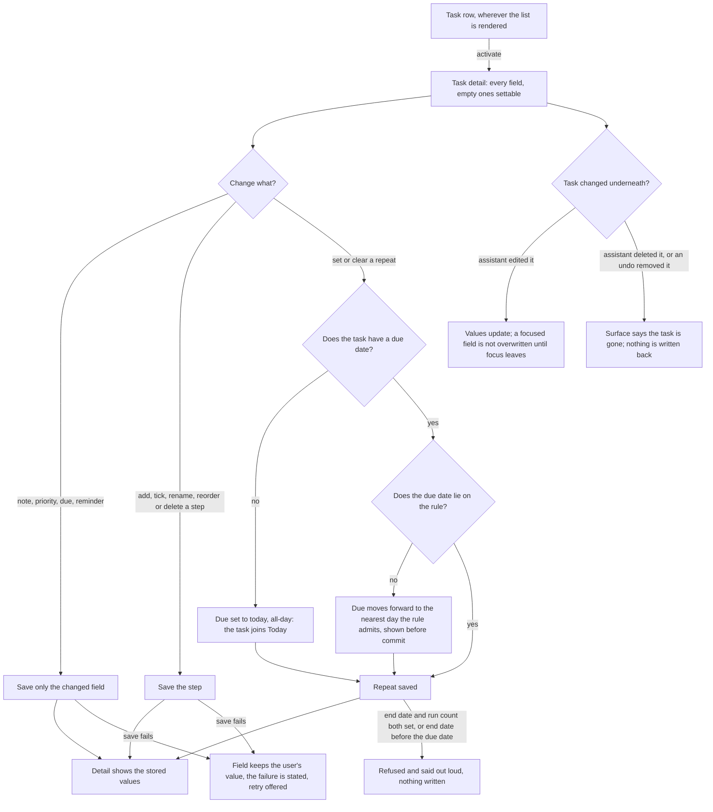
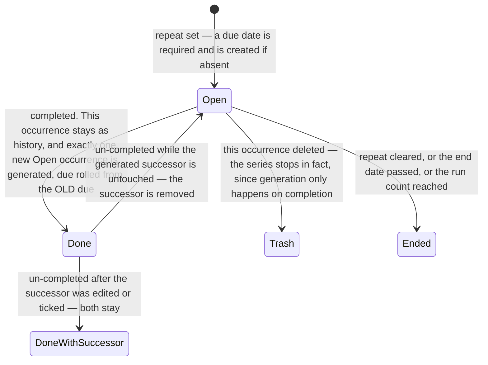

# Feature: Task Detail — every field a task has, by hand

**ID**: F-005
**Slug**: task-detail
**Status**: `draft` (revision 1)
**Last Updated**: 2026-08-18

---

## Links

```yaml
primary_module:    assistant
secondary_modules: []
depends_on:        [F-001]
implemented_in:    []
designed_in:       []
api_endpoints:     []
tested_by:
  api:    []
  web:    []
  mobile: []
known_bugs: []
```

---

## Purpose

A saved task has exactly one thing you can change by hand today: its title, and only on web. Everything else a task is — when it is due, when it should speak up, how urgent it is, what it actually involves, whether it comes back next week — is either unreachable or does not exist. This feature builds the surface where all of it lives.

**The sharpest fact in the current model, and the one worth carrying into every decision below: the data already separates the deadline from the reminder — two distinct moments, exactly as UC-27 AC-27.2 requires — and the user can reach neither.** `due_at` and `reminder_at` both exist and are both patchable (`TASK_PATCH_FIELDS`, `src/assistant/api/app.ts:135`); no client sets either, and there is no picker anywhere. `priority` exists as a free `string | null` with no control and no visual mark. `note`, sub-tasks and recurrence do not exist at all. The data is careful and there is no door.

This is also the surface `todo-ai ADR-11`'s second path has been leaning on since F-001: *"the full todo list remains usable by hand"* (F-001 AC-18, AC-24, AC-25). Without a place for a task's own fields to live, the by-hand path can create, tick, rename and delete — and nothing else.

**Naming convention.** Field names and state words below (`note`, `repeat`, `step`, "occurrence") are this spec's own vocabulary. They are not shipped strings; the user-visible wording of every label, message and accessible name is the design system's (`design/_shared/components.md`), as F-001 `## Naming convention` already establishes.

## Scope — which use cases are in, and which are not

`specs/_shared/uc-coverage-map.md` item #5 puts this feature here with the sentence *"Every remaining CORE field needs somewhere to live. Without it, 35/36/39 have no home."* That is what decided the set.

| UC | In? | Why |
|---|---|---|
| **UC-27** — edit a saved task by hand, every field | **in** | The feature itself. |
| **UC-44** — a note on a task | **in** | The owner's *"description"*. The source calls it `note`; one concept, one name. |
| **UC-35** — priority by hand, urgency visible in the list | **in** | One AC's worth of behaviour and it rides on this surface (map #6). |
| **UC-34** — deadline & reminder by picker | **in** | The field exists and is patchable; only the control is missing (map #3). Recurrence needs it (AC-22). |
| **UC-36** — sub-tasks, full CRUD, user-ordered | **in** | Map #11. Its home is Task Detail in the source's own main flow. |
| **UC-39** — recurring | **in** | Map #12, the largest CORE item, and named by the owner. Depends on UC-34 and UC-36, both in. |
| **UC-33** — delete, with undo | **partly in** | Only the detail's own delete control and the parent→step cascade (AC-31). The row-level delete on the list, and its missing undo, stay with the Tasks surface. |
| **UC-04** — AI sub-task decomposition | **out** | It is the AI layer over UC-36, not a field. It needs a model, and there is none (map D1). F-005 unblocks it; map Tier 2 #13 is its place. |
| **UC-18** — open a task, tap mic, edit by voice | **out, deliberately** | See Out of Scope — its actual requirement is already met, and its flow costs a second mic locus. |
| **UC-49** — start date | **out, and contested** | The owner named it; the source declines to write ACs for it and UC-39 refuses it a field on purpose. Open Question 1. |
| UC-37 search · UC-45 Logbook · UC-42 Upcoming · UC-43 drag ordering of *tasks* · UC-46 dates in quick-add · UC-41 lists | **out** | Each is its own surface or its own field. Sub-task ordering (UC-36) is in; top-level task ordering (UC-43) is not — they are different fields. |

## Users & Permissions

| Role | Can do | Cannot do |
|------|--------|-----------|
| Authenticated user | Open any of their tasks and set every field on it: note, priority, due, reminder, steps, repeat; complete, un-complete and delete it; end a repeat or delete a whole series | See or affect another user's tasks; set a value the pickers cannot express (AC-21); leave a repeating task without a due date (AC-22) |
| Assistant (AI) | Unchanged from F-001 — it may change a task while this surface has it open, and does so through the same turn path | Overwrite a field the user currently has focus in (AC-3); silently win a conflict — every change it makes here is visible in the same turn |

## User Flow



### The life of one repeating occurrence



## Acceptance Criteria

### The surface

- [ ] **AC-1** (web) — Activating a task row, wherever the task list is rendered, opens that task's detail in **one action**, showing every field this spec names. A field with no value renders as an empty, settable control — never as absent. The obligation is stated as a bound rather than as a named control, for the reason F-001 AC-24 states: the list is on screen beside the conversation at or above `tokens.json breakpoints.split` and is a separate surface below it, and an AC naming either arrangement is false in the other.
- [ ] **AC-2** (api, web) — Every change is a **field-level** write: the request carries the fields the user changed and no others. Falsifiable both ways — the request body contains exactly the changed keys, and a value changed on the same task by an assistant turn between load and save is still present afterwards. A whole-object write that happens to look correct fails this AC. `updated_at` advances on every accepted change (UC-27 AC-27.1). **A write that fails or is refused leaves the user's value in the field**, states what happened, and offers a retry — it never silently reverts to the stored value, because a field that snaps back while someone is looking away is indistinguishable from one that saved.
- [ ] **AC-3** (web) — **The task changing underneath the user is a normal event, not an error.** While the detail is open, an assistant turn or an undo that touches this task updates the displayed values within that turn, with no manual refresh and no re-navigation — the guarantee F-001 AC-32 makes for the list, applied to this surface. **One exception, and it is absolute: a control the user currently has focus in is never overwritten while it has focus.** The incoming value applies when focus leaves, with the arrival cue F-001 AC-31 already defines (`diffFlashHold` / `diffFlashFade`). (UC-44's edge table fixes this behaviour for the note; it holds for every field, because the reason — do not move what someone is holding — has nothing to do with which field it is.)
- [ ] **AC-4** (web) — **The task being deleted underneath is a normal event too.** When the open task is deleted — by an assistant turn, or by an undo removing a task that turn created — the surface says so and offers no further edits. Nothing the user had typed is written back: a stale save never resurrects a deleted task and never revives a field on one. The user's unsaved text is not thrown away silently either; it stays legible on the surface that is telling them the task is gone.
- [ ] **AC-5** (api, web) — A hand edit made here participates in F-001's undo contract **unchanged**, and this AC exists because this surface is the first way to reach that state for any field but the title: an edit here makes the task *modified-since* under AC-7's snapshot comparison, so a later undo of the assistant turn that touched it **skips that task and names it** in the reverted message. No new rule is introduced; what is new is that a user can now cause it.

### The note (UC-44)

- [ ] **AC-6** (api, web) — The note is read and edited on this surface; leaving the field saves it. **Empty, whitespace-only and newline-only input is stored as no note at all, never as an empty string** — the distinction is observable on read-back. Line breaks survive both the round trip and any export. A long note scrolls within the surface rather than truncating. A URL inside a note stays plain text this version — it does not become a link.
- [ ] **AC-7** (web) — **The list row shows the title and nothing else about the note**: no marker, no icon, no preview line. This is an assertion of absence and must be written as one. (UC-44 AC-44.2 and its recorded decision — the source shipped a `¶` marker, then removed it after finding that no comparable app marks notes in a list view, and recorded the lesson that the original AC had fixed a *solution* before anyone checked the *need*.)

### Priority (UC-35)

- [ ] **AC-8** (api, web) — Priority has **exactly four states — none, low, medium, high** — each settable and clearable in one action. A write carrying any other value is rejected. **Narrowing costs no migration, measured rather than assumed:** of 790 rows in `data/assistant.json` on 2026-08-18, 783 hold `null` and 7 hold `"high"`; no live value falls outside the new set. (Today's type is a free `string | null` and the 7 come from one fixture row, `fixture-table.ts:17`.)
- [ ] **AC-9** (web) — **Urgency is readable from the list without opening anything.** A row conveys its task's priority both visually and through its accessible name; `none` renders no mark at all, so the marks stay meaningful. The *form* of the mark is design's call — UC-35 AC-35.1 deliberately leaves it open ("hình thức thể hiện chưa chốt"). **This obligation lands on a surface that has no spec yet** (F-001 `## Out of Scope`: the Tasks surface is a separate feature with its own F-id). It lives here, exactly as F-001 AC-32 lives there, so that the guarantee is never unowned, and it moves when that spec is written.

### Deadline and reminder (UC-34, UC-27 AC-27.2)

- [ ] **AC-10** (api, web) — The due date (`due_at`) and the reminder (`reminder_at`) are each set and cleared from this surface by picker, with **zero AI calls**. Clearing stores no value (not a zero date, not an empty string), observable on read-back.
- [ ] **AC-11** (web) — **They are two moments, and the surface says which one makes a sound.** Setting a due date never creates a reminder — *"the report is due Friday, remind me Wednesday"* is an ordinary sentence a single merged field cannot express, and attaching a reminder to every deadline guesses that every deadline deserves noise. The reminder control names itself as the one that alerts. **And it must not promise an alert this app cannot deliver:** nothing consumes `reminder_at` today (UC-26 is unbuilt; 0 of 790 rows have ever carried one), so the control states plainly that reminders are not delivered yet. See Open Question 2 — the owner may prefer to withhold the control entirely until UC-26.
- [ ] **AC-12** (web) — The picker offers shortcuts alongside the calendar — today at 18:00, tomorrow at 09:00, this weekend (UC-34 main flow names them). Each resolves to a specific instant computed from the device clock, and a task given today's date joins the Today collection by ADR-009's rule, which is a visible consequence and not a surprise.
- [ ] **AC-13** (api, web) — **A due date set without a time never displays or behaves as a time the user did not choose.** `due_all_day` is a requirement, not a schema instruction: a date-only deadline must be distinguishable from one at midnight, because AC-22 creates date-only deadlines by rule and a fabricated 00:00 would show up as a time the user never picked. How it is represented is architecture's call.

### Sub-tasks (UC-36)

- [ ] **AC-14** (api, web) — Full CRUD on steps from this surface with **zero AI calls**: add by typing, tick and untick each one, rename, delete.
- [ ] **AC-15** (api, web) — **The order of the steps is the user's, and it survives a restart.** Reordering persists (`step_order` on the step's own record) and is **never derived from a step's date** — a step that has a deadline does not jump. Four edges the source fixes: dropping a step where it already was writes nothing and creates no undo entry; a list of one step cannot be reordered because there is nowhere to drop it; a **done** step can still be moved, since "finished" does not mean "no longer part of this list"; and deleting a step and then undoing returns it to the position it held, because the order lives on the record that came back.
- [ ] **AC-16** (web) — **Reordering has a keyboard-operable, single-pointer alternative** — dragging is never the only way (WCAG 2.1 **2.5.1** pointer gestures, **2.1.1** keyboard). This is not a nicety on a voice-first product whose MANIFEST standard is WCAG 2.1 AA: a path-based gesture as the sole mechanism excludes exactly the users the second path exists for.
- [ ] **AC-17** (web) — **How many steps are left is readable without opening the task** (UC-36 AC-36.1) — a task with steps shows its remaining count in the row, visually and in its accessible name; a task with no steps shows nothing. Same home note as AC-9: the row belongs to the Tasks-surface spec when it exists.
- [ ] **AC-18** (api) — **What a step is, and is not.** A step has exactly one parent (`parent_id`). **A step has no steps of its own** — one level, and a write attempting deeper nesting is refused rather than flattened. A step has no repeat of its own; only a top-level task can repeat. Steps are never rendered as top-level tasks in any collection — they exist inside their parent and nowhere else.
- [ ] **AC-19** (api, web) — **What happens to a step when its parent moves.** All four cases, because these are where an under-specified spec hands the decision to whoever writes the code:
  - **Parent completed** — no step's own done state changes. Completing a parent is a statement about the parent, and ticking its unfinished steps would claim work that did not happen. The steps travel with the parent out of the open collections.
  - **Parent completed with steps outstanding** — allowed. The remaining count informs; it never gates. A todo app that refuses to let you finish something is arguing with its user.
  - **Parent un-completed** — the steps return exactly as they were, because completing changed none of them. (The one case where un-completing does more is a repeating parent — AC-28.)
  - **Parent deleted** — its steps go with it, and undo restores the whole cluster (UC-33 AC-33.2, verbatim: the source refuses a confirmation dialog here on the grounds that an action with an undo does not also need a question).

### Recurrence (UC-39)

- [ ] **AC-20** (api, web) — **Setting and clearing a repeat needs no AI** (UC-39 AC-39.4): it is a picker, not a sentence. This diverges from UC-39's main flow step 1, which sets the cadence in natural language — **this repo has no model** (map D1, `ADR-001`), so a spoken cadence has nothing to interpret it. The picker is therefore the whole mechanism, not the fallback.
- [ ] **AC-21** (api) — **The shapes that exist, exactly, and nothing else is expressible.** Every N days, weeks, months or years (`recurrence.frequency` × `recurrence.interval`). A weekly rule may name `recurrence.weekdays`; a monthly rule may name `recurrence.month_days` (1–31). Two deliberate exclusions, both with the source's reasoning: **no hourly repeat** — each occurrence is a row, so a four-hour cycle produces six rows a day and drowns the history for one task; what answers "remind me every few hours" is a reminder, and every task already has one. **No weekday selection under a daily rule** — "daily, but only Mondays and Fridays" is not daily, it is weekly on two days, and offering both is two paths to one cadence. *(The source contains both readings: an earlier struck-through line gives `days?` meaning under DAY and WEEK, and a later paragraph on the same date reverses it with an argument and calls the earlier one "bản đầu". This spec follows the later one and records the contradiction rather than inheriting it silently.)*
- [ ] **AC-22** (api) — **A repeating task always has a due date, and this is an invariant, not a default.** The cadence rolls the old due into a new one; with no due there is nothing to roll from, and a "Monday weekly" task anchored to whenever it got ticked drifts to Wednesday over a few late weeks, silently. So: setting a repeat on a dateless task **sets the due to today, all-day** (no invented time — AC-13), and the task therefore joins Today, which is a visible consequence and stated here so it is not discovered. **Clearing the due date of a repeating task is refused**, with a message naming the action that ends the repeat. It is never accepted by silently ending the repeat — a destructive side effect of a smaller action is how a user loses something they did not know they were touching. (The source's edge case for a dateless repeating task is unreachable under this invariant, and is not implemented.)
- [ ] **AC-23** (api, web) — **The due date must lie on the rule.** When the chosen rule does not admit the current due — due Wednesday, rule "weekly on Monday and Thursday" — the due moves **forward** to the nearest day the rule admits, never backward (backward lands it in the past and the task is overdue the instant the rule is set), and **the surface shows the new date before the user commits**. A first occurrence falling on a day the rule excludes is wrong exactly once, and nothing afterwards explains it.
- [ ] **AC-24** (api) — **Month-day overflow lands on the last day of the month.** A rule naming day 31 in a 30-day month falls on the 30th; in February, the 28th or 29th. It never spills into the next month — that is wrong in both the day and the month — and it never skips the month, which would make the task vanish from four months a year with nothing to explain it.
- [ ] **AC-25** (api, web) — **A series ends by an end date or by a number of runs, never by both.** The picker offers one; a write carrying `recurrence.until` **and** `recurrence.count` is refused, because "which one wins" is a question with no right answer. The end date is inclusive. An end date **earlier than the due date is reported, not silently corrected** — the user may be about to change the due date next, and a date that moves on its own while they are still typing is worse than a sentence. The number of runs is counted from the series' own rows; there is no stored counter, which would be wrong the first time anyone deletes an old occurrence.
- [ ] **AC-26** (api) — **Completing a repeating task never loses the work** (UC-39 AC-39.2). The completed occurrence stays as history, and **exactly one open occurrence exists per series at any moment** — that invariant is what the rest of this section rests on. The successor's due is computed **from the previous due, not from the moment of completion**: ticking Monday's task on Wednesday still produces next Monday.
- [ ] **AC-27** (api) — **The successor carries everything the user set** (UC-39 AC-39.3): note, priority, and every step, **all unticked**. The reminder travels too, keeping its **offset from the due date** rather than its absolute instant — an alert copied verbatim onto next month's task is already in the past, which is the same drift AC-22 exists to prevent, arriving through a different door.
- [ ] **AC-28** (api) — **Un-completing removes the successor only when the successor is untouched.** All five conditions, and they are conjunctive: same `series_id`, created no earlier than the completion, never edited (`updated_at` equals `created_at`), not itself done, and **no step of it ticked or changed**. Otherwise both rows stay. The reason for the asymmetry is the whole point: un-ticking **is** the way to fix a mis-tap and it is closer than hunting for an undo, but it only works if it reverses the entire tick including the part the user never saw — while deleting something the user has already edited by hand is worse than leaving one extra row.
- [ ] **AC-29** (api) — **Editing one occurrence edits only that occurrence, and the change carries forward** because the successor is generated from it (UC-39 AC-39.1). Changing the **rule** applies from the next generation onward; history is never rewritten. This is how "change it from now on" works without introducing a second concept.
- [ ] **AC-30** (api, web) — **Deleting names which of the two things it is about to do.** Deleting the open occurrence stops the series in fact — generation only happens on completion, and there is now nothing to complete. Deleting the **whole series** sends every unfinished occurrence to the trash and **leaves every completed one**, because those are a record of work that was actually done, not rubbish. The surface distinguishes the two before acting.

### Delete, and the manual path

- [ ] **AC-31** (api, web) — The detail can delete its task. The delete is soft, as it already is (`deleted_at`), and it offers an **immediate in-place undo** that restores the task and its steps as one cluster (UC-33 AC-33.1, AC-33.2). This covers the detail's own control only; the row-level delete on the list, and the undo it is missing today, belong to the Tasks surface (map, UC-33 residue).
- [ ] **AC-32** (web) — **Every operation on this surface makes zero AI calls**, asserted through F-001's harness AI-call counter, and every one of them works while the assistant is erroring. This surface is part of what F-001 AC-24 and AC-25 hand over to; a by-hand path that needs the assistant to be healthy is not one.
- [ ] **AC-33** (web) — WCAG 2.1 AA, by name: **2.1.1** (every control here keyboard-operable, including AC-16's reorder alternative), **2.5.1** (no path-based gesture is anything's only mechanism), **4.1.2** (name/role/value on the pickers, the priority control, and each step's checkbox), **1.4.3** (contrast on the priority marks and the step counter — a mark carried by colour alone fails this and AC-9 together), **2.5.3**, and **4.1.3** (status messages announced: a save failure, and each refusal in AC-22, AC-23 and AC-25 — the aligned date AC-23 shows must reach a screen-reader user too, since it is the only warning that the date moved).

## Data

Requirement names, not a schema. Architecture owns representation, nesting and wire shape.

| Field | Type | Required | Validation | Notes |
|-------|------|----------|------------|-------|
| note | text \| none | no | whitespace-only is no note; line breaks preserved | AC-6, AC-7. The owner's "description" |
| priority | enum(none, low, medium, high) | yes | other values rejected | AC-8. Narrows today's free `string \| null`; measured migration-free |
| due_at | instant \| none | no | clearing stores no value; refused while a repeat is set | AC-10, AC-12, AC-22 |
| due_all_day | flag | yes | a date-only due never renders a time | AC-13, AC-22 |
| reminder_at | instant \| none | no | independent of due_at; nothing delivers it yet | AC-10, AC-11, AC-27 |
| parent_id | task ref \| none | no | one level only; a step's step is refused | AC-18, AC-19 |
| step_order | user-set position | yes for steps | per parent; never derived from a date | AC-15 |
| recurrence.frequency | enum(day, week, month, year) | with a repeat | no hourly | AC-20, AC-21 |
| recurrence.interval | int ≥ 1 | with a repeat | — | AC-21 |
| recurrence.weekdays | day-of-week set | no | weekly only | AC-21, AC-23 |
| recurrence.month_days | int set 1–31 | no | monthly only; 31 clamps to month end | AC-21, AC-24 |
| recurrence.until | date \| none | no | exclusive with count; inclusive; before due → reported | AC-25 |
| recurrence.count | int ≥ 1 \| none | no | exclusive with until; runs counted from rows, not stored | AC-25 |
| series_id | series ref | with a repeat | shared by every occurrence of one series | AC-26, AC-28, AC-30 |

## API Touch Points

No new assistant endpoints. The task CRUD endpoints (`specs/assistant/api-contracts.md § Prototype task CRUD`) carry all of it.

- `PATCH /tasks/{id}` — the write path for every field above. `TASK_PATCH_FIELDS` grows; the request stays field-level (AC-2).
- `POST /tasks` — creates steps, so it must accept a parent; it accepts neither `parent_id` nor `reminder_at` today, and both are gaps this feature closes.
- `DELETE /tasks/{id}` — needs a **scope** for AC-30: this occurrence, or the whole series. The parameter or second endpoint is architecture's call; that the two are distinguishable is not.
- `GET /tasks` — returns the new fields and each task's steps.
- **Rolling a series on completion is a server behaviour, not a client one.** Two clients implementing the same generation rule is L-005's shape exactly — one door guarded, one not — and the drift would show up as duplicate or missing occurrences depending on which client ticked the box.

## Ops

- **Observability** — counters for repeat rolls, refused writes by reason (AC-21/22/25), and alignment moves (AC-23). Prototype: in-process, no exporter (`ADR-001`).
- **Feature flag / rollback** — N/A this phase: prototype server, no deployment target.

## Test strategy

- **An injectable clock is mandatory**, not a convenience: AC-23, AC-24, AC-26 and AC-27 are all statements about dates the suite must be able to sit on. A month-boundary table (31st in February, in a 30-day month, in a leap year) belongs with the api test cases.
- **One case per door, per L-005 and L-012.** A successor can be removed by AC-28 and can survive it for five different reasons; each reason needs a case that can only be reached that way, with the other four shut in the setup. The same applies to AC-19's four parent transitions.
- AC-2's field-level guarantee is proven by *interleaving*, not by inspection: apply an assistant turn to field X between the surface's load and its save of field Y, then assert X survived.
- AC-7 and AC-18 are **assertions of absence** — a note marker that never renders, a nesting level that is refused. Both must be written so that removing the behaviour turns them red.

## Out of Scope

- **UC-04 — AI sub-task decomposition.** Needs a model (map D1) and belongs to the conversation surface. F-005 is what unblocks it (map Tier 2 #13).
- **UC-18 — a mic on the task detail.** **Deliberate, and here is the reasoning rather than a line.** UC-18 AC-18.1's actual requirement — a voice edit lands on the existing task and never duplicates it — **is already satisfied by construction**: every turn is handed the user's whole live task list as handles (`turns.ts:370-378`, map D4), so there is nothing to inject. What UC-18's *flow* adds is a per-task mic, and it costs two things this feature should not spend: a **second place the mic lives**, with its own states, which is the interface form of L-005 and the exact cost F-001 Open Question 9 already weighs; and **binding a turn to one task**, which is new semantics on `POST /assistant/turn` — today a turn addresses the whole list and resolves references itself. The flow becomes possible for the first time *because* this surface exists; that is a reason to spec it next, not to fold it in here.
- **UC-49 — a start date.** The owner named it. The source marks it `⏸ HOÃN` with the product question unanswered, and UC-39 refuses the series a separate start field on purpose ("hai câu trả lời cho 'lần đầu rơi vào ngày nào'"). Open Question 1 — not built until the owner answers.
- **Reminder delivery (UC-26).** This surface sets `reminder_at`; nothing fires it. AC-11 requires the surface to say so.
- **The mobile client.** Web first, as F-001 decided for itself and F-003 then discharged as its own F-id. The field set here is the full one — only the second client is sequenced. The owner can pull it into F-005 at Gate 1; see Open Question 8.
- **The Tasks surface's own acceptance criteria.** AC-9 and AC-17 place obligations on a list row whose surface has no spec; they live here until it does, on F-001 AC-32's precedent, and move when it is written.
- **Lists / "move to list" (UC-41), search (UC-37), Logbook (UC-45), Upcoming (UC-42), drag-ordering of tasks (UC-43), dates in quick-add (UC-46).**
- **A calendar view of upcoming occurrences.** Drawn in the source, never coded, and explicitly not needing a model change — a later feature.

**Considered and rejected:** *a repeat expressed as one row plus a list of completed dates* — the source weighed and rejected it, and this spec inherits the rejection: it makes a calendar view trivial and destroys three things that are working — editing one occurrence (AC-29), steps returning unticked each cycle (AC-27), and one history row per day the work was actually done. *Blocking a parent's completion until its steps are done* — see AC-19.

## Open Questions

Plain questions first; the AC each one would change is in brackets.

1. **You asked for a start date. The old product wrote down that it could not answer whether people really separate "start" from "due", and left it unbuilt.** Do you want a second date on every task — one more thing to learn — or is what you want really *"don't show me this until Thursday"*, which is a different feature (snooze)? Until you answer, F-005 has one date. [would add a field and touch AC-10, AC-13, AC-22]
2. **A reminder you set today will not go off.** Nothing in the app delivers notifications yet. Two choices: ship the reminder control now with a line saying so, or leave it out until reminders actually fire. This spec assumes the first, because the field exists and hiding it keeps the problem it was built to solve. [AC-11]
3. **How deep should steps go?** F-005 builds one level — a step cannot have steps. Is a step of a step ever something you want? Answering "yes" later is a data-model change, not a widening of this AC. [AC-18]
4. **Should a step be able to have its own deadline or priority?** The source's own edge cases assume a step can carry a date; F-005 offers no control for one, and only guarantees that a date never reorders the list. [AC-15, AC-18]
5. **How should urgency look in the list?** The source deliberately left the form open until comparable apps were checked. It also has to work in colour-blind and screen-reader terms (AC-33), which rules out a coloured dot alone. Design's call, your veto. [AC-9]
6. **If you edit a task while offline, should the edit be kept and sent later?** Today the app keeps one outgoing turn and locally-created tasks. Field edits are new and their offline durability is unspecified. [would add to AC-2]
7. **The old product moved "delete" off the list row and into the detail screen** — a destructive action deserving one deliberate step. This repo has a delete on the web row. Keep both, or follow the source and take the row control away? F-005 changes nothing on the row either way. [AC-31]
8. **Should this land on the phone in the same feature, or right after?** F-005 is web; the phone client has been its own feature (F-003) each time so far. [scope]

**Decisions this spec took that no source answers**, listed so you can overturn any of them at a glance: completing a parent leaves its steps untouched and is allowed with steps outstanding (AC-19); a reminder keeps its **offset** from the due date when a repeat rolls (AC-27); clearing the due date of a repeating task is **refused** rather than quietly ending the repeat (AC-22); the weekday-under-daily contradiction in the source is resolved in favour of the later paragraph (AC-21).
